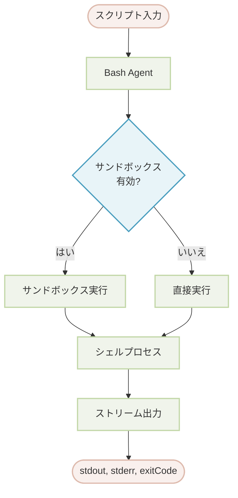

# Bash

このドキュメントでは、Bash Agentについて詳しく説明します。Bash Agentは、Agentワークフロー内でシェルスクリプトやコマンドラインツールを安全に実行できるようにするものです。サンドボックス環境の設定方法、コマンド権限の管理方法、そしてシステムレベルの操作のためにアプリケーションに統合する方法を学びます。

## 概要

Bash Agentは、制御された安全な環境内でbashスクリプトを実行するように設計されています。AnthropicのSandbox Runtimeを活用して分離された実行空間を提供し、ネットワークやファイルシステム操作を含むシステムアクセスに対してきめ細かな制御を実現します。これにより、システムのセキュリティを損なうことなく、ファイル操作、プロセス管理、シェルコマンドの自動化を必要とするタスクに最適なツールとなります。

主な機能は次のとおりです。

*   **サンドボックス実行**: スクリプトは、ネットワークおよびファイルシステムリソースに対する設定可能なアクセス制御を備えた、分離された環境で実行されます。
*   **コマンド権限**: 堅牢な権限システムにより、特定のコマンドをホワイトリスト、ブラックリスト、または承認要求に設定でき、不正な操作を防ぎます。
*   **リアルタイム出力**: 標準出力 (`stdout`) と標準エラー (`stderr`) は、スクリプトの実行中にリアルタイムでストリーミングされます。
*   **Guard Agent**: 承認が必要なコマンドに対して、別のAgent（「AIガード」）を指定して、カスタムロジックに基づいて実行を動的に承認または拒否させることができます。

:::warning
サンドボックスモードはWindowsではサポートされていません。Windowsユーザーは、Bash Agentを使用するために設定で明示的に`sandbox: false`を設定する必要があります。サンドボックスを無効にすると、すべてのセキュリティ保護が解除されるため、信頼できる環境でのみ実行してください。
:::

### アーキテクチャ

Agentはスクリプトを処理し、サンドボックスが有効かどうかに応じて、直接実行するか、サンドボックス環境内で実行します。`stdout`、`stderr`、および最終的な`exitCode`を含む出力は、呼び出し元にストリーミングで返されます。



## 基本的な使い方

Bash Agentを使用する最も簡単な方法は、YAMLファイルで定義することです。これにより、その動作を宣言的に設定できます。

### 標準サンドボックスモード

デフォルトでは、Bash Agentは安全なサンドボックス環境で実行されます。

```yaml bash-agent.yaml icon=lucide:file-code
type: "@aigne/agent-library/bash"
name: Bash

# 入力スキーマは 'script' パラメータを定義します
input_schema:
  type: object
  properties:
    script:
      type: string
      description: 実行するbashスクリプト。
  required:
    - script
```

その後、AIGNE CLIを使用してスクリプトを実行できます。

```bash icon=lucide:terminal
aigne run . Bash --script 'echo "Hello from the Bash Agent!"'
```

### サンドボックスの無効化

開発時、信頼できる環境、またはWindowsでは、サンドボックスを無効にすることができます。

```yaml bash-agent-no-sandbox.yaml icon=lucide:file-code
type: "@aigne/agent-library/bash"
name: Bash
sandbox: false # サンドボックスを無効にする

input_schema:
  type: object
  properties:
    script:
      type: string
      description: 実行するbashスクリプト。
  required:
    - script
```

:::error
サンドボックスを無効にすると、すべてのセキュリティ保護が解除されます。これは、実行されるスクリプトを完全に信頼できる環境でのみ行ってください。
:::

## 設定

Bash Agentは、実行環境とセキュリティ設定を制御するために、いくつかのオプションで設定できます。

<x-field-group>
  <x-field data-name="sandbox" data-type="object | boolean" data-required="false" data-default="true">
    <x-field-desc markdown>[AnthropicのSandbox Runtime](https://github.com/anthropic-experimental/sandbox-runtime)に基づいたサンドボックス環境の設定。サンドボックスを無効にするには`false`に設定します。デフォルトは`true`で、デフォルトの制限が適用されます。</x-field-desc>
  </x-field>
  <x-field data-name="timeout" data-type="number" data-required="false" data-default="60000">
    <x-field-desc markdown>実行タイムアウト（ミリ秒）。スクリプトがこの制限を超えると終了します。</x-field-desc>
  </x-field>
  <x-field data-name="permissions" data-type="object" data-required="false">
    <x-field-desc markdown>コマンド実行権限の設定。`allow`、`deny`、`defaultMode`、および`guard` Agentを含みます。</x-field-desc>
  </x-field>
</x-field-group>

### 入力と出力

Agentは単純な入力オブジェクトを受け取り、詳細な出力オブジェクトを生成します。

#### InputSchema

<x-field-group>
  <x-field data-name="script" data-type="string" data-required="true" data-desc="実行されるbashスクリプト。"></x-field>
</x-field-group>

#### OutputSchema

<x-field-group>
  <x-field data-name="stdout" data-type="string" data-required="false" data-desc="スクリプトによって生成された標準出力。"></x-field>
  <x-field data-name="stderr" data-type="string" data-required="false" data-desc="スクリプトによって生成された標準エラー出力。"></x-field>
  <x-field data-name="exitCode" data-type="number" data-required="false" data-desc="スクリプトの終了コード。通常、`0`の値は成功を示します。"></x-field>
</x-field-group>

## サンドボックスの設定

サンドボックスは、ネットワークおよびファイルシステムリソースへのアクセスを制限することにより、スクリプト実行のための安全なレイヤーを提供します。

### ネットワーク制御

スクリプトがアクセスを許可または禁止されているドメインを指定できます。

```yaml network-config.yaml icon=lucide:file-code
sandbox:
  network:
    # 許可されたドメインのリスト。ワイルドカードがサポートされています。
    allowedDomains:
      - "api.github.com"
      - "*.example.com"
    # 拒否されたドメインのリスト。許可リストよりも優先されます。
    deniedDomains:
      - "*.ads.com"
```

### ファイルシステム制御

特定のパスまたはパターンに対する読み取りおよび書き込み権限を定義します。

```yaml filesystem-config.yaml icon=lucide:file-code
sandbox:
  filesystem:
    # 書き込みが許可されているパスのリスト。
    allowWrite:
      - "./output"
      - "/tmp"
    # 書き込みが禁止されているパスのリスト。
    denyWrite:
      - "/etc"
      - "/usr"
    # 読み取りが禁止されているパスのリスト。
    denyRead:
      - "~/.ssh"
      - "*.key"
```

## 権限の設定

権限システムは、どのコマンドが実行できるかを制御します。明確な優先順位で動作します：`deny`ルールは`allow`ルールを上書きし、`allow`ルールは`defaultMode`を上書きします。

### 権限プロパティ

<x-field-group>
  <x-field data-name="allow" data-type="string[]" data-required="false">
    <x-field-desc markdown>承認なしで実行が許可されるコマンドのホワイトリスト。完全一致（`git status`）およびワイルドカード付きのプレフィックスマッチング（`ls:*`）をサポートします。</x-field-desc>
  </x-field>
  <x-field data-name="deny" data-type="string[]" data-required="false">
    <x-field-desc markdown>厳密に禁止されるコマンドのブラックリスト。このリストが最も高い優先度を持ちます。</x-field-desc>
  </x-field>
  <x-field data-name="defaultMode" data-type="string" data-required="false" data-default="allow">
    <x-field-desc markdown>`allow`または`deny`リストに一致しないコマンドのデフォルトの動作。指定可能な値は`allow`、`ask`、または`deny`です。</x-field-desc>
  </x-field>
  <x-field data-name="guard" data-type="Agent" data-required="false">
    <x-field-desc markdown>`defaultMode`が`ask`の場合に呼び出されるAgent。スクリプトを受け取り、ブール値の`approved`ステータスを返す必要があります。</x-field-desc>
  </x-field>
</x-field-group>

### Guard Agentを使用した例

`defaultMode`が`ask`に設定されている場合、コマンドを承認または拒否するために`guard` Agentを提供する必要があります。Guard Agentは入力としてスクリプトを受け取り、`approved`ブール値とオプションの`reason`文字列を含むオブジェクトを返す必要があります。

```yaml guard-config.yaml icon=lucide:file-code
type: "@aigne/agent-library/bash"
name: Bash
permissions:
  allow:
    - "echo:*"
    - "ls:*"
  deny:
    - "rm:*"
    - "sudo:*"
  defaultMode: "ask"
  guard:
    type: "ai"
    model: "anthropic/claude-3-5-sonnet-20241022"
    instructions: |
      You are a security guard for bash command execution.
      Analyze the requested script and decide whether to approve it.

      Script to evaluate:
      ```bash
      {{script}}
      ```

      Approve safe, read-only operations. Deny any command that
      could modify or delete files, or alter system state.
    output_schema:
      type: object
      properties:
        approved:
          type: boolean
          description: Whether to approve the script execution.
        reason:
          type: string
          description: An explanation for the decision.
      required:
        - approved
```

## ベストプラクティス

*   **サンドボックスを使用する**: 本番環境では常にサンドボックスを有効にして、セキュリティリスクを軽減してください。
*   **最小権限の原則**: サンドボックスと権限ルールを設定して、タスクに必要な最小限のアクセスのみを許可するようにします。
*   **危険なコマンドを拒否する**: `rm`、`sudo`、`dd`などの破壊的なコマンドを明示的に`deny`リストに追加します。
*   **終了コードを処理する**: Agentの出力にある`exitCode`をチェックして、スクリプトの失敗を検出し、処理します。`0`以外の終了コードは通常エラーを示し、詳細は`stderr`で確認できます。
*   **機密ファイルを保護する**: `denyRead`を使用して、`~/.ssh`、`.env`ファイル、秘密鍵などの機密ファイルやディレクトリへのアクセスを防ぎます。