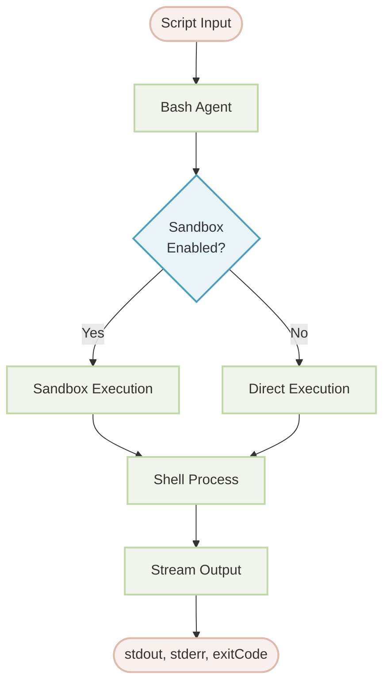

# Bash

This document details the Bash agent, which allows for the secure execution of shell scripts and command-line tools within an agentic workflow. You will learn how to configure its sandboxed environment, manage command permissions, and integrate it into your applications for system-level operations.

## Overview

The Bash agent is designed to execute bash scripts within a controlled and secure environment. It leverages Anthropic's Sandbox Runtime to provide an isolated execution space, offering fine-grained control over system access, including network and filesystem operations. This makes it an ideal tool for tasks requiring file manipulation, process management, and automation of shell commands without compromising system security.

Key features include:

*   **Sandboxed Execution**: Scripts are run in an isolated environment with configurable access controls for network and filesystem resources.
*   **Command Permissions**: A robust permission system allows you to whitelist, blacklist, or require approval for specific commands, preventing unauthorized operations.
*   **Real-time Output**: Standard output (`stdout`) and standard error (`stderr`) are streamed in real-time as the script executes.
*   **Guard Agents**: For commands requiring approval, you can designate another agent (an "AI guard") to dynamically approve or deny execution based on custom logic.

:::warning
Sandbox mode is not supported on Windows. Windows users must explicitly set `sandbox: false` in their configuration to use the Bash agent. Disabling the sandbox removes all security protections and should only be done in trusted environments.
:::

### Architecture

The agent processes a script and, depending on whether the sandbox is enabled, either runs it directly or within the sandboxed environment. The output, including `stdout`, `stderr`, and the final `exitCode`, is streamed back to the caller.



## Basic Usage

The most straightforward way to use the Bash Agent is by defining it in a YAML file. This allows you to configure its behavior declaratively.

### Standard Sandboxed Mode

By default, the Bash agent runs in a secure, sandboxed environment.

```yaml bash-agent.yaml icon=lucide:file-code
type: "@aigne/agent-library/bash"
name: Bash

# The input schema defines the 'script' parameter
input_schema:
  type: object
  properties:
    script:
      type: string
      description: The bash script to execute.
  required:
    - script
```

You can then execute a script using the AIGNE CLI:

```bash icon=lucide:terminal
aigne run . Bash --script 'echo "Hello from the Bash Agent!"'
```

### Disabling the Sandbox

For development, trusted environments, or on Windows, you can disable the sandbox.

```yaml bash-agent-no-sandbox.yaml icon=lucide:file-code
type: "@aigne/agent-library/bash"
name: Bash
sandbox: false # Disable the sandbox

input_schema:
  type: object
  properties:
    script:
      type: string
      description: The bash script to execute.
  required:
    - script
```

:::error
Disabling the sandbox removes all security protections. This should only be done in environments where you fully trust the scripts being executed.
:::

## Configuration

The Bash agent can be configured with several options to control its execution environment and security settings.

<x-field-group>
  <x-field data-name="sandbox" data-type="object | boolean" data-required="false" data-default="true">
    <x-field-desc markdown>Configuration for the sandboxed environment based on [Anthropic's Sandbox Runtime](https://github.com/anthropic-experimental/sandbox-runtime). Set to `false` to disable sandboxing. Defaults to `true` with default restrictions.</x-field-desc>
  </x-field>
  <x-field data-name="timeout" data-type="number" data-required="false" data-default="60000">
    <x-field-desc markdown>Execution timeout in milliseconds. The script will be terminated if it exceeds this limit.</x-field-desc>
  </x-field>
  <x-field data-name="permissions" data-type="object" data-required="false">
    <x-field-desc markdown>Configuration for command execution permissions, including `allow`, `deny`, `defaultMode`, and a `guard` agent.</x-field-desc>
  </x-field>
</x-field-group>

### Input and Output

The agent accepts a simple input object and produces a detailed output object.

#### Input Schema

<x-field-group>
  <x-field data-name="script" data-type="string" data-required="true" data-desc="The bash script to be executed."></x-field>
</x-field-group>

#### Output Schema

<x-field-group>
  <x-field data-name="stdout" data-type="string" data-required="false" data-desc="The standard output produced by the script."></x-field>
  <x-field data-name="stderr" data-type="string" data-required="false" data-desc="The standard error output produced by the script."></x-field>
  <x-field data-name="exitCode" data-type="number" data-required="false" data-desc="The exit code of the script. A value of `0` typically indicates success."></x-field>
</x-field-group>

## Sandbox Configuration

The sandbox provides a secure layer for script execution by restricting access to network and filesystem resources.

### Network Control

You can specify which domains a script is allowed or forbidden to access.

```yaml network-config.yaml icon=lucide:file-code
sandbox:
  network:
    # A list of allowed domains. Wildcards are supported.
    allowedDomains:
      - "api.github.com"
      - "*.example.com"
    # A list of denied domains, which takes precedence over the allow list.
    deniedDomains:
      - "*.ads.com"
```

### Filesystem Control

Define read and write permissions for specific paths or patterns.

```yaml filesystem-config.yaml icon=lucide:file-code
sandbox:
  filesystem:
    # A list of paths where writing is permitted.
    allowWrite:
      - "./output"
      - "/tmp"
    # A list of paths where writing is forbidden.
    denyWrite:
      - "/etc"
      - "/usr"
    # A list of paths where reading is forbidden.
    denyRead:
      - "~/.ssh"
      - "*.key"
```

## Permissions Configuration

The permissions system controls which commands can be executed. It operates with a clear priority: `deny` rules override `allow` rules, and `allow` rules override the `defaultMode`.

### Permission Properties

<x-field-group>
  <x-field data-name="allow" data-type="string[]" data-required="false">
    <x-field-desc markdown>A whitelist of commands that are permitted to execute without approval. Supports exact match (`git status`) and prefix matching with a wildcard (`ls:*`).</x-field-desc>
  </x-field>
  <x-field data-name="deny" data-type="string[]" data-required="false">
    <x-field-desc markdown>A blacklist of commands that are strictly forbidden. This list has the highest priority.</x-field-desc>
  </x-field>
  <x-field data-name="defaultMode" data-type="string" data-required="false" data-default="allow">
    <x-field-desc markdown>The default behavior for commands not matching `allow` or `deny` lists. Possible values are `allow`, `ask`, or `deny`.</x-field-desc>
  </x-field>
  <x-field data-name="guard" data-type="Agent" data-required="false">
    <x-field-desc markdown>An agent invoked when `defaultMode` is `ask`. It receives the script and must return a boolean `approved` status.</x-field-desc>
  </x-field>
</x-field-group>

### Example with a Guard Agent

When `defaultMode` is set to `ask`, you must provide a `guard` agent to approve or reject commands. The guard agent receives the script as input and must return an object containing an `approved` boolean and an optional `reason` string.

```yaml guard-config.yaml icon=lucide:file-code
type: "@aigne/agent-library/bash"
name: Bash
permissions:
  allow:
    - "echo:*"
    - "ls:*"
  deny:
    - "rm:*"
    - "sudo:*"
  defaultMode: "ask"
  guard:
    type: "ai"
    model: "anthropic/claude-3-5-sonnet-20241022"
    instructions: |
      You are a security guard for bash command execution.
      Analyze the requested script and decide whether to approve it.

      Script to evaluate:
      ```bash
      {{script}}
      ```

      Approve safe, read-only operations. Deny any command that
      could modify or delete files, or alter system state.
    output_schema:
      type: object
      properties:
        approved:
          type: boolean
          description: Whether to approve the script execution.
        reason:
          type: string
          description: An explanation for the decision.
      required:
        - approved
```

## Best Practices

*   **Use the Sandbox**: Always enable the sandbox in production environments to mitigate security risks.
*   **Principle of Least Privilege**: Configure sandbox and permission rules to grant only the minimum access necessary for the task.
*   **Deny Dangerous Commands**: Explicitly add destructive commands like `rm`, `sudo`, and `dd` to the `deny` list.
*   **Handle Exit Codes**: Check the `exitCode` in the agent's output to detect and handle script failures. An exit code other than `0` usually indicates an error, and details can be found in `stderr`.
*   **Protect Sensitive Files**: Use `denyRead` to prevent access to sensitive files and directories such as `~/.ssh`, `.env` files, and private keys.