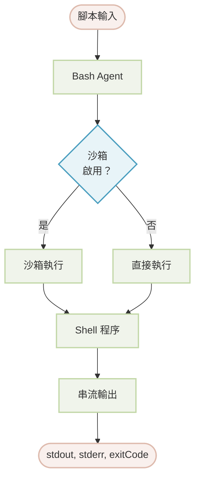

# Bash

本文件詳細介紹 Bash Agent，它允許在 Agent 工作流程中安全地執行 shell 腳本和命令列工具。您將學習如何設定其沙箱環境、管理命令權限，以及將其整合到您的應用程式中以進行系統級操作。

## 總覽

Bash Agent 旨在於受控且安全的環境中執行 bash 腳本。它利用 Anthropic 的沙箱執行時期來提供一個隔離的執行空間，對系統存取（包括網路和檔案系統操作）提供細微度的控制。這使其成為在不損害系統安全的情況下，需要進行檔案操作、程序管理和自動化 shell 命令等任務的理想工具。

主要功能包括：

*   **沙箱執行**：腳本在一個隔離的環境中執行，並對網路和檔案系統資源具有可設定的存取控制。
*   **命令權限**：一個強大的權限系統，允許您將特定命令列入白名單、黑名單或要求批准，以防止未經授權的操作。
*   **即時輸出**：標準輸出（`stdout`）和標準錯誤（`stderr`）會在腳本執行時即時串流。
*   **守衛 Agents**：對於需要批准的命令，您可以指定另一個 Agent（一個「AI 守衛」）根據自訂邏輯動態地批准或拒絕執行。

:::warning
沙箱模式在 Windows 上不受支援。Windows 使用者必須在其設定中明確設定 `sandbox: false` 才能使用 Bash Agent。停用沙箱會移除所有安全保護，只應在受信任的環境中進行。
:::

### 架構

此 Agent 處理一個腳本，並根據沙箱是否啟用，直接執行或在沙箱環境中執行該腳本。輸出，包括 `stdout`、`stderr` 和最終的 `exitCode`，會被串流回呼叫者。



## 基本用法

使用 Bash Agent 最直接的方式是在 YAML 檔案中定義它。這讓您能以宣告式的方式設定其行為。

### 標準沙箱模式

預設情況下，Bash Agent 在一個安全的沙箱環境中執行。

```yaml bash-agent.yaml icon=lucide:file-code
type: "@aigne/agent-library/bash"
name: Bash

# 輸入結構定義了 'script' 參數
input_schema:
  type: object
  properties:
    script:
      type: string
      description: 要執行的 bash 腳本。
  required:
    - script
```

然後，您可以使用 AIGNE CLI 來執行一個腳本：

```bash icon=lucide:terminal
aigne run . Bash --script 'echo "Hello from the Bash Agent!"'
```

### 停用沙箱

在開發、受信任的環境或 Windows 上，您可以停用沙箱。

```yaml bash-agent-no-sandbox.yaml icon=lucide:file-code
type: "@aigne/agent-library/bash"
name: Bash
sandbox: false # 停用沙箱

input_schema:
  type: object
  properties:
    script:
      type: string
      description: 要執行的 bash 腳本。
  required:
    - script
```

:::error
停用沙箱會移除所有安全保護。只有在您完全信任所執行腳本的環境中，才應這樣做。
:::

## 設定

Bash Agent 可以透過多個選項進行設定，以控制其執行環境和安全設定。

<x-field-group>
  <x-field data-name="sandbox" data-type="object | boolean" data-required="false" data-default="true">
    <x-field-desc markdown>基於 [Anthropic 的沙箱執行時期](https://github.com/anthropic-experimental/sandbox-runtime) 的沙箱環境設定。設為 `false` 可停用沙箱。預設為 `true` 並帶有預設限制。</x-field-desc>
  </x-field>
  <x-field data-name="timeout" data-type="number" data-required="false" data-default="60000">
    <x-field-desc markdown>執行逾時時間，單位為毫秒。如果腳本超過此限制，將被終止。</x-field-desc>
  </x-field>
  <x-field data-name="permissions" data-type="object" data-required="false">
    <x-field-desc markdown>命令執行權限的設定，包括 `allow`、`deny`、`defaultMode` 和 `guard` Agent。</x-field-desc>
  </x-field>
</x-field-group>

### 輸入與輸出

此 Agent 接受一個簡單的輸入物件，並產生一個詳細的輸出物件。

#### 輸入結構

<x-field-group>
  <x-field data-name="script" data-type="string" data-required="true" data-desc="要執行的 bash 腳本。"></x-field>
</x-field-group>

#### 輸出結構

<x-field-group>
  <x-field data-name="stdout" data-type="string" data-required="false" data-desc="腳本產生的標準輸出。"></x-field>
  <x-field data-name="stderr" data-type="string" data-required="false" data-desc="腳本產生的標準錯誤輸出。"></x-field>
  <x-field data-name="exitCode" data-type="number" data-required="false" data-desc="腳本的結束代碼。`0` 值通常表示成功。"></x-field>
</x-field-group>

## 沙箱設定

沙箱透過限制對網路和檔案系統資源的存取，為腳本執行提供了一個安全層。

### 網路控制

您可以指定一個腳本允許或禁止存取的網域。

```yaml network-config.yaml icon=lucide:file-code
sandbox:
  network:
    # 允許的網域列表。支援萬用字元。
    allowedDomains:
      - "api.github.com"
      - "*.example.com"
    # 拒絕的網域列表，其優先級高於允許列表。
    deniedDomains:
      - "*.ads.com"
```

### 檔案系統控制

為特定路徑或模式定義讀取和寫入權限。

```yaml filesystem-config.yaml icon=lucide:file-code
sandbox:
  filesystem:
    # 允許寫入的路徑列表。
    allowWrite:
      - "./output"
      - "/tmp"
    # 禁止寫入的路徑列表。
    denyWrite:
      - "/etc"
      - "/usr"
    # 禁止讀取的路徑列表。
    denyRead:
      - "~/.ssh"
      - "*.key"
```

## 權限設定

權限系統控制哪些命令可以被執行。它以明確的優先順序運作：`deny` 規則覆寫 `allow` 規則，而 `allow` 規則覆寫 `defaultMode`。

### 權限屬性

<x-field-group>
  <x-field data-name="allow" data-type="string[]" data-required="false">
    <x-field-desc markdown>允許無需批准即可執行的命令白名單。支援精確匹配（`git status`）和帶有萬用字元的前綴匹配（`ls:*`）。</x-field-desc>
  </x-field>
  <x-field data-name="deny" data-type="string[]" data-required="false">
    <x-field-desc markdown>嚴格禁止的命令黑名單。此列表具有最高優先級。</x-field-desc>
  </x-field>
  <x-field data-name="defaultMode" data-type="string" data-required="false" data-default="allow">
    <x-field-desc markdown>對於不匹配 `allow` 或 `deny` 列表的命令的預設行為。可能的值為 `allow`、`ask` 或 `deny`。</x-field-desc>
  </x-field>
  <x-field data-name="guard" data-type="Agent" data-required="false">
    <x-field-desc markdown>當 `defaultMode` 為 `ask` 時被呼叫的 Agent。它會接收腳本，且必須回傳一個布林值的 `approved` 狀態。</x-field-desc>
  </x-field>
</x-field-group>

### 使用守衛 Agent 的範例

當 `defaultMode` 設定為 `ask` 時，您必須提供一個 `guard` Agent 來批准或拒絕命令。此守衛 Agent 會接收腳本作為輸入，並且必須回傳一個包含 `approved` 布林值和一個可選的 `reason` 字串的物件。

```yaml guard-config.yaml icon=lucide:file-code
type: "@aigne/agent-library/bash"
name: Bash
permissions:
  allow:
    - "echo:*"
    - "ls:*"
  deny:
    - "rm:*"
    - "sudo:*"
  defaultMode: "ask"
  guard:
    type: "ai"
    model: "anthropic/claude-3-5-sonnet-20241022"
    instructions: |
      您是 bash 命令執行的安全守衛。
      分析請求的腳本並決定是否批准它。

      待評估的腳本：
      ```bash
      {{script}}
      ```

      批准安全的、唯讀的操作。拒絕任何可能修改或刪除檔案、
      或改變系統狀態的命令。
    output_schema:
      type: object
      properties:
        approved:
          type: boolean
          description: 是否批准腳本執行。
        reason:
          type: string
          description: 決定的解釋。
      required:
        - approved
```

## 最佳實踐

*   **使用沙箱**：始終在生產環境中啟用沙箱以降低安全風險。
*   **最小權限原則**：設定沙箱和權限規則，僅授予任務所需之最小存取權限。
*   **拒絕危險命令**：將 `rm`、`sudo` 和 `dd` 等破壞性命令明確加入 `deny` 列表。
*   **處理結束代碼**：檢查 Agent 輸出中的 `exitCode` 以偵測並處理腳本失敗。非 `0` 的結束代碼通常表示錯誤，詳細資訊可在 `stderr` 中找到。
*   **保護敏感檔案**：使用 `denyRead` 來防止存取敏感檔案和目錄，例如 `~/.ssh`、`.env` 檔案和私密金鑰。