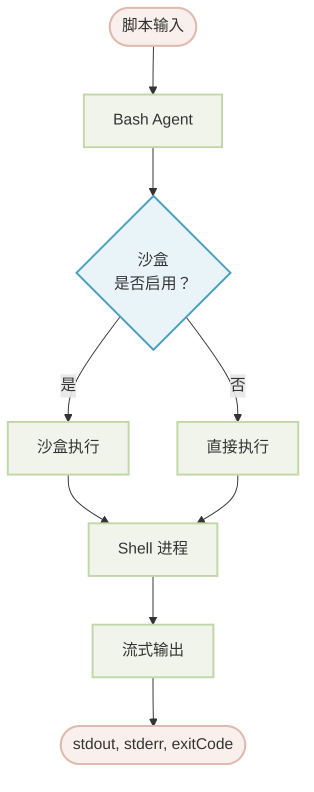

# Bash

本文档详细介绍了 Bash Agent，它允许在 Agent 工作流中安全地执行 Shell 脚本和命令行工具。您将学习如何配置其沙盒环境、管理命令权限，并将其集成到您的应用程序中以执行系统级操作。

## 概览

Bash Agent 旨在受控且安全的环境中执行 Bash 脚本。它利用 Anthropic 的沙盒运行时提供一个隔离的执行空间，对系统访问（包括网络和文件系统操作）进行精细控制。这使其成为在不损害系统安全的情况下，执行需要文件操作、进程管理和自动化 Shell 命令等任务的理想工具。

主要功能包括：

*   **沙盒执行**：脚本在隔离环境中运行，并可为网络和文件系统资源配置访问控制。
*   **命令权限**：强大的权限系统允许您对特定命令设置白名单、黑名单或要求批准，以防止未经授权的操作。
*   **实时输出**：标准输出 (`stdout`) 和标准错误 (`stderr`) 会在脚本执行时实时流式传输。
*   **守卫 Agent**：对于需要批准的命令，您可以指定另一个 Agent（“AI 守卫”）根据自定义逻辑动态批准或拒绝执行。

:::warning
沙盒模式在 Windows 上不受支持。Windows 用户必须在其配置中明确设置 `sandbox: false` 才能使用 Bash Agent。禁用沙盒会移除所有安全保护，因此只应在受信任的环境中进行。
:::

### 架构

该 Agent 处理脚本时，会根据是否启用沙盒来决定是直接运行脚本还是在沙盒环境中运行。包括 `stdout`、`stderr` 和最终 `exitCode` 在内的输出会流式传输回调用方。



## 基本用法

使用 Bash Agent 最直接的方法是在 YAML 文件中定义它。这使您能够以声明方式配置其行为。

### 标准沙盒模式

默认情况下，Bash Agent 在安全的沙盒环境中运行。

```yaml bash-agent.yaml icon=lucide:file-code
type: "@aigne/agent-library/bash"
name: Bash

# 输入模式定义了 'script' 参数
input_schema:
  type: object
  properties:
    script:
      type: string
      description: 要执行的 bash 脚本。
  required:
    - script
```

然后，您可以使用 AIGNE CLI 执行脚本：

```bash icon=lucide:terminal
aigne run . Bash --script 'echo "Hello from the Bash Agent!"'
```

### 禁用沙盒

在开发、受信任的环境或 Windows 上，您可以禁用沙盒。

```yaml bash-agent-no-sandbox.yaml icon=lucide:file-code
type: "@aigne/agent-library/bash"
name: Bash
sandbox: false # 禁用沙盒

input_schema:
  type: object
  properties:
    script:
      type: string
      description: 要执行的 bash 脚本。
  required:
    - script
```

:::error
禁用沙盒会移除所有安全保护。这只应在您完全信任所执行脚本的环境中进行。
:::

## 配置

Bash Agent 可以通过多个选项进行配置，以控制其执行环境和安全设置。

<x-field-group>
  <x-field data-name="sandbox" data-type="object | boolean" data-required="false" data-default="true">
    <x-field-desc markdown>基于 [Anthropic 的沙盒运行时](https://github.com/anthropic-experimental/sandbox-runtime) 的沙盒环境配置。设置为 `false` 可禁用沙盒。默认为 `true`，并采用默认限制。</x-field-desc>
  </x-field>
  <x-field data-name="timeout" data-type="number" data-required="false" data-default="60000">
    <x-field-desc markdown>执行超时时间，单位为毫秒。如果脚本执行超过此限制，将被终止。</x-field-desc>
  </x-field>
  <x-field data-name="permissions" data-type="object" data-required="false">
    <x-field-desc markdown>命令执行权限的配置，包括 `allow`、`deny`、`defaultMode` 和一个 `guard` Agent。</x-field-desc>
  </x-field>
</x-field-group>

### 输入和输出

该 Agent 接受一个简单的输入对象，并生成一个详细的输出对象。

#### 输入模式

<x-field-group>
  <x-field data-name="script" data-type="string" data-required="true" data-desc="将要执行的 bash 脚本。"></x-field>
</x-field-group>

#### 输出模式

<x-field-group>
  <x-field data-name="stdout" data-type="string" data-required="false" data-desc="脚本产生的标准输出。"></x-field>
  <x-field data-name="stderr" data-type="string" data-required="false" data-desc="脚本产生的标准错误输出。"></x-field>
  <x-field data-name="exitCode" data-type="number" data-required="false" data-desc="脚本的退出码。值为 `0` 通常表示成功。"></x-field>
</x-field-group>

## 沙盒配置

沙盒通过限制对网络和文件系统资源的访问，为脚本执行提供了一个安全层。

### 网络控制

您可以指定脚本允许或禁止访问哪些域名。

```yaml network-config.yaml icon=lucide:file-code
sandbox:
  network:
    # 允许的域名列表。支持通配符。
    allowedDomains:
      - "api.github.com"
      - "*.example.com"
    # 拒绝的域名列表，其优先级高于允许列表。
    deniedDomains:
      - "*.ads.com"
```

### 文件系统控制

为特定路径或模式定义读写权限。

```yaml filesystem-config.yaml icon=lucide:file-code
sandbox:
  filesystem:
    # 允许写入的路径列表。
    allowWrite:
      - "./output"
      - "/tmp"
    # 禁止写入的路径列表。
    denyWrite:
      - "/etc"
      - "/usr"
    # 禁止读取的路径列表。
    denyRead:
      - "~/.ssh"
      - "*.key"
```

## 权限配置

权限系统控制哪些命令可以被执行。它按明确的优先级运行：`deny` 规则覆盖 `allow` 规则，而 `allow` 规则覆盖 `defaultMode`。

### 权限属性

<x-field-group>
  <x-field data-name="allow" data-type="string[]" data-required="false">
    <x-field-desc markdown>允许无需批准即可执行的命令白名单。支持精确匹配（`git status`）和带通配符的前缀匹配（`ls:*`）。</x-field-desc>
  </x-field>
  <x-field data-name="deny" data-type="string[]" data-required="false">
    <x-field-desc markdown>严格禁止的命令黑名单。此列表具有最高优先级。</x-field-desc>
  </x-field>
  <x-field data-name="defaultMode" data-type="string" data-required="false" data-default="allow">
    <x-field-desc markdown>对于不匹配 `allow` 或 `deny` 列表的命令的默认行为。可能的值为 `allow`、`ask` 或 `deny`。</x-field-desc>
  </x-field>
  <x-field data-name="guard" data-type="Agent" data-required="false">
    <x-field-desc markdown>当 `defaultMode` 为 `ask` 时调用的 Agent。它接收脚本作为输入，并且必须返回一个布尔值 `approved` 状态。</x-field-desc>
  </x-field>
</x-field-group>

### 使用守卫 Agent 的示例

当 `defaultMode` 设置为 `ask` 时，您必须提供一个 `guard` Agent 来批准或拒绝命令。守卫 Agent 接收脚本作为输入，并且必须返回一个包含 `approved` 布尔值和可选 `reason` 字符串的对象。

```yaml guard-config.yaml icon=lucide:file-code
type: "@aigne/agent-library/bash"
name: Bash
permissions:
  allow:
    - "echo:*"
    - "ls:*"
  deny:
    - "rm:*"
    - "sudo:*"
  defaultMode: "ask"
  guard:
    type: "ai"
    model: "anthropic/claude-3-5-sonnet-20241022"
    instructions: |
      你是一个用于 bash 命令执行的安全守卫。
      分析请求的脚本并决定是否批准它。

      待评估的脚本：
      ```bash
      {{script}}
      ```

      批准安全的只读操作。拒绝任何可能
      修改或删除文件，或改变系统状态的命令。
    output_schema:
      type: object
      properties:
        approved:
          type: boolean
          description: 是否批准脚本执行。
        reason:
          type: string
          description: 对该决定的解释。
      required:
        - approved
```

## 最佳实践

*   **使用沙盒**：始终在生产环境中启用沙盒以降低安全风险。
*   **最小权限原则**：配置沙盒和权限规则，仅授予任务所需的最小访问权限。
*   **拒绝危险命令**：将 `rm`、`sudo` 和 `dd` 等破坏性命令明确添加到 `deny` 列表中。
*   **处理退出码**：检查 Agent 输出中的 `exitCode` 以检测和处理脚本失败。非 `0` 的退出码通常表示错误，详细信息可在 `stderr` 中找到。
*   **保护敏感文件**：使用 `denyRead` 防止访问敏感文件和目录，例如 `~/.ssh`、`.env` 文件和私钥。