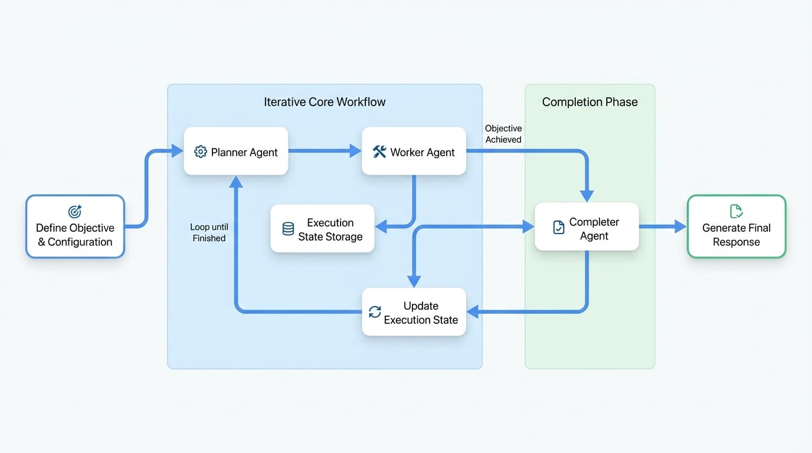

# Orchestrator

Orchestrator Agent 提供一個結構化且可靠的解決方案，用於管理複雜的多步驟 AI 工作流程。它將高階目標分解為一系列可管理的任務，按順序執行它們，並將結果綜合成一個最終、連貫的回應，從而實現自主的任務規劃和執行。

本文件詳細介紹了 Orchestrator Agent 的架構、設定和實際應用。

## 概觀

Orchestrator Agent 採用一個複雜的模式，透過三階段架構來實現自主任務管理：**Planner → Worker → Completer**。這種結構使其能夠處理需要多個步驟、工具和迭代優化的複雜目標。

核心元件包括：
*   **Planner**：分析主要目標和目前進度，以決定最合乎邏輯的下一個任務。
*   **Worker**：執行 Planner 分配的特定任務，使用任何可用的工具或技能。
*   **Completer**：一旦所有任務完成，它會審查整個執行歷史，並將各個結果綜合成一個最終、全面的輸出。
*   **Execution State**：一個記錄元件，用於追蹤工作流程中執行的所有任務的歷史、狀態和結果。

這個迭代過程會持續進行，直到 Planner 判斷整體目標已經達成。

## 架構

此工作流程是一個循環，其中 Planner 和 Worker 協同工作，直到目標達成，最後由 Completer 進行最終的綜合步驟。下圖說明了這個過程：

<!-- DIAGRAM_IMAGE_START:architecture:16:9 -->

<!-- DIAGRAM_IMAGE_END -->

過程如下展開：
1.  **初始化**：Orchestrator 接收一個高階目標，並初始化一個空的執行狀態。
2.  **規劃**：Planner 檢查目標和目前的狀態（最初為空），並設計出第一個任務。
3.  **執行**：Worker 從 Planner 接收任務並執行它。結果（成功或失敗，以及結果或錯誤）會被記錄下來。
4.  **狀態更新**：任務的結果被附加到執行狀態中。
5.  **迭代**：從步驟 2 開始重複此過程。Planner 現在會審查目標和執行狀態中更新的歷史記錄，以決定下一個任務。
6.  **完成**：當 Planner 決定目標已完成時，它會發出循環結束的信號。然後，Completer 會接手，審查執行狀態中的完整歷史記錄，並產生最終的回應。

## 基本用法

設定 Orchestrator Agent 最直接的方法是透過 YAML 定義檔案。

### 設定範例

這是一個建立一個分析專案結構的 Orchestrator 的基本設定。

```yaml title="agents/orchestrator.yaml"
type: "@aigne/agent-library/orchestrator"
name: orchestrator

# 定義 Agent 的整體目標。
# 可使用外部檔案以實現更清晰的分離。
objective:
  url: objective.md

# 設定狀態管理以控制工作流程的執行。
state_management:
  max_iterations: 20      # 設定規劃-執行週期的上限。
  max_tokens: 100000      # 設定執行狀態上下文的權杖限制。
  keep_recent: 20         # 在壓縮狀態時，保留最近的 20 個任務。

# 設定 Agent 檔案系統（AFS）以提供一個工作空間。
afs:
  modules:
    - module: local-fs
      options:
        name: workspace
        localPath: .
        description: Orchestrator Agent 的工作空間目錄。
```

`objective.md` 檔案包含 Agent 的主要目標。

```markdown title="agents/objective.md"
分析專案結構並產生一份全面的報告。

- 忽略 node_modules、.git、dist、build 目錄。
- 根據實際檔案內容提供準確的資訊。
- 包括關鍵發現和建議。


## 使用者指示
{{ message }}

```

最後，主 `aigne.yaml` 檔案將所有內容整合在一起。

```yaml title="aigne.yaml"
#!/usr/bin/env aigne

model: google/gemini-1.5-pro
agents:
  - agents/orchestrator.yaml
```

## 設定參考

Orchestrator Agent 透過一系列選項進行設定，這些選項定義了其行為、元件和限制。

### 頂層選項

<x-field-group>
  <x-field data-name="objective" data-type="PromptBuilder" data-required="true" data-desc="Orchestrator 要實現的整體目標。"></x-field>
  <x-field data-name="planner" data-type="Agent" data-required="false" data-desc="處理規劃階段的自訂 Agent。如果未提供，則使用預設的 planner。"></x-field>
  <x-field data-name="worker" data-type="Agent" data-required="false" data-desc="處理執行階段的自訂 Agent。如果未提供，則使用預設的 worker。"></x-field>
  <x-field data-name="completer" data-type="Agent" data-required="false" data-desc="處理完成階段的自訂 Agent。如果未提供，則使用預設的 completer。"></x-field>
  <x-field data-name="stateManagement" data-type="object" data-required="false" data-desc="用於管理執行狀態的設定。">
    <x-field-desc markdown>詳細資訊請參閱下方的 `StateManagementOptions`。</x-field-desc>
  </x-field>
  <x-field data-name="inputSchema" data-type="ZodSchema" data-required="false" data-desc="用於驗證輸入資料的結構。如果您在目標範本中使用自訂變數，則此為必填項。"></x-field>
  <x-field data-name="outputSchema" data-type="ZodSchema" data-required="false" data-desc="用於驗證 completer 最終輸出的結構。"></x-field>
  <x-field data-name="afs" data-type="AFSOptions" data-required="false" data-desc="Agent 檔案系統的設定，使檔案和目錄對所有元件可用。"></x-field>
  <x-field data-name="skills" data-type="Agent[]" data-required="false" data-desc="可供 Worker Agent 使用的工具或技能清單。"></x-field>
  <x-field data-name="model" data-type="string" data-required="false" data-desc="供所有元件（planner、worker、completer）使用的預設模型，除非在元件的特定設定中被覆蓋。"></x-field>
</x-field-group>

:::info
當在 `objective` 提示中使用像 `{{ message }}` 這樣的自訂輸入變數時，您必須在 `inputSchema` 中宣告它們。任何未宣告的變數將不會傳遞給範本。
:::

### StateManagementOptions

這些選項控制執行循環並防止無限執行或上下文溢位。

<x-field-group>
  <x-field data-name="maxIterations" data-type="number" data-default="20" data-desc="要執行的最大規劃-執行週期數。"></x-field>
  <x-field data-name="maxTokens" data-type="number" data-required="false" data-desc="傳遞給 Agent 的執行狀態歷史記錄所允許的最大權杖數。"></x-field>
  <x-field data-name="keepRecent" data-type="number" data-required="false" data-desc="因權杖限制而壓縮狀態時，要保留的最近任務數量。"></x-field>
</x-field-group>

## 自訂元件

您可以將預設的 Planner、Worker 或 Completer 替換為您自己的自訂 Agent，以根據特定領域的需求調整 Orchestrator 的邏輯。這通常是透過建立具有自訂指令的 AI Agent 來完成的。

### 自訂 Planner

Planner 的角色是決定下一個行動。

*   **標準輸入**：`objective`、`skills`、`executionState`。
*   **標準輸出**：一個包含 `nextTask`（字串）和 `finished`（布林值）的物件。

**設定範例：**

```yaml title="agents/orchestrator.yaml"
type: "@aigne/agent-library/orchestrator"
objective:
  url: objective.md
planner:
  type: ai
  instructions:
    url: custom-planner.md
```

**指令範例 (`custom-planner.md`)：**

```markdown
## 您的角色
您是程式碼分析任務的策略規劃師。您的職責是根據整體目標和已完成任務的歷史記錄，決定要執行的下一個單一任務。

## 目標
{{ objective }}

## 可用技能
{{ skills | yaml.stringify }}

## 目前執行狀態
{{ executionState | yaml.stringify }}

## 規劃指南
- 審查 `executionState` 以避免重複工作。
- 將目標分解為小而合乎邏輯的步驟。
- 一次只規劃一個任務。
- 如果所有工作都已完成，請設定 `finished: true`。

## 輸出格式
返回一個包含以下欄位的 JSON 物件：
- `nextTask`：一個描述下一個要執行任務的字串。如果已完成，則省略此欄位。
- `finished`：一個布林值，表示目標是否已完成。
```

### 自訂 Worker

Worker 的角色是執行單一任務。

*   **標準輸入**：`objective`、`task`、`executionState`。
*   **標準輸出**：一個包含 `success`（布林值）、`result`（字串，成功時）和 `error`（帶有 `message` 的物件，失敗時）的物件。

**設定範例：**

```yaml title="agents/orchestrator.yaml"
# ...
worker:
  type: ai
  instructions:
    url: custom-worker.md
```

**指令範例 (`custom-worker.md`)：**

```markdown
## 您的角色
您是一位專業的程式碼分析工作者。您的工作是使用可用的工具來執行指定的任務。

## 整體目標（僅供參考）
{{ objective }}

## 目前任務
{{ task }}

## 執行指南
- 嚴格專注於完成「目前任務」。
- 使用提供的工具和技能來完成任務。
- 如果成功，請提供結果。如果不成功，請在錯誤訊息中解釋失敗原因。

## 輸出格式
返回一個包含以下欄位的 JSON 物件：
- `success`：一個布林值，表示任務是否成功。
- `result`：一個包含任務輸出的字串。成功時為必填。
- `error`：一個帶有 `message` 欄位的物件。失敗時為必填。
```

### 自訂 Completer

Completer 的角色是綜合最終報告。

*   **標準輸入**：`objective`、`executionState`。
*   **標準輸出**：一個使用者定義的結構，根據 Orchestrator 的 `output_schema` 進行驗證。

**設定範例：**

```yaml title="agents/orchestrator.yaml"
# ...
completer:
  type: ai
  instructions:
    url: custom-completer.md
  output_schema:
    type: object
    properties:
      summary:
        type: string
        description: 發現的執行摘要。
      recommendations:
        type: array
        items:
          type: string
        description: 一系列可行的建議。
    required: [summary]
```

**指令範例 (`custom-completer.md`)：**

```markdown
## 您的角色
您負責將執行歷史中的所有任務結果綜合成一個最終的、結構化的回應。

## 使用者目標
{{ objective }}

## 執行結果
{{ executionState | yaml.stringify }}

## 綜合指南
- 分析 `executionState` 中所有成功和失敗的任務。
- 將個別結果整合成一份連貫的報告。
- 根據定義的輸出結構來組織您的回應。

## 輸出格式
返回一個符合輸出結構的 JSON 物件。
```

## 最佳實踐

為最大化 Orchestrator Agent 的效能，請遵循以下原則。

### 1. 定義明確的目標
提供具體、可執行且明確的目標。一個定義良好的目標對於 Planner 建立合乎邏輯的任務序列至關重要。

*   **佳**：「分析 `/src/auth` 中的身份驗證系統，識別安全漏洞，並為每個發現的問題提供具體建議。」
*   **差**：「看看程式碼，告訴我哪裡有問題。」

### 2. 專門化元件角色
確保每個元件都專注於其指定的角色。Planner 應該只負責規劃，而不執行。Worker 應該只執行其目前的任務，而不規劃未來的任務。

### 3. 對於長工作流程使用狀態壓縮
對於可能需要多次迭代的複雜目標，請設定狀態管理以防止上下文變得過大，超出模型的處理能力。

```yaml
state_management:
  max_iterations: 50
  max_tokens: 80000      # 防止上下文溢位
  keep_recent: 25        # 保留最近的任務歷史以供參考
```

### 4. 為不同元件使用不同模型
根據每個元件的需求，為其分配不同的模型，以優化成本和效能。為規劃和綜合分配一個強大的模型，為執行分配一個更快、更便宜的模型，通常是一種符合成本效益的策略。

```yaml
planner:
  type: ai
  model: anthropic/claude-3-5-sonnet-20240620

worker:
  type: ai
  model: google/gemini-1.5-flash

completer:
  type: ai
  model: anthropic/claude-3-5-sonnet-20240620
```

### 5. 驗證輸入和輸出
使用 `input_schema` 和 `output_schema` 來強制執行類型安全，並確保 Agent 接收和產生的資料格式符合預期。當目標提示使用範本變數時，這一點尤其重要。