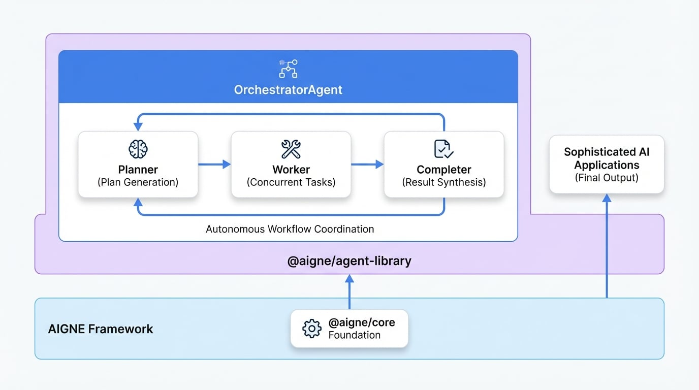

# Agent ライブラリ

Agent ライブラリは、複雑な AI アプリケーションの開発を加速させるために設計された、ビルド済みで再利用可能な Agent のコレクションを提供します。これらの既製のコンポーネントを統合することで、すべてをゼロから構築することなく、洗練されたワークフローのオーケストレーション、同時タスクの管理、マルチステッププロセスの自動化を簡単に行うことができます。

## はじめに

`@aigne/agent-library`は AIGNE フレームワークの公式パッケージであり、強力なビルド済み Agent 実装を提供します。`@aigne/core` を基盤として構築されたこのライブラリは、フレームワークの基本機能を拡張し、複雑な Agent ワークフローのオーケストレーションを簡素化します。これにより、開発者は基盤となる実装の詳細ではなく、高レベルのロジックに集中できます。

このライブラリの主な機能は次のとおりです。

*   **高度な Agent パターン**: `OrchestratorAgent` のような高レベルの Agent 実装を提供し、複雑なタスク実行フローを管理します。
*   **同時タスク実行**: 複数のタスクの並列実行をサポートし、要求の厳しいワークロードの処理効率を大幅に向上させます。
*   **自動プランニング**: 高レベルの目標に基づいて、段階的な実行計画を自動的に生成できます。
*   **結果の統合**: さまざまなタスクやステップからの結果をインテリジェントに集約・統合し、一貫性のある最終的な出力を生成します。
*   **完全な TypeScript サポート**: 堅牢でタイプセーフな開発体験を保証するための包括的な型定義が含まれています。

## インストール

開始するには、お好みのパッケージマネージャーを使用して必要なパッケージをインストールします。`@aigne/agent-library` とそのコア依存関係である `@aigne/core` の両方が必要です。

```sh npmでインストール icon=lucide:terminal
npm install @aigne/agent-library @aigne/core
```

```sh yarnでインストール icon=lucide:terminal
yarn add @aigne/agent-library @aigne/core
```

```sh pnpmでインストール icon=lucide:terminal
pnpm add @aigne/agent-library @aigne/core
```

## 利用可能な Agent

このライブラリには、高度なユースケース向けに設計された特殊な Agent が含まれています。各 Agent は、詳細なガイダンスのために独自のセクションで文書化されています。

次の図は、`OrchestratorAgent` の高レベルのアーキテクチャを示しています。

<!-- DIAGRAM_IMAGE_START:architecture:16:9 -->

<!-- DIAGRAM_IMAGE_END -->

<x-cards data-columns="2">
  <x-card data-title="Orchestrator Agent" data-href="/agent-library/orchestrator" data-icon="lucide:workflow">
    複雑な目標に対して自律的に計画、実行、結果の統合を行う高度な Agent です。Planner → Worker → Completer アーキテクチャを使用して、マルチステップのワークフローを調整します。
  </x-card>
</x-cards>

## まとめ

Agent ライブラリは、AIGNE フレームワークを使用して洗練されたマルチ Agent システムを構築しようとするすべての開発者にとって不可欠なツールキットです。複雑なプロセスの自動化とワークフローの効率的なオーケストレーションのための基盤コンポーネントを提供します。このライブラリの主要コンポーネントについてさらに詳しく知りたい場合は、[Orchestrator](./agent-library-orchestrator.md) のドキュメントに進んでください。