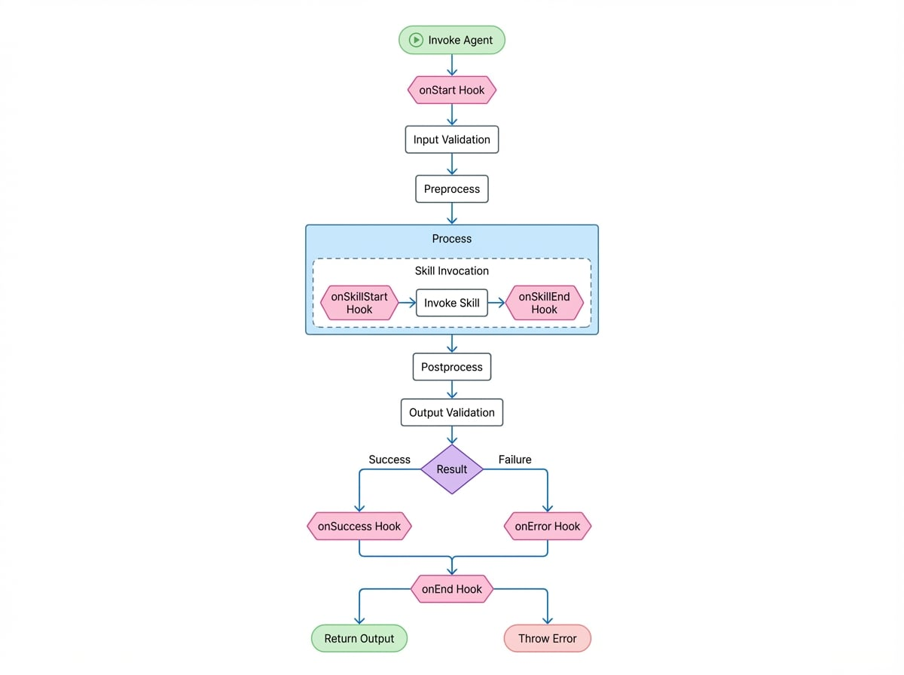

# 钩子

钩子（Hooks）提供了一种强大的机制，用于观察、拦截 Agent 的执行生命周期并向其中注入自定义逻辑。它们允许您在不改变 Agent 核心实现的情况下，添加日志记录、监控、输入/输出转换以及自定义错误处理等功能。

本指南详细介绍了 Agent 的执行生命周期、可用的钩子以及如何有效地实现它们。

## Agent 执行生命周期

要正确使用钩子，理解 Agent 的执行生命周期至关重要。当一个 Agent 被调用时，它会按一系列步骤执行，并在特定时间点触发钩子。

下图展示了 Agent 调用期间的事件序列以及相应调用的钩子。

<!-- DIAGRAM_IMAGE_START:flowchart:4:3 -->

<!-- DIAGRAM_IMAGE_END -->

## 可用的钩子

钩子在 `AgentHooks` 对象中定义。每个钩子都可以实现为一个函数或一个独立的、专用的 Agent。

<x-field-group>
  <x-field data-name="onStart" data-type="function | Agent">
    <x-field-desc markdown>在 Agent 调用的最开始，输入校验之前触发。可用于修改初始的 `input` 或 `options`。</x-field-desc>
  </x-field>
  <x-field data-name="onSuccess" data-type="function | Agent">
    <x-field-desc markdown>在 Agent 的 `process` 方法成功完成且输出已通过校验后触发。可用于转换最终的 `output`。</x-field-desc>
  </x-field>
  <x-field data-name="onError" data-type="function | Agent">
    <x-field-desc markdown>在执行的任何阶段抛出错误时触发。可用于实现自定义错误日志记录，或通过返回 `{ retry: true }` 实现重试机制。</x-field-desc>
  </x-field>
  <x-field data-name="onEnd" data-type="function | Agent">
    <x-field-desc markdown>在 Agent 调用的最末尾触发，无论成功还是失败。适用于清理任务、最终日志记录或指标收集。</x-field-desc>
  </x-field>
  <x-field data-name="onSkillStart" data-type="function | Agent">
    <x-field-desc markdown>在 Agent 调用其某个技能（一个子 Agent）之前触发。这对于追踪 Agent 之间的任务委托很有用。</x-field-desc>
  </x-field>
  <x-field data-name="onSkillEnd" data-type="function | Agent">
    <x-field-desc markdown>在技能调用完成（无论成功或失败）后触发。它会接收到技能的结果或错误。</x-field-desc>
  </x-field>
  <x-field data-name="onHandoff" data-type="function | Agent">
    <x-field-desc markdown>当一个 Agent 的 `process` 方法返回另一个 Agent 实例时触发，这实际上是交出了控制权。这允许监控 Agent 到 Agent 的转移。</x-field-desc>
  </x-field>
</x-field-group>

## 实现钩子

可以通过三种方式将钩子附加到 Agent 上：
1.  在 Agent 实例化时，通过 `AgentOptions` 中的 `hooks` 属性。
2.  在调用时，通过 `AgentInvokeOptions` 中的 `hooks` 属性。
3.  在 `AIGNEContext` 实例上全局设置。

### 示例 1：基本日志记录

这是一个简单的钩子示例，用于记录 Agent 执行的开始和结束。

```typescript Agent 日志记录钩子 icon=logos:typescript
import { Agent, AIGNE, type AgentHooks } from "@aigne/core";

// 定义日志记录钩子
const loggingHook: AgentHooks = {
  onStart: ({ agent, input }) => {
    console.log(`[${agent.name}] Starting execution with input:`, input);
  },
  onEnd: ({ agent, input, output, error }) => {
    if (error) {
      console.error(`[${agent.name}] Execution failed for input:`, input, "Error:", error);
    } else {
      console.log(`[${agent.name}] Execution succeeded with output:`, output);
    }
  },
};

// 定义一个简单的 Agent
class MyAgent extends Agent {
  async process(input: { message: string }) {
    return { reply: `You said: ${input.message}` };
  }
}

// 使用钩子实例化 Agent
const myAgent = new MyAgent({
  name: "EchoAgent",
  hooks: [loggingHook],
});

const aigne = new AIGNE();
await aigne.invoke(myAgent, { message: "hello" });

// 控制台输出：
// [EchoAgent] Starting execution with input: { message: 'hello' }
// [EchoAgent] Execution succeeded with output: { reply: 'You said: hello' }
```

### 示例 2：使用 `onStart` 修改输入

`onStart` 钩子可以返回一个对象来修改 Agent 将接收到的 `input`。

```typescript 修改 Agent 输入 icon=logos:typescript
import { Agent, AIGNE, type AgentHooks } from "@aigne/core";

const inputModificationHook: AgentHooks = {
  onStart: ({ input }) => {
    // 向输入消息中添加时间戳
    const newInput = {
      ...input,
      timestamp: new Date().toISOString(),
    };
    return { input: newInput };
  },
};

class GreeterAgent extends Agent {
  async process(input: { name: string; timestamp?: string }) {
    return { greeting: `Hello, ${input.name}! (processed at ${input.timestamp})` };
  }
}

const agent = new GreeterAgent({ hooks: [inputModificationHook] });

const aigne = new AIGNE();
const result = await aigne.invoke(agent, { name: "Alice" });

console.log(result);
// {
//   greeting: "Hello, Alice! (processed at 2023-10-27T10:00:00.000Z)"
// }
```

### 示例 3：使用 `onError` 自定义重试

`onError` 钩子可以返回 `{ retry: true }` 来通知 AIGNE 应重新尝试 Agent 的 `process` 方法。这对于处理暂时性故障很有用。

```typescript 自定义重试钩子 icon=logos:typescript
import { Agent, AIGNE, type AgentHooks } from "@aigne/core";

let attempt = 0;

const retryHook: AgentHooks = {
  onError: ({ agent, error }) => {
    console.log(`[${agent.name}] Attempt failed: ${error.message}. Retrying...`);
    // 返回 true 以表示重试，但仅限前 2 次尝试
    if (attempt < 2) {
      return { retry: true };
    }
    // 不返回任何内容，让错误继续传播
  },
};

class UnreliableAgent extends Agent {
  async process() {
    attempt++;
    if (attempt <= 2) {
      throw new Error("Service temporarily unavailable");
    }
    return { status: "OK" };
  }
}

const agent = new UnreliableAgent({ hooks: [retryHook] });

const aigne = new AIGNE();
const result = await aigne.invoke(agent, {});

console.log(result); // { status: 'OK' }
```

这个 Agent 会失败两次，`retryHook` 会拦截错误并每次都触发重试。在第三次尝试时，Agent 成功执行。

## 钩子优先级

钩子可以在 Agent 上、在调用时以及在上下文中定义。为了管理执行顺序，钩子可以设置一个 `priority` 属性，其值为 `"high"`、`"medium"` 或 `"low"`（默认值）。

钩子按其优先级顺序执行：`high` > `medium` > `low`。

```typescript 钩子优先级示例 icon=logos:typescript
const highPriorityHook: AgentHooks = {
  priority: 'high',
  onStart: () => console.log('High priority hook executed.'),
};

const mediumPriorityHook: AgentHooks = {
  priority: 'medium',
  onStart: () => console.log('Medium priority hook executed.'),
};

const lowPriorityHook: AgentHooks = {
  // priority 默认为 'low'
  onStart: () => console.log('Low priority hook executed.'),
};

class MonitoredAgent extends Agent {
  async process(input: {}) {
    console.log('Agent processing...');
    return { success: true };
  }
}

const agent = new MonitoredAgent({
  hooks: [lowPriorityHook, highPriorityHook, mediumPriorityHook],
});

const aigne = new AIGNE();
await aigne.invoke(agent, {});


// 控制台输出：
// High priority hook executed.
// Medium priority hook executed.
// Low priority hook executed.
// Agent processing...
```

当一个钩子的逻辑依赖于另一个钩子的结果时，这种可预测的执行顺序至关重要。

## 总结

钩子是构建健壮且可观察的基于 Agent 的系统的重要工具。它们提供了一种清晰、非侵入性的方式，为您的 Agent 添加诸如日志记录、性能监测和弹性模式等横切关注点。通过理解 Agent 的生命周期和每个钩子的功能，您可以创建出复杂的、生产就绪的 AI 应用程序。