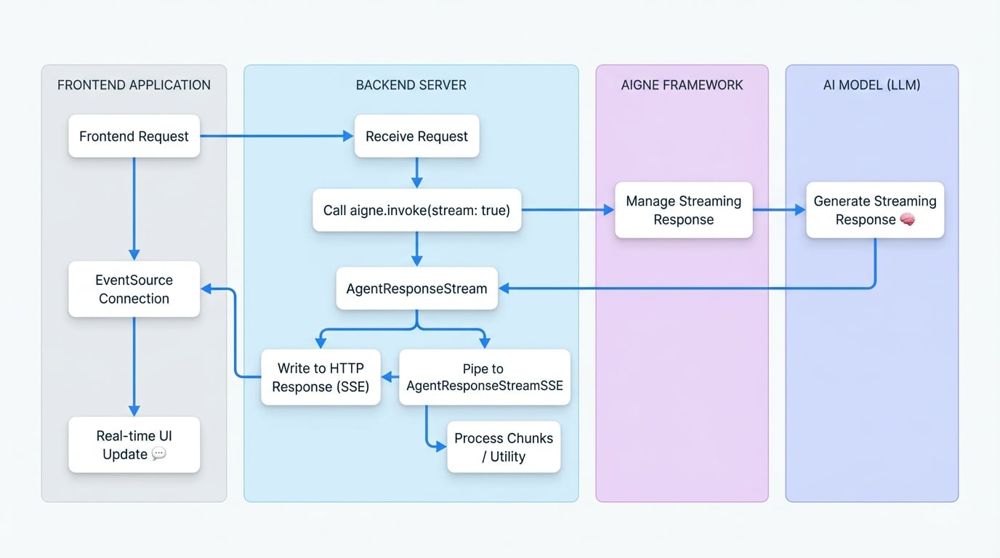

# 串流

AIGNE 框架為處理來自 Agent 的串流回應提供了強大的支援。這對於需要即時資料處理的應用程式特別有用，例如聊天機器人、即時資料摘要或任何能從即時、漸進式更新中受益的使用者介面。透過在資料可用時立即處理，您可以創造更具響應性和互動性的使用者體驗。

本指南詳細介紹了在框架內啟用和使用串流回應的方法。

## 啟用串流

要從 Agent 接收串流回應，您必須在 `invoke` 呼叫中將 `stream` 選項設定為 `true`。啟用此選項後，`invoke` 方法會回傳一個 `AgentResponseStream`，它是一個 `AgentResponseChunk` 物件的 `ReadableStream`，而不是一個完整的回應物件。

```typescript AIGNE Invoke with Streaming icon=logos:typescript
import { AIGNE, AIAgent } from "@aigne/core";
import { OpenAI } from "@aigne/openai";

const llm = new OpenAI({
  apiKey: process.env.OPENAI_API_KEY,
  model: "gpt-4o",
});

const agent = new AIAgent({
  model: llm,
  instructions: "You are a helpful assistant.",
});

const aigne = new AIGNE({
  model: llm,
  agents: { agent },
});

async function run() {
  // 透過將 `stream` 選項設定為 true 來啟用串流
  const stream = await aigne.invoke("agent", {
    prompt: "Tell me a short story.",
  }, { stream: true });

  // 'stream' 變數現在是一個 ReadableStream
  for await (const chunk of stream) {
    // 在每個區塊到達時進行處理
    process.stdout.write(chunk.delta.text?.text || "");
  }
}

run();
```

## 使用串流

回傳的串流由 `AgentResponseChunk` 物件組成。每個區塊代表總回應的一部分。在區塊的 `delta` 中，主要有兩種類型的資料：

- `delta.text`：包含部分文字內容。這用於從語言模型串流傳輸文字。
- `delta.json`：包含部分 JSON 資料。當 Agent 設定為回傳結構化輸出時使用。框架會漸進地建立最終的 JSON 物件。

### 處理區塊

您可以使用 `for await...of` 迴圈來疊代串流，以便在每個區塊到達時進行處理。以下範例示範如何從串流中累積文字和最終的結構化 JSON。

```typescript Processing Stream Chunks icon=logos:typescript
import { AIGNE, AIAgent, Message } from "@aigne/core";
import { OpenAI } from "@aigne/openai";
import { agentResponseStreamToObject } from "@aigne/core/utils";

// 假設 aigne 和 agent 的設定與前一個範例相同

interface StoryOutput extends Message {
  protagonist: string;
  setting: string;
  plotSummary: string;
  storyText: string;
}

async function processStream() {
  const aigne = new AIGNE({
    model: new OpenAI(),
    agents: {
      agent: new AIAgent({
        model: new OpenAI(),
      })
    },
  });
  const stream = await aigne.invoke<StoryOutput>("agent", {
      prompt: "Write a short story about a robot who discovers music. Return the protagonist's name, the setting, a plot summary, and the full story text.",
      // 假設 Agent 已設定為結構化輸出
    },
    { stream: true }
  );

  let fullText = "";
  const finalResult: Partial<StoryOutput> = {};

  for await (const chunk of stream) {
    if (chunk.delta.text?.storyText) {
      const partialText = chunk.delta.text.storyText;
      fullText += partialText;
      process.stdout.write(partialText); // 用文字即時更新 UI
    }

    if (chunk.delta.json) {
      // 框架在每個相關的區塊中提供部分合併的 JSON 物件
      Object.assign(finalResult, chunk.delta.json);
    }
  }

  console.log("\n\n--- Final Structured Output ---");
  console.log(finalResult);

  // 您也可以使用一個工具程式直接取得最終物件
  // 注意：這會消耗掉串流，所以應該用它來代替迴圈
  // const finalObject = await agentResponseStreamToObject(stream);
  // console.log(finalObject);
}

processStream();
```

## 工具程式：agentResponseStreamToObject

如果您只需要最終的、完整形成的物件，而不需要處理中間的區塊，框架提供了 `agentResponseStreamToObject` 工具程式。此函式會消耗整個串流並回傳一個解析為完整回應物件的 promise。

當您希望在後端享受串流的好處（例如，從 LLM 獲得更低的 time-to-first-byte），但只需要向呼叫者提供最終結果時，這非常有用。

```typescript Using agentResponseStreamToObject icon=logos:typescript
import { AIGNE, AIAgent } from "@aigne/core";
import { OpenAI } from "@aigne/openai";
import { agentResponseStreamToObject } from "@aigne/core/utils";
// ... 設定 aigne 和 agent

async function getFinalObject() {
  const aigne = new AIGNE({
    model: new OpenAI(),
    agents: {
      agent: new AIAgent({
        model: new OpenAI(),
      })
    },
  });
  const stream = await aigne.invoke("agent", {
    prompt: "Tell me a short story.",
  }, { stream: true });

  // 消耗串流並回傳最終的聚合物件
  const result = await agentResponseStreamToObject(stream);

  console.log("--- Complete Response ---");
  console.log(result.text);
}

getFinalObject();
```

## 使用 Server-Sent Events (SSE) 串流至前端

串流的一個常見用例是向 Web 前端發送即時更新。AIGNE 框架透過提供 `AgentResponseStreamSSE` 類別簡化了此過程，該類別可將 `AgentResponseStream` 轉換為與 Server-Sent Events (SSE) 相容的格式。

### 資料流圖

下圖說明了使用 SSE 時，從後端 AIGNE 到前端應用程式的資料流。

<!-- DIAGRAM_IMAGE_START:architecture:16:9 -->

<!-- DIAGRAM_IMAGE_END -->

### 後端實作

在您的伺服器上，建立一個端點來啟動啟用串流的 Agent `invoke` 呼叫。然後，將產生的 `AgentResponseStream` 管道傳輸至 `AgentResponseStreamSSE`，並將其輸出寫入 HTTP 回應。

以下範例使用通用的 Web 伺服器結構。

```typescript SSE Backend Endpoint icon=logos:typescript
import { AIGNE, AIAgent } from "@aigne/core";
import { OpenAI } from "@aigne/openai";
import { AgentResponseStreamSSE } from "@aigne/core/utils";
// ... 設定 aigne

// 使用通用伺服器上下文的範例（例如 Express、Hono 等）
async function handleSseRequest(req, res) {
  const aigne = new AIGNE({
    model: new OpenAI(),
    agents: {
      agent: new AIAgent({
        model: new OpenAI(),
      })
    },
  });
  res.writeHead(200, {
    "Content-Type": "text/event-stream",
    "Connection": "keep-alive",
    "Cache-Control": "no-cache",
  });

  try {
    const stream = await aigne.invoke("agent", {
      prompt: req.body.prompt,
    }, { stream: true });

    // 將 Agent 串流轉換為 SSE 串流
    const sseStream = new AgentResponseStreamSSE(stream);

    // 將 SSE 串流管道傳輸至 HTTP 回應
    for await (const sseChunk of sseStream) {
      res.write(sseChunk);
    }
  } catch (error) {
    console.error("SSE stream error:", error);
    const sseError = `event: error\ndata: ${JSON.stringify({ message: error.message })}\n\n`;
    res.write(sseError);
  } finally {
    res.end();
  }
}
```

### 前端實作

在前端，使用原生的 `EventSource` API 連接到您的 SSE 端點。然後您可以監聽 `message` 事件以接收區塊，並監聽 `error` 事件以處理問題。

```javascript SSE Frontend Client icon=logos:javascript
const promptInput = document.getElementById('prompt-input');
const submitButton = document.getElementById('submit-button');
const responseContainer = document.getElementById('response');

submitButton.addEventListener('click', async () => {
  const prompt = promptInput.value;
  responseContainer.innerHTML = ''; // 清除先前的回應

  const eventSource = new EventSource('/api/chat-stream', {
    method: 'POST',
    headers: { 'Content-Type': 'application/json' },
    body: JSON.stringify({ prompt }),
  });

  eventSource.onmessage = (event) => {
    const chunk = JSON.parse(event.data);

    if (chunk.delta?.text?.text) {
      responseContainer.innerHTML += chunk.delta.text.text;
    }
  };

  eventSource.onerror = (error) => {
    console.error('EventSource failed:', error);
    responseContainer.innerHTML += '<p style="color: red;">Error receiving stream.</p>';
    eventSource.close();
  };

  // 'open' 事件在連線建立時觸發
  eventSource.onopen = () => {
    console.log('Connection to server opened.');
  };
});
```

這種架構能夠建立高度響應的使用者介面，文字會隨著 AI 模型的生成逐字顯示。

## 總結

AIGNE 框架的串流功能對於建立現代化的即時 AI 應用程式至關重要。透過在 `invoke` 方法中啟用 `stream` 選項，您可以漸進式處理資料、提高感知效能，並使用 Server-Sent Events 將 Agent 回應有效地管道傳輸至前端。有關 Agent 呼叫的更多詳細資訊，請參閱 [AI Agent](./developer-guide-agents-ai-agent.md) 文件。