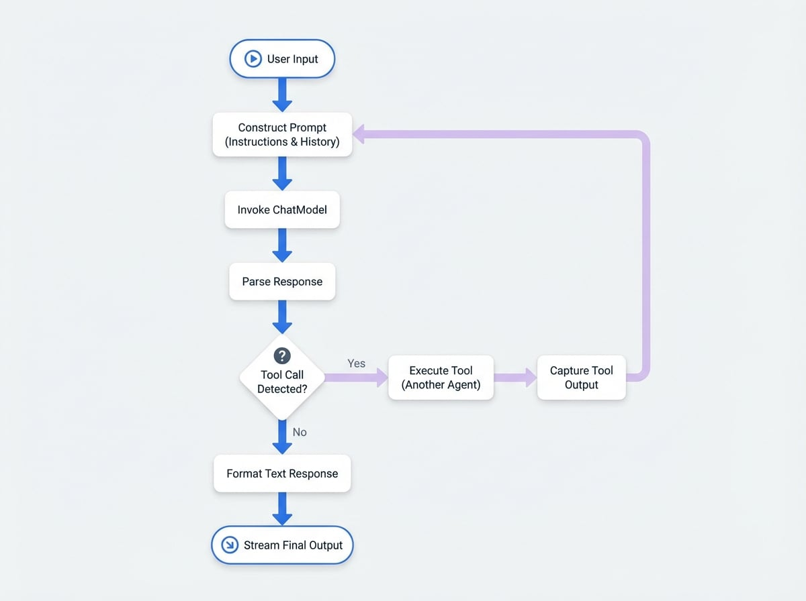

# AI Agent

`AIAgent` 是与大语言模型 (LLM) 交互的主要组件。它充当 `ChatModel` 的直接接口，支持复杂的对话式 AI、函数调用（工具使用）和结构化数据提取。该 Agent 负责处理提示词构建、模型调用、响应解析和工具执行循环等复杂任务。

本指南全面概述了 `AIAgent`、其配置及其核心功能。要更广泛地了解 Agent 如何融入 AIGNE 框架，请参阅 [Agent 核心概念指南](./developer-guide-core-concepts-agents.md)。

## 工作原理

`AIAgent` 遵循一个系统化的流程来处理用户输入并生成响应。这个过程通常涉及与 LLM 的多次交互，尤其是在使用工具时。

<!-- DIAGRAM_IMAGE_START:flowchart:4:3 -->

<!-- DIAGRAM_IMAGE_END -->

上图说明了一个请求的典型生命周期：
1.  **提示词构建**：`AIAgent` 使用 `PromptBuilder` 从其 `instructions`、用户输入以及任何先前工具调用的历史记录中组装最终的提示词。
2.  **模型调用**：完全成形的提示词被发送到配置好的 `ChatModel`。
3.  **响应解析**：Agent 接收模型的原始输出。
4.  **工具调用检测**：它会检查响应是否包含调用工具的请求。
    - 如果**否**，Agent 会格式化文本响应并返回。
    - 如果**是**，它将进入工具执行循环。
5.  **工具执行**：Agent 识别并调用所请求的工具（这是另一个 Agent），捕获其输出，并将其格式化为发送给模型的消息。然后，流程循环回到步骤 1，将工具的结果发送回模型以进行下一步的生成。
6.  **最终输出**：一旦模型生成了没有任何工具调用的最终文本响应，Agent 会将其格式化并以流式方式返回给用户。

## 配置

`AIAgent` 通过其构造函数选项进行配置。以下是可用参数的详细说明。

<x-field-group>
  <x-field data-name="instructions" data-type="string | PromptBuilder" data-required="false">
    <x-field-desc markdown>指导 AI 模型行为的核心指令。可以是一个简单的字符串，也可以是一个用于创建复杂动态提示词的 `PromptBuilder` 实例。更多详情请参阅 [提示词](./developer-guide-advanced-topics-prompts.md) 指南。</x-field-desc>
  </x-field>
  <x-field data-name="inputKey" data-type="string" data-required="false">
    <x-field-desc markdown>指定输入消息对象中的哪个键应被视为主用户查询。如果未设置，则必须提供 `instructions`。</x-field-desc>
  </x-field>
  <x-field data-name="outputKey" data-type="string" data-default="message" data-required="false">
    <x-field-desc markdown>定义 Agent 的最终文本响应将放置在输出对象中的键。默认为 `message`。</x-field-desc>
  </x-field>
  <x-field data-name="inputFileKey" data-type="string" data-required="false">
    <x-field-desc markdown>指定输入消息中包含要发送给模型的文件数据的键。</x-field-desc>
  </x-field>
  <x-field data-name="outputFileKey" data-type="string" data-default="files" data-required="false">
    <x-field-desc markdown>定义模型生成的任何文件将放置在输出对象中的键。默认为 `files`。</x-field-desc>
  </x-field>
  <x-field data-name="toolChoice" data-type="AIAgentToolChoice | Agent" data-default="auto" data-required="false">
    <x-field-desc markdown>控制 Agent 如何使用其可用工具（技能）。详情请参阅下文的“工具使用”部分。</x-field-desc>
  </x-field>
  <x-field data-name="toolCallsConcurrency" data-type="number" data-default="1" data-required="false">
    <x-field-desc markdown>单轮中可并发执行的工具调用最大数量。</x-field-desc>
  </x-field>
  <x-field data-name="catchToolsError" data-type="boolean" data-default="true" data-required="false">
    <x-field-desc markdown>如果为 `true`，Agent 将捕获工具执行中的错误，并将错误消息反馈给模型。如果为 `false`，错误将中止整个过程。</x-field-desc>
  </x-field>
  <x-field data-name="structuredStreamMode" data-type="boolean" data-default="false" data-required="false">
    <x-field-desc markdown>启用一种模式，用于从模型的流式响应中提取结构化的 JSON 数据。更多信息请参阅“结构化输出”部分。</x-field-desc>
  </x-field>
  <x-field data-name="memoryAgentsAsTools" data-type="boolean" data-default="false" data-required="false">
    <x-field-desc markdown>当为 `true` 时，附加的 `MemoryAgent` 实例将作为可调用工具暴露给模型，允许 Agent 显式地从其内存中读取或写入数据。</x-field-desc>
  </x-field>
</x-field-group>

### 基本示例

以下是一个简单的 `AIAgent` 示例，配置其作为一个乐于助人的助手。

```javascript 基本聊天 Agent icon=logos:javascript
import { AIAgent } from "@aigne/core";
import { OpenAI } from "@aigne/openai";

// 配置要使用的模型
const model = new OpenAI({
  apiKey: process.env.OPENAI_API_KEY,
  model: "gpt-4o",
});

// 创建 AI Agent
const chatAgent = new AIAgent({
  instructions: "You are a helpful assistant.",
  inputKey: "question",
  outputKey: "answer",
});

// 要运行此 Agent，您需要使用 AIGNE 的 invoke 方法
// const aigne = new AIGNE({ model });
// const response = await aigne.invoke(chatAgent, { question: "What is AIGNE?" });
// console.log(response.answer);
```

该 Agent 接收一个带有 `question` 键的输入对象，并生成一个带有 `answer` 键的输出对象。

## 工具使用

`AIAgent` 的一个强大功能是它能够将其他 Agent 用作工具。通过在调用期间提供 `skills` 列表，`AIAgent` 可以决定调用这些工具来收集信息或执行操作。`toolChoice` 选项决定了此行为。

| `toolChoice` 值 | 描述 |
| :--- | :--- |
| `auto` | （默认）模型根据对话上下文决定是否调用工具。 |
| `none` | 完全禁用工具使用。模型不会尝试调用任何工具。 |
| `required` | 强制模型调用一个或多个工具。 |
| `router` | 一种特殊模式，强制模型只选择一个工具。然后，Agent 将请求直接路由到该工具，并将其响应作为最终输出进行流式传输。这对于创建调度器 Agent 非常高效。 |

### 工具使用示例

假设您有一个可以获取天气信息的 `FunctionAgent`。您可以将其作为技能提供给 `AIAgent`。

```javascript 带工具的 Agent icon=logos:javascript
import { AIAgent, FunctionAgent } from "@aigne/core";
import { OpenAI } from "@aigne/openai";

// 一个获取天气的简单函数
function getCurrentWeather(location) {
  if (location.toLowerCase().includes("tokyo")) {
    return JSON.stringify({ location: "Tokyo", temperature: "15", unit: "celsius" });
  }
  return JSON.stringify({ location, temperature: "unknown" });
}

// 将函数包装在 FunctionAgent 中，使其成为一个工具
const weatherTool = new FunctionAgent({
  name: "get_current_weather",
  description: "Get the current weather in a given location",
  inputSchema: {
    type: "object",
    properties: { location: { type: "string", description: "The city and state" } },
    required: ["location"],
  },
  process: ({ location }) => getCurrentWeather(location),
});

// 配置模型
const model = new OpenAI({
  apiKey: process.env.OPENAI_API_KEY,
  model: "gpt-4o",
});

// 创建一个可以使用天气工具的 AI Agent
const weatherAssistant = new AIAgent({
  instructions: "You are a helpful assistant that can provide weather forecasts.",
  inputKey: "query",
  outputKey: "response",
});

// 调用时，将工具作为技能提供
// const aigne = new AIGNE({ model, skills: [weatherTool] });
// const result = await aigne.invoke(weatherAssistant, { query: "What's the weather like in Tokyo?" });
// console.log(result.response); // LLM 将使用工具的输出进行响应
```

在此场景中，`AIAgent` 将接收查询，识别出需要天气信息，调用 `weatherTool`，接收其 JSON 输出，然后使用该数据来组织一个自然语言响应。

## 结构化输出

对于需要提取特定结构化信息（如情感分析、分类或实体提取）的任务，`structuredStreamMode` 非常有用。启用后，Agent 会主动解析模型的流式输出，以查找并提取 JSON 对象。

默认情况下，必须指示模型将其结构化数据以 YAML 格式放置在 `<metadata>...</metadata>` 标签内。

### 结构化输出示例

此示例配置了一个 Agent，用于分析用户消息的情感并返回一个结构化的 JSON 对象。

```javascript 结构化情感分析 icon=logos:javascript
import { AIAgent } from "@aigne/core";
import { OpenAI } from "@aigne/openai";

const sentimentAnalyzer = new AIAgent({
  instructions: `
    Analyze the sentiment of the user's message.
    Respond with a single word summary, followed by a structured analysis.
    Place the structured analysis in YAML format inside <metadata> tags.
    The structure should contain 'sentiment' (positive, negative, or neutral) and a 'score' from -1.0 to 1.0.
  `,
  inputKey: "message",
  outputKey: "summary",
  structuredStreamMode: true,
});

// 调用时，输出将同时包含文本摘要
// 和解析后的 JSON 对象。
// const aigne = new AIGNE({ model: new OpenAI(...) });
// const result = await aigne.invoke(sentimentAnalyzer, { message: "AIGNE is an amazing framework!" });
/*
  预期结果:
  {
    summary: "Positive.",
    sentiment: "positive",
    score: 0.9
  }
*/
```

您可以使用 `customStructuredStreamInstructions` 选项自定义解析逻辑，包括开始/结束标签和解析函数（例如，直接支持 JSON）。

## 总结

`AIAgent` 是创建高级 AI 应用程序的基础构建块。它为语言模型提供了一个强大而灵活的接口，并完整支持工具使用、结构化数据提取和内存集成。

对于更复杂的工作流，您可能需要编排多个 Agent。要了解如何操作，请继续阅读 [Team Agent](./developer-guide-agents-team-agent.md) 文档。有关高级提示词模板技术，请参阅 [提示词](./developer-guide-advanced-topics-prompts.md) 指南。