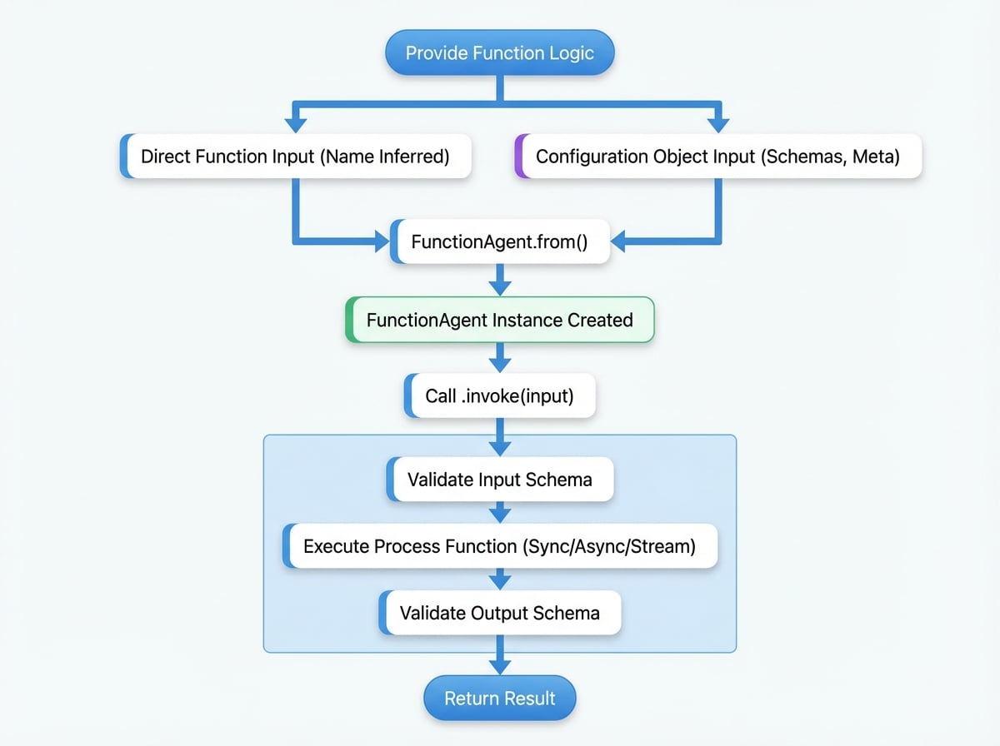

# Function Agent

The `FunctionAgent` provides a straightforward method for encapsulating existing TypeScript or JavaScript functions, thereby elevating them to first-class agents within the AIGNE framework. This enables the seamless integration of custom business logic, external API interactions, or any arbitrary code into an agentic workflow, obviating the need for extensive boilerplate.

By wrapping a function, the `FunctionAgent` allows it to participate fully in the agent ecosystem. It can be invoked identically to any other agent, incorporated as a skill within an `AIAgent` or `TeamAgent`, and interact with the AIGNE context and lifecycle hooks. This positions it as an essential component for bridging conventional programmatic logic with AI-driven processes.

This diagram illustrates the creation and invocation flow of a `FunctionAgent`, from providing the source function to receiving the final output.

<!-- DIAGRAM_IMAGE_START:flowchart:4:3 -->

<!-- DIAGRAM_IMAGE_END -->

## Key Concepts

A `FunctionAgent` is a specialized implementation of the `Agent` class that delegates its core processing logic to a user-supplied function. The primary constructor for this agent is the static method `FunctionAgent.from()`, which streamlines its instantiation.

A `FunctionAgent` can be created in two ways:

1.  **Directly from a function:** Pass a synchronous or asynchronous function to `FunctionAgent.from()`. The agent will infer properties, such as its name, from the function definition.
2.  **From a configuration object:** For more explicit control, provide an options object that specifies the `process` function along with other standard agent configurations like `name`, `description`, `inputSchema`, and `outputSchema`.

This design provides flexibility for both rapid, ad-hoc integrations and the development of robust, well-defined agent components.

## Creating a Function Agent

The standard method for creating a `FunctionAgent` is through the `FunctionAgent.from()` factory method, which accepts either a function or a configuration object.

### From a Simple Function

Any standard function can be wrapped directly. The AIGNE framework will use the function's name as the agent's name. This approach is optimal for simple, self-contained operations.

```javascript Wrapping a Simple Function icon=logos:javascript
import { FunctionAgent } from "@aigne/core";

// Define a simple synchronous function
function add({ a, b }) {
  return { result: a + b };
}

// Wrap the function into an agent
const addAgent = FunctionAgent.from(add);

console.log(addAgent.name); // Outputs: 'add'
```

The function receives the agent's input object as its first argument and is expected to return an object that constitutes the agent's output.

### With Full Configuration

For more complex integrations, a full configuration object should be provided. This allows for the definition of input/output schemas for validation, the inclusion of a description, and the assignment of a custom name. This method is recommended for creating robust and reusable agents.

```javascript Function Agent with Configuration icon=logos:javascript
import { FunctionAgent } from "@aigne/core";
import { z } from "zod";

const fetchUserAgent = FunctionAgent.from({
  name: "FetchUser",
  description: "Fetches user data from a placeholder API.",
  inputSchema: z.object({
    userId: z.number().describe("The ID of the user to fetch."),
  }),
  outputSchema: z.object({
    id: z.number(),
    name: z.string(),
    email: z.string().email(),
  }),
  process: async ({ userId }) => {
    const response = await fetch(`https://jsonplaceholder.typicode.com/users/${userId}`);
    if (!response.ok) {
      throw new Error("Failed to fetch user data.");
    }
    const data = await response.json();
    return {
      id: data.id,
      name: data.name,
      email: data.email,
    };
  },
});
```

In this example, `zod` schemas are defined to ensure the input `userId` is a number and the output conforms to a specified structure.

## Invoking a Function Agent

A created `FunctionAgent` is invoked using the standard `.invoke()` method, consistent with all other agent types.

```javascript Invoking the Agent icon=logos:javascript
async function main() {
  // Using the simple 'add' agent from the previous example
  const result = await addAgent.invoke({ a: 10, b: 5 });
  console.log(result); // { result: 15 }

  // Using the configured 'FetchUser' agent
  const user = await fetchUserAgent.invoke({ userId: 1 });
  console.log(user); 
  // { id: 1, name: 'Leanne Graham', email: 'Sincere@april.biz' }
}

main();
```

The `invoke` method manages the execution lifecycle, including input validation against the schema (if provided), execution of the underlying function, and validation of the result against the output schema.

## Advanced Usage

### Streaming Responses

`FunctionAgent` supports streaming responses through the use of asynchronous generators. The `process` function can be defined as an `async function*` that `yield`s `AgentResponseChunk` objects, enabling incremental data transmission.

```javascript Streaming with an Async Generator icon=logos:javascript
import { FunctionAgent, jsonDelta, textDelta } from "@aigne/core";
import { z } from "zod";

const streamNumbersAgent = FunctionAgent.from({
  name: "StreamNumbers",
  inputSchema: z.object({
    count: z.number().int().positive(),
  }),
  outputSchema: z.object({
    finalCount: z.number(),
    message: z.string(),
  }),
  process: async function* ({ count }) {
    for (let i = 1; i <= count; i++) {
      yield textDelta({ message: `Processing number ${i}... ` });
      await new Promise((resolve) => setTimeout(resolve, 200)); // Simulate work
    }
    yield jsonDelta({ finalCount: count });
    yield textDelta({ message: "Done." });
  },
});

async function runStream() {
  const stream = await streamNumbersAgent.invoke({ count: 5 }, { streaming: true });
  for await (const chunk of stream) {
    console.log(chunk);
  }
}

runStream();
```

This capability is particularly useful for long-running tasks where providing real-time feedback on the agent's progress is required.

## Configuration

The `FunctionAgent` is initialized via a configuration object passed to `FunctionAgent.from` or its constructor. The following parameters are specific to its configuration.

<x-field-group>
  <x-field data-name="process" data-type="FunctionAgentFn" data-required="true">
    <x-field-desc markdown>The function that implements the agent's logic. It receives the input message and invocation options and returns the processing result. This can be a synchronous function, an async function returning a Promise, or an async generator for streaming.</x-field-desc>
  </x-field>
  <x-field data-name="name" data-type="string" data-required="false">
    <x-field-desc markdown>A unique name for the agent, used for identification and logging. If not provided, it defaults to the name of the `process` function.</x-field-desc>
  </x-field>
  <x-field data-name="description" data-type="string" data-required="false">
    <x-field-desc markdown>A human-readable description of what the agent does. This is useful for documentation and for other agents to understand its capabilities.</x-field-desc>
  </x-field>
  <x-field data-name="inputSchema" data-type="ZodObject" data-required="false">
    <x-field-desc markdown>A Zod schema to validate the structure and types of the input message. If validation fails, the agent will throw an error before the `process` function is called.</x-field-desc>
  </x-field>
  <x-field data-name="outputSchema" data-type="ZodObject" data-required="false">
    <x-field-desc markdown>A Zod schema to validate the structure and types of the output message returned by the `process` function. If validation fails, an error is thrown.</x-field-desc>
  </x-field>
</x-field-group>

All other properties from the base `AgentOptions` are also available. Refer to the [Agent documentation](./developer-guide-core-concepts-agents.md) for a complete list.

## Summary

The `FunctionAgent` is a versatile tool for integrating conventional code into the AIGNE framework, acting as a bridge that allows any JavaScript or TypeScript function to operate as a standard agent.

-   **Simplicity:** Wrap existing functions with minimal effort using `FunctionAgent.from()`.
-   **Integration:** Seamlessly incorporate traditional business logic, calculations, or external API calls into agentic workflows.
-   **Validation:** Enforce data contracts and improve reliability by defining input and output schemas with Zod.
-   **Flexibility:** Supports synchronous functions, asynchronous promises, and streaming with async generators.

By leveraging `FunctionAgent`, developers can combine the deterministic and reliable nature of traditional code with the dynamic capabilities of AI agents to build more powerful and robust applications. For orchestrating multiple agents, including Function Agents, refer to the documentation on the [Team Agent](./developer-guide-agents-team-agent.md).
