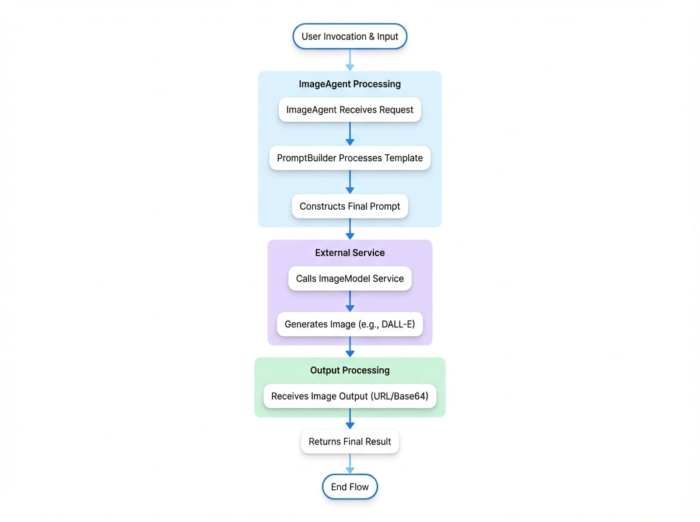

# Image Agent

The `ImageAgent` is a specialized agent responsible for generating images. It acts as an interface to an `ImageModel`, processing input data to formulate a prompt and then requesting the image generation service to create an image.

This agent is essential for any workflow that requires the dynamic creation of visual content based on textual descriptions. It leverages a `PromptBuilder` to construct its prompts, enabling the use of templates to generate images from variable inputs.

The following diagram illustrates the invocation flow of the `ImageAgent`, from user request to final output:

<!-- DIAGRAM_IMAGE_START:flowchart:4:3 -->

<!-- DIAGRAM_IMAGE_END -->

## Configuration

An `ImageAgent` can be configured either programmatically using TypeScript or declaratively using YAML. Both methods require defining the instructions for image generation and optionally specifying model-specific parameters.

### TypeScript Configuration

To create an `ImageAgent` in TypeScript, use the static `ImageAgent.from()` method and provide it with `ImageAgentOptions`.

```typescript "ImageAgent Configuration" icon=logos:typescript
import { AIGNE, ImageAgent } from "@aigne/core";
import { OpenAI } from "@aigne/openai";

// Configure the image model provider
const openai = new OpenAI({
  apiKey: process.env.OPENAI_API_KEY,
});

// Create an instance of the ImageAgent
const architectAgent = ImageAgent.from({
  name: "architect",
  description: "An agent that draws architectural diagrams.",
  instructions: "Create an architectural diagram of a {{subject}}.",
  modelOptions: {
    quality: "hd",
    style: "vivid",
  },
});

// The AIGNE instance must have an imageModel configured
const aigne = new AIGNE({
  imageModel: openai.image("dall-e-3"),
});

async function run() {
  const result = await aigne.invoke(architectAgent, {
    input: {
      subject: "microservices application",
    },
  });

  console.log(result);
}

run();
```

The code above defines an `ImageAgent` named "architect". It uses a templated `instructions` string to generate a prompt. The `modelOptions` object passes specific parameters to the underlying DALL-E 3 model to request a high-definition, vivid image.

### YAML Configuration

Alternatively, you can define an `ImageAgent` in a `.yaml` file. This approach is useful for separating agent definitions from application logic.

```yaml "image-agent.yaml" icon=logos:yaml
type: image
name: style-artist
description: Draws an image of an object in a specific style.
instructions: |
  Draw an image of a {{object}} in the {{style}} style.
input_schema:
  type: object
  properties:
    object:
      type: string
      description: The object to draw.
    style:
      type: string
      description: The style of the image.
  required:
    - object
    - style
```

In this declarative example, the `type: image` specifies that this is an `ImageAgent`. The `instructions` field contains a multi-line string with placeholders (`{{object}}`, `{{style}}`) that will be populated from the input during invocation. The `input_schema` formally defines the expected input structure.

## Parameters

The behavior of an `ImageAgent` is controlled by the options provided during its construction.

<x-field-group>
  <x-field data-name="instructions" data-type="string | PromptBuilder" data-required="true">
    <x-field-desc markdown>The prompt template used for image generation. This can be a simple string or a `PromptBuilder` instance for more complex logic. Placeholders in the format `{{key}}` will be replaced with values from the input object.</x-field-desc>
  </x-field>
  <x-field data-name="modelOptions" data-type="Record<string, any>" data-required="false">
    <x-field-desc markdown>An object containing provider-specific parameters to pass to the underlying `ImageModel`. This allows for fine-tuned control over the generation process, such as specifying image quality, size, or style. Refer to the specific model provider's documentation for available options.</x-field-desc>
  </x-field>
  <x-field data-name="outputFileType" data-type="'url' | 'base64'" data-required="false">
    <x-field-desc markdown>Specifies the desired format for the output image. The default behavior is determined by the `ImageModel`, but you can explicitly request either a public URL (`url`) or a Base64-encoded string (`base64`).</x-field-desc>
  </x-field>
</x-field-group>

## Invocation and Output

When an `ImageAgent` is invoked, it passes the input to its `PromptBuilder` to generate the final prompt. It then calls the configured `ImageModel` with this prompt and any specified `modelOptions`.

The agent's output is an object conforming to the `ImageModelOutput` schema, which contains the generated image in the requested format.

**Example Invocation**

```typescript "Invoking the Agent" icon=logos:typescript
const result = await aigne.invoke(styleArtistAgent, { // Assuming styleArtistAgent is loaded from YAML
  input: {
    object: "futuristic city",
    style: "cyberpunk",
  },
});
```

**Example Response**

```json "ImageAgent Output" icon=mdi:code-json
{
  "url": "https://oaidalleapiprodscus.blob.core.windows.net/private/...",
  "base64": null
}
```

The response contains a `url` pointing to the generated image. If `outputFileType` were set to `'base64'`, the `base64` field would be populated instead.

## Summary

The `ImageAgent` provides a structured and reusable way to integrate image generation capabilities into your AI workflows. By separating the prompt logic from the model interaction, it allows for clear and maintainable agent designs.

For more information on other agent types, refer to the following documentation:
- [AI Agent](./developer-guide-agents-ai-agent.md): For interacting with language models.
- [Team Agent](./developer-guide-agents-team-agent.md): For orchestrating multiple agents.
- [Function Agent](./developer-guide-agents-function-agent.md): For wrapping custom code as an agent.
