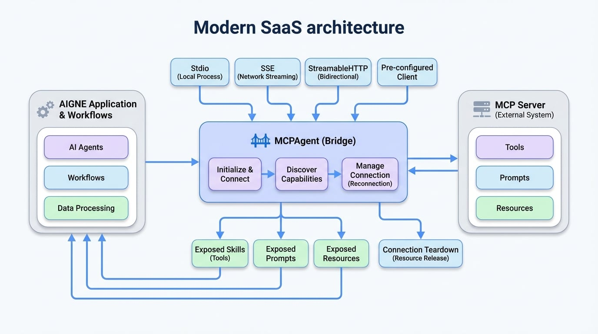

# MCP Agent

`MCPAgent` は、**モデルコンテキストプロトコル (MCP)** に準拠した外部システムと対話するために設計された特殊な Agent です。これはブリッジとして機能し、AIGNE アプリケーションがリモートの MCP サーバーに接続し、ツール、プロンプト、リソースなどの機能を、あたかもフレームワークのネイティブコンポーネントであるかのように利用できるようにします。

これにより、データベースコネクタやウェブオートメーションツールから、独自のエンタープライズシステムまで、MCP 準拠のインターフェースを公開していれば、幅広い外部サービスとのシームレスな統合が可能になります。

主な機能は次のとおりです。
- **複数のトランスポートプロトコル**: 標準 I/O (`stdio`)、サーバーセントイベント (`sse`)、または `streamableHttp` を介して MCP サーバーに接続します。
- **自動検出**: 接続された MCP サーバーで利用可能なツール、プロンプト、リソースを自動的に検出し、登録します。
- **堅牢な接続管理**: ネットワークベースのトランスポートに対して自動再接続機能を備え、一時的な接続性の問題に対応します。

## MCPAgent の仕組み

`MCPAgent` は、MCP サーバーへの接続と、その提供機能を AIGNE の構成要素に変換するロジックをカプセル化しています。`MCPAgent` が初期化されると、指定されたサーバーに接続し、利用可能なツール、プロンプト、リソースを問い合わせます。これらは、それぞれ `skills`、`prompts`、`resources` として Agent インスタンスに動的にアタッチされ、AIGNE ワークフロー内で直接アクセスできるようになります。

<!-- DIAGRAM_IMAGE_START:architecture:16:9 -->

<!-- DIAGRAM_IMAGE_END -->

## MCPAgent の作成

静的メソッド `MCPAgent.from()` を使用して `MCPAgent` インスタンスを作成できます。このファクトリメソッドは、MCP サーバーへの接続方法に応じて、いくつかの設定パターンをサポートしています。

### 1. 標準 I/O (Stdio) 経由での接続

この方法は、MCP サーバーをローカルの子プロセスとして実行する場合に最適です。`MCPAgent` は、サーバーの標準入力および出力ストリームを介して通信します。

<x-field-group>
  <x-field data-name="command" data-type="string" data-required="true" data-desc="MCP サーバープロセスを開始するために実行するコマンド。"></x-field>
  <x-field data-name="args" data-type="string[]" data-required="false" data-desc="コマンドに渡す文字列引数の配列。"></x-field>
  <x-field data-name="env" data-type="Record<string, string>" data-required="false" data-desc="子プロセスに設定する環境変数。"></x-field>
</x-field-group>

```javascript ローカルファイルシステムサーバーへの接続 icon=logos:javascript
import { MCPAgent } from "@aigne/core";

// コマンドラインサーバーを実行して MCPAgent を作成
await using mcpAgent = await MCPAgent.from({
  command: "npx",
  args: ["-y", "@modelcontextprotocol/server-filesystem", "."],
});

console.log('Connected to:', mcpAgent.name);

// ファイルシステムサーバーによって提供されるスキルにアクセス
const fileReader = mcpAgent.skills.read_file;
if (fileReader) {
  const result = await fileReader.invoke({ path: "./package.json" });
  console.log(result);
}
```

### 2. ネットワーク経由での接続 (SSE または StreamableHTTP)

これは、ネットワーク経由でリモートの MCP サーバーに接続するための標準的な方法です。以下の2つのトランスポートプロトコルから選択できます。
*   `sse`: サーバーセントイベント。ストリーミングのためのシンプルで広くサポートされているプロトコルです。
*   `streamableHttp`: より高度な双方向ストリーミングプロトコルです。

<x-field-group>
  <x-field data-name="url" data-type="string" data-required="true" data-desc="リモート MCP サーバーエンドポイントの URL。"></x-field>
  <x-field data-name="transport" data-type="'sse' | 'streamableHttp'" data-default="sse" data-required="false">
    <x-field-desc markdown>使用するトランスポートプロトコル。デフォルトは `sse` です。</x-field-desc>
  </x-field>
  <x-field data-name="opts" data-type="object" data-required="false" data-desc="基盤となるトランスポートクライアントに渡す追加オプション (例: ヘッダーや認証用)。"></x-field>
  <x-field data-name="timeout" data-type="number" data-default="60000" data-required="false">
    <x-field-desc markdown>リクエストのタイムアウト (ミリ秒)。</x-field-desc>
  </x-field>
  <x-field data-name="maxReconnects" data-type="number" data-default="10" data-required="false">
    <x-field-desc markdown>接続が失われた場合に再接続を試行する最大回数。`0` に設定すると無効になります。</x-field-desc>
  </x-field>
  <x-field data-name="shouldReconnect" data-type="(error: Error) => boolean" data-required="false">
    <x-field-desc markdown>受信したエラーに基づいて再接続を試行すべきかどうかを `true` で返す関数。</x-field-desc>
  </x-field>
</x-field-group>

```javascript StreamableHTTP 経由での接続 icon=logos:javascript
import { MCPAgent } from "@aigne/core";

// StreamableHTTP サーバー接続を使用して MCPAgent を作成
await using mcpAgent = await MCPAgent.from({
  url: `http://localhost:3000/mcp`,
  transport: "streamableHttp",
});

console.log('Connected to:', mcpAgent.name);

const echoSkill = mcpAgent.skills.echo;
if (echoSkill) {
  const result = await echoSkill.invoke({ message: "Hello, World!" });
  console.log(result);
}
```

### 3. 事前設定済みクライアントの使用

すでに MCP `Client` オブジェクトをインスタンス化して設定している場合は、それを直接渡して `MCPAgent` を作成できます。これは、クライアントの設定をきめ細かく制御する必要がある高度なシナリオで役立ちます。

<x-field-group>
  <x-field data-name="client" data-type="Client" data-required="true" data-desc="事前設定済みの MCP Client のインスタンス。"></x-field>
  <x-field data-name="prompts" data-type="MCPPrompt[]" data-required="false" data-desc="オプションで、事前定義された MCP プロンプトの配列。"></x-field>
  <x-field data-name="resources" data-type="MCPResource[]" data-required="false" data-desc="オプションで、事前定義された MCP リソースの配列。"></x-field>
</x-field-group>

```javascript クライアントインスタンスからの作成 icon=logos:javascript
import { MCPAgent } from "@aigne/core";
import { Client } from "@modelcontextprotocol/sdk/client/index.js";
import { StdioClientTransport } from "@modelcontextprotocol/sdk/client/stdio.js";

// クライアントを手動で作成および設定
const client = new Client({ name: "test-client", version: "1.0.0" });
const transport = new StdioClientTransport({
  command: "bun",
  args: ["./mock-mcp-server.ts"],
});
await client.connect(transport);

// 既存のクライアントインスタンスから MCPAgent を作成
await using mcpAgent = MCPAgent.from({
  name: client.getServerVersion()?.name,
  client,
});

console.log('Connected to:', mcpAgent.name);
```

## サーバーの機能へのアクセス

`MCPAgent` が接続されると、サーバーのツール、プロンプト、リソースがそのプロパティを通じて公開されます。

### スキルへのアクセス

サーバー側のツールは、`MCPAgent` インスタンスの `skills` として公開されます。名前でアクセスし、その `invoke` メソッドを使用できます。これらのスキルは、`AIAgent` などの他の Agent に渡して、新しい機能を与えることができます。

```javascript MCPAgent からのスキルの使用 icon=logos:javascript
// `mcpAgent` は初期化済みの MCPAgent であると仮定
const echoSkill = mcpAgent.skills.echo;

if (echoSkill) {
  const result = await echoSkill.invoke({ message: "Hello from AIGNE!" });
  console.log(result);
  // 期待される出力:
  // {
  //   "content": [
  //     { "text": "Tool echo: Hello from AIGNE!", "type": "text" }
  //   ]
  // }
}
```

### プロンプトへのアクセス

サーバーで定義されたプロンプトは、`prompts` プロパティの下で利用できます。これらは、サーバーから事前定義された複雑なプロンプト構造を取得するのに役立ちます。

```javascript サーバーサイドのプロンプトへのアクセス icon=logos:javascript
// `mcpAgent` は初期化済みの MCPAgent であると仮定
const echoPrompt = mcpAgent.prompts.echo;

if (echoPrompt) {
  const result = await echoPrompt.invoke({ message: "Hello!" });
  console.log(result);
  // 期待される出力:
  // {
  //   "messages": [
  //     {
  //       "content": { "text": "Please process this message: Hello!", "type": "text" },
  //       "role": "user"
  //     },
  //     ...
  //   ]
  // }
}
```

### リソースへのアクセス

サーバーでホストされているリソースまたはリソーステンプレートには、`resources` プロパティを介してアクセスできます。これにより、URI テンプレートを展開してサーバーからデータを読み取ることができます。

```javascript サーバーサイドのリソースの読み取り icon=logos:javascript
// `mcpAgent` は初期化済みの MCPAgent であると仮定
const echoResource = mcpAgent.resources.echo;

if (echoResource) {
  const result = await echoResource.invoke({ message: "Hello!" });
  console.log(result);
  // 期待される出力:
  // {
  //   "contents": [
  //     { "text": "Resource echo: Hello!", "uri": "echo://Hello!" }
  //   ]
  // }
}
```

## 接続の切断

リソースを解放するためには、MCP サーバーへの接続を適切に閉じる必要があります。

### 手動シャットダウン

`shutdown()` メソッドを明示的に呼び出すことができます。

```javascript Agent の手動シャットダウン icon=logos:javascript
const mcpAgent = await MCPAgent.from({
  url: `http://localhost:3000/mcp`,
});

// ... agent を使用

await mcpAgent.shutdown();
```

### `using` を使用した自動シャットダウン

`using` 宣言 (ES2023) をサポートする環境では、Agent がスコープ外に出たときに自動的に接続が閉じられます。これは、Agent のライフサイクルを管理するための推奨されるアプローチです。

```javascript 'using' による自動シャットダウン icon=logos:javascript
async function connectAndUseAgent() {
  await using mcpAgent = await MCPAgent.from({
    url: `http://localhost:3000/mcp`,
  });

  // ここで agent が使用されます...
  const echo = mcpAgent.skills.echo;
  if (echo) await echo.invoke({ message: "Test" });
} // <-- ここで mcpAgent.shutdown() が自動的に呼び出されます。
```

## まとめ

`MCPAgent` は、外部システムと統合することで AIGNE フレームワークの機能を拡張するための重要なコンポーネントです。接続と通信のロジックを抽象化することにより、外部のツールやデータソースを、Agent ワークフローの主要な要素として扱うことができます。

`MCPAgent` によって提供されるスキルの使用方法の詳細については、[AI Agent](./developer-guide-agents-ai-agent.md) のドキュメントを参照してください。