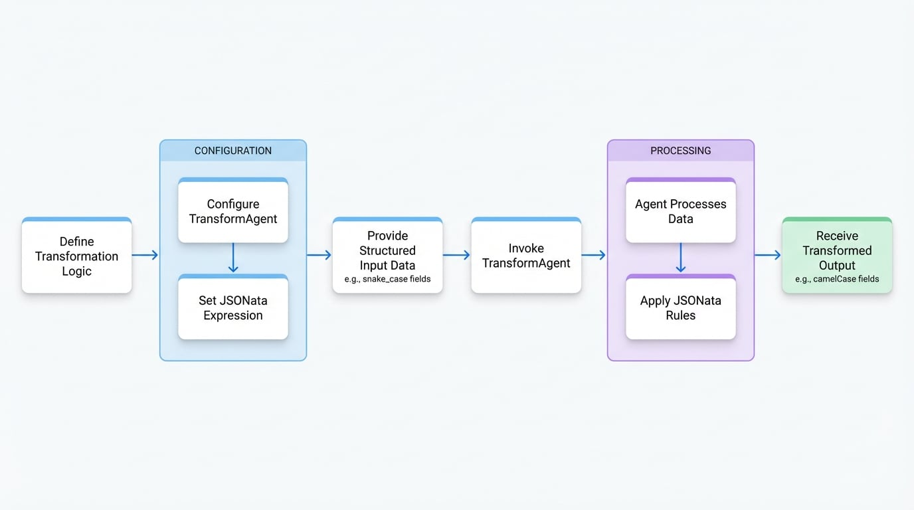

# 转换 Agent

`TransformAgent` 是一种专门的 Agent，它提供了一种使用 [JSONata](https://jsonata.org/) 表达式来转换结构化数据的声明式方法。它非常适合需要将数据从一种格式映射、重构或转换为另一种格式，而无需复杂命令式逻辑的场景。

常见用例包括：
- 将 API 响应规范化为一致的格式。
- 在不同数据模式之间映射字段（例如，数据库结果到应用程序模型）。
- 重构配置数据。
- 转换数据格式，例如将字段名从 `snake_case` 更改为 `camelCase`。
- 对数据执行简单的聚合、计算或筛选。

对于需要更复杂的自定义逻辑的转换，请考虑使用 [Function Agent](./developer-guide-agents-function-agent.md)。

<!-- DIAGRAM_IMAGE_START:flowchart:16:9 -->

<!-- DIAGRAM_IMAGE_END -->

## 配置

`TransformAgent` 使用以下选项进行配置。

<x-field-group>
  <x-field data-name="jsonata" data-type="string" data-required="true">
    <x-field-desc markdown>
      一个 [JSONata](https://jsonata.org/) 表达式字符串，用于定义数据转换逻辑。JSONata 是一种用于 JSON 数据的轻量级查询和转换语言。该表达式决定了输入消息如何转换为输出消息。您可以在 [JSONata Playground](https://try.jsonata.org/) 中试验表达式。

      **常见模式：**
      - **字段映射：** `{ "newField": oldField }`
      - **数组转换：** `items.{ "name": product_name, "price": price }`
      - **计算：** `$sum(items.price)`
      - **条件逻辑：** `condition ? value1 : value2`
      - **字符串操作：** `$uppercase(name)`
    </x-field-desc>
  </x-field>
</x-field-group>

## 用法

`TransformAgent` 可以通过 TypeScript 以编程方式定义，也可以通过 YAML 以声明方式定义。

### TypeScript 示例

此示例演示了如何创建一个将字段名从 snake_case 转换为 camelCase 的 `TransformAgent`。

```typescript Transform Agent Example icon=logos:typescript
import { TransformAgent } from "@aigne/core";

// 1. 定义 TransformAgent
const snakeToCamelAgent = TransformAgent.from({
  name: "snake-to-camel-converter",
  description: "Converts user data fields from snake_case to camelCase.",
  jsonata: `{
    "userId": user_id,
    "userName": user_name,
    "createdAt": created_at
  }`,
});

// 2. 定义输入数据
const inputData = {
  user_id: "usr_12345",
  user_name: "John Doe",
  created_at: "2023-10-27T10:00:00Z",
};

// 3. 调用 Agent 执行转换
async function runTransform() {
  const result = await snakeToCamelAgent.invoke(inputData);
  console.log(result);
}

runTransform();
```

该 Agent 将 JSONata 表达式应用于 `inputData`，并按指定重命名键。

**输出**

```json icon=mdi:code-json
{
  "userId": "usr_12345",
  "userName": "John Doe",
  "createdAt": "2023-10-27T10:00:00Z"
}
```

### YAML 示例

同一个 Agent 可以在 YAML 文件中以声明方式定义。这对于将 Agent 定义为更大型配置的一部分非常有用。

```yaml transform.yaml icon=mdi:language-yaml
type: transform
name: transform-agent
description: |
  A Transform Agent that processes input data using JSONata expressions.
input_schema:
  type: object
  properties:
    user_id:
      type: string
      description: The ID of the user.
    user_name:
      type: string
      description: The name of the user.
    created_at:
      type: string
      description: The creation date of the user.
  required:
    - user_id
    - user_name
    - created_at
output_schema:
  type: object
  properties:
    userId:
      type: string
      description: The ID of the user.
    userName:
      type: string
      description: The name of the user.
    createdAt:
      type: string
      description: The creation date of the user.
  required:
    - userId
    - userName
    - createdAt
jsonata: |
  {
    "userId": user_id,
    "userName": user_name,
    "createdAt": created_at
  }
```

此 YAML 定义指定了 Agent 的类型、名称、模式以及核心的 `jsonata` 转换表达式，实现了与 TypeScript 示例相同的结果。

## 总结

`TransformAgent` 为处理结构化数据转换提供了一种强大而简洁的方法。通过利用 JSONata，它将数据映射和重构逻辑与主应用程序代码分离，从而使 Agentic 工作流更清晰、更易于维护。

要将此 Agent 与其他 Agent 进行编排，请参阅 [Team Agent](./developer-guide-agents-team-agent.md) 文档。