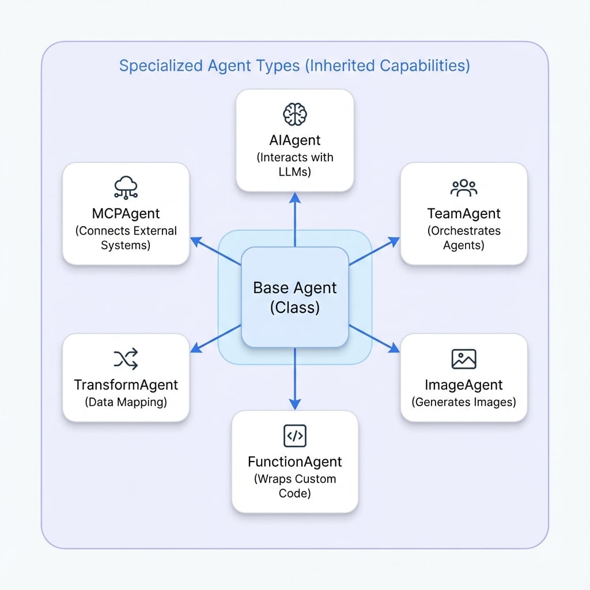

# Agent 類型

AIGNE 框架提供了一套專門的 Agent 類型，每種類型都設計用於執行特定功能。雖然所有 Agent 都繼承自基礎的 `Agent` 類別，但這些專門的實作提供了預先建構的功能，可用於常見任務，從與 AI 模型互動到協調複雜的工作流程。了解這些類型是建構穩健且高效應用程式的關鍵。

本節提供了可用 Agent 類型的高階概覽。有關詳細的實作、設定選項和程式碼範例，請參閱每種 Agent 的特定子文件。

<!-- DIAGRAM_IMAGE_START:architecture:1:1 -->

<!-- DIAGRAM_IMAGE_END -->

## 可用的 Agent 類型

此框架包含以下專門的 Agent，每種都為特定目的量身打造。

<x-cards data-columns="2">
  <x-card data-title="AI Agent" data-icon="lucide:bot" data-href="/developer-guide/agents/ai-agent">
    與大型語言模型 (LLMs) 互動的主要 Agent。它處理提示詞的建構、模型的調用以及 AI 生成回應的處理，包括工具使用。
  </x-card>
  <x-card data-title="Team Agent" data-icon="lucide:users" data-href="/developer-guide/agents/team-agent">
    協調一組 Agent 協同工作。它能以循序或平行模式管理工作流程，從而解決複雜的多步驟問題。
  </x-card>
  <x-card data-title="Image Agent" data-icon="lucide:image" data-href="/developer-guide/agents/image-agent">
    一種專門用於與圖片生成模型對接的 Agent。它接收指令性提示詞並生成視覺內容。
  </x-card>
  <x-card data-title="Function Agent" data-icon="lucide:function-square" data-href="/developer-guide/agents/function-agent">
    包裝標準的 TypeScript 或 JavaScript 函數，讓您能將任何自訂程式碼或業務邏輯無縫整合到 Agent 工作流程中。
  </x-card>
  <x-card data-title="Transform Agent" data-icon="lucide:shuffle" data-href="/developer-guide/agents/transform-agent">
    使用 JSONata 表達式執行宣告式資料轉換。它非常適合在不同格式之間進行資料的映射、重組和轉換，而無需編寫程序性程式碼。
  </x-card>
  <x-card data-title="MCP Agent" data-icon="lucide:plug-zap" data-href="/developer-guide/agents/mcp-agent">
    透過模型上下文協定 (MCP) 連接到外部系統和工具。此 Agent 扮演橋樑的角色，讓您的應用程式能夠利用外部資源和功能。
  </x-card>
</x-cards>

## 總結

為特定任務選擇正確的 Agent 類型是設計高效 AIGNE 應用程式的基礎步驟。每種 Agent 都是為特定工作設計的專門工具。透過組合這些 Agent，您可以建構能夠處理各種任務的複雜系統。

若要更深入地了解每種 Agent 的功能和設定，請繼續閱讀各類型的詳細文件。

- **下一步**：了解 [AI Agent](./developer-guide-agents-ai-agent.md)，這是與語言模型互動的核心元件。