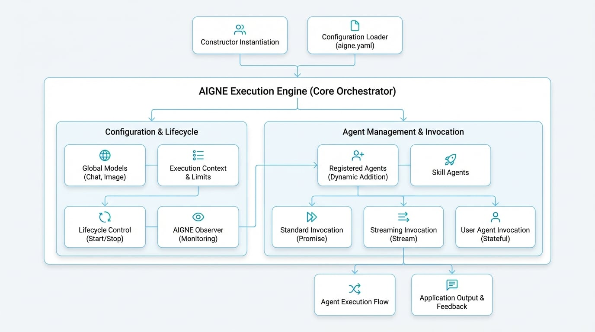

# AIGNE

The `AIGNE` class is the central execution engine of the framework. It orchestrates multiple agents to build complex AI applications, serving as the main coordination point for agent interactions, message passing, and the overall execution flow.

This guide covers how to instantiate and configure the `AIGNE` engine, execute agents using the `invoke` method, and manage the application lifecycle.

<!-- DIAGRAM_IMAGE_START:architecture:16:9 -->

<!-- DIAGRAM_IMAGE_END -->

## Overview

AIGNE acts as the container for your entire agentic application. Its primary responsibilities include:

-   **Agent Management**: Manages the lifecycle of all registered agents and skills.
-   **Model Configuration**: Provides a global default configuration for chat and image models, which can be inherited or overridden by individual agents.
-   **Execution Context**: Creates and manages isolated contexts for each invocation, ensuring that concurrent operations do not interfere with each other.
-   **Lifecycle Control**: Offers methods to gracefully start and stop the application, ensuring all resources are properly handled.

## Instantiation

There are two primary ways to create an `AIGNE` instance: programmatically using the constructor or by loading a configuration from a directory.

### Using the Constructor

The most direct method is to use the `AIGNE` constructor, passing in an options object. This approach is ideal for applications where configuration is managed dynamically in code.

```typescript Instantiating AIGNE icon=logos:typescript
import { AIGNE } from "@aigne/core";
import { OpenAIChatModel } from "@aigne/openai";

const aigne = new AIGNE({
  name: "MyFirstAIGNEApp",
  model: new OpenAIChatModel({
    apiKey: process.env.OPENAI_API_KEY,
    model: "gpt-4o-mini",
  }),
});
```

### Loading from Configuration

For more complex projects, it is best practice to define your application structure in a directory containing an `aigne.yaml` file and other agent definitions. The static `AIGNE.load()` method reads this directory and constructs a fully configured instance. This promotes separation of configuration from logic.

```typescript Loading AIGNE from a Directory icon=logos:typescript
import { AIGNE } from "@aigne/core";
import { join } from "node:path";

const configPath = join(process.cwd(), "my-aigne-project");
const aigne = await AIGNE.load(configPath);
```

## Configuration Options

The `AIGNE` constructor accepts an `AIGNEOptions` object to control its behavior.

<x-field-group>
  <x-field data-name="name" data-type="string" data-required="false" data-desc="A unique name for the AIGNE instance."></x-field>
  <x-field data-name="description" data-type="string" data-required="false" data-desc="A brief description of the instance's purpose."></x-field>
  <x-field data-name="rootDir" data-type="string" data-required="false" data-desc="The root directory for resolving relative paths for agents and skills."></x-field>
  <x-field data-name="model" data-type="ChatModel" data-required="false">
    <x-field-desc markdown>A global default chat model for all agents that do not specify their own. See [Models](./developer-guide-core-concepts-models.md) for more details.</x-field-desc>
  </x-field>
  <x-field data-name="imageModel" data-type="ImageModel" data-required="false" data-desc="A global default image model for image generation tasks."></x-field>
  <x-field data-name="agents" data-type="Agent[]" data-required="false" data-desc="An array of agent instances to register with the engine upon initialization."></x-field>
  <x-field data-name="skills" data-type="Agent[]" data-required="false" data-desc="An array of skill agents to make available to other agents."></x-field>
  <x-field data-name="limits" data-type="ContextLimits" data-required="false" data-desc="Execution limits, such as timeouts or maximum tokens, to apply to all invocations."></x-field>
  <x-field data-name="observer" data-type="AIGNEObserver" data-required="false" data-desc="An observer instance for monitoring and logging execution traces."></x-field>
</x-field-group>

## Agent and Lifecycle Management

Once an instance is created, you can manage agents and control the application lifecycle.

### Adding Agents

While agents can be provided in the constructor, you can also add them dynamically using the `addAgent` method. Each agent is attached to the AIGNE instance, giving it access to shared resources like the global model.

```typescript Dynamically Adding an Agent icon=logos:typescript
import { AIAgent } from "@aigne/core";
import { AIGNE } from "@aigne/core";

// Assuming 'aigne' is an existing AIGNE instance
const aigne = new AIGNE();

const myAgent = new AIAgent({
  instructions: "You are a helpful assistant.",
});

aigne.addAgent(myAgent);
```

### Shutting Down

To ensure a clean exit and proper resource cleanup, call the `shutdown` method. This is crucial for long-running applications to prevent resource leaks. The engine also automatically handles process exit signals like `SIGINT`.

```typescript Graceful Shutdown icon=logos:typescript
// Assuming 'aigne' is an existing AIGNE instance
await aigne.shutdown();
```

## Invoking Agents

The `invoke` method is the primary entry point for executing an agent. It is an overloaded method that supports several patterns, from simple request-response to real-time streaming.

### Standard Invocation

The most common use case is to provide an agent and an input message. This returns a promise that resolves with the agent's final output.

```typescript Standard Agent Invocation icon=logos:typescript
// Assuming 'aigne' and 'myAgent' are configured
const result = await aigne.invoke(myAgent, {
  message: "What is the AIGNE Framework?",
});

console.log(result.message);
// Expected output: A descriptive answer about the framework.
```

### Streaming Responses

For interactive applications like chatbots, you can enable streaming to receive the response incrementally. Setting `streaming: true` in the options returns an `AgentResponseStream`. You can then iterate over the stream to process chunks of data as they arrive.

```typescript Streaming Agent Responses icon=logos:typescript
import { isAgentResponseDelta } from "@aigne/core";

// Assuming 'aigne' and 'myAgent' are configured
const stream = await aigne.invoke(
  myAgent,
  { message: "Tell me a short story." },
  { streaming: true }
);

let fullResponse = "";
for await (const chunk of stream) {
  if (isAgentResponseDelta(chunk)) {
    const textDelta = chunk.delta.text?.message ?? "";
    fullResponse += textDelta;
    process.stdout.write(textDelta);
  }
}

console.log("\n--- End of Story ---");
```

### Creating a User Agent

Invoking an agent without a message creates a `UserAgent`. This is a stateful wrapper that preserves the conversation context across multiple calls, making it ideal for building conversational experiences.

```typescript Creating a Stateful UserAgent icon=logos:typescript
// Assuming 'aigne' and 'myAgent' are configured

// Create a UserAgent to maintain context
const userAgent = aigne.invoke(myAgent);

// First interaction
const response1 = await userAgent.invoke({ message: "My name is Bob." });
console.log(response1.message); // e.g., "Nice to meet you, Bob!"

// Second interaction preserves context
const response2 = await userAgent.invoke({ message: "What is my name?" });
console.log(response2.message); // e.g., "Your name is Bob."
```

The `invoke` method offers additional overloads for advanced scenarios, such as returning the final active agent in a multi-agent team. Refer to the API reference for a complete list of signatures.

---

With a clear understanding of the `AIGNE` engine, you are now prepared to explore the different types of [Agents](./developer-guide-core-concepts-agents.md) that form the building blocks of your application.