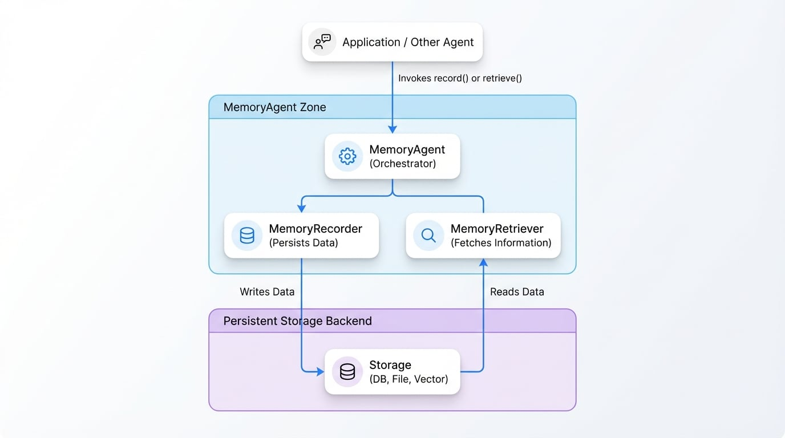

# メモリ

`MemoryAgent` は、Agent が対話を通じて状態を維持し、情報を記憶するためのメカニズムを提供します。これは、メッセージを直接処理するのではなく、情報を保存するための `Recorder` とそれを呼び出すための `Retriever` という 2 つの主要なコンポーネントを通じてメモリ操作を管理する、特化したオーケストレーターとして機能します。この関心の分離により、柔軟でプラグイン可能なメモリストレージソリューションが可能になります。

## コアコンポーネント

メモリシステムは、主に 3 つのクラスで構成されています。

1.  **`MemoryAgent`**: メモリ操作を管理する中心的な Agent。レコーダーとリトリーバーで構成され、メモリストアと対話するための `record()` および `retrieve()` メソッドを提供します。
2.  **`MemoryRecorder`**: 永続的なストレージバックエンド（例：データベース、ファイルシステム、ベクトルストア）に情報を書き込む役割を担う Agent。データの保存方法と場所に関する実装を提供する必要があります。
3.  **`MemoryRetriever`**: 検索クエリや制限などの指定された基準に基づいてストレージバックエンドから情報を取得する役割を担う Agent。取得ロジックの実装を提供する必要があります。

<!-- DIAGRAM_IMAGE_START:architecture:16:9 -->

<!-- DIAGRAM_IMAGE_END -->

## 仕組み

`MemoryAgent` は、タスクをその下位 Agent に委任します。`MemoryAgent` の `record()` メソッドを呼び出すと、設定された `MemoryRecorder` を呼び出してデータを永続化します。同様に、`retrieve()` を呼び出すと、`MemoryRetriever` を呼び出して保存された情報をクエリし、返します。

このアーキテクチャにより、開発者はコアの Agent ワークフローを変更することなく、カスタムのストレージおよび取得ロジックを定義できます。例えば、会話履歴を PostgreSQL データベースに保存するレコーダーや、ベクトル埋め込みを使用して意味的に類似した過去の対話を見つけるリトリーバーを実装できます。

## `MemoryAgent`

`MemoryAgent` は、メモリ管理の主要なインターフェースです。処理 Agent のチェーン内で直接呼び出されるように設計されているのではなく、他の Agent やアプリケーションロジックから利用可能なステートフルなサービスとして設計されています。

### 設定

`MemoryAgent` を作成するには、`recorder` と `retriever` を提供します。これらは `MemoryRecorder` と `MemoryRetriever` のインスタンス、またはそれぞれの `process` メソッドの関数定義にすることができます。

```typescript Agent の初期化 icon=logos:typescript
import { MemoryAgent, MemoryRecorder, MemoryRetriever } from "@aigne/core";
import { v7 as uuidv7 } from "@aigne/uuid";

// 1. デモンストレーション用にシンプルなインメモリ ストアを定義
const memoryStore: Map<string, any> = new Map();

// 2. レコーダーのロジックを実装
const recorder = new MemoryRecorder({
  async process({ content }) {
    const memories = content.map((item) => {
      const memory = {
        id: uuidv7(),
        content: item,
        createdAt: new Date().toISOString(),
      };
      memoryStore.set(memory.id, memory);
      return memory;
    });
    return { memories };
  },
});

// 3. リトリーバーのロジックを実装
const retriever = new MemoryRetriever({
  async process({ search, limit = 10 }) {
    // これは単純な検索です。実際の 実装では、データベースクエリやベクトル検索を使用することがあります。
    const allMemories = Array.from(memoryStore.values());
    const filteredMemories = search
      ? allMemories.filter((m) => JSON.stringify(m.content).includes(search as string))
      : allMemories;

    return { memories: filteredMemories.slice(0, limit) };
  },
});

// 4. MemoryAgent をインスタンス化
const memoryAgent = new MemoryAgent({
  recorder,
  retriever,
});
```

上記の例では、シンプルなインメモリのストレージメカニズムを持つ `MemoryAgent` を作成する方法を示しています。本番環境では、これをデータベースのようなより堅牢なソリューションに置き換えることになります。

### `MemoryAgentOptions`

<x-field-group>
  <x-field data-name="recorder" data-type="MemoryRecorder | MemoryRecorderOptions['process'] | MemoryRecorderOptions" data-required="false">
    <x-field-desc markdown>メモリの保存を担当する Agent または関数。完全な `MemoryRecorder` インスタンス、設定オブジェクト、または単なる処理関数を指定できます。</x-field-desc>
  </x-field>
  <x-field data-name="retriever" data-type="MemoryRetriever | MemoryRetrieverOptions['process'] | MemoryRetrieverOptions" data-required="false">
    <x-field-desc markdown>メモリの取得を担当する Agent または関数。完全な `MemoryRetriever` インスタンス、設定オブジェクト、または単なる処理関数を指定できます。</x-field-desc>
  </x-field>
  <x-field data-name="autoUpdate" data-type="boolean" data-required="false">
    <x-field-desc markdown>`true` の場合、Agent は操作完了後に自動的に情報を記録し、対話の履歴を作成します。</x-field-desc>
  </x-field>
  <x-field data-name="subscribeTopic" data-type="string | string[]" data-required="false" data-desc="自動メッセージ記録のためにサブスクライブするトピック。"></x-field>
  <x-field data-name="skills" data-type="Agent[]" data-required="false" data-desc="スキルとして利用可能にする他の Agent の配列。レコーダーとリトリーバーは自動的にこのリストに追加されます。"></x-field>
</x-field-group>

## `MemoryRecorder`

`MemoryRecorder` は、メモリを保存するためのコントラクトを定義する抽象 Agent クラスです。その `process` メソッドの具体的な実装を提供する必要があります。

### `MemoryRecorderInput`

`MemoryRecorder` の `process` メソッドは、`MemoryRecorderInput` オブジェクトを受け取ります。

<x-field-group>
  <x-field data-name="content" data-type="array" data-required="true">
    <x-field-desc markdown>メモリとして保存されるオブジェクトの配列。各オブジェクトには、メモリを文脈化するための `input`、`output`、および `source` を含めることができます。</x-field-desc>
    <x-field data-name="input" data-type="Message" data-required="false" data-desc="このメモリにつながった入力メッセージ（例：ユーザーのプロンプト）。"></x-field>
    <x-field data-name="output" data-type="Message" data-required="false" data-desc="生成された出力メッセージ（例：AI の応答）。"></x-field>
    <x-field data-name="source" data-type="string" data-required="false" data-desc="出力を生成した Agent またはシステムの識別子。"></x-field>
  </x-field>
</x-field-group>

### `MemoryRecorderOutput`

`process` メソッドは、`MemoryRecorderOutput` オブジェクトを返さなければなりません。

<x-field-group>
  <x-field data-name="memories" data-type="Memory[]" data-required="true" data-desc="新しく作成されたメモリオブジェクトの配列。それぞれに一意の ID、元のコンテンツ、および作成タイムスタンプが含まれます。"></x-field>
</x-field-group>

## `MemoryRetriever`

`MemoryRetriever` は、ストレージからメモリを取得するためのコントラクトを定義する抽象 Agent クラスです。その `process` メソッドの具体的な実装を提供する必要があります。

### `MemoryRetrieverInput`

`MemoryRetriever` の `process` メソッドは、結果をフィルタリングおよび制限するための `MemoryRetrieverInput` オブジェクトを受け取ります。

<x-field-group>
  <x-field data-name="limit" data-type="number" data-required="false">
    <x-field-desc markdown>返されるメモリの最大数。ページネーションやコンテキストウィンドウを小さく保つのに役立ちます。</x-field-desc>
  </x-field>
  <x-field data-name="search" data-type="string | Message" data-required="false">
    <x-field-desc markdown>メモリをフィルタリングするための検索語またはメッセージオブジェクト。この値がどのように使用されるか（例：キーワード検索、ベクトル類似性）は実装によって決まります。</x-field-desc>
  </x-field>
</x-field-group>

### `MemoryRetrieverOutput`

`process` メソッドは、`MemoryRetrieverOutput` オブジェクトを返さなければなりません。

<x-field-group>
  <x-field data-name="memories" data-type="Memory[]" data-required="true" data-desc="取得条件に一致したメモリオブジェクトの配列。"></x-field>
</x-field-group>

## 使用例

`MemoryAgent` が設定されると、アプリケーションのコンテキスト内でそれを使用して情報を記録および取得できます。

```typescript AIGNE との対話 icon=logos:typescript
import { AIGNE } from "@aigne/core";

// memoryAgent が最初の例で示したように設定されていると仮定
const aigne = new AIGNE({
  // ...other configurations
});

async function run() {
  // 新しいメモリを記録
  const recordedMemory = await aigne.invoke(memoryAgent.record.bind(memoryAgent), {
    content: [{ input: { query: "What is the capital of France?" } }],
  });
  console.log("Recorded:", recordedMemory.memories[0].id);

  // メモリを取得
  const retrievedMemories = await aigne.invoke(memoryAgent.retrieve.bind(memoryAgent), {
    search: "France",
    limit: 5,
  });
  console.log("Retrieved:", retrievedMemories.memories);
}

run();
```
この例は、`aigne.invoke` メソッドを使用して `memoryAgent` インスタンスの `record` および `retrieve` 関数を呼び出し、対話を通じて Agent の状態を効果的に管理する方法を示しています。

## まとめ

`MemoryAgent` は、Agent アプリケーションにおける状態管理のための強力で柔軟な抽象化を提供します。オーケストレーション (`MemoryAgent`) を実装詳細 (`MemoryRecorder`、`MemoryRetriever`) から分離することで、単純なインメモリ配列から高度なベクトルデータベースまで、さまざまなストレージバックエンドを簡単に統合できます。

コア実行エンジンに関する詳細については、[AIGNE](./developer-guide-core-concepts-aigne-engine.md) のドキュメントを参照してください。作業の基本的な構成要素を理解するには、[Agents](./developer-guide-core-concepts-agents.md) のページを参照してください。