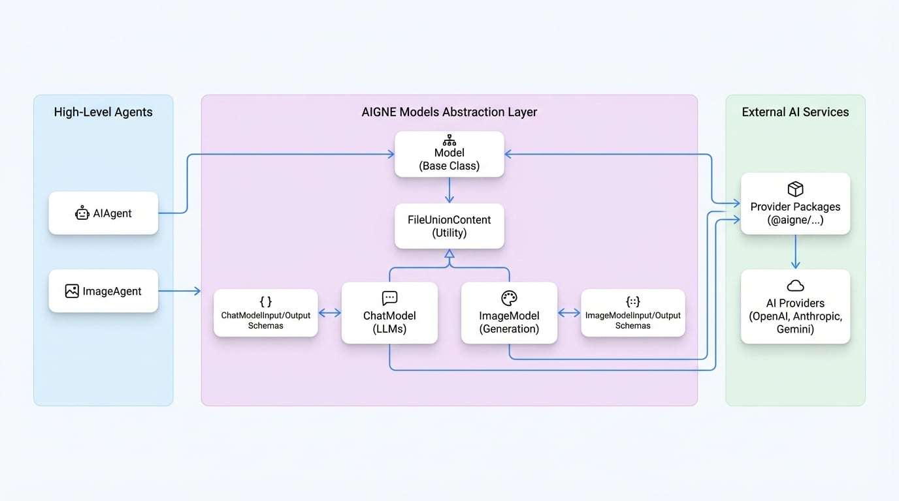

# Models

Models are specialized agents that serve as a crucial abstraction layer, providing a standardized interface for interacting with external AI services, such as Large Language Models (LLMs) and image generation platforms. They encapsulate the complexity of API communication, allowing developers to work with various AI providers through a consistent and unified contract.

The AIGNE Framework defines a base `Model` class, which is extended by two primary specializations: `ChatModel` for text-based conversational AI and `ImageModel` for image generation tasks. These abstractions are the foundation upon which higher-level agents like `AIAgent` and `ImageAgent` are built.

## Core Concepts

The `Model` layer is designed to streamline interactions with different AI providers. Instead of writing provider-specific code for each service (like OpenAI, Anthropic, or Google Gemini), you interact with the standardized `ChatModel` or `ImageModel` interface. The AIGNE framework, through specific model packages (e.g., `@aigne/openai`), handles the translation between this standard format and the provider's native API.

This design offers several key advantages:
- **Provider Agnostic:** Swap out underlying AI models with minimal code changes. For example, you can switch from OpenAI's GPT-4 to Anthropic's Claude 3 by simply changing the model instantiation.
- **Standardized Data Structures:** All models use consistent input and output schemas (`ChatModelInput`, `ImageModelOutput`, etc.), simplifying data handling and agent composition.
- **Simplified API:** The models provide a clean, high-level API that abstracts away the nuances of authentication, request formatting, and error handling for each external service.

The following diagram illustrates the relationship between the base `Agent`, the `Model` abstractions, and the external AI services they connect to.

<!-- DIAGRAM_IMAGE_START:architecture:16:9 -->

<!-- DIAGRAM_IMAGE_END -->

## ChatModel Abstraction

The `ChatModel` is an abstract class designed for interfacing with Large Language Models (LLMs). It provides a structured way to handle conversational interactions, including multi-turn dialogues, tool usage, and structured data extraction.

### ChatModelInput

The `ChatModelInput` interface defines the data structure for requests sent to a language model. It standardizes how messages, tools, and other configurations are passed.

<x-field-group>
  <x-field data-name="messages" data-type="ChatModelInputMessage[]" data-required="true">
    <x-field-desc markdown>An array of message objects that form the conversation history and the current prompt.</x-field-desc>
  </x-field>
  <x-field data-name="responseFormat" data-type="ChatModelInputResponseFormat" data-required="false">
    <x-field-desc markdown>Specifies the desired format for the model's output, such as plain text or structured JSON based on a provided schema.</x-field-desc>
  </x-field>
  <x-field data-name="tools" data-type="ChatModelInputTool[]" data-required="false">
    <x-field-desc markdown>A list of available tools (functions) that the model can request to call to perform actions or retrieve information.</x-field-desc>
  </x-field>
  <x-field data-name="toolChoice" data-type="ChatModelInputToolChoice" data-required="false">
    <x-field-desc markdown>Controls how the model uses the provided tools. It can be set to `"auto"`, `"none"`, `"required"`, or to force a specific function call.</x-field-desc>
  </x-field>
  <x-field data-name="modelOptions" data-type="ChatModelInputOptions" data-required="false">
    <x-field-desc markdown>A container for provider-specific options, such as `temperature`, `topP`, or `parallelToolCalls`.</x-field-desc>
  </x-field>
  <x-field data-name="outputFileType" data-type="'local' | 'file'" data-required="false">
    <x-field-desc markdown>Specifies the desired format for any file-based outputs, either as a local file path (`local`) or a base64-encoded string (`file`).</x-field-desc>
  </x-field>
</x-field-group>

#### ChatModelInputMessage

Each message in the `messages` array follows a defined structure.

<x-field-group>
  <x-field data-name="role" data-type="'system' | 'user' | 'agent' | 'tool'" data-required="true">
    <x-field-desc markdown>The role of the message sender. `system` provides instructions, `user` represents user input, `agent` is for model responses, and `tool` is for the output of a tool call.</x-field-desc>
  </x-field>
  <x-field data-name="content" data-type="string | UnionContent[]" data-required="false">
    <x-field-desc markdown>The content of the message. It can be a simple string or an array for multimodal content, combining text and images (`FileUnionContent`).</x-field-desc>
  </x-field>
  <x-field data-name="toolCalls" data-type="object[]" data-required="false">
    <x-field-desc markdown>Used in an `agent` message to indicate one or more tool calls initiated by the model.</x-field-desc>
  </x-field>
  <x-field data-name="toolCallId" data-type="string" data-required="false">
    <x-field-desc markdown>Used in a `tool` message to link the tool's output back to the corresponding `toolCalls` request.</x-field-desc>
  </x-field>
</x-field-group>

### ChatModelOutput

The `ChatModelOutput` interface standardizes the response received from a language model.

<x-field-group>
  <x-field data-name="text" data-type="string" data-required="false">
    <x-field-desc markdown>The text-based content of the model's response.</x-field-desc>
  </x-field>
  <x-field data-name="json" data-type="object" data-required="false">
    <x-field-desc markdown>The JSON object returned by the model when `responseFormat` is set to `"json_schema"`.</x-field-desc>
  </x-field>
  <x-field data-name="toolCalls" data-type="ChatModelOutputToolCall[]" data-required="false">
    <x-field-desc markdown>An array of tool call requests made by the model. Each object includes the function name and arguments.</x-field-desc>
  </x-field>
  <x-field data-name="usage" data-type="ChatModelOutputUsage" data-required="false">
    <x-field-desc markdown>An object containing token usage statistics, including `inputTokens` and `outputTokens`.</x-field-desc>
  </x-field>
  <x-field data-name="model" data-type="string" data-required="false">
    <x-field-desc markdown>The identifier of the model that generated the response.</x-field-desc>
  </x-field>
  <x-field data-name="files" data-type="FileUnionContent[]" data-required="false">
    <x-field-desc markdown>An array of files generated by the model, if any.</x-field-desc>
  </x-field>
</x-field-group>

## ImageModel Abstraction

The `ImageModel` is an abstract class for interfacing with image generation models. It provides a simplified contract for creating or editing images based on textual prompts.

### ImageModelInput

The `ImageModelInput` interface defines the request structure for an image generation task.

<x-field-group>
  <x-field data-name="prompt" data-type="string" data-required="true">
    <x-field-desc markdown>A textual description of the desired image.</x-field-desc>
  </x-field>
  <x-field data-name="image" data-type="FileUnionContent[]" data-required="false">
    <x-field-desc markdown>An optional array of input images, used for tasks like image editing or creating variations.</x-field-desc>
  </x-field>
  <x-field data-name="n" data-type="number" data-required="false">
    <x-field-desc markdown>The number of images to generate. Defaults to 1.</x-field-desc>
  </x-field>
  <x-field data-name="outputFileType" data-type="'local' | 'file'" data-required="false">
    <x-field-desc markdown>Specifies whether the output images should be saved as local files (`local`) or returned as base64-encoded strings (`file`).</x-field-desc>
  </x-field>
  <x-field data-name="modelOptions" data-type="ImageModelInputOptions" data-required="false">
    <x-field-desc markdown>A container for provider-specific options, such as image dimensions, quality, or style presets.</x-field-desc>
  </x-field>
</x-field-group>

### ImageModelOutput

The `ImageModelOutput` interface defines the response structure from an image generation service.

<x-field-group>
  <x-field data-name="images" data-type="FileUnionContent[]" data-required="true">
    <x-field-desc markdown>An array of the generated images. The format of each element depends on the `outputFileType` specified in the input.</x-field-desc>
  </x-field>
  <x-field data-name="usage" data-type="ChatModelOutputUsage" data-required="false">
    <x-field-desc markdown>An object containing usage statistics, which may include token counts or other provider-specific metrics.</x-field-desc>
  </x-field>
  <x-field data-name="model" data-type="string" data-required="false">
    <x-field-desc markdown>The identifier of the model that generated the images.</x-field-desc>
  </x-field>
</x-field-group>

## File Content Types

Models handle various forms of file inputs for multimodal tasks through the `FileUnionContent` type. This discriminated union allows files to be represented in three ways:

-   **`LocalContent`**: Represents a file stored on the local filesystem.
    -   `type`: "local"
    -   `path`: The absolute path to the file.
-   **`UrlContent`**: Represents a file accessible via a public URL.
    -   `type`: "url"
    -   `url`: The URL of the file.
-   **`FileContent`**: Represents a file as a base64-encoded string.
    -   `type`: "file"
    -   `data`: The base64-encoded content of the file.

The `Model` base class includes a `transformFileType` method that can automatically convert between these formats as needed, simplifying file handling across different agents and model providers.

## Summary

The `ChatModel` and `ImageModel` abstractions are core components that make the AIGNE Framework flexible and provider-agnostic. They provide a stable, standardized interface for interacting with a wide range of external AI services.

-   To learn how to use these models in practice, see the documentation for the [AI Agent](./developer-guide-agents-ai-agent.md) and [Image Agent](./developer-guide-agents-image-agent.md).
-   For details on configuring specific providers like OpenAI, Anthropic, or Google Gemini, refer to the guides in the [Models](./models.md) section.