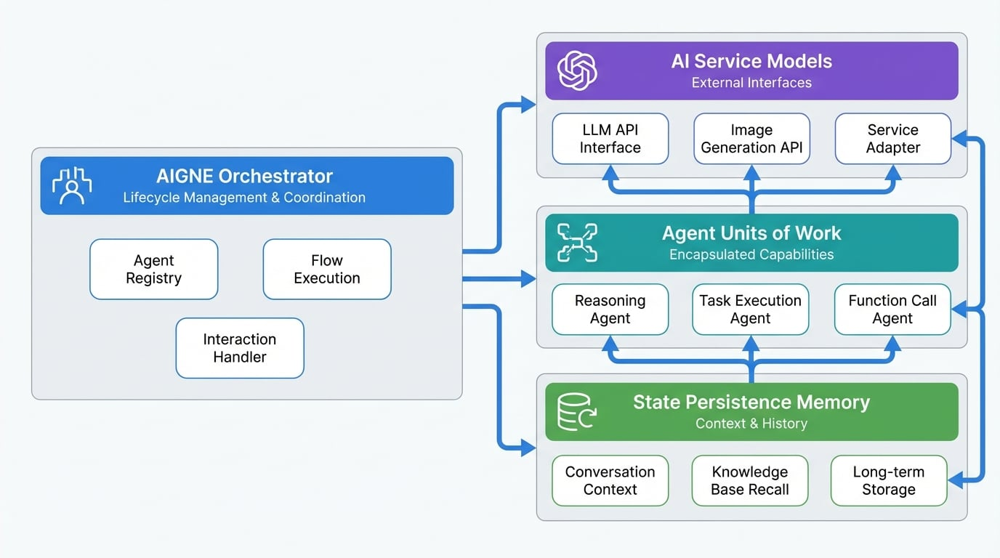

# 核心概念

若要有效使用 AIGNE 框架建置應用程式，必須先了解其基本的架構元件。本節將對主要建構區塊及其互動提供一個高層次的概覽。清楚地掌握這些概念將有助於更直觀的開發流程。

此框架圍繞幾個關鍵的抽象概念設計，這些抽象概念共同協作以編排複雜的 AI 驅動工作流程。主要元件包括 AIGNE 編排器、作為基本工作單位的 Agent、用於與 AI 服務介接的 Models，以及用於狀態持久化的 Memory。

下圖說明了這些核心元件之間的關係。

<!-- DIAGRAM_IMAGE_START:architecture:16:9 -->

<!-- DIAGRAM_IMAGE_END -->

## 架構建構區塊

AIGNE 框架由四個主要概念組成。了解每一個概念對於建置穩健且可擴展的基於 Agent 的應用程式至關重要。

<x-cards data-columns="2">
  <x-card data-title="AIGNE" data-icon="lucide:box" data-href="/developer-guide/core-concepts/aigne-engine">
    負責管理 Agent 的生命週期、協調其互動並處理整體執行流程的中央編排器。
  </x-card>
  <x-card data-title="Agents" data-icon="lucide:bot" data-href="/developer-guide/core-concepts/agents">
    基本的工作單元。一個 Agent 是一個封裝了特定能力的抽象，從執行簡單函式到複雜的推理。
  </x-card>
  <x-card data-title="Models" data-icon="lucide:brain-circuit" data-href="/developer-guide/core-concepts/models">
    提供對外部服務（例如大型語言模型 (LLM) 或圖像生成 API）的標準化介面的特殊 Agent。
  </x-card>
  <x-card data-title="Memory" data-icon="lucide:database" data-href="/developer-guide/core-concepts/memory">
    提供 Agent 持久化和回憶資訊的能力，從而實現有狀態的對話和隨時間推移具備情境感知能力的行為。
  </x-card>
</x-cards>

## 總結

本節介紹了 AIGNE 框架的四個基礎支柱：`AIGNE` 編排器、`Agent`、`Models` 和 `Memory`。每個元件在架構中都扮演著獨特而重要的角色。

為了更全面地理解，建議您繼續閱讀每個概念的詳細文件。

*   **下一步：** 深入了解 [AIGNE 編排器](./developer-guide-core-concepts-aigne-engine.md)。