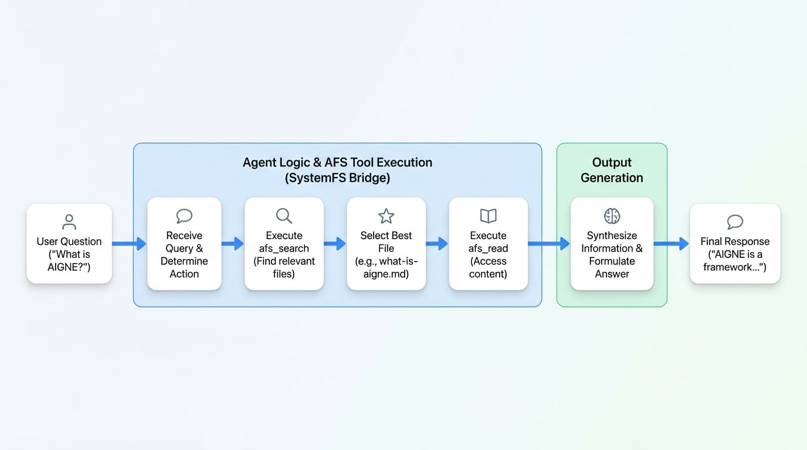

# AFS ローカル FS

このガイドでは、ローカルファイルシステムと対話できるチャットボットを構築する方法を説明します。AIGNE File System (AFS) と `SystemFS` モジュールを活用することで、AI Agent がマシン上のファイルを検索、読み取り、管理できるようになり、強力なローカルデータエキスパートに変えることができます。

## 概要

AIGNE File System (AFS) は、AI Agent がさまざまなストレージシステムにアクセスするための標準化された方法を提供する仮想ファイルシステムレイヤーです。この例では、AFS をローカルファイルシステムに橋渡しする `SystemFS` モジュールに焦点を当てます。

ユーザーが質問をすると、Agent はインテリジェントに以下のアクションを実行します。
1.  **検索:** `afs_search` ツールを使用して、ユーザーのクエリに基づいて指定されたディレクトリ内の関連ファイルを検索します。
2.  **読み取り:** 検索結果から最も有望なファイルを特定し、`afs_read` ツールを使用してそのコンテンツにアクセスします。
3.  **統合:** ファイルのコンテンツを処理して、包括的で正確な回答を作成します。

これにより、Agent は手動のガイダンスなしで、ドキュメント、コード、その他のテキストベースのファイルに関する質問に答えることができます。

## 前提条件

始める前に、以下がインストールされ、設定されていることを確認してください。
- [Node.js](https://nodejs.org) (バージョン 20.0 以上)
- [OpenAI API キー](https://platform.openai.com/api-keys)

## クイックスタート

この例は、`npx` を使用してローカルにインストールすることなく直接実行できます。

1.  **OpenAI API キーを設定します:**
    ```bash icon=lucide:terminal
    export OPENAI_API_KEY=YOUR_OPENAI_API_KEY
    ```

2.  **チャットボットを実行します:**
    任意のローカルディレクトリをマウントできます。この例では、AIGNE フレームワークをクローンし、そのドキュメントをナレッジベースとして使用します。

    ```bash icon=lucide:terminal
    # リポジトリをクローンしてそのドキュメントを使用する
    git clone https://github.com/AIGNE-io/aigne-framework
    
    # 対話モードでチャットボットを起動し、ドキュメントを指す
    npx -y @aigne/example-afs-local-fs --path ./aigne-framework --chat
    ```

    または、特定の質問を 1 つだけすることもできます。
    ```bash icon=lucide:terminal
    npx -y @aigne/example-afs-local-fs --path ./aigne-framework --input "What is AIGNE?"
    ```

### 対話例

以下は、「AIGNE とは何ですか？」と尋ねられたときの Agent のプロセスの例です。

```
👤 あなた: "AIGNE とは何ですか？"

🤖 Agent の思考: 提供されたファイルから AIGNE に関する情報を見つける必要があります。まず検索から始めます。
   → 呼び出し: afs_search(query: "AIGNE")

📁 15件の一致するファイルが見つかりました:
   • docs/getting-started/what-is-aigne.md ⭐ (最も関連性が高い)
   • README.md
   • docs/core-concepts/overview.md
   ...

🤖 Agent の思考: 最初の結果が最も関連性が高いようです。これを読んでユーザーの質問に答えます。
   → 呼び出し: afs_read("docs/getting-started/what-is-aigne.md")

📄 ファイルが読み込まれました (2.4 KB)

🤖 AI: "AIGNE は、LLM を活用したアプリケーションや AI Agent を構築するための
       フレームワークおよびランタイムエンジンです。以下の機能を提供します:

       • 統一された Agentic File System (AFS) インターフェース
       • 複数の LLM プロバイダー (OpenAI、Anthropic など) のサポート
       • 自律型 Agent を構築するためのツール
       • MCP を介した外部サービスとの統合

       クイックスタートチュートリアルをご案内しましょうか、それとも
       特定の例をご覧になりますか？"
```
Agent は正しいファイルを見つけ、その内容を読み、要約された役立つ応答を提供することに成功しました。

## AI モデルへの接続

Agent が機能するには、大規模言語モデル (LLM) への接続が必要です。API キーを提供せずにこの例を実行すると、接続方法を選択するように求められます。


3つの選択肢があります。

1.  **AIGNE Hub に接続 (推奨):** これが最も簡単な始め方です。ブラウザで認証ページが開きます。新規ユーザーはサービスを利用するための無料クレジットを受け取れます。

    

2.  **セルフホストの AIGNE Hub に接続:** 独自の AIGNE Hub インスタンスを実行している場合は、このオプションを選択してその URL を入力します。

    

3.  **サードパーティのモデルプロバイダーを使用:** 対応する環境変数を設定することで、OpenAI のようなプロバイダーに直接接続できます。

    ```bash icon=lucide:terminal
    export OPENAI_API_KEY="YOUR_OPENAI_API_KEY"
    ```
    サポートされているプロバイダーとそれらに必要な環境変数のリストについては、ソースコード内の `.env.local.example` ファイルを参照してください。

## 仕組み

実装は、以下の図に示すように、3つの主要なステップに分けることができます。

<!-- DIAGRAM_IMAGE_START:flowchart:16:9 -->

<!-- DIAGRAM_IMAGE_END -->

### 1. LocalFS モジュールを作成する

まず、`LocalFS` モジュールをインスタンス化し、Agent がアクセスしたいディレクトリへのローカルパスと、オプションで説明を指定します。

```typescript create-local-fs.ts
import { LocalFS } from "@aigne/afs-local-fs";

const localFS = new LocalFS({
  localPath: './aigne-framework',
  description: 'AIGNE framework documentation'
});
```

### 2. AFS にモジュールをマウントする

次に、`AFS` インスタンスを作成し、`localFS` モジュールを `mount` します。これにより、この AFS インスタンスにアクセスできるすべての Agent がローカルディレクトリを利用できるようになります。

```typescript mount-module.ts
import { AFS } from "@aigne/afs";
import { AFSHistory } from "@aigne/afs-history";

const afs = new AFS()
  .mount(new AFSHistory({ storage: { url: ":memory:" } }))
  .mount(localFS);  // デフォルトパス /modules/local-fs にマウントされる
```

### 3. AI Agent を作成して設定する

最後に、`AIAgent` を作成し、`afs` インスタンスを提供します。Agent は自動的にファイルシステム操作のための AFS ツールへのアクセス権を取得します。

```typescript create-agent.ts
import { AIAgent } from "@aigne/core";

const agent = AIAgent.from({
  instructions: "Help users find and read files from the local file system.",
  inputKey: "message",
  afs,  // Agent は afs_list, afs_read, afs_write, afs_search を継承する
});
```

### 利用可能な AFS ツール

Agent を AFS に接続することで、マウントされたディレクトリ上で操作するために、以下のサンドボックス化されたツールを使用できます。
-   `afs_list`: ファイルとサブディレクトリを一覧表示します。
-   `afs_read`: 特定のファイルのコンテンツとメタデータを読み取ります。
-   `afs_write`: 新しいファイルを作成するか、既存のファイルを上書きします。
-   `afs_search`: ディレクトリ内のすべてのファイルに対して全文検索を実行します。

## インストールとローカル実行

ソースコードからこの例を実行したい場合は、以下の手順に従ってください。

1.  **リポジトリをクローンします:**
    ```bash icon=lucide:terminal
    git clone https://github.com/AIGNE-io/aigne-framework
    ```

2.  **依存関係をインストールします:**
    サンプルのディレクトリに移動し、`pnpm` を使用して必要なパッケージをインストールします。
    ```bash icon=lucide:terminal
    cd aigne-framework/examples/afs-local-fs
    pnpm install
    ```

3.  **例を実行します:**
    `pnpm start` コマンドを使用してチャットボットを実行します。
    ```bash icon=lucide:terminal
    # 現在のディレクトリをマウントする
    pnpm start --path .

    # カスタムの説明付きで特定のディレクトリをマウントする
    pnpm start --path ~/Documents --description "My Documents"

    # 対話型チャットモードで実行する
    pnpm start --path . --chat
    ```

## ユースケース

この例は、いくつかの実用的なアプリケーションの基盤を提供します。

### ドキュメンテーションチャット
プロジェクトのドキュメンテーションフォルダをマウントして、プロジェクトに関するユーザーの質問に答えられるチャットボットを作成します。
```typescript
const afs = new AFS()
  .mount(new LocalFS({ localPath: './docs', description: 'Project documentation' }));
```

### コードベース分析
AI Agent がソースコードにアクセスできるようにして、分析、リファクタリング、または複雑なロジックの説明を支援します。
```typescript
const afs = new AFS()
  .mount(new LocalFS({ localPath: './src', description: 'Source code' }));
```

### ファイル整理
「ダウンロード」フォルダなど、ディレクトリ内のファイルの整理や管理を支援する Agent を構築します。
```typescript
const afs = new AFS()
  .mount(new LocalFS({ localPath: '~/Downloads', description: 'Downloads folder' }));
```

### 複数ディレクトリへのアクセス
複数のディレクトリをマウントして、Agent により広いコンテキストを与え、ソースコード、ドキュメント、テストを同時に検索できるようにします。
```typescript
const afs = new AFS()
  .mount("/docs", new LocalFS({ localPath: './docs' }))
  .mount("/src", new LocalFS({ localPath: './src' }))
  .mount("/tests", new LocalFS({ localPath: './tests' }));
```

## まとめ

AIGNE Framework を使用して、ローカルファイルシステムと対話できるチャットボットを作成する方法を学びました。この強力な機能により、インテリジェントなドキュメント検索から自動コード分析まで、幅広いアプリケーションが可能になります。

さらに詳しく知るには、以下の関連する例とパッケージをご覧ください。
<x-cards data-columns="2">
  <x-card data-title="Memory の例" data-href="/examples/memory" data-icon="lucide:brain-circuit">
    チャットボットに会話メモリを追加する方法を学びます。
  </x-card>
  <x-card data-title="MCP サーバーの例" data-href="/examples/mcp-server" data-icon="lucide:server">
    MCP を使用して Agent を外部サービスと統合する方法を発見します。
  </x-card>
</x-cards>