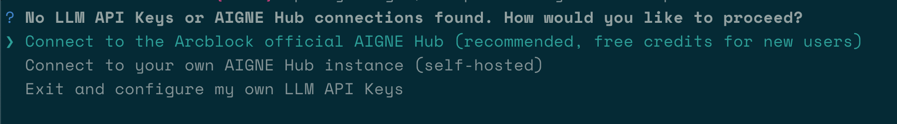

# Chatbot

This guide provides a comprehensive walkthrough of the agent-based chatbot example. You will learn how to run the chatbot in different modes, connect it to various AI model providers, and use the AIGNE observability tools to debug its execution. This example is designed to work out-of-the-box, allowing you to get started without any local installation.

## Overview

This example demonstrates how to create and run a simple yet powerful agent-based chatbot using the AIGNE Framework. It supports two primary modes of operation:
*   **One-shot mode**: The chatbot takes a single input, provides a response, and then exits.
*   **Interactive mode**: The chatbot engages in a continuous conversation until you decide to end the session.

The chatbot can be configured to use different AI models and can accept input directly from the command line or through a pipeline.

## Prerequisites

Before running the example, ensure you have the following installed on your system:

*   [Node.js](https://nodejs.org) (version 20.0 or higher)
*   An [OpenAI API key](https://platform.openai.com/api-keys) or access to an AIGNE Hub for model interaction.

## Quick Start

You can run this example directly using `npx` without cloning the repository or installing any dependencies locally.

### Running the Example

Execute the following commands in your terminal to run the chatbot.

Run in default one-shot mode:
```bash npx command icon=lucide:terminal
npx -y @aigne/example-chat-bot
```

Run in interactive chat mode using the `--interactive` flag:
```bash npx command icon=lucide:terminal
npx -y @aigne/example-chat-bot --interactive
```

Use pipeline input to provide a prompt directly:
```bash npx command icon=lucide:terminal
echo "Tell me about AIGNE Framework" | npx -y @aigne/example-chat-bot
```

### Connecting to an AI Model

The first time you run the example, it will prompt you to connect to an AI model service since no API keys are configured. The following diagram illustrates the connection options available:

```d2
direction: down

Chatbot-Example: {
  label: "Chatbot Example\n(@aigne/example-chat-bot)"
  shape: rectangle
}

Connection-Options: {
  label: "Connection Options"
  shape: rectangle
  style: {
    stroke-dash: 4
  }

  Official-AIGNE-Hub: {
    label: "1. Official AIGNE Hub\n(Recommended)"
    icon: "https://www.arcblock.io/image-bin/uploads/89a24f04c34eca94f26c9dd30aec44fc.png"
  }

  Self-Hosted-Hub: {
    label: "2. Self-Hosted AIGNE Hub"
    icon: "https://www.arcblock.io/image-bin/uploads/89a24f04c34eca94f26c9dd30aec44fc.png"
  }

  Third-Party-Provider: {
    label: "3. Third-Party Provider\n(e.g., OpenAI)"
    shape: rectangle
  }
}

Blocklet-Store: {
  label: "Blocklet Store"
  icon: "https://store.blocklet.dev/assets/z8ia29UsENBg6tLZUKi2HABj38Cw1LmHZocbQ/logo.png"
}

Chatbot-Example -> Connection-Options: "Prompts user to connect to AI model"
Connection-Options.Self-Hosted-Hub -> Blocklet-Store: "Install from"
```



You have several options to proceed:

#### 1. Connect to the Official AIGNE Hub (Recommended)

This is the easiest way to get started.
1.  Select the first option: `Connect to the Arcblock official AIGNE Hub`.
2.  Your web browser will open a page to authorize the AIGNE CLI.
3.  Follow the on-screen instructions to approve the connection. New users receive a complimentary token grant to use the service.


#### 2. Connect to a Self-Hosted AIGNE Hub

If you are running your own instance of AIGNE Hub:
1.  Select the second option: `Connect to a self-hosted AIGNE Hub instance`.
2.  Enter the URL of your self-hosted AIGNE Hub when prompted.
3.  Follow the subsequent prompts to complete the connection.

If you need to set up a self-hosted AIGNE Hub, you can install it from the [Blocklet Store](https://store.blocklet.dev/blocklets/z8ia3xzq2tMq8CRHfaXj1BTYJyYnEcHbqP8cJ).


#### 3. Connect via a Third-Party Model Provider

You can also connect directly to a third-party AI model provider, such as OpenAI, by setting the appropriate environment variables. For example, to use OpenAI, set your API key as follows:

```bash Set OpenAI API Key icon=lucide:terminal
export OPENAI_API_KEY="YOUR_OPENAI_API_KEY"
```

After setting the environment variable, run the example again. For a list of supported providers and their required environment variables, refer to the example configuration file.

## Local Installation and Usage

For development purposes, you may want to clone the repository and run the example locally.

### 1. Install AIGNE CLI

First, install the AIGNE Command Line Interface (CLI) globally.

```bash Install AIGNE CLI icon=lucide:terminal
npm install -g @aigne/cli
```

### 2. Clone the Repository

Clone the `aigne-framework` repository and navigate to the `chat-bot` example directory.

```bash Clone repository icon=lucide:terminal
git clone https://github.com/AIGNE-io/aigne-framework
cd aigne-framework/examples/chat-bot
```

### 3. Run the Example Locally

Use the `pnpm start` command to run the chatbot.

Run in default one-shot mode:
```bash pnpm command icon=lucide:terminal
pnpm start
```

Run in interactive chat mode:
```bash pnpm command icon=lucide:terminal
pnpm start --interactive
```

Use pipeline input:
```bash pnpm command icon=lucide:terminal
echo "Tell me about AIGNE Framework" | pnpm start
```

## Command-Line Options

The chatbot script accepts several command-line arguments to customize its behavior.

| Parameter | Description | Default |
|---|---|---|
| `--interactive` | Run in interactive chat mode. If omitted, runs in one-shot mode. | `Disabled` |
| `--model <provider[:model]>` | Specifies the AI model to use. The format is `provider[:model]`. Examples: `openai` or `openai:gpt-4o-mini`. | `openai` |
| `--temperature <value>` | Sets the temperature for model generation, controlling randomness. | Provider default |
| `--top-p <value>` | Sets the top-p (nucleus sampling) value for model generation. | Provider default |
| `--presence-penalty <value>` | Sets the presence penalty value to influence topic diversity. | Provider default |
| `--frequency-penalty <value>` | Sets the frequency penalty value to reduce repetitive output. | Provider default |
| `--log-level <level>` | Sets the logging level. Options are `ERROR`, `WARN`, `INFO`, `DEBUG`, `TRACE`. | `INFO` |
| `--input`, `-i <input>` | Provides the input prompt directly as an argument. | `None` |

## Debugging with AIGNE Observe

AIGNE includes a powerful local observability tool for debugging and analyzing agent execution. The `aigne observe` command starts a local web server that provides a user interface to inspect execution traces.

First, start the observation server in your terminal:

```bash aigne observe icon=lucide:terminal
aigne observe
```


After running the chatbot, you can open the provided URL (typically `http://localhost:7893`) in your browser to view a list of recent agent executions. This interface allows you to inspect detailed information for each run, including inputs, outputs, model calls, and performance metrics, which is invaluable for debugging and optimization.


## Summary

This example provides a practical foundation for building agent-based chatbots with the AIGNE Framework. You have learned how to run the example, connect it to various AI models, and utilize the built-in observability tools for debugging.

For more advanced topics and examples, you may find the following documents helpful:

<x-cards data-columns="2">
  <x-card data-title="Memory" data-icon="lucide:brain-circuit" data-href="/examples/memory">
    Learn how to add memory to your chatbot to maintain context across conversations.
  </x-card>
  <x-card data-title="AIGNE Core Concepts" data-icon="lucide:book-open" data-href="/developer-guide/core-concepts">
    Dive deeper into the fundamental building blocks of the AIGNE Framework.
  </x-card>
</x-cards>
