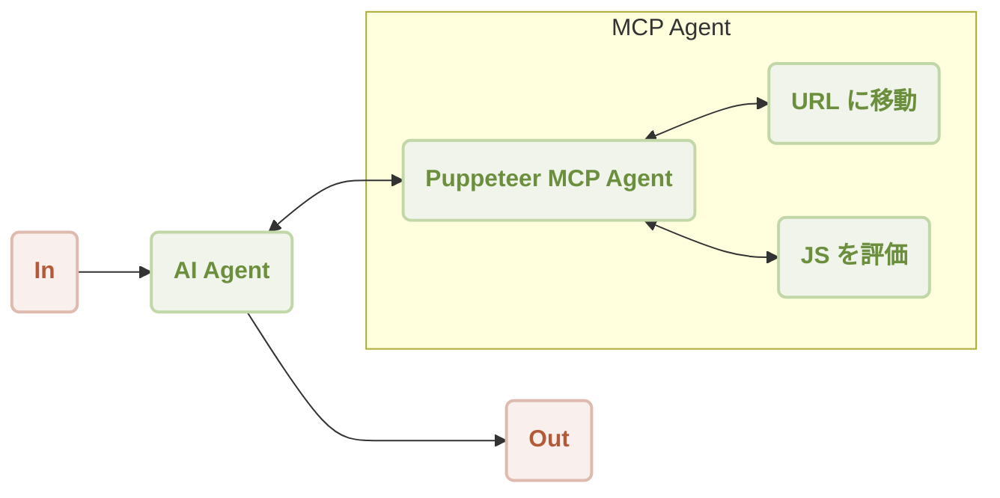

# MCP Puppeteer

このガイドでは、AIGNE フレームワークを Puppeteer MCP サーバーと組み合わせて自動化された Web スクレイピングを行う方法を、ステップバイステップで解説します。この例を通じて、Web サイトにアクセスしてそのコンテンツを抽出できる AI Agent を構築し、実行する方法を学びます。

## 概要

この例では、`AIAgent` と Puppeteer インスタンスを制御する `MCPAgent` との統合を紹介します。`AIAgent` は、URL からコンテンツを抽出するための自然言語コマンドを受け取ります。その後、Web 自動化タスクを Puppeteer Agent に委任します。Puppeteer Agent は、指定されたページに移動し、JavaScript を実行してコンテンツをスクレイピングします。

一般的なワークフローは以下の通りです。



Web サイトのコンテンツを要約するための操作シーケンスを以下に示します。

```d2
shape: sequence_diagram

User: {
  shape: c4-person
}

AI: {
  label: "AI Agent"
}

P: {
  label: "Puppeteer MCP Agent"
}

N: {
  label: "URL に移動"
}

E: {
  label: "JS を評価"
}

User -> AI: "https://www.arcblock.io のコンテンツを要約して"
AI -> P: "https://www.arcblock.io からコンテンツを抽出して"
P -> N: "https://www.arcblock.io に移動して"
N -> P: "移動完了"
P -> E: "document.body.innerText を評価して"
E -> P: "コンテンツ抽出済み"
E -> AI: "コンテキストとして抽出されたコンテンツ"
AI -> User: "コンテンツは以下の通りです: ..."
```

## 前提条件

この例を実行する前に、以下の要件が満たされていることを確認してください。
* Node.js バージョン 20.0 以降。
* 有効な OpenAI API キー。

## クイックスタート

`npx` を使用して、リポジトリをクローンせずにこの例を直接実行できます。

### 例の実行

ターミナルで以下のコマンドを実行してください。この例は、ワンショットモード、対話型チャットモードをサポートしており、パイプライン経由での入力も受け取ることができます。

```sh ワンショットモードで実行 icon=lucide:terminal
# ワンショットモードで実行 (デフォルト)
npx -y @aigne/example-mcp-puppeteer
```

```sh 対話型チャットモードで実行 icon=lucide:terminal
# 対話型チャットモードで実行
npx -y @aigne/example-mcp-puppeteer --interactive
```

```sh パイプライン入力を使用 icon=lucide:terminal
# パイプライン入力を使用
echo "extract content from https://www.arcblock.io" | npx -y @aigne/example-mcp-puppeteer
```

### AI モデルへの接続

初回実行時にモデルプロバイダーが設定されていない場合、アプリケーションは接続を促すプロンプトを表示します。


続行するにはいくつかのオプションがあります。

*   **公式 AIGNE Hub 経由で接続:** これが推奨オプションです。これを選択すると、Web ブラウザで AIGNE Hub が開き、接続を承認できます。新規ユーザーは、試用目的で無料のトークン残高を受け取れます。

    

*   **セルフホストの AIGNE Hub 経由で接続:** 独自の AIGNE Hub をホストしている場合は、このオプションを選択し、インスタンスの URL を入力して接続を完了します。[Blocklet Store](https://store.blocklet.dev/blocklets/z8ia3xzq2tMq8CRHfaXj1BTYJyYnEcHbqP8cJ?utm_source=www.arcblock.io&utm_medium=blog_link&utm_campaign=default&utm_content=store.blocklet.dev#:~:text=%F0%9F%9A%80%20Get%20Started%20in%20Minutes) から独自の AIGNE Hub をデプロイできます。

    

*   **サードパーティのモデルプロバイダー経由で接続:** 環境変数を使用して、OpenAI などのプロバイダーから直接 API キーを設定できます。

    ```sh OpenAI API キーを設定 icon=lucide:terminal
    export OPENAI_API_KEY="YOUR_API_KEY"
    ```

    サポートされているプロバイダーと変数の完全なリストについては、プロジェクト内の `.env.local.example` ファイルを参照してください。環境変数を設定した後、コマンドを再度実行してください。

## ソースからのインストール

コードを調べたり、変更を加えたりするには、リポジトリをクローンしてローカルで例を実行できます。

### 1. リポジトリのクローン

```sh aigne-framework リポジトリをクローン icon=lucide:terminal
git clone https://github.com/AIGNE-io/aigne-framework
```

### 2. 依存関係のインストール

例のディレクトリに移動し、`pnpm` を使用して必要なパッケージをインストールします。

```sh 依存関係をインストール icon=lucide:terminal
cd aigne-framework/examples/mcp-puppeteer
pnpm install
```

### 3. 例の実行

スタートスクリプトを実行してアプリケーションを起動します。

```sh ソースから例を実行 icon=lucide:terminal
pnpm start
```

コマンドライン引数をスクリプトに渡すには、`--` で区切ります。

```sh ソースからチャットモードで実行 icon=lucide:terminal
pnpm start -- --interactive
```

## コード例

以下の TypeScript コードは、AIGNE インスタンスのセットアップ、Puppeteer MCP Agent の設定、および AI Agent を呼び出して Web コンテンツを抽出するためのコアロジックを示しています。

```typescript agent.ts
import { AIAgent, AIGNE, MCPAgent } from "@aigne/core";
import { OpenAIChatModel } from "@aigne/core/models/openai-chat-model.js";

const { OPENAI_API_KEY } = process.env;

// API キーで OpenAI モデルを初期化
const model = new OpenAIChatModel({
  apiKey: OPENAI_API_KEY,
});

// Puppeteer サーバーを実行する MCPAgent を作成
const puppeteerMCPAgent = await MCPAgent.from({
  command: "npx",
  args: ["-y", "@modelcontextprotocol/server-puppeteer"],
});

// モデルと Puppeteer Agent をスキルとして AIGNE インスタンスを初期化
const aigne = new AIGNE({
  model,
  skills: [puppeteerMCPAgent],
});

// Web コンテンツ抽出のための指示を持つ AI Agent を定義
const agent = AIAgent.from({
  instructions: `\
## Steps to extract content from a website
1. navigate to the url
2. evaluate document.body.innerText to get the content
`,
});

// プロンプトで Agent を呼び出す
const result = await aigne.invoke(
  agent,
  "extract content from https://www.arcblock.io",
);

console.log(result);
// 期待される出力:
// {
//   $message: "The content extracted from the website [ArcBlock](https://www.arcblock.io) is as follows:\n\n---\n\n**Redefining Software Architect and Ecosystems**\n\nA total solution for building decentralized applications ...",
// }

// AIGNE インスタンスとその Agent をシャットダウン
await aigne.shutdown();
```

## コマンドラインオプション

このアプリケーションは、その動作をカスタマイズするためのいくつかのコマンドライン引数をサポートしています。

| パラメーター | 説明 | デフォルト |
|-----------|-------------|---------|
| `--interactive` | 対話型チャットモードで実行します。 | 無効 |
| `--model <provider[:model]>` | AI モデルを指定します。例: `openai`、`openai:gpt-4o-mini`。 | `openai` |
| `--temperature <value>` | モデル生成の temperature を設定します。 | プロバイダーのデフォルト |
| `--top-p <value>` | top-p サンプリング値を設定します。 | プロバイダーのデフォルト |
| `--presence-penalty <value>` | presence penalty の値を設定します。 | プロバイダーのデフォルト |
| `--frequency-penalty <value>` | frequency penalty の値を設定します。 | プロバイダーのデフォルト |
| `--log-level <level>` | ログレベルを設定します (`ERROR`、`WARN`、`INFO`、`DEBUG`、`TRACE`)。 | `INFO` |
| `--input`, `-i <input>` | 引数として直接入力を提供します。 | なし |

## デバッグ

AIGNE フレームワークには、Agent の実行を監視およびデバッグするのに役立つ可観測性ツールが含まれています。

観測サーバーを起動するには、以下を実行します。

```sh 可観測性サーバーを起動 icon=lucide:terminal
aigne observe
```


実行後、ブラウザで Web インターフェースを開くと、実行トレースの詳細なリストを表示し、各 Agent の入力、出力、およびツール呼び出しを検査できます。


このツールは、Agent の動作を理解し、問題を診断し、パフォーマンスを最適化するために不可欠です。
