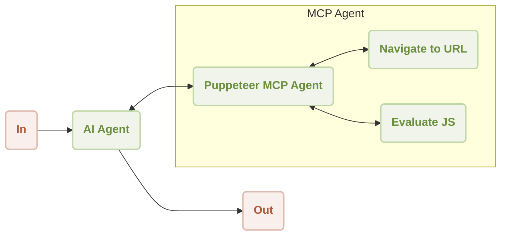

# MCP Puppeteer

This guide provides a step-by-step demonstration of how to use the AIGNE Framework with a Puppeteer MCP Server for automated web scraping. By following this example, you will learn to build and run an AI agent capable of navigating to a website and extracting its content.

## Overview

This example showcases an integration between an `AIAgent` and a `MCPAgent` that controls a Puppeteer instance. The `AIAgent` receives a natural language command to extract content from a URL. It then delegates the web automation tasks to the Puppeteer agent, which navigates to the specified page and executes JavaScript to scrape the content.

The general workflow is as follows:



The sequence of operations for summarizing website content is illustrated below:

```d2
shape: sequence_diagram

User: {
  shape: c4-person
}

AI: {
  label: "AI Agent"
}

P: {
  label: "Puppeteer MCP Agent"
}

N: {
  label: "Navigate to URL"
}

E: {
  label: "Evaluate JS"
}

User -> AI: "summarize content from https://www.arcblock.io"
AI -> P: "extract content from https://www.arcblock.io"
P -> N: "navigate to https://www.arcblock.io"
N -> P: "navigation completed"
P -> E: "evaluate document.body.innerText"
E -> P: "content extracted"
E -> AI: "extracted content as context"
AI -> User: "The content is as follows: ..."
```

## Prerequisites

Before running the example, ensure the following requirements are met:
*   Node.js version 20.0 or higher.
*   An active OpenAI API key.

## Quick Start

You can run this example directly without cloning the repository using `npx`.

### Run the Example

Execute the following commands in your terminal. The example supports a one-shot mode, an interactive chat mode, and can receive input via a pipeline.

```sh Run in one-shot mode icon=lucide:terminal
# Run in one-shot mode (default)
npx -y @aigne/example-mcp-puppeteer
```

```sh Run in interactive chat mode icon=lucide:terminal
# Run in interactive chat mode
npx -y @aigne/example-mcp-puppeteer --chat
```

```sh Use pipeline input icon=lucide:terminal
# Use pipeline input
echo "extract content from https://www.arcblock.io" | npx -y @aigne/example-mcp-puppeteer
```

### Connect to an AI Model

On the first run, if no model provider is configured, the application will prompt you to connect to one.


You have several options to proceed:

*   **Connect via the official AIGNE Hub:** This is the recommended option. Choosing it will open your web browser to the AIGNE Hub, where you can authorize the connection. New users receive a complimentary token balance for trial purposes.

    

*   **Connect via a self-hosted AIGNE Hub:** If you host your own AIGNE Hub, select this option and enter the URL of your instance to complete the connection. You can deploy your own AIGNE Hub from the [Blocklet Store](https://store.blocklet.dev/blocklets/z8ia3xzq2tMq8CRHfaXj1BTYJyYnEcHbqP8cJ?utm_source=www.arcblock.io&utm_medium=blog_link&utm_campaign=default&utm_content=store.blocklet.dev#:~:text=%F0%9F%9A%80%20Get%20Started%20in%20Minutes).

    

*   **Connect via a third-party model provider:** You can configure an API key from a provider like OpenAI directly using environment variables.

    ```sh Configure OpenAI API Key icon=lucide:terminal
    export OPENAI_API_KEY="YOUR_API_KEY"
    ```

    For a comprehensive list of supported providers and variables, refer to the example `.env.local.example` file within the project. After setting the environment variable, run the command again.

## Installation from Source

To examine the code or make modifications, you can clone the repository and run the example locally.

### 1. Clone the Repository

```sh Clone the aigne-framework repository icon=lucide:terminal
git clone https://github.com/AIGNE-io/aigne-framework
```

### 2. Install Dependencies

Navigate to the example directory and install the required packages using `pnpm`.

```sh Install dependencies icon=lucide:terminal
cd aigne-framework/examples/mcp-puppeteer
pnpm install
```

### 3. Run the Example

Execute the start script to run the application.

```sh Run the example from source icon=lucide:terminal
pnpm start
```

To pass command-line arguments to the script, separate them with `--`.

```sh Run in chat mode from source icon=lucide:terminal
pnpm start -- --chat
```

## Code Example

The following TypeScript code demonstrates the core logic for setting up the AIGNE instance, configuring the Puppeteer MCP agent, and invoking the AI agent to extract web content.

```typescript agent.ts
import { AIAgent, AIGNE, MCPAgent } from "@aigne/core";
import { OpenAIChatModel } from "@aigne/core/models/openai-chat-model.js";

const { OPENAI_API_KEY } = process.env;

// Initialize the OpenAI model with an API key
const model = new OpenAIChatModel({
  apiKey: OPENAI_API_KEY,
});

// Create an MCPAgent that runs the Puppeteer server
const puppeteerMCPAgent = await MCPAgent.from({
  command: "npx",
  args: ["-y", "@modelcontextprotocol/server-puppeteer"],
});

// Initialize the AIGNE instance with the model and the Puppeteer agent as a skill
const aigne = new AIGNE({
  model,
  skills: [puppeteerMCPAgent],
});

// Define the AI agent with instructions for web content extraction
const agent = AIAgent.from({
  instructions: `\
## Steps to extract content from a website
1. navigate to the url
2. evaluate document.body.innerText to get the content
`,
});

// Invoke the agent with a prompt
const result = await aigne.invoke(
  agent,
  "extract content from https://www.arcblock.io",
);

console.log(result);
// Expected output:
// {
//   $message: "The content extracted from the website [ArcBlock](https://www.arcblock.io) is as follows:\n\n---\n\n**Redefining Software Architect and Ecosystems**\n\nA total solution for building decentralized applications ...",
// }

// Shut down the AIGNE instance and its agents
await aigne.shutdown();
```

## Command-Line Options

The application supports several command-line arguments to customize its behavior.

| Parameter | Description | Default |
|-----------|-------------|---------|
| `--chat` | Run in interactive chat mode. | Disabled |
| `--model <provider[:model]>` | Specify the AI model. Examples: `openai`, `openai:gpt-4o-mini`. | `openai` |
| `--temperature <value>` | Set the temperature for model generation. | Provider default |
| `--top-p <value>` | Set the top-p sampling value. | Provider default |
| `--presence-penalty <value>` | Set the presence penalty value. | Provider default |
| `--frequency-penalty <value>` | Set the frequency penalty value. | Provider default |
| `--log-level <level>` | Set the logging level (`ERROR`, `WARN`, `INFO`, `DEBUG`, `TRACE`). | `INFO` |
| `--input`, `-i <input>` | Provide input directly as an argument. | None |

## Debugging

The AIGNE Framework includes an observability tool to help you monitor and debug agent executions.

To start the observation server, run:

```sh Start the observability server icon=lucide:terminal
aigne observe
```


Once running, you can open the web interface in your browser to view a detailed list of execution traces, inspect inputs, outputs, and tool calls for each agent.


This tool is essential for understanding agent behavior, diagnosing issues, and optimizing performance.
