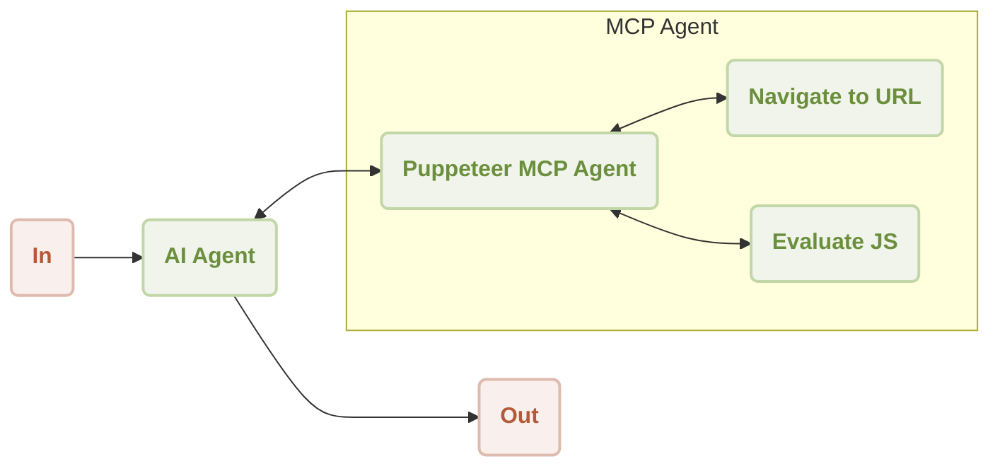

# MCP Puppeteer

本指南逐步示範如何將 AIGNE 框架與 Puppeteer MCP 伺服器結合使用，以實現自動化網頁抓取。透過此範例，您將學習如何建構並執行一個能夠瀏覽網站並擷取其內容的 AI Agent。

## 概覽

此範例展示了 `AIAgent` 和一個控制 Puppeteer 執行個體的 `MCPAgent` 之間的整合。`AIAgent` 接收一個自然語言指令，要求從某個 URL 擷取內容。然後，它將網頁自動化任務委派給 Puppeteer Agent，後者會瀏覽到指定頁面並執行 JavaScript 來抓取內容。

一般工作流程如下：



摘要網站內容的操作順序如下所示：

```d2
shape: sequence_diagram

User: {
  shape: c4-person
}

AI: {
  label: "AI Agent"
}

P: {
  label: "Puppeteer MCP Agent"
}

N: {
  label: "Navigate to URL"
}

E: {
  label: "Evaluate JS"
}

User -> AI: "summarize content from https://www.arcblock.io"
AI -> P: "extract content from https://www.arcblock.io"
P -> N: "navigate to https://www.arcblock.io"
N -> P: "navigation completed"
P -> E: "evaluate document.body.innerText"
E -> P: "content extracted"
E -> AI: "extracted content as context"
AI -> User: "The content is as follows: ..."
```

## 先決條件

在執行此範例前，請確保滿足以下要求：
*   Node.js 版本 20.0 或更高。
*   有效的 OpenAI API 金鑰。

## 快速入門

您可以使用 `npx` 直接執行此範例，無需複製儲存庫。

### 執行範例

在您的終端機中執行以下指令。此範例支援單次模式、互動式聊天模式，並可透過管道接收輸入。

```sh 在單次模式下執行 icon=lucide:terminal
# 在單次模式下執行（預設）
npx -y @aigne/example-mcp-puppeteer
```

```sh 在互動式聊天模式下執行 icon=lucide:terminal
# 在互動式聊天模式下執行
npx -y @aigne/example-mcp-puppeteer --interactive
```

```sh 使用管道輸入 icon=lucide:terminal
# 使用管道輸入
echo "extract content from https://www.arcblock.io" | npx -y @aigne/example-mcp-puppeteer
```

### 連線至 AI 模型

首次執行時，如果未設定模型提供者，應用程式將提示您進行連線。


您有以下幾個選項可以繼續：

*   **透過官方 AIGNE Hub 連線：** 這是建議選項。選擇此選項將在您的網頁瀏覽器中開啟 AIGNE Hub，您可以在那裡授權連線。新使用者會獲得免費的試用代幣餘額。

    

*   **透過自行託管的 AIGNE Hub 連線：** 如果您自行託管 AIGNE Hub，請選擇此選項並輸入您執行個體的 URL 以完成連線。您可以從 [Blocklet Store](https://store.blocklet.dev/blocklets/z8ia3xzq2tMq8CRHfaXj1BTYJyYnEcHbqP8cJ?utm_source=www.arcblock.io&utm_medium=blog_link&utm_campaign=default&utm_content=store.blocklet.dev#:~:text=%F0%9F%9A%80%20Get%20Started%20in%20Minutes) 部署自己的 AIGNE Hub。

    

*   **透過第三方模型提供者連線：** 您可以直接使用環境變數設定來自 OpenAI 等提供者的 API 金鑰。

    ```sh 設定 OpenAI API 金鑰 icon=lucide:terminal
    export OPENAI_API_KEY="YOUR_API_KEY"
    ```

    有關支援的提供者和變數的完整清單，請參考專案中的 `.env.local.example` 範例檔案。設定環境變數後，請重新執行指令。

## 從原始碼安裝

若要檢視程式碼或進行修改，您可以複製儲存庫並在本機執行此範例。

### 1. 複製儲存庫

```sh 複製 aigne-framework 儲存庫 icon=lucide:terminal
git clone https://github.com/AIGNE-io/aigne-framework
```

### 2. 安裝依賴項

瀏覽至範例目錄並使用 `pnpm` 安裝所需套件。

```sh 安裝依賴項 icon=lucide:terminal
cd aigne-framework/examples/mcp-puppeteer
pnpm install
```

### 3. 執行範例

執行啟動腳本以執行應用程式。

```sh 從原始碼執行範例 icon=lucide:terminal
pnpm start
```

若要將命令列參數傳遞給腳本，請使用 `--` 將它們分開。

```sh 從原始碼以聊天模式執行 icon=lucide:terminal
pnpm start -- --interactive
```

## 程式碼範例

以下 TypeScript 程式碼展示了設定 AIGNE 執行個體、配置 Puppeteer MCP Agent 以及呼叫 AI Agent 以擷取網頁內容的核心邏輯。

```typescript agent.ts
import { AIAgent, AIGNE, MCPAgent } from "@aigne/core";
import { OpenAIChatModel } from "@aigne/core/models/openai-chat-model.js";

const { OPENAI_API_KEY } = process.env;

// 使用 API 金鑰初始化 OpenAI 模型
const model = new OpenAIChatModel({
  apiKey: OPENAI_API_KEY,
});

// 建立一個執行 Puppeteer 伺服器的 MCPAgent
const puppeteerMCPAgent = await MCPAgent.from({
  command: "npx",
  args: ["-y", "@modelcontextprotocol/server-puppeteer"],
});

// 初始化 AIGNE 執行個體，將模型和 Puppeteer Agent 作為技能
const aigne = new AIGNE({
  model,
  skills: [puppeteerMCPAgent],
});

// 定義 AI Agent，包含網頁內容擷取的指令
const agent = AIAgent.from({
  instructions: `\
## 從網站擷取內容的步驟
1. 瀏覽至該 url
2. 執行 document.body.innerText 以取得內容
`,
});

// 使用提示呼叫 Agent
const result = await aigne.invoke(
  agent,
  "extract content from https://www.arcblock.io",
);

console.log(result);
// 預期輸出：
// {
//   $message: "The content extracted from the website [ArcBlock](https://www.arcblock.io) is as follows:\n\n---\n\n**Redefining Software Architect and Ecosystems**\n\nA total solution for building decentralized applications ...",
// }

// 關閉 AIGNE 執行個體及其 Agent
await aigne.shutdown();
```

## 命令列選項

應用程式支援多個命令列參數以自訂其行為。

| 參數 | 說明 | 預設值 |
|-----------|-------------|---------|
| `--interactive` | 以互動式聊天模式執行。 | 已停用 |
| `--model <provider[:model]>` | 指定 AI 模型。範例：`openai`、`openai:gpt-4o-mini`。 | `openai` |
| `--temperature <value>` | 設定模型生成的溫度。 | 提供者預設值 |
| `--top-p <value>` | 設定 top-p 取樣值。 | 提供者預設值 |
| `--presence-penalty <value>` | 設定存在懲罰值。 | 提供者預設值 |
| `--frequency-penalty <value>` | 設定頻率懲罰值。 | 提供者預設值 |
| `--log-level <level>` | 設定記錄層級（`ERROR`、`WARN`、`INFO`、`DEBUG`、`TRACE`）。 | `INFO` |
| `--input`, `-i <input>` | 直接以參數形式提供輸入。 | 無 |

## 偵錯

AIGNE 框架包含一個可觀測性工具，可協助您監控和偵錯 Agent 的執行。

若要啟動可觀測性伺服器，請執行：

```sh 啟動可觀測性伺服器 icon=lucide:terminal
aigne observe
```


一旦執行，您可以在瀏覽器中開啟網頁介面，以檢視詳細的執行追蹤清單，並檢查每個 Agent 的輸入、輸出和工具呼叫。


此工具對於理解 Agent 行為、診斷問題和最佳化效能至關重要。
