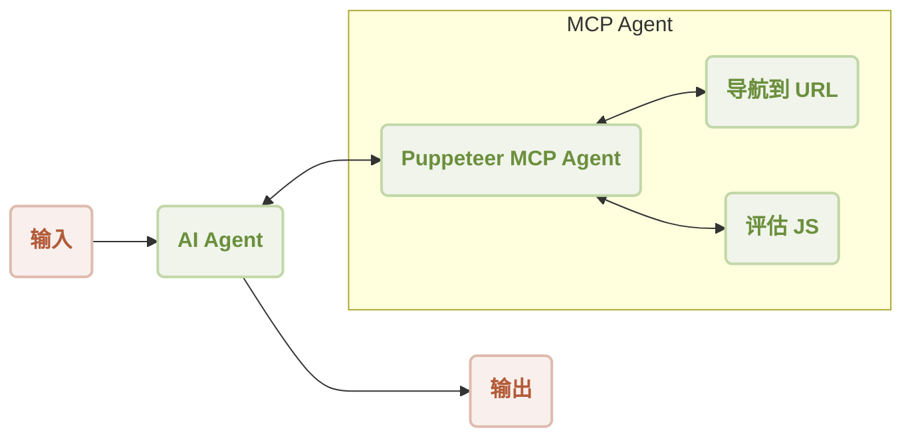
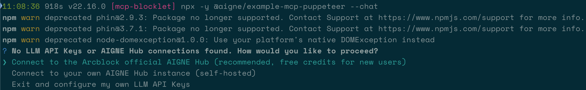

# MCP Puppeteer

本指南逐步演示了如何将 AIGNE 与 Puppeteer MCP Server 结合使用以实现自动化网络抓取。通过此示例，您将学习如何构建并运行一个能够访问网站并提取其内容的 AI agent。

## 概述

此示例展示了 `AIAgent` 与控制 Puppeteer 实例的 `MCPAgent` 之间的集成。`AIAgent` 接收一条自然语言命令以从 URL 中提取内容。然后，它将 Web 自动化任务委托给 Puppeteer agent，后者会导航至指定页面并执行 JavaScript 以抓取内容。

一般工作流程如下：



总结网站内容的操作顺序如下所示：

```d2
shape: sequence_diagram

User: {
  shape: c4-person
}

AI: {
  label: "AI Agent"
}

P: {
  label: "Puppeteer MCP Agent"
}

N: {
  label: "导航到 URL"
}

E: {
  label: "评估 JS"
}

User -> AI: "从 https://www.arcblock.io 总结内容"
AI -> P: "从 https://www.arcblock.io 提取内容"
P -> N: "导航到 https://www.arcblock.io"
N -> P: "导航完成"
P -> E: "评估 document.body.innerText"
E -> P: "内容已提取"
E -> AI: "提取的内容作为上下文"
AI -> User: "内容如下：..."
```

## 前置要求

在运行此示例之前，请确保满足以下要求：
*   Node.js 版本 20.0 或更高。
*   一个有效的 OpenAI API 密钥。

## 快速入门

您可以使用 `npx` 直接运行此示例，而无需克隆代码仓库。

### 运行示例

在您的终端中执行以下命令。该示例支持单次运行模式、交互式聊天模式，并能通过管道接收输入。

```sh 在单次运行模式下运行 icon=lucide:terminal
# 在单次运行模式下运行 (默认)
npx -y @aigne/example-mcp-puppeteer
```

```sh 在交互式聊天模式下运行 icon=lucide:terminal
# 在交互式聊天模式下运行
npx -y @aigne/example-mcp-puppeteer --chat
```

```sh 使用管道输入 icon=lucide:terminal
# 使用管道输入
echo "extract content from https://www.arcblock.io" | npx -y @aigne/example-mcp-puppeteer
```

### 连接到 AI 模型

首次运行时，如果未配置模型提供商，应用程序将提示您连接一个。



您有以下几种选择：

*   **通过官方 AIGNE Hub 连接：** 这是推荐选项。选择它将在您的 Web 浏览器中打开 AIGNE Hub，您可以在那里授权连接。新用户会获得免费的试用代币余额。

    

*   **通过自托管的 AIGNE Hub 连接：** 如果您托管自己的 AIGNE Hub，请选择此选项并输入您的实例 URL 以完成连接。您可以从 [Blocklet Store](https://store.blocklet.dev/blocklets/z8ia3xzq2tMq8CRHfaXj1BTYJyYnEcHbqP8cJ?utm_source=www.arcblock.io&utm_medium=blog_link&utm_campaign=default&utm_content=store.blocklet.dev#:~:text=%F0%9F%9A%80%20Get%20Started%20in%20Minutes) 部署自己的 AIGNE Hub。

    

*   **通过第三方模型提供商连接：** 您可以直接使用环境变量配置来自 OpenAI 等提供商的 API 密钥。

    ```sh 配置 OpenAI API 密钥 icon=lucide:terminal
    export OPENAI_API_KEY="YOUR_API_KEY"
    ```

    有关支持的提供商和变量的完整列表，请参阅项目中的 `.env.local.example` 示例文件。设置环境变量后，请再次运行该命令。

## 从源代码安装

要检查代码或进行修改，您可以克隆代码仓库并在本地运行示例。

### 1. 克隆代码仓库

```sh 克隆 aigne-framework 代码仓库 icon=lucide:terminal
git clone https://github.com/AIGNE-io/aigne-framework
```

### 2. 安装依赖项

导航至示例目录并使用 `pnpm` 安装所需的包。

```sh 安装依赖项 icon=lucide:terminal
cd aigne-framework/examples/mcp-puppeteer
pnpm install
```

### 3. 运行示例

执行启动脚本以运行应用程序。

```sh 从源代码运行示例 icon=lucide:terminal
pnpm start
```

要将命令行参数传递给脚本，请用 `--` 将它们分开。

```sh 从源代码以聊天模式运行 icon=lucide:terminal
pnpm start -- --chat
```

## 代码示例

以下 TypeScript 代码演示了设置 AIGNE 实例、配置 Puppeteer MCP agent 以及调用 AI agent 提取 Web 内容的核心逻辑。

```typescript agent.ts
import { AIAgent, AIGNE, MCPAgent } from "@aigne/core";
import { OpenAIChatModel } from "@aigne/core/models/openai-chat-model.js";

const { OPENAI_API_KEY } = process.env;

// 使用 API 密钥初始化 OpenAI 模型
const model = new OpenAIChatModel({
  apiKey: OPENAI_API_KEY,
});

// 创建一个运行 Puppeteer 服务器的 MCPAgent
const puppeteerMCPAgent = await MCPAgent.from({
  command: "npx",
  args: ["-y", "@modelcontextprotocol/server-puppeteer"],
});

// 使用模型和 Puppeteer agent 作为技能来初始化 AIGNE 实例
const aigne = new AIGNE({
  model,
  skills: [puppeteerMCPAgent],
});

// 定义 AI agent 并附上用于 Web 内容提取的指令
const agent = AIAgent.from({
  instructions: `\
## 从网站提取内容的步骤
1. 导航到该 url
2. 评估 document.body.innerText 以获取内容
`,
});

// 使用提示调用 agent
const result = await aigne.invoke(
  agent,
  "extract content from https://www.arcblock.io",
);

console.log(result);
// 预期输出：
// {
//   $message: "The content extracted from the website [ArcBlock](https://www.arcblock.io) is as follows:\n\n---\n\n**Redefining Software Architect and Ecosystems**\n\nA total solution for building decentralized applications ...",
// }

// 关闭 AIGNE 实例及其 agent
await aigne.shutdown();
```

## 命令行选项

该应用程序支持多个命令行参数来自定义其行为。

| 参数 | 描述 | 默认值 |
|-----------|-------------|---------|
| `--chat` | 以交互式聊天模式运行。 | 已禁用 |
| `--model <provider[:model]>` | 指定 AI 模型。示例：`openai`、`openai:gpt-4o-mini`。 | `openai` |
| `--temperature <value>` | 设置模型生成的温度。 | 提供商默认值 |
| `--top-p <value>` | 设置 top-p 采样值。 | 提供商默认值 |
| `--presence-penalty <value>` | 设置存在惩罚值。 | 提供商默认值 |
| `--frequency-penalty <value>` | 设置频率惩罚值。 | 提供商默认值 |
| `--log-level <level>` | 设置日志级别（`ERROR`、`WARN`、`INFO`、`DEBUG`、`TRACE`）。 | `INFO` |
| `--input`, `-i <input>` | 直接作为参数提供输入。 | 无 |

## 调试

AIGNE 框架包含一个可观测性工具，可帮助您监控和调试 agent 的执行过程。

要启动可观测性服务器，请运行：

```sh 启动可观测性服务器 icon=lucide:terminal
aigne observe
```


运行后，您可以在浏览器中打开 Web 界面，查看详细的执行跟踪列表，检查每个 agent 的输入、输出和工具调用。


该工具对于理解 agent 行为、诊断问题和优化性能至关重要。