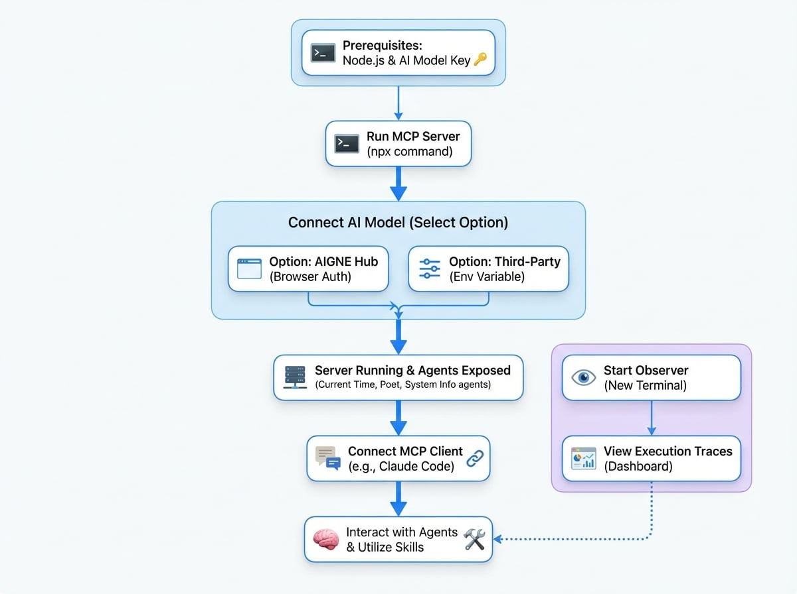

This guide provides instructions on how to run AIGNE Framework agents as a Model Context Protocol (MCP) server. By the end of this document, you will be able to start the server, connect it to an AI model, and interact with your agents using an MCP-compatible client like Claude Code.

The Model Context Protocol (MCP) is an open standard designed to enable AI assistants to securely connect with various data sources and tools. By exposing AIGNE agents as an MCP server, you can augment MCP-compatible clients with the specialized skills and capabilities of your custom agents.

The following diagram illustrates how the AIGNE MCP server connects your agents to an AI model and an MCP-compatible client.

<!-- DIAGRAM_IMAGE_START:guide:4:3 -->

<!-- DIAGRAM_IMAGE_END -->

## Prerequisites

Before proceeding, ensure your development environment meets the following requirements:

*   **Node.js:** Version 20.0 or higher.
*   **AI Model Access:** An API key for a supported large language model provider, such as OpenAI.

## Quick Start

You can run the example directly without a local installation using `npx`.

### 1. Run the MCP Server

Execute the following command in your terminal to download and start the MCP server example:

```sh serve-mcp icon=lucide:terminal
npx -y @aigne/example-mcp-server serve-mcp --port 3456
```

Upon successful execution, the server will start, and you will see the following output, confirming that the MCP server is active and listening for connections.

```sh Expected Output icon=lucide:terminal
Observability OpenTelemetry SDK Started, You can run `npx aigne observe` to start the observability server.
MCP server is running on http://localhost:3456/mcp
```

### 2. Connect to an AI Model

The MCP server requires a connection to a large language model to function. If you are running the server for the first time, a command-line prompt will guide you through the connection process.


You have three primary options for connecting to an AI model:

#### Option 1: AIGNE Hub (Recommended)

Connect to the official AIGNE Hub to get started quickly. New users receive free credits, making this the most straightforward option for evaluation. Select the first option in the prompt, and your web browser will open to guide you through the authorization process.


#### Option 2: Self-Hosted AIGNE Hub

If your organization uses a self-hosted instance of AIGNE Hub, select the second option and enter the URL of your hub instance when prompted.


#### Option 3: Third-Party Model Provider

You can connect directly to a third-party model provider by setting the appropriate environment variables. For example, to use OpenAI, export your API key before running the server command.

```sh Configure OpenAI API Key icon=lucide:terminal
export OPENAI_API_KEY="YOUR_OPENAI_API_KEY"
```

After setting the environment variable, restart the `serve-mcp` command.

## Available Agents

This example exposes several pre-configured agents as MCP tools, each with a distinct function:

*   **Current Time Agent:** Provides the current time. Defined in `agents/current-time.js`.
*   **Poet Agent:** Generates poetry and other creative text formats. Defined in `agents/poet.yaml`.
*   **System Info Agent:** Retrieves information about the host system. Defined in `agents/system-info.js`.

## Connecting to an MCP Client

Once the MCP server is running, you can connect to it from any MCP-compatible client. The following example uses Claude Code.

First, ensure you have [Claude Code](https://claude.ai/code) installed. Then, add the AIGNE MCP server as a tool source using the following command:

```sh Add MCP Server to Claude icon=lucide:terminal
claude mcp add -t http test http://localhost:3456/mcp
```

After adding the server, you can invoke the agents' skills directly from the Claude Code interface.

## Observing Agent Execution

The AIGNE Framework includes an observability tool that allows you to monitor and debug agent behavior in real-time. This tool is essential for analyzing traces, inspecting inputs and outputs, and understanding agent performance.

### 1. Start the Observer

To start the local observability web server, run the following command in a new terminal window:

```sh Start Observability Server icon=lucide:terminal
npx aigne observe --port 7890
```

The server will start and provide a URL to access the dashboard.


### 2. View Traces

Open `http://localhost:7890` in your web browser to access the AIGNE observability dashboard. The "Traces" view provides a list of recent agent executions, including details on latency, token usage, and status.

