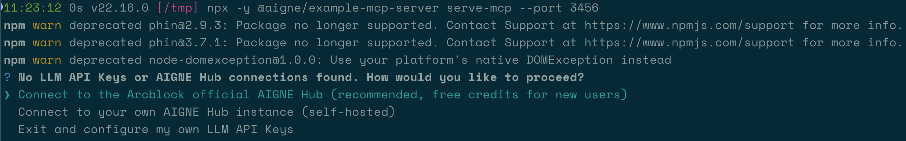

# MCP 伺服器

本指南說明如何將 AIGNE 框架 Agent 作為模型上下文協定（MCP）伺服器執行。透過遵循這些步驟，您將能夠將自訂 Agent 作為工具公開給任何與 MCP 相容的用戶端（例如 Claude Code），從而擴展其功能。

## 概觀

[模型上下文協定（MCP）](https://modelcontextprotocol.io) 是一項開放標準，旨在使 AI 助理能夠安全地與各種資料來源和工具連接。透過將 AIGNE Agent 作為 MCP 伺服器運作，您可以使用 Agent 的專業能力來增強與 MCP 相容的用戶端。

## 先決條件

在繼續之前，請確保滿足以下要求：

*   **Node.js：** 必須安裝 20.0 或更高版本。您可以從 [nodejs.org](https://nodejs.org) 下載。
*   **AI 模型提供商：** Agent 需要來自 [OpenAI](https://platform.openai.com/api-keys) 等提供商的 API 金鑰才能運作。

## 快速入門

您可以使用 `npx` 直接啟動 MCP 伺服器，無需本地安裝。

### 1. 執行 MCP 伺服器

在您的終端機中執行以下命令，以在 `3456` 連接埠上啟動伺服器：

```bash server.js icon=lucide:terminal
npx -y @aigne/example-mcp-server serve-mcp --port 3456
```

成功執行後，伺服器將啟動，您將看到以下輸出，表示 MCP 伺服器已啟用並可存取。

```bash
Observability OpenTelemetry SDK Started, You can run `npx aigne observe` to start the observability server.
MCP server is running on http://localhost:3456/mcp
```

### 2. 連接到 AI 模型

Agent 需要連接到大型語言模型（LLM）才能處理請求。如果您在未設定模型提供商的情況下執行伺服器，系統將提示您選擇一種連接方法。



您有三種主要選項可以連接到 AI 模型。

#### 選項 A：連接到官方 AIGNE Hub

這是推薦給新使用者的方法。

1.  選擇第一個選項，「Connect to the Arcblock official AIGNE Hub」。
2.  您的網頁瀏覽器將開啟 AIGNE Hub 授權頁面。
3.  按照螢幕上的說明批准連接。新使用者將自動獲得 400,000 個權杖用於評估。


#### 選項 B：連接到自行託管的 AIGNE Hub

如果您運行自己的 AIGNE Hub 實例，請選擇第二個選項。

1.  系統將提示您輸入自行託管的 AIGNE Hub 的 URL。
2.  提供 URL 並按照後續提示完成連接。

有關部署自行託管的 AIGNE Hub 的說明，請造訪 [Blocklet Store](https://store.blocklet.dev/blocklets/z8ia3xzq2tMq8CRHfaXj1BTYJyYnEcHbqP8cJ?utm_source=www.arcblock.io&utm_medium=blog_link&utm_campaign=default&utm_content=store.blocklet.dev#:~:text=%F0%9F%9A%80%20Get%20Started%20in%20Minutes)。


#### 選項 C：透過第三方模型提供商連接

您可以透過將適當的 API 金鑰設定為環境變數，直接連接到第三方模型提供商，例如 OpenAI。

例如，要使用 OpenAI，請設定 `OPENAI_API_KEY` 變數：

```bash .env icon=lucide:terminal
export OPENAI_API_KEY="your_openai_api_key_here"
```

設定環境變數後，重新啟動 MCP 伺服器命令。有關其他提供商（如 DeepSeek 或 Google Gemini）支援的變數列表，請參閱儲存庫中的範例設定檔。

## 可用的 Agent

此範例將幾個預先建置的 Agent 作為 MCP 工具公開，每個 Agent 都有不同的功能：

| Agent | 檔案路徑 | 說明 |
| ----------------- | -------------------------- | ------------------------------------- |
| Current Time | `agents/current-time.js` | 提供當前日期和時間。 |
| Poet | `agents/poet.yaml` | 生成詩歌和創意文本。 |
| System Info | `agents/system-info.js` | 報告有關系統的資訊。 |

## 連接到 MCP 用戶端

伺服器執行後，您可以將其連接到與 MCP 相容的用戶端。以下範例使用 [Claude Code](https://claude.ai/code)。

1.  使用以下命令將執行中的 MCP 伺服器新增到 Claude Code：

    ```bash icon=lucide:terminal
    claude mcp add -t http test http://localhost:3456/mcp
    ```

2.  從用戶端內部叫用 Agent。例如，您可以請求系統資訊或要求寫一首詩。

    **範例：叫用 System Info Agent**
    

    **範例：叫用 Poet Agent**
    

## 觀察 Agent 活動

AIGNE 包含一個可觀測性工具，可讓您即時監控和偵錯 Agent 的執行情況。

1.  在新的終端機視窗中執行以下命令來啟動可觀測性伺服器：

    ```bash icon=lucide:terminal
    npx aigne observe --port 7890
    ```

    

2.  開啟您的網頁瀏覽器並導覽至 `http://localhost:7890`。

該儀表板提供了一個使用者友善的介面，用於檢查執行追蹤、查看詳細的呼叫資訊以及了解 Agent 的行為。這是偵錯、效能調整以及深入了解 Agent 如何處理資訊的重要工具。


以下是由 Poet Agent 處理的請求的詳細追蹤範例。


## 總結

您已成功啟動 MCP 伺服器、將其連接到 AI 模型，並將 AIGNE Agent 作為工具公開給 MCP 用戶端。這使您能夠使用自訂的邏輯和資料來源擴展 AI 助理的功能。

有關更進階的範例和 Agent 類型，請探索以下部分：

<x-cards data-columns="2">
  <x-card data-title="MCP Agent" data-icon="lucide:box" data-href="/developer-guide/agents/mcp-agent">
    了解如何透過模型上下文協定（MCP）連接到外部系統並與之互動。
  </x-card>
  <x-card data-title="MCP GitHub 範例" data-icon="lucide:github" data-href="/examples/mcp-github">
    查看使用 MCP 伺服器與 GitHub 儲存庫互動的範例。
  </x-card>
</x-cards>