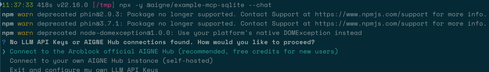

# MCP SQLite

このガイドでは、AIGNE フレームワークを活用した AI Agent を使用して SQLite データベースと対話するための包括的なウォークスルーを提供します。これらの手順に従うことで、必要なコンポーネントのセットアップ、サンプルアプリケーションの実行、Agent を使用したテーブル作成やデータクエリなどのデータベース操作の実行方法を学びます。

このサンプルの中心は、`MCPAgent` を使用して実行中の [SQLite MCP Server](https://github.com/modelcontextprotocol/servers/tree/main/src/sqlite) に接続することです。このサーバーはデータベース機能をスキルとして公開し、`AIAgent` はユーザープロンプトに基づいてそれらをインテリジェントに呼び出すことができます。

```d2
direction: down

User: {
  shape: c4-person
}

App: {
  label: "@aigne/example-mcp-sqlite"
  shape: rectangle

  AIGNE-Framework: {
    label: "AIGNE Framework (@aigne/core)"
    shape: rectangle

    AIGNE-Instance: {
      label: "AIGNE インスタンス"
    }

    AIAgent: {
      label: "AIAgent"
    }

    MCPAgent: {
      label: "MCPAgent"
    }
  }

  AI-Model: {
    label: "AI モデル\n(例: OpenAI)"
    shape: rectangle
  }
}

SQLite-MCP-Server: {
  label: "SQLite MCP サーバー"
  shape: rectangle
}

SQLite-DB: {
  label: "SQLite データベース\n(usages.db)"
  shape: cylinder
}

User -> App: "1. コマンド実行\n(例: '製品テーブルを作成')"
App.AIGNE-Framework.AIAgent -> App.AI-Model: "2. プロンプトを解釈"
App.AI-Model -> App.AIGNE-Framework.AIAgent: "3. 必要なスキル呼び出しを返す"
App.AIGNE-Framework.AIAgent -> App.AIGNE-Framework.MCPAgent: "4. スキルを呼び出す"
App.AIGNE-Framework.MCPAgent -> SQLite-MCP-Server: "5. コマンドを送信"
SQLite-MCP-Server -> SQLite-DB: "6. SQL を実行"
SQLite-DB -> SQLite-MCP-Server: "7. 結果を返す"
SQLite-MCP-Server -> App.AIGNE-Framework.MCPAgent: "8. 応答を送信"
App.AIGNE-Framework.MCPAgent -> App.AIGNE-Framework.AIAgent: "9. 応答を転送"
App.AIGNE-Framework.AIAgent -> App: "10. 最終出力を処理"
App -> User: "11. 結果メッセージを表示"
```

## 前提条件

先に進む前に、開発環境が以下の要件を満たしていることを確認してください。サンプルを正常に実行するためには、これらの前提条件を遵守する必要があります。

*   **Node.js:** バージョン 20.0 以上。
*   **npm:** Node.js に同梱されている Node.js パッケージマネージャー。
*   **uv:** Python パッケージインストーラー。SQLite MCP サーバーの実行に必要です。インストール手順は [`uv` の公式リポジトリ](https://github.com/astral-sh/uv) で確認できます。
*   **AI モデル API キー:** AI Agent が機能するためには、サポートされているプロバイダーの API キーが必要です。この例ではデフォルトで OpenAI を使用しますが、他のプロバイダーもサポートされています。[OpenAI API キー](https://platform.openai.com/api-keys) は彼らのプラットフォームから取得できます。

ソースコードからサンプルを実行する開発者向けには、以下の依存関係も必要です。

*   **Pnpm:** 高速でディスクスペース効率の良いパッケージマネージャー。
*   **Bun:** テストやサンプルの実行に使用される高速な JavaScript オールインワンツールキット。

## クイックスタート

このセクションでは、手動インストールなしで直接サンプルを実行する手順を説明します。これは、予備評価のための最も効率的な方法です。

アプリケーションは、単一コマンド用のワンショットモード、対話型のチャットモード、またはスクリプトへの直接パイプ入力で実行できます。

ターミナルで以下のいずれかのコマンドを実行してください。

```bash title="ワンショットモードで実行 (デフォルト)" icon=lucide:terminal
npx -y @aigne/example-mcp-sqlite
```

```bash title="対話型チャットモードで実行" icon=lucide:terminal
npx -y @aigne/example-mcp-sqlite --interactive
```

```bash title="パイプライン入力を使用" icon=lucide:terminal
echo "create a product table with columns name description and createdAt" | npx -y @aigne/example-mcp-sqlite
```

## AI モデルへの接続

AI Agent は、指示を処理するために大規模言語モデル (LLM) への接続を必要とします。モデルが事前に設定されていない状態でサンプルを実行すると、接続方法を選択するよう求められます。



この接続を確立するには、主に 3 つの方法があります。

### 1. 公式 AIGNE Hub への接続

これは新規ユーザーに推奨される方法です。合理化されたブラウザベースの認証プロセスを提供します。新規ユーザーはプラットフォームをテストするための無料クレジットを受け取れます。

1.  最初のオプション `Connect to the Arcblock official AIGNE Hub` を選択します。
2.  デフォルトの Web ブラウザが開き、認証ページが表示されます。
3.  画面の指示に従って接続を承認します。


### 2. セルフホストの AIGNE Hub への接続

組織が AIGNE Hub のプライベートインスタンスを運用している場合は、2 番目のオプションを選択し、ハブの URL を入力して接続を完了します。


### 3. サードパーティモデルプロバイダー経由での接続

適切な API キーを環境変数として設定することで、OpenAI などのサポートされているサードパーティモデルプロバイダーに直接接続できます。

例えば、OpenAI に接続するには、`OPENAI_API_KEY` 変数を設定します。

```bash title="OpenAI API キーを設定" icon=lucide:terminal
export OPENAI_API_KEY="your-openai-api-key-here"
```

環境変数を設定した後、`npx` コマンドを再実行してください。サポートされているプロバイダーとその必要な環境変数の包括的なリストについては、リポジトリ内の `.env.local.example` ファイルを参照してください。

## ソースからのインストール

ソースコードを調査または変更したい開発者は、以下の手順に従ってリポジトリをクローンし、サンプルをローカルで実行してください。

### 1. リポジトリをクローンする

公式 AIGNE フレームワークリポジトリをローカルマシンにクローンします。

```bash title="リポジトリをクローン" icon=lucide:terminal
git clone https://github.com/AIGNE-io/aigne-framework
```

### 2. 依存関係をインストールする

サンプルディレクトリに移動し、`pnpm` を使用して必要な依存関係をインストールします。

```bash title="依存関係をインストール" icon=lucide:terminal
cd aigne-framework/examples/mcp-sqlite
pnpm install
```

### 3. サンプルを実行する

`pnpm start` コマンドを使用してアプリケーションを実行します。

```bash title="ワンショットモードで実行 (デフォルト)" icon=lucide:terminal
pnpm start
```

対話モードで実行したり、パイプライン入力を使用したりするには、`--` 区切り文字の後に目的のフラグを追加します。

```bash title="対話型チャットモードで実行" icon=lucide:terminal
pnpm start -- --interactive
```

```bash title="パイプライン入力を使用" icon=lucide:terminal
echo "create a product table with columns name description and createdAt" | pnpm start
```

### コマンドラインオプション

アプリケーションは、その動作をカスタマイズするためのいくつかのコマンドライン引数をサポートしています。

| パラメータ | 説明 | デフォルト |
| :--- | :--- | :--- |
| `--interactive` | 対話型チャットモードを有効にします。 | 無効 (ワンショット) |
| `--model <provider[:model]>` | AI モデルを指定します。フォーマット: `'provider[:model]'`。 | `openai` |
| `--temperature <value>` | 生成のためのモデルの temperature を設定します。 | プロバイダーのデフォルト |
| `--top-p <value>` | モデルの top-p サンプリング値を設定します。 | プロバイダーのデフォルト |
| `--presence-penalty <value>`| モデルの presence penalty を設定します。 | プロバイダーのデフォルト |
| `--frequency-penalty <value>`| モデルの frequency penalty を設定します。 | プロバイダーのデフォルト |
| `--log-level <level>` | ログの詳細度 (`ERROR`, `WARN`, `INFO`, `DEBUG`, `TRACE`) を設定します。 | `INFO` |
| `--input`, `-i <input>` | 引数として直接入力を提供します。 | `None` |

## コード例

以下の TypeScript コードは、SQLite データベースと対話するために AI Agent をセットアップして呼び出すためのコアロジックを示しています。

このスクリプトは `OpenAIChatModel` を初期化し、SQLite サーバーに接続された `MCPAgent` を開始し、モデルと Agent のスキルで `AIGNE` インスタンスを設定します。最後に、データベースタスクを実行するための特定の指示を持つ `AIAgent` を呼び出します。

```typescript title="index.ts" icon=logos:typescript-icon
import { join } from "node:path";
import { AIAgent, AIGNE, MCPAgent } from "@aigne/core";
import { OpenAIChatModel } from "@aigne/core/models/openai-chat-model.js";

const { OPENAI_API_KEY } = process.env;

// 1. チャットモデルを初期化
const model = new OpenAIChatModel({
  apiKey: OPENAI_API_KEY,
});

// 2. SQLite MCP サーバーを管理されたサブプロセスとして開始
const sqlite = await MCPAgent.from({
  command: "uvx",
  args: [
    "-q",
    "mcp-server-sqlite",
    "--db-path",
    join(process.cwd(), "usages.db"),
  ],
});

// 3. モデルと MCP スキルで AIGNE インスタンスを設定
const aigne = new AIGNE({
  model,
  skills: [sqlite],
});

// 4. 特定の指示を持つ AI Agent を定義
const agent = AIAgent.from({
  instructions: "あなたはデータベース管理者です",
});

// 5. Agent を呼び出してテーブルを作成
console.log(
  await aigne.invoke(
    agent,
    "create a product table with columns name description and createdAt",
  ),
);
// 期待される出力:
// {
//   $message: "The product table has been created successfully with the columns: `name`, `description`, and `createdAt`.",
// }

// 6. Agent を呼び出してデータを挿入
console.log(await aigne.invoke(agent, "create 10 products for test"));
// 期待される出力:
// {
//   $message: "I have successfully created 10 test products in the database...",
// }

// 7. Agent を呼び出してデータをクエリ
console.log(await aigne.invoke(agent, "how many products?"));
// 期待される出力:
// {
//   $message: "There are 10 products in the database.",
// }

// 8. AIGNE インスタンスと MCP サーバーをシャットダウン
await aigne.shutdown();
```

## デバッグ

Agent の実行フローを監視および分析するには、`aigne observe` コマンドを使用できます。このツールは、トレース、ツール呼び出し、モデルとの対話の詳細なビューを提供するローカル Web サーバーを起動し、デバッグやパフォーマンス分析に非常に役立ちます。

1.  **観測サーバーを開始:**

    ```bash title="観測サーバーを開始" icon=lucide:terminal
    aigne observe
    ```

    

2.  **トレースを表示:**

    提供された URL (例: `http://localhost:7893`) を Web ブラウザで開き、観測インターフェースにアクセスします。「Traces」ページには、最近の Agent 実行が一覧表示されます。

    

    ここから個々のトレースを選択して、モデルに送信されたプロンプト、Agent によって呼び出されたスキル、最終出力など、操作の完全なシーケンスを検査できます。
