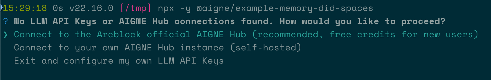
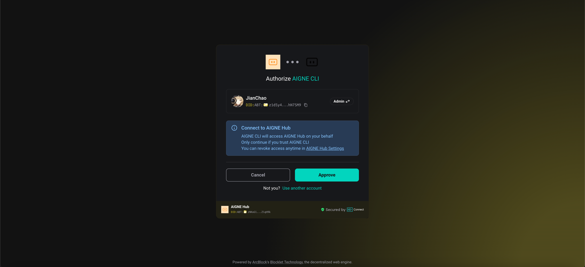
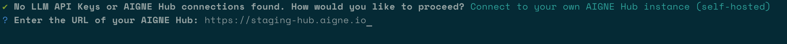
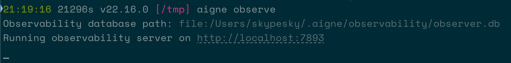
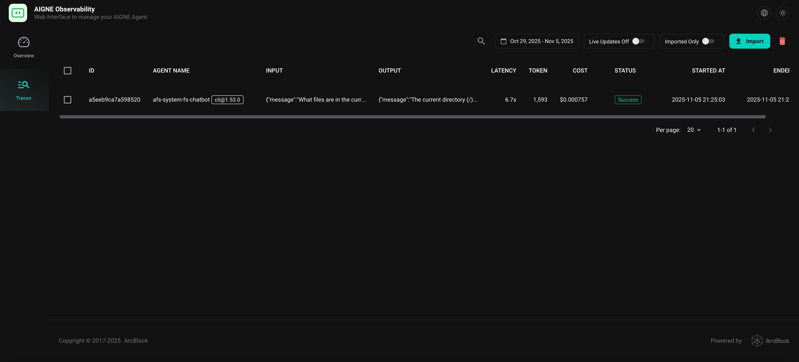

# DID Spaces 内存

本指南演示了如何使用 DID Spaces 构建一个具有持久化内存的聊天机器人。通过利用 AIGNE 框架中的 `DIDSpacesMemory` 插件，您的 Agent 能够以去中心化且安全的方式跨多个会话保留对话历史。

## 前提条件

在开始之前，请确保您已安装并配置好以下各项：

*   **Node.js**：版本 20.0 或更高。
*   **npm**：随 Node.js 一同安装。
*   **OpenAI API 密钥**：用于连接语言模型。您可以从 [OpenAI Platform](https://platform.openai.com/api-keys) 获取。
*   **DID Spaces 凭证**：内存持久化所必需。

## 快速入门

您可以使用 `npx` 直接运行此示例，无需任何本地安装。

### 1. 运行示例

在您的终端中执行以下命令：

```bash 运行 memory-did-spaces 示例 icon=lucide:terminal
npx -y @aigne/example-memory-did-spaces
```

### 2. 连接 AI 模型

首次运行时，由于尚未配置任何 API 密钥，CLI 将提示您连接到一个 AI 模型。



您有以下几种选择：

*   **通过官方 AIGNE Hub 连接（推荐）**
    这是最简单的入门方式。选择此选项将会在您的网页浏览器中打开官方 AIGNE Hub 的认证页面。按照屏幕上的说明连接您的钱包。新用户将自动获得 400,000 个 token 的欢迎奖励。

    

*   **通过自托管的 AIGNE Hub 连接**
    如果您有自己的 AIGNE Hub 实例，请选择此选项。系统将提示您输入自托管 Hub 的 URL 以完成连接。您可以从 [Blocklet Store](https://store.blocklet.dev/blocklets/z8ia3xzq2tMq8CRHfaXj1BTYJyYnEcHbqP8cJ) 部署您自己的 AIGNE Hub。

    

*   **通过第三方模型提供商连接**
    您也可以直接连接到第三方提供商，如 OpenAI、DeepSeek 或 Google Gemini。为此，您需要将提供商的 API 密钥设置为环境变量。例如，要使用 OpenAI，请设置 `OPENAI_API_KEY` 变量：

    ```bash 在此处设置您的 OpenAI API 密钥 icon=lucide:terminal
    export OPENAI_API_KEY="YOUR_OPENAI_API_KEY"
    ```

    设置环境变量后，再次运行 `npx` 命令。

## 本地安装与执行

如果您倾向于从源代码运行示例，请按照以下步骤操作。

### 1. 克隆仓库

首先，从 GitHub 克隆 AIGNE 框架的仓库：

```bash icon=lucide:terminal
git clone https://github.com/AIGNE-io/aigne-framework
```

### 2. 安装依赖

导航至示例目录，并使用 `pnpm` 安装所需依赖：

```bash icon=lucide:terminal
cd aigne-framework/examples/memory-did-spaces
pnpm install
```

### 3. 运行示例

最后，启动示例：

```bash icon=lucide:terminal
pnpm start
```

该脚本将执行三个测试，以演示内存功能：存储用户个人资料、回忆偏好，以及根据存储的数据创建投资组合。结果将显示在控制台中，并保存到一个 Markdown 报告文件中供您查阅。

## 工作原理

本示例使用了 `@aigne/agent-library` 包中的 `DIDSpacesMemory` 插件。该插件通过将对话历史存储在 DID Spaces（一种去中心化的个人数据存储解决方案）中，使 Agent 能够持久化对话历史。

主要功能包括：
*   **去中心化持久性**：对话被安全地存储在用户的 DID Space 中。
*   **会话连续性**：聊天机器人可以回忆起先前交互中的信息，即使在重启后也能做到。
*   **隐私与安全**：用户数据使用去中心化标识符（DID）技术进行管理，确保了隐私和用户控制权。

该示例通过存储用户个人资料详情，在新的交互中回忆这些信息，并利用这些记住的上下文来提供个性化推荐，从而展示了这一功能。

## 配置

虽然该示例为了演示目的预先配置了一个 DID Spaces 端点，但在生产应用中，您需要更新配置。这包括设置您自己的 DID Spaces 实例，并在代码中提供正确的 URL 和认证凭证。

```typescript memory-config.ts
import { DIDSpacesMemory } from '@aigne/agent-library';

const memory = new DIDSpacesMemory({
  url: "YOUR_DID_SPACES_URL",
  auth: {
    authorization: "Bearer YOUR_TOKEN",
  },
});
```

请将 `"YOUR_DID_SPACES_URL"` 和 `"Bearer YOUR_TOKEN"` 替换为您的实际端点和认证令牌。

## 使用 AIGNE Observe 进行调试

要监控和调试您的 Agent 执行情况，您可以使用 `aigne observe` 命令。该工具会启动一个本地 Web 服务器，提供 Agent 追踪的详细视图，帮助您了解其行为、诊断问题并优化性能。

要启动观察服务器，请运行：

```bash icon=lucide:terminal
aigne observe
```



运行后，您可以在浏览器中打开提供的 URL（默认为 `http://localhost:7893`），查看最近的 Agent 执行列表并检查其详细信息。



## 总结

本示例演示了如何使用 `DIDSpacesMemory` 插件将去中心化的持久内存集成到 AI Agent 中。此功能使您能够创建更复杂、更具上下文感知能力的聊天机器人，这些机器人能够跨会话记住用户交互。

要了解更多相关概念，请参阅以下文档：
<x-cards data-columns="2">
  <x-card data-title="内存" data-href="/developer-guide/core-concepts/memory" data-icon="lucide:brain-circuit">
   了解 AIGNE 框架中 Agent 内存的核心概念。
  </x-card>
  <x-card data-title="文件系统内存" data-href="/examples/memory" data-icon="lucide:folder">
   探索另一个使用本地文件系统进行内存持久化的示例。
  </x-card>
</x-cards>