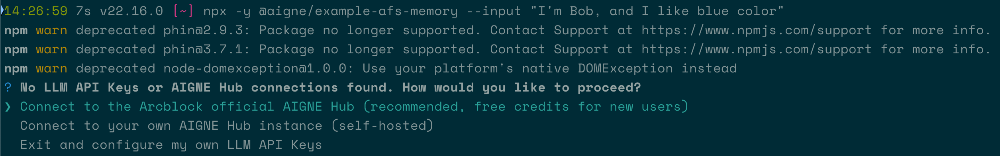
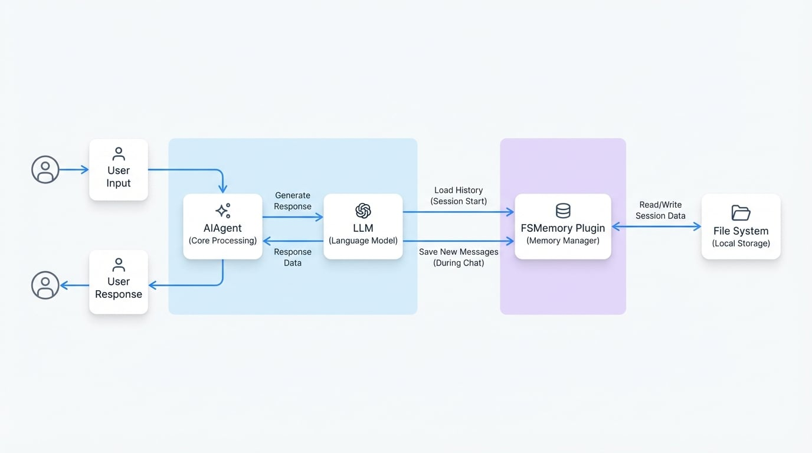

# メモリ

このガイドでは、セッションをまたいで会話履歴を保持するステートフルなチャットボットを構築する方法を説明します。`FSMemory` プラグインを活用することで、Agent はセッションデータをローカルファイルシステムに永続化でき、以前の対話を思い出すことが可能になります。

## 概要

多くの対話型 AI アプリケーションでは、Agent が一貫性のある適切な応答を提供するために、過去の対話のコンテキストを記憶することが不可欠です。AIGNE フレームワークは、そのメモリコンポーネントを通じてこの課題に対応します。この例では、会話履歴をローカルディスクに永続化するための簡単なソリューションである `FSMemory` に焦点を当てます。

このアプローチは、外部データベースやサービスを必要とせずにローカルで状態を管理できる開発、テスト、またはアプリケーションに最適です。より高度な、または分散型の永続化については、[DIDSpacesMemory](./examples-memory-did-spaces.md) などの代替手段を検討してください。

## サンプルの実行方法

このサンプルは `npx` を使って直接実行できます。このコマンドは必要なパッケージをダウンロードし、チャットボットのスクリプトを実行します。

対話モードでチャットボットを開始するには、ターミナルで次のコマンドを実行してください。

```sh
npx -y @aigne/example-memory --chat
```

LLM API キーを設定していない場合は、簡単に始められる方法を提供する AIGNE Hub への接続を促すプロンプトが表示されます。



## コードの説明

このサンプルの核となるのは、`FSMemory` プラグインと `AIAgent` の統合です。Agent は、このメモリモジュールを使用して、特定のセッションの会話履歴を自動的に保存および取得するように設定されています。

次の図は、チャットセッション中に `AIAgent`、`FSMemory` プラグイン、およびファイルシステムがどのように相互作用するかを示しています。

<!-- DIAGRAM_IMAGE_START:architecture:16:9 -->

<!-- DIAGRAM_IMAGE_END -->

### `main.ts`

メインスクリプトは Agent を初期化し、メモリプラグインを登録して、対話ループを開始します。

```typescript main.ts icon=logos:typescript
import { AIAgent, AIGNE, FSMemory, command, define, option } from '@aigne/framework';
import { ChatOllama } from '@aigne/ollama';
import path from 'node:path';

const program = define({
  name: 'memory-chatbot',
  version: '1.0.0',
});

program(
  command({
    name: 'chat',
    description: 'Chat with the bot',
    options: [
      option({
        name: '--chat',
        description: 'Chat with the bot',
      }),
    ],
    action: async (_, { session }) => {
      const memory = new FSMemory({
        path: path.join(__dirname, '..', '.memory'),
        sessionId: session.id,
      });

      const llm = new ChatOllama({
        model: 'llama3',
      });

      const chatbot = new AIAgent({
        name: 'chatbot',
        model: llm,
        memory,
        instructions:
          'Your name is Mega. You are a helpful assistant. Please answer the user question.',
      });

      const aigne = new AIGNE({
        agents: [chatbot],
      });

      await aigne.chat(chatbot, {
        endOfStream: (message) => {
          if (message.type === 'end') {
            process.stdout.write('\n');
          }
          if (message.type === 'chunk') {
            process.stdout.write(message.payload.content);
          }
        },
      });
    },
  })
);

program.run();
```

スクリプトの主要なコンポーネント：

1.  **モジュールのインポート**: AIGNE フレームワークから `AIAgent`、`AIGNE`、`FSMemory` をインポートします。
2.  **`FSMemory` の初期化**: `FSMemory` のインスタンスが作成されます。
    *   `path`: 会話ログが保存されるディレクトリ (`.memory`) を指定します。
    *   `sessionId`: 会話セッションの一意の識別子。これにより、異なるチャットセッションの履歴が別々に保存されることが保証されます。
3.  **`AIAgent` の設定**: `chatbot` Agent がインスタンス化されます。
    *   `model`: 応答の生成に使用される言語モデル。
    *   `memory`: `FSMemory` インスタンスが Agent のコンストラクタに渡されます。これにより、Agent が永続化レイヤーにリンクされます。
    *   `instructions`: Agent のペルソナと目的を定義するシステムプロンプト。
4.  **チャットの実行**: `aigne.chat()` メソッドが対話セッションを開始します。フレームワークは、セッション開始時に `FSMemory` から過去のメッセージを自動的にロードし、会話が進むにつれて新しいメッセージを保存します。

## まとめ

この例では、`FSMemory` プラグインを使用して永続的なメモリを持つチャットボットを作成する方法を学びました。これにより、Agent はローカルファイルシステムから会話履歴を保存・取得することで、複数の対話にわたってコンテキストを維持できます。この基本的な概念は、より高度で文脈を意識した AI アプリケーションを構築するための鍵となります。