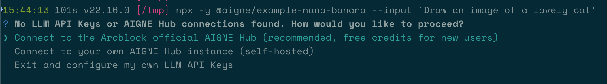

# Nano Banana

本指南將示範如何建構並執行一個能夠生成圖片的聊天機器人。透過遵循這些步驟，您將學習如何執行一個預先建置的 AIGNE 範例、將其連接到 AI 模型，並使用框架的可觀測性工具來檢視其行為。

## 先決條件

在繼續之前，請確保滿足以下要求：

*   **Node.js：** 必須安裝 20.0 或更高版本。您可以從 [nodejs.org](https://nodejs.org) 下載。
*   **OpenAI API 金鑰：** 需要來自 [OpenAI](https://platform.openai.com/api-keys) 的 API 金鑰才能與其圖片生成模型互動。

## 快速入門

您可以使用 `npx` 直接執行此範例，無需在本機安裝。

### 執行範例

在您的終端機中執行以下命令，以單一輸入執行聊天機器人。此命令將下載並執行範例套件。

```bash 以單一輸入執行 icon=lucide:terminal
npx -y @aigne/example-nano-banana --input 'Draw an image of a lovely cat'
```

若要啟動一個互動式會話，讓您可以與聊天機器人進行對話，請使用 `--chat` 旗標。

```bash 以互動模式執行 icon=lucide:terminal
npx -y @aigne/example-nano-banana --chat
```

### 連接到 AI 模型

首次執行時，應用程式會偵測到沒有配置 AI 模型，並會提示您連接一個。



您有三個主要選項來連接 AI 模型：

#### 1. 透過官方 AIGNE Hub 連接 (建議)

這是最簡單的方法。選擇此選項將打開您的網頁瀏覽器，並引導您在官方 AIGNE Hub 上完成授權過程。新用戶會收到免費的 token 分配，以便立即開始使用。


#### 2. 透過自行託管的 AIGNE Hub 連接

如果您營運自己的 AIGNE Hub 實例，請選擇此選項。系統會提示您輸入自行託管的 Hub 的 URL 以完成連接。您可以從 [Blocklet Store](https://store.blocklet.dev/blocklets/z8ia3xzq2tMq8CRHfaXj1BTYJyYnEcHbqP8cJ) 部署您自己的 AIGNE Hub。


#### 3. 透過第三方模型供應商連接

您可以透過將必要的 API 金鑰配置為環境變數，直接連接到像 OpenAI 這樣的第三方供應商。例如，若要使用 OpenAI，請在您的終端機中設定 `OPENAI_API_KEY` 變數。

```bash 設定 OpenAI API 金鑰 icon=lucide:terminal
export OPENAI_API_KEY="your-openai-api-key-here"
```

設定環境變數後，再次執行 `npx` 命令。有關不同模型供應商支援的變數的完整列表，請參閱原始碼儲存庫中的範例環境檔案。

### 使用可觀測性 UI 進行偵錯

AIGNE 框架包含一個內建的可觀測性工具，可幫助您監控和偵錯您的 Agent。`aigne observe` 命令會啟動一個本機網頁伺服器，提供 Agent 執行追蹤的詳細視圖。

首先，在您的終端機中執行以下命令來啟動觀測伺服器：

```bash 啟動可觀測性伺服器 icon=lucide:terminal
aigne observe
```


伺服器執行後，您可以在瀏覽器中打開提供的 URL（通常是 `http://localhost:7893`）來查看最近的 Agent 執行列表。此介面可讓您檢查每個追蹤的輸入、輸出、延遲和 token 使用情況，為偵錯和最佳化提供關鍵見解。


## 本機安裝與執行

出於開發目的，您可能偏好複製儲存庫並在本機執行範例。

### 1. 複製儲存庫

從 GitHub 複製官方 AIGNE 框架儲存庫。

```bash 複製儲存庫 icon=lucide:terminal
git clone https://github.com/AIGNE-io/aigne-framework
```

### 2. 安裝依賴項

導覽至範例的目錄並使用 `pnpm` 安裝所需的依賴項。

```bash 安裝依賴項 icon=lucide:terminal
cd aigne-framework/examples/nano-banana
pnpm install
```

### 3. 執行範例

安裝完成後，您可以使用專案的 `package.json` 中定義的 `start` 指令碼來執行範例。

```bash 執行本機範例 icon=lucide:terminal
pnpm start
```

## 總結

本文件提供了執行「Nano Banana」範例的逐步指南，該範例展示了一個具有圖片生成功能的人工智慧聊天機器人。您已經學會了如何使用 `npx` 直接執行範例、連接各種 AI 模型供應商，以及使用 `aigne observe` 命令來偵錯 Agent 行為。

有關更進階的用例和對框架功能的更深入了解，請參閱以下部分：

<x-cards data-columns="2">
  <x-card data-title="Image Agent" data-icon="lucide:image" data-href="/developer-guide/agents/image-agent">
    了解如何配置和使用用於圖片生成的 Agent。
  </x-card>
  <x-card data-title="AI Agent" data-icon="lucide:bot" data-href="/developer-guide/agents/ai-agent">
    探索與語言模型互動的主要 Agent。
  </x-card>
</x-cards>