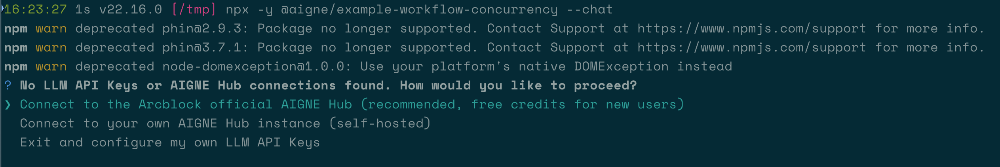

# ワークフローの並行処理

タスクを並列実行することで、複雑なワークフローの効率を大幅に向上させることができます。このガイドでは、AIGNE フレームワークを使用して並行ワークフローを構築する方法を示します。このワークフローでは、複数の Agent が同時に同じ入力を処理し、その出力が集約されます。製品を異なる視点から同時に分析する実践的な例を設定し、実行する方法を学びます。

## 概要

この例では、製品説明を入力として受け取るワークフローを構築します。その後、2つの専門 Agent が並行して動作します。

1.  **特徴抽出 Agent (Feature Extractor)**: 説明を分析して、主要な製品特徴を特定し、要約します。
2.  **オーディエンス分析 Agent (Audience Analyzer)**: 同じ説明を分析して、ターゲットオーディエンスを決定します。

最後に、**アグリゲーター (Aggregator)** が両方の Agent からの出力を1つの統合された結果にまとめます。この並列処理モデルは、独立したサブタスクに分割できるタスクに最適であり、総実行時間を短縮します。

以下の図は、この並行ワークフローを示しています。

```d2
direction: down

Input: {
  label: "製品説明"
  shape: oval
}

Parallel-Processing: {
  label: "並列処理"
  style.stroke-dash: 2

  Feature-Extractor: {
    label: "特徴抽出 Agent\n(Agent 1)"
  }

  Audience-Analyzer: {
    label: "オーディエンス分析 Agent\n(Agent 2)"
  }
}

Aggregator: {
  label: "アグリゲーター"
}

Result: {
  label: "統合結果"
  shape: oval
}

Input -> Parallel-Processing.Feature-Extractor: "特徴を分析"
Input -> Parallel-Processing.Audience-Analyzer: "オーディエンスを分析"
Parallel-Processing.Feature-Extractor -> Aggregator: "特徴の要約"
Parallel-Processing.Audience-Analyzer -> Aggregator: "オーディエンスのプロファイル"
Aggregator -> Result
```

## 前提条件

先に進む前に、開発環境が以下の要件を満たしていることを確認してください。
*   **Node.js**: バージョン 20.0 以降。
*   **npm**: Node.js に同梱されています。
*   **OpenAI API キー**: OpenAI モデルに接続するために必要です。[OpenAI Platform](https://platform.openai.com/api-keys) から取得できます。

## クイックスタート

`npx` を使用して、インストールなしでこの例を直接実行できます。

### 例を実行する

ターミナルで以下のコマンドを実行して、さまざまなモードでワークフローを実行します。

*   **ワンショットモード (デフォルト)**: 事前に定義された単一の入力を処理して終了します。

    ```bash icon=lucide:terminal
    npx -y @aigne/example-workflow-concurrency
    ```

*   **インタラクティブチャットモード**: 複数の入力を提供できるチャットセッションを開始します。

    ```bash icon=lucide:terminal
    npx -y @aigne/example-workflow-concurrency --chat
    ```

*   **パイプラインモード**: 別のコマンドからパイプされた入力を使用します。

    ```bash icon=lucide:terminal
    echo "Analyze product: Smart home assistant with voice control and AI learning capabilities" | npx -y @aigne/example-workflow-concurrency
    ```

### AI モデルに接続する

この例を初めて実行すると、API キーが設定されていないため、AI モデルプロバイダーに接続するように求められます。



続行するにはいくつかのオプションがあります。

1.  **公式 AIGNE Hub 経由で接続する (推奨)**

    これが最も簡単に始める方法です。新規ユーザーは無料クレジットを受け取れます。最初のオプションを選択すると、ブラウザが AIGNE Hub の認証ページに開きます。画面の指示に従って接続を承認してください。

    

2.  **セルフホストの AIGNE Hub 経由で接続する**

    独自の AIGNE Hub インスタンスをお持ちの場合は、2番目のオプションを選択してください。接続を完了するために、セルフホスト Hub の URL を入力するように求められます。

    

3.  **サードパーティのモデルプロバイダー経由で接続する**

    API キーを含む環境変数を設定することで、OpenAI のようなプロバイダーに直接接続できます。例えば、OpenAI を使用するには、キーをエクスポートしてコマンドを再実行します。

    ```bash icon=lucide:terminal
    export OPENAI_API_KEY="YOUR_OPENAI_API_KEY"
    npx -y @aigne/example-workflow-concurrency --chat
    ```

## ソースからのインストール

開発やカスタマイズのために、リポジトリをクローンしてローカルで例を実行することができます。

### 1. リポジトリをクローンする

```bash icon=lucide:terminal
git clone https://github.com/AIGNE-io/aigne-framework
```

### 2. 依存関係をインストールする

例のディレクトリに移動し、pnpm を使用して必要なパッケージをインストールします。

```bash icon=lucide:terminal
cd aigne-framework/examples/workflow-concurrency
pnpm install
```

### 3. 例を実行する

`pnpm start` コマンドを使用してワークフローを実行します。コマンドライン引数は `--` の後に渡す必要があります。

*   **ワンショットモードで実行:**

    ```bash icon=lucide:terminal
    pnpm start
    ```

*   **インタラクティブチャットモードで実行:**

    ```bash icon=lucide:terminal
    pnpm start -- --chat
    ```

*   **パイプライン入力を使用:**

    ```bash icon=lucide:terminal
    echo "Analyze product: Smart home assistant with voice control and AI learning capabilities" | pnpm start
    ```

## 実行オプション

このアプリケーションは、カスタマイズのためにいくつかのコマンドラインパラメータをサポートしています。

| パラメータ | 説明 | デフォルト |
|-----------|-------------|---------|
| `--chat` | インタラクティブチャットモードで実行します。 | 無効 (ワンショットモード) |
| `--model <provider[:model]>` | 使用する AI モデルを指定します (例: `openai` または `openai:gpt-4o-mini`)。 | `openai` |
| `--temperature <value>` | モデル生成の temperature を設定します。 | プロバイダーのデフォルト |
| `--top-p <value>` | top-p サンプリング値を設定します。 | プロバイダーのデフォルト |
| `--presence-penalty <value>` | presence penalty 値を設定します。 | プロバイダーのデフォルト |
| `--frequency-penalty <value>` | frequency penalty 値を設定します。 | プロバイダーのデフォルト |
| `--log-level <level>` | ログレベル (`ERROR`, `WARN`, `INFO`, `DEBUG`, `TRACE`) を設定します。 | `INFO` |
| `--input`, `-i <input>` | コマンドライン経由で直接入力を指定します。 | なし |

## コード例

以下の TypeScript コードは、`TeamAgent` と `ProcessMode.parallel` を使用して、並行ワークフローを定義し、オーケストレーションする方法を示しています。

```typescript concurrency-workflow.ts
import { AIAgent, AIGNE, ProcessMode, TeamAgent } from "@aigne/core";
import { OpenAIChatModel } from "@aigne/core/models/openai-chat-model.js";

const { OPENAI_API_KEY } = process.env;

// AI モデルを初期化する
const model = new OpenAIChatModel({
  apiKey: OPENAI_API_KEY,
});

// 製品の特徴を抽出する最初の Agent を定義する
const featureExtractor = AIAgent.from({
  instructions: `\
You are a product analyst. Extract and summarize the key features of the product.\n\nProduct description:\n{{product}}`,
  outputKey: "features",
});

// ターゲットオーディエンスを分析する2番目の Agent を定義する
const audienceAnalyzer = AIAgent.from({
  instructions: `\
You are a market researcher. Identify the target audience for the product.\n\nProduct description:\n{{product}}`,
  outputKey: "audience",
});

// AIGNE インスタンスを初期化する
const aigne = new AIGNE({ model });

// 並列ワークフローを管理するために TeamAgent を作成する
const teamAgent = TeamAgent.from({
  skills: [featureExtractor, audienceAnalyzer],
  mode: ProcessMode.parallel,
});

// 製品説明でチームを呼び出す
const result = await aigne.invoke(teamAgent, {
  product: "AIGNE is a No-code Generative AI Apps Engine",
});

console.log(result);

/*
期待される出力:
{
  features: "**Product Name:** AIGNE\n\n**Product Type:** No-code Generative AI Apps Engine\n\n...",
  audience: "**Small to Medium Enterprises (SMEs)**: \n   - Businesses that may not have extensive IT resources or budget for app development but are looking to leverage AI to enhance their operations or customer engagement.\n\n...",
}
*/
```

## デバッグ

AIGNE フレームワークには、Agent の実行を監視およびデバッグするのに役立つ、組み込みのオブザーバビリティツールが含まれています。

オブザーバビリティサーバーを起動するには、以下を実行します。

```bash icon=lucide:terminal
aigne observe
```


このコマンドは、通常 `http://localhost:7893` でローカルウェブサーバーを起動します。ブラウザでこの URL を開くと、オブザーバビリティインターフェースにアクセスでき、入力、出力、パフォーマンスメトリクスを含む各 Agent の実行の詳細なトレースを検査できます。


## まとめ

このガイドでは、AIGNE フレームワークを使用して並行ワークフローを作成し、実行する方法について説明しました。並列モードで `TeamAgent` を活用することで、複数の独立したタスクを同時に効率的に処理できます。他のワークフローパターンを調べるには、以下の例を参照してください。

<x-cards data-columns="2">
  <x-card data-title="シーケンシャルワークフロー" data-icon="lucide:arrow-right-circle" data-href="/examples/workflow-sequential">
    Agent を特定の順序で実行する方法を学びます。
  </x-card>
  <x-card data-title="ワークフローオーケストレーション" data-icon="lucide:milestone" data-href="/examples/workflow-orchestration">
    より複雑で洗練されたパイプラインで複数の Agent を調整します。
  </x-card>
</x-cards>