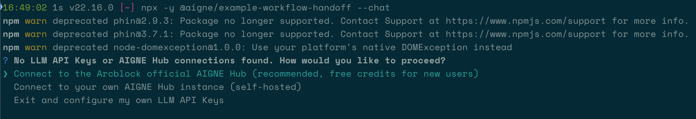

# 工作流程交接

本指南將示範如何建立一個工作流程，讓一個 Agent 可以無縫地將控制權交接給另一個專門的 Agent。讀完本指南後，您將了解如何建立多 Agent 系統，該系統能根據使用者輸入來委派任務，從而實現更複雜和動態的問題解決方案。

## 概覽

在許多複雜的 AI 應用程式中，單一 Agent 可能不具備處理各種任務所需的所有技能。工作流程交接模式透過允許一個主要 Agent 充當調度員來解決此問題，當滿足特定觸發條件時，將控制權轉移給一個專門的 Agent。這創造了一個無縫的過渡，使不同的 Agent 能夠協作解決複雜問題。

此範例實作了一個簡單的交接：
*   **Agent A：** 一個通用目的的 Agent。
*   **Agent B：** 一個只用俳句（Haikus）溝通的專門 Agent。

當使用者指示 Agent A「轉接給 Agent B」時，系統會無縫地將對話交接給 Agent B 進行所有後續的互動。

```d2
shape: sequence_diagram

User: {
  shape: c4-person
}

AIGNE-Framework: {
  label: "AIGNE 框架"
}

Agent-A: {
  label: "Agent A\n(通用目的)"
}

Agent-B: {
  label: "Agent B\n(俳句專家)"
}

User -> AIGNE-Framework: "1. '轉接給 agent b'"
AIGNE-Framework -> Agent-A: "2. 使用輸入進行叫用"
Agent-A -> Agent-A: "3. 執行技能：transfer_to_b()"
Agent-A -> AIGNE-Framework: "4. 回傳 Agent B 物件"
AIGNE-Framework -> AIGNE-Framework: "5. 交接：用 B 取代 Agent A"
AIGNE-Framework -> Agent-B: "6. 叫用 Agent B 以取得回應"
Agent-B -> AIGNE-Framework: "7. 產生俳句回應"
AIGNE-Framework -> User: "8. 顯示 Agent B 的回應"

User -> AIGNE-Framework: "9. '真是美好的一天'"
AIGNE-Framework -> Agent-B: "10. 使用新輸入進行叫用"
Agent-B -> AIGNE-Framework: "11. 產生另一首俳句"
AIGNE-Framework -> User: "12. 顯示 Agent B 的回應"
```

## 先決條件

在執行此範例之前，請確保您的開發環境符合以下要求：

*   **Node.js：** 20.0 或更高版本。
*   **npm：** 隨 Node.js 一起提供。
*   **AI 模型提供商帳戶：** 需要來自像 OpenAI 這類提供商的 API 金鑰來驅動 Agent。

## 快速入門

您可以使用 `npx` 直接執行此範例，而無需複製儲存庫。

### 步驟 1：執行範例

開啟您的終端機並執行以下指令之一。`--chat` 旗標會啟用一個互動式會話，您可以在其中進行連續對話。

```bash 以單次模式執行 icon=lucide:terminal
npx -y @aigne/example-workflow-handoff
```

```bash 以互動式聊天模式執行 icon=lucide:terminal
npx -y @aigne/example-workflow-handoff --chat
```

您也可以直接將輸入透過管道傳送至指令：

```bash 使用管道輸入 icon=lucide:terminal
echo "transfer to agent b" | npx -y @aigne/example-workflow-handoff
```

### 步驟 2：連接到 AI 模型

如果您是第一次執行此範例，由於尚未設定任何 API 金鑰，系統會提示您連接到 AI 模型。



您有以下幾個選項可以繼續：

1.  **連接到 AIGNE Hub (建議)**
    這是最簡單的入門方式。官方 AIGNE Hub 為新使用者提供免費點數。選擇第一個選項，您的瀏覽器將開啟一個頁面以授權連接。

    

2.  **連接到自行託管的 AIGNE Hub**
    如果您有自己的 AIGNE Hub 實例，請選擇第二個選項並輸入其 URL 進行連接。

    

3.  **設定第三方模型提供商**
    您可以透過設定適當的環境變數，直接連接到像 OpenAI、DeepSeek 或 Google Gemini 這樣的提供商。例如，要使用 OpenAI，請在終端機中設定您的 API 金鑰：

    ```bash 設定 OpenAI API 金鑰 icon=lucide:terminal
    export OPENAI_API_KEY="YOUR_OPENAI_API_KEY"
    ```

    設定好環境變數後，再次執行 `npx` 指令。

## 程式碼深入解析

此範例的核心是一個作為第一個 Agent「技能」的函式。當模型根據使用者輸入判斷應使用此技能時，該函式會回傳一個新的 Agent，從而有效地轉移控制權。

### 運作方式

1.  **Agent A (調度員)：** 此 Agent 設定了 `transfer_to_b` 技能。其指令是通用的。
2.  **Agent B (專家)：** 此 Agent 有一個非常具體的指令：「只用俳句說話。」它沒有特殊技能。
3.  **交接機制：** `transfer_to_b` 函式只會回傳 `agentB` 物件。當 AIGNE 框架收到一個 Agent 物件作為技能執行的結果時，它會將會話中的當前 Agent 替換為新的 Agent。

### 範例實作

以下程式碼示範了如何定義兩個 Agent 並實作交接邏輯。

```typescript index.ts icon=logos:typescript
import { AIAgent, AIGNE } from "@aigne/core";
import { OpenAIChatModel } from "@aigne/core/models/openai-chat-model.js";

const { OPENAI_API_KEY } = process.env;

// 1. 初始化 AI 模型
const model = new OpenAIChatModel({
  apiKey: OPENAI_API_KEY,
});

// 2. 定義執行交接的技能
function transfer_to_b() {
  return agentB;
}

// 3. 定義帶有交接技能的 Agent A
const agentA = AIAgent.from({
  name: "AgentA",
  instructions: "你是一個有用的 Agent。",
  outputKey: "A",
  skills: [transfer_to_b],
});

// 4. 定義專家 Agent B
const agentB = AIAgent.from({
  name: "AgentB",
  instructions: "只用俳句說話。",
  outputKey: "B",
});

// 5. 初始化 AIGNE 執行環境
const aigne = new AIGNE({ model });

// 6. 使用 Agent A 啟動會話
const userAgent = aigne.invoke(agentA);

// 7. 第一次叫用：觸發交接
const result1 = await userAgent.invoke("transfer to agent b");
console.log(result1);
// 預期輸出：
// {
//   B: "Transfer now complete,  \nAgent B is here to help.  \nWhat do you need, friend?",
// }

// 8. 第二次叫用：現在與 Agent B 對話
const result2 = await userAgent.invoke("It's a beautiful day");
console.log(result2);
// 預期輸出：
// {
//   B: "Sunshine warms the earth,  \nGentle breeze whispers softly,  \nNature sings with joy.  ",
// }
```

## 從原始碼執行 (選用)

如果您希望在本地修改或檢查程式碼，請按照以下步驟操作。

### 1. 複製儲存庫

```bash icon=lucide:terminal
git clone https://github.com/AIGNE-io/aigne-framework
```

### 2. 安裝依賴項

導覽至範例目錄並使用 `pnpm` 安裝必要的套件。

```bash icon=lucide:terminal
cd aigne-framework/examples/workflow-handoff
pnpm install
```

### 3. 執行範例

使用 `pnpm start` 指令。要傳遞額外的參數（如 `--chat`），請在它們前面加上一個額外的 `--`。

```bash 以單次模式執行 icon=lucide:terminal
pnpm start
```

```bash 以互動式聊天模式執行 icon=lucide:terminal
pnpm start -- --chat
```

## 命令列選項

此範例指令稿接受數個命令列參數來自訂其行為。

| 參數 | 說明 | 預設值 |
|-----------|-------------|---------|
| `--chat` | 以互動式聊天模式執行。 | 停用 |
| `--model <provider[:model]>` | 要使用的 AI 模型（例如 `openai` 或 `openai:gpt-4o-mini`）。 | `openai` |
| `--temperature <value>` | 模型生成的溫度值。 | 提供商預設值 |
| `--top-p <value>` | Top-p 取樣值。 | 提供商預設值 |
| `--presence-penalty <value>` | 存在懲罰值。 | 提供商預設值 |
| `--frequency-penalty <value>` | 頻率懲罰值。 | 提供商預設值 |
| `--log-level <level>` | 設定日誌記錄層級（ERROR, WARN, INFO, DEBUG, TRACE）。 | INFO |
| `--input`, `-i <input>` | 直接透過命令列指定輸入。 | 無 |

## 偵錯與觀察

要檢查 Agent 的執行流程，您可以使用 `aigne observe` 指令。此工具會啟動一個本地 Web 伺服器，提供追蹤、呼叫和其他執行時期資料的詳細檢視，這對於偵錯非常有價值。

首先，在一個單獨的終端機中啟動觀察伺服器：

```bash 啟動觀察伺服器 icon=lucide:terminal
aigne observe
```


執行範例後，您可以在 Web 介面中查看執行追蹤，該介面通常位於 `http://localhost:7893`。


## 總結

您現在已經學會如何實作工作流程交接，這是一種強大的模式，用於建構將任務委派給專門 Agent 的多 Agent 系統。這種方法讓您可以透過組合具有不同技能的 Agent 來建構更強大、更有能力的 AI 應用程式。

要探索更進階的 Agent 調度，請查看這些相關範例：

<x-cards data-columns="2">
  <x-card data-title="工作流程調度" data-icon="lucide:milestone" data-href="/examples/workflow-orchestration">協調多個 Agent 在複雜的處理流程中協同工作。</x-card>
  <x-card data-title="工作流程路由器" data-icon="lucide:git-fork" data-href="/examples/workflow-router">實作智慧路由邏輯，根據內容將請求導向適當的處理程式。</x-card>
</x-cards>