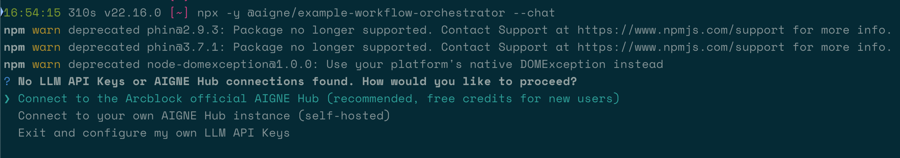

# 工作流编排

本指南将演示如何构建并运行一个复杂的工作流，该工作流能够编排多个专门的 AI Agent。您将学习如何协调像 `finder`、`writer` 和 `proofreader` 这样的 Agent，共同完成一项复杂的任务，从初步研究到最终报告生成。

## 概览

工作流编排涉及创建一个处理管道，其中多个 Agent 协作以实现共同的目标。管道中的每个 Agent 都有特定的角色，一个中央编排器负责管理它们之间的任务流和信息流。本示例展示了如何使用 AIGNE 框架构建这样一个系统，支持单次运行（one-shot）和交互式聊天两种模式。

下图展示了本示例中各 Agent 之间的关系：

```d2
direction: down

User: {
  shape: c4-person
}

OrchestratorAgent: {
  label: "Orchestrator Agent"
  shape: rectangle

  finder: {
    label: "Finder Agent"
    shape: rectangle
  }

  writer: {
    label: "Writer Agent"
    shape: rectangle
  }
}

Skills: {
  label: "技能 / 工具"
  shape: rectangle
  style: {
    stroke-dash: 2
  }

  puppeteer: {
    label: "Puppeteer\n(网页抓取)"
    shape: rectangle
  }

  filesystem: {
    label: "文件系统\n(读/写)"
    shape: cylinder
  }
}

User -> OrchestratorAgent: "1. 提交研究任务"
OrchestratorAgent -> OrchestratorAgent.finder: "2. 委派：查找信息"
OrchestratorAgent.finder -> Skills.puppeteer: "3. 抓取网页"
OrchestratorAgent.finder -> Skills.filesystem: "4. 保存发现"
OrchestratorAgent -> OrchestratorAgent.writer: "5. 委派：编写报告"
OrchestratorAgent.writer -> Skills.filesystem: "6. 写入最终报告"

```

## 前提条件

在开始之前，请确保您已安装并配置好以下各项：

*   **Node.js**：版本 20.0 或更高。
*   **npm**：随 Node.js 捆绑安装。
*   **OpenAI API 密钥**：Agent 与 OpenAI 模型交互所需。您可以从 [OpenAI Platform](https://platform.openai.com/api-keys) 获取。

从源代码运行的可选依赖项：

*   **Bun**：用于运行单元测试和示例。
*   **Pnpm**：用于包管理。

## 快速开始

您可以使用 `npx` 直接运行此示例，无需任何安装。

### 运行示例

在您的终端中执行以下命令：

```bash 在单次运行模式下运行 icon=lucide:terminal
# 在单次运行模式下运行（默认）
npx -y @aigne/example-workflow-orchestrator
```

```bash 在交互式聊天模式下运行 icon=lucide:terminal
# 在交互式聊天模式下运行
npx -y @aigne/example-workflow-orchestrator --chat
```

```bash 使用管道输入 icon=lucide:terminal
# 使用管道输入
echo "Research ArcBlock and compile a report about their products and architecture" | npx -y @aigne/example-workflow-orchestrator
```

### 连接 AI 模型

首次运行该示例时，由于尚未配置任何 API 密钥，系统将提示您连接到一个 AI 模型服务。



您有三个选项：

1.  **通过 AIGNE 官方 Hub 连接**：这是推荐给新用户的选项。选择此项将打开浏览器进入授权页面。在您批准后，CLI 将连接到 AIGNE Hub，您将获得免费的 token 以开始使用。

    

2.  **通过自托管的 AIGNE Hub 连接**：如果您有自己的 AIGNE Hub 实例，请选择此项。系统将提示您输入 Hub 的 URL 以完成连接。您可以从 [Blocklet Store](https://store.blocklet.dev/blocklets/z8ia3xzq2tMq8CRHfaXj1BTYJyYnEcHbqP8cJ) 部署一个自托管的 AIGNE Hub。

    

3.  **通过第三方模型提供商连接**：您可以直接配置来自 OpenAI 等提供商的 API 密钥。将密钥设置为环境变量，然后再次运行示例。

    ```bash 设置 OpenAI API 密钥 icon=lucide:terminal
    export OPENAI_API_KEY="YOUR_API_KEY_HERE"
    ```

    更多配置示例，请参阅代码仓库中的 `.env.local.example` 文件。

### 使用 AIGNE Observe 进行调试

`aigne observe` 命令会启动一个本地 Web 服务器，帮助您监控和分析 Agent 的执行过程。这个工具对于调试、性能调优和理解 Agent 行为非常有价值。

首先，启动观察服务器：

```bash 启动可观察性服务器 icon=lucide:terminal
aigne observe
```


服务器运行后，您可以在浏览器中打开提供的 URL（`http://localhost:7893`），查看最近的 Agent 执行轨迹列表并检查其详细信息。


## 本地安装和使用

出于开发目的，您可以克隆代码仓库并在本地运行该示例。

### 1. 克隆代码仓库

```bash 克隆代码仓库 icon=lucide:terminal
git clone https://github.com/AIGNE-io/aigne-framework
```

### 2. 安装依赖

导航到示例目录并使用 `pnpm` 安装必要的包。

```bash 安装依赖 icon=lucide:terminal
cd aigne-framework/examples/workflow-orchestrator
pnpm install
```

### 3. 运行示例

使用 `pnpm start` 命令执行工作流。

```bash 在单次运行模式下运行 icon=lucide:terminal
# 在单次运行模式下运行（默认）
pnpm start
```

```bash 在交互式聊天模式下运行 icon=lucide:terminal
# 在交互式聊天模式下运行
pnpm start -- --chat
```

```bash 使用管道输入 icon=lucide:terminal
# 使用管道输入
echo "Research ArcBlock and compile a report about their products and architecture" | pnpm start
```

## 运行选项

该脚本接受多个命令行参数以自定义其行为。

| 参数 | 描述 | 默认值 |
| ------------------------- | ------------------------------------------------------------------------------ | ------------------ |
| `--chat` | 以交互式聊天模式运行。 | 禁用 |
| `--model <provider[:model]>` | 指定要使用的 AI 模型（例如，`openai` 或 `openai:gpt-4o-mini`）。 | `openai` |
| `--temperature <value>` | 设置模型生成的温度。 | 提供商默认值 |
| `--top-p <value>` | 设置 top-p 采样值。 | 提供商默认值 |
| `--presence-penalty <value>` | 设置存在惩罚值。 | 提供商默认值 |
| `--frequency-penalty <value>` | 设置频率惩罚值。 | 提供商默认值 |
| `--log-level <level>` | 设置日志级别（例如，`ERROR`、`WARN`、`INFO`、`DEBUG`）。 | `INFO` |
| `--input`, `-i <input>` | 通过命令行直接指定输入。 | 无 |

#### 示例

```bash 在交互式聊天模式下运行 icon=lucide:terminal
# 以聊天模式运行
pnpm start -- --chat
```

```bash 设置不同的日志级别 icon=lucide:terminal
# 将日志级别设置为 DEBUG
pnpm start -- --log-level DEBUG
```

## 代码示例

以下 TypeScript 代码演示了如何定义和编排多个 Agent 来执行深入研究并编写报告。`OrchestratorAgent` 协调一个 `finder` 和一个 `writer`，它们具备浏览网页（`puppeteer`）和与本地文件系统交互的技能。

```typescript orchestrator.ts icon=logos:typescript
import { OrchestratorAgent } from "@aigne/agent-library/orchestrator/index.js";
import { AIAgent, AIGNE, MCPAgent } from "@aigne/core";
import { OpenAIChatModel } from "@aigne/core/models/openai-chat-model.js";

const { OPENAI_API_KEY } = process.env;

// 1. 初始化聊天模型
const model = new OpenAIChatModel({
  apiKey: OPENAI_API_KEY,
  modelOptions: {
    parallelToolCalls: false, // Puppeteer 一次只能运行一个任务
  },
});

// 2. 设置用于网页抓取和文件系统访问的 MCP Agent
const puppeteer = await MCPAgent.from({
  command: "npx",
  args: ["-y", "@modelcontextprotocol/server-puppeteer"],
  env: process.env as Record<string, string>,
});

const filesystem = await MCPAgent.from({
  command: "npx",
  args: ["-y", "@modelcontextprotocol/server-filesystem", import.meta.dir],
});

// 3. 定义用于研究信息的 finder Agent
const finder = AIAgent.from({
  name: "finder",
  description: "找到与用户请求最匹配的内容",
  instructions: `你是一个可以在网上查找信息的 Agent。
你的任务是找到与用户请求最匹配的内容。
你可以使用 puppeteer 抓取网页信息。
你也可以使用文件系统保存你找到的信息。

规则：
- 不要使用 puppeteer 的截图功能
- 使用 document.body.innerText 获取页面的文本内容
- 如果你想要某个页面的 URL，你应该获取当前（主）页面的所有链接及其标题，
然后你可以使用标题来搜索你想要访问的页面的 URL。
  `,
  skills: [puppeteer, filesystem],
});

// 4. 定义用于保存报告的 writer Agent
const writer = AIAgent.from({
  name: "writer",
  description: "写入文件系统",
  instructions: `你是一个可以写入文件系统的 Agent。
  你的任务是接收用户的输入，处理它，并将结果写入磁盘上的适当位置。`,
  skills: [filesystem],
});

// 5. 创建用于管理工作流的 orchestrator Agent
const agent = OrchestratorAgent.from({
  skills: [finder, writer],
  maxIterations: 3,
  tasksConcurrency: 1, // Puppeteer 一次只能运行一个任务
});

// 6. 初始化 AIGNE 实例
const aigne = new AIGNE({ model });

// 7. 使用详细提示调用工作流
const result = await aigne.invoke(
  agent,
  `\
仅使用官方网站对 ArcBlock 进行深入研究\
（避免使用搜索引擎或第三方来源），并编写一份详细报告，保存为 arcblock.md。 \
报告应包括对公司产品（附有详细的研究发现和链接）、技术架构和未来计划的全面见解。`,
);
console.log(result);
```

执行后，此工作流会生成一个详细的 Markdown 文件。您可以在这里查看生成输出的示例：[arcblock-deep-research.md](https://github.com/AIGNE-io/aigne-framework/blob/main/examples/workflow-orchestrator/generated-report-arcblock.md)。

## 总结

本示例展示了 AIGNE 框架在构建复杂的多 Agent 工作流方面的强大能力。通过定义专门的 Agent 并使用编排器进行协调，您可以自动化需要多个步骤的复杂任务，例如研究、内容生成和文件操作。

要了解更多高级工作流模式的示例，请浏览以下部分：

<x-cards data-columns="2">
  <x-card data-title="顺序工作流" data-icon="lucide:arrow-right-circle" data-href="/examples/workflow-sequential">
    构建 Agent 严格按步骤顺序执行任务的管道。
  </x-card>
  <x-card data-title="并发工作流" data-icon="lucide:git-fork" data-href="/examples/workflow-concurrency">
    同时处理多个任务以提高性能和效率。
  </x-card>
  <x-card data-title="Agent 移交" data-icon="lucide:arrow-right-left" data-href="/examples/workflow-handoff">
    创建无缝过渡，让一个 Agent 将其输出传递给另一个 Agent 进行进一步处理。
  </x-card>
  <x-card data-title="群聊" data-icon="lucide:users" data-href="/examples/workflow-group-chat">
    使多个 Agent 能够在共享环境中协作和交流。
  </x-card>
</x-cards>