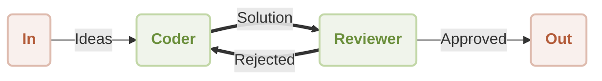

# ワークフローリフレクション

AI にコンテンツを生成させるだけでなく、自身の成果物を批評し改善させたいと思ったことはありませんか？このガイドでは、ある Agent の出力を別の Agent がレビューして改良する、自己修正ワークフローの構築方法を解説します。これらの手順に従うことで、AIGNE フレームワークを使用してこの強力な反復パターンを実装する方法を学びます。

この例では、`Coder` と `Reviewer` という 2 つの異なる Agent を持つワークフローを確立します。`Coder` Agent はユーザーのリクエストを解決するためのコードを作成する責任を負い、`Reviewer` Agent はそのコードを評価します。`Reviewer` がコードを不十分だと判断した場合、建設的なフィードバックを提供し、修正のために `Coder` に送り返します。これにより、出力が必要な基準を満たすまで継続的な改善のループが生まれます。

以下の図は、このプロセスを示しています。



## 前提条件

この例を正常に実行するには、開発環境が以下の基準を満たしている必要があります。

*   **Node.js**: バージョン 20.0 以上。
*   **npm**: Node.js のインストールに含まれています。
*   **OpenAI API キー**: この例が OpenAI モデルと通信するために API キーが必要です。[OpenAI Platform](https://platform.openai.com/api-keys) から取得できます。

## クイックスタート

この例は、ローカルへのインストールを必要とせず、`npx` を使用してコマンドラインから直接実行できます。

### 例の実行

ターミナルを開き、以下のいずれかのコマンドを使用してワークフローを実行します。

単一のリクエストを処理して終了する、デフォルトのワンショットモードで実行するには：
```bash npx command icon=lucide:terminal
npx -y @aigne/example-workflow-reflection
```

インタラクティブセッションに参加するには、`--chat` フラグを使用します：
```bash npx command icon=lucide:terminal
npx -y @aigne/example-workflow-reflection --chat
```

コマンドに直接入力をパイプすることもできます：
```bash npx command icon=lucide:terminal
echo "Write a function to validate email addresses" | npx -y @aigne/example-workflow-reflection
```

### AI モデルへの接続

初回実行時、API キーがまだ設定されていないため、アプリケーションは AI モデルへの接続を設定するように求めます。

```d2
direction: down

In: {
  shape: oval
}

Out: {
  shape: oval
}

Coder: {
  shape: rectangle
}

Reviewer: {
  shape: rectangle
}

In -> Coder: "Ideas"
Coder -> Reviewer: "Solution"
Reviewer -> Out: "Approved"
Reviewer -> Coder: "Rejected"
```

以下のオプションが表示されます：

#### 1. 公式 AIGNE Hub 経由で接続 (推奨)

これが最も簡単な方法です。新規ユーザーには、すぐに始められる無料クレジットが付与されます。

1.  最初のオプション `Connect to the Arcblock official AIGNE Hub` を選択します。
2.  デフォルトのウェブブラウザで新しいタブが開き、認証ページが表示されます。
3.  画面の指示に従い、接続リクエストを承認します。


#### 2. セルフホストの AIGNE Hub 経由で接続

あなたやあなたの組織がプライベートな AIGNE Hub インスタンスを運用している場合は、以下の手順に従ってください：

1.  2 番目のオプション `Connect to a self-hosted AIGNE Hub` を選択します。
2.  プロンプトが表示されたら、セルフホストの AIGNE Hub インスタンスの URL を入力します。
3.  画面の指示に従って接続を完了します。


#### 3. サードパーティのモデルプロバイダー経由で接続

適切な API キーを環境変数として設定することで、OpenAI などのサードパーティ LLM プロバイダーに直接接続できます。

例えば、OpenAI モデルを使用するには、ターミナルで `OPENAI_API_KEY` 環境変数を設定します：
```bash OpenAI API キーを設定 icon=lucide:terminal
export OPENAI_API_KEY="YOUR_OPENAI_API_KEY"
```

`"YOUR_OPENAI_API_KEY"` を実際のキーに置き換えてください。環境変数を設定したら、`npx` コマンドを再度実行します。Google Gemini や DeepSeek などの他のプロバイダーの設定方法については、ソースコードに含まれる `.env.local.example` ファイルを参照してください。

## ソースからのインストール

コードを確認したりカスタマイズしたい開発者のために、リポジトリをクローンしてローカルで例を実行することができます。

### 1. リポジトリのクローン

```bash リポジトリをクローン icon=lucide:terminal
git clone https://github.com/AIGNE-io/aigne-framework
```

### 2. 依存関係のインストール

例のディレクトリに移動し、`pnpm` を使用して必要なパッケージをインストールします。

```bash 依存関係をインストール icon=lucide:terminal
cd aigne-framework/examples/workflow-reflection
pnpm install
```

### 3. 例の実行

`pnpm start` コマンドを使用してスクリプトを実行します。

```bash ワンショットモードで実行 icon=lucide:terminal
pnpm start
```

インタラクティブなチャットモードで実行するには、`--chat` フラグを追加します。追加の `--` は、フラグを `pnpm` 自身ではなくスクリプトに渡すために必要です。

```bash インタラクティブモードで実行 icon=lucide:terminal
pnpm start -- --chat
```

パイプライン経由で入力を提供するには：
```bash パイプライン入力で実行 icon=lucide:terminal
echo "Write a function to validate email addresses" | pnpm start
```

## 仕組み

このワークフローは、`coder` と `reviewer` という 2 つの `AIAgent` インスタンスによって編成され、これらはトピックのシステムを通じて通信します。これにより、メッセージ駆動型のステートマシンが作成されます。

1.  **初期化**：ユーザーのリクエストを含むメッセージが `UserInputTopic` に公開されると、プロセスが開始されます。
2.  **Coder Agent**：`UserInputTopic` を購読している `coder` Agent がリクエストを受け取ります。初期コードを生成し、その解決策を `review_request` トピックに公開します。
3.  **Reviewer Agent**：`reviewer` Agent は `review_request` トピックを購読します。提出されたコードを、正確性、効率性、安全性などの基準で評価します。
4.  **決定とルーティング**：
    *   コードが**承認された**場合、`reviewer` は最終的に検証された結果を `UserOutputTopic` に公開し、ワークフローを終了します。
    *   コードが**拒否された**場合、`reviewer` はフィードバックを作成し、それを `rewrite_request` トピックに公開します。
5.  **反復**：`coder` Agent は `rewrite_request` トピックも購読しています。フィードバックを受け取ると、それに応じてコードを修正し、`review_request` トピックに再提出します。これにより、承認が得られるまでサイクルが繰り返されます。

### コード実装

以下の TypeScript コードは、`coder` と `reviewer` Agent を定義し、実行するための完全な実装を提供します。

```typescript reflection-workflow.ts icon=logos:typescript
import { AIAgent, AIGNE, UserInputTopic, UserOutputTopic } from "@aigne/core";
import { OpenAIChatModel } from "@aigne/core/models/openai-chat-model.js";
import { z } from "zod";

const { OPENAI_API_KEY } = process.env;

// モデルを初期化
const model = new OpenAIChatModel({
  apiKey: OPENAI_API_KEY,
});

// Coder agent を定義
const coder = AIAgent.from({
  subscribeTopic: [UserInputTopic, "rewrite_request"],
  publishTopic: "review_request",
  instructions: `\
You are a proficient coder. You write code to solve problems.
Work with the reviewer to improve your code.
Always put all finished code in a single Markdown code block.
For example:
\`\`\`python
def hello_world():
    print("Hello, World!")
\`\`\`

Respond using the following format:

Thoughts: <Your comments>
Code: <Your code>

Previous review result:
{{feedback}}

User's question:
{{question}}
`,
  outputSchema: z.object({
    code: z.string().describe("Your code"),
  }),
});

// Reviewer agent を定義
const reviewer = AIAgent.from({
  subscribeTopic: "review_request",
  publishTopic: (output) =>
    output.approval ? UserOutputTopic : "rewrite_request",
  instructions: `\
You are a code reviewer. You focus on correctness, efficiency and safety of the code.

The problem statement is: {{question}}
The code is:
\`\`\`
{{code}}
\`\`\`

Previous feedback:
{{feedback}}

Please review the code. If previous feedback was provided, see if it was addressed.
`,
  outputSchema: z.object({
    approval: z.boolean().describe("APPROVE or REVISE"),
    feedback: z.object({
      correctness: z.string().describe("Your comments on correctness"),
      efficiency: z.string().describe("Your comments on efficiency"),
      safety: z.string().describe("Your comments on safety"),
      suggested_changes: z
        .string()
        .describe("Your comments on suggested changes"),
    }),
  }),
  includeInputInOutput: true,
});

// AIGNE インスタンスを初期化して実行
const aigne = new AIGNE({ model, agents: [coder, reviewer] });
aigne.publish(
  UserInputTopic,
  "Write a function to find the sum of all even numbers in a list.",
);

const { message } = await aigne.subscribe(UserOutputTopic);
console.log(message);
```

### 出力例

ワークフローが正常に完了すると、最終的に承認されたコードとレビュー担当者のフィードバックが JSON オブジェクトとしてコンソールにログ出力されます。

```json 出力例
{
  "code": "def sum_of_even_numbers(numbers):\n    \"\"\"Function to calculate the sum of all even numbers in a list.\"\"\"\n    return sum(number for number in numbers if number % 2 == 0)",
  "approval": true,
  "feedback": {
    "correctness": "The function correctly calculates the sum of all even numbers in the given list. It properly checks for evenness using the modulus operator and sums the valid numbers.",
    "efficiency": "The implementation is efficient as it uses a generator expression which computes the sum in a single pass over the list. This minimizes memory usage as compared to creating an intermediate list of even numbers.",
    "safety": "The function does not contain any safety issues. However, it assumes that all elements in the input list are integers. It would be prudent to handle cases where the input contains non-integer values (e.g., None, strings, etc.).",
    "suggested_changes": "Consider adding type annotations to the function for better clarity and potential type checking, e.g. `def sum_of_even_numbers(numbers: list[int]) -> int:`. Also, include input validation to ensure 'numbers' is a list of integers."
  }
}
```

## AIGNE Observe を使ったデバッグ

Agent のインタラクション、メッセージフロー、および全体的な実行についての洞察を得るには、AIGNE の可観測性ツールを使用できます。

まず、別のターミナルウィンドウから観測サーバーを起動します：
```bash AIGNE Observe を起動 icon=lucide:terminal
aigne observe
```

サーバーはローカルで実行され、`http://localhost:7893` でアクセスできます。サーバーが実行されている状態で AIGNE アプリケーションを実行すると、詳細なトレースがキャプチャされます。ブラウザでウェブインターフェースを開くと、最近の実行リストを表示し、ワークフローの各ステップの詳細を確認できます。


## まとめ

このガイドでは、Agent が協調して出力を反復的に改善するリフレクションワークフローの構築プロセスを詳述しました。このパターンは、自己修正が可能な、より信頼性が高く洗練された AI システムを開発するための重要なテクニックです。

Agent を協調させる他の方法を探るには、以下のワークフローパターンを検討してください：
<x-cards data-columns="2">
  <x-card data-title="シーケンシャルワークフロー" data-icon="lucide:arrow-right-circle" data-href="/examples/workflow-sequential">
    実行順序が保証されたステップバイステップの処理パイプラインを構築します。
  </x-card>
  <x-card data-title="ワークフローオーケストレーション" data-icon="lucide:network" data-href="/examples/workflow-orchestration">
    洗練された処理パイプラインで連携して動作する複数の Agent を調整します。
  </x-card>
</x-cards>