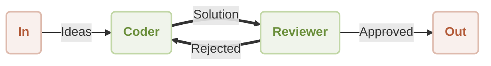

# Workflow Reflection

Have you ever needed an AI to not just generate content, but also to critique and improve its own work? This guide demonstrates how to build a self-correcting workflow where one agent's output is reviewed and refined by another. By following these steps, you will learn how to implement this powerful iterative pattern using the AIGNE Framework.

This example establishes a workflow with two distinct agents: a `Coder` and a `Reviewer`. The `Coder` agent is responsible for writing code to solve a user's request, while the `Reviewer` agent evaluates the code. If the `Reviewer` deems the code unsatisfactory, it provides constructive feedback and sends it back to the `Coder` for revision. This creates a loop of continuous improvement until the output meets the required standards.

The following diagram illustrates this process:



## Prerequisites

To successfully run this example, your development environment must meet the following criteria:

*   **Node.js**: Version 20.0 or higher.
*   **npm**: Included with your Node.js installation.
*   **OpenAI API Key**: An API key is necessary for the example to communicate with OpenAI models. You can acquire one from the [OpenAI Platform](https://platform.openai.com/api-keys).

## Quick Start

This example can be executed directly from the command line using `npx`, which eliminates the need for a local installation.

### Run the Example

Open your terminal and use one of the following commands to run the workflow.

To run in the default one-shot mode, which processes a single request and exits:
```bash npx command icon=lucide:terminal
npx -y @aigne/example-workflow-reflection
```

To engage in an interactive session, use the `--chat` flag:
```bash npx command icon=lucide:terminal
npx -y @aigne/example-workflow-reflection --chat
```

You can also pipe input directly into the command:
```bash npx command icon=lucide:terminal
echo "Write a function to validate email addresses" | npx -y @aigne/example-workflow-reflection
```

### Connect to an AI Model

Upon first execution, the application will prompt you to configure a connection to an AI model, as no API keys have been set up yet.

```d2
direction: down

In: {
  shape: oval
}

Out: {
  shape: oval
}

Coder: {
  shape: rectangle
}

Reviewer: {
  shape: rectangle
}

In -> Coder: "Ideas"
Coder -> Reviewer: "Solution"
Reviewer -> Out: "Approved"
Reviewer -> Coder: "Rejected"
```

You are presented with the following options:

#### 1. Connect via the Official AIGNE Hub (Recommended)

This is the most straightforward method. New users are granted free credits to get started.

1.  Select the first option: `Connect to the Arcblock official AIGNE Hub`.
2.  Your default web browser will open a new tab, displaying an authorization page.
3.  Follow the on-screen instructions to approve the connection request.


#### 2. Connect via a Self-Hosted AIGNE Hub

If you or your organization operates a private AIGNE Hub instance, follow these steps:

1.  Select the second option: `Connect to a self-hosted AIGNE Hub`.
2.  When prompted, enter the URL of your self-hosted AIGNE Hub instance.
3.  Proceed with the on-screen instructions to finalize the connection.


#### 3. Connect via a Third-Party Model Provider

You can connect directly to a third-party LLM provider, such as OpenAI, by configuring the appropriate API key as an environment variable.

For instance, to use an OpenAI model, set the `OPENAI_API_KEY` environment variable in your terminal:
```bash Set OpenAI API Key icon=lucide:terminal
export OPENAI_API_KEY="YOUR_OPENAI_API_KEY"
```

Replace `"YOUR_OPENAI_API_KEY"` with your actual key. Once the environment variable is set, run the `npx` command again. For details on configuring other providers like Google Gemini or DeepSeek, consult the `.env.local.example` file included in the source code.

## Installation from Source

For developers who want to examine or customize the code, the repository can be cloned to run the example locally.

### 1. Clone the Repository

```bash Clone the repository icon=lucide:terminal
git clone https://github.com/AIGNE-io/aigne-framework
```

### 2. Install Dependencies

Navigate to the example's directory and use `pnpm` to install the necessary packages.

```bash Install dependencies icon=lucide:terminal
cd aigne-framework/examples/workflow-reflection
pnpm install
```

### 3. Run the Example

Execute the script using the `pnpm start` command.

```bash Run in one-shot mode icon=lucide:terminal
pnpm start
```

To run in interactive chat mode, append the `--chat` flag. The extra `--` is required to pass the flag to the script rather than to `pnpm` itself.

```bash Run in interactive mode icon=lucide:terminal
pnpm start -- --chat
```

To provide input via a pipeline:
```bash Run with pipeline input icon=lucide:terminal
echo "Write a function to validate email addresses" | pnpm start
```

## How It Works

The workflow is orchestrated by two `AIAgent` instances, `coder` and `reviewer`, which communicate through a system of topics. This creates a message-driven state machine.

1.  **Initialization**: The process begins when a message with the user's request is published to the `UserInputTopic`.
2.  **Coder Agent**: The `coder` agent, which subscribes to `UserInputTopic`, receives the request. It generates the initial code and publishes its solution to a `review_request` topic.
3.  **Reviewer Agent**: The `reviewer` agent subscribes to the `review_request` topic. It assesses the submitted code against criteria such as correctness, efficiency, and safety.
4.  **Decision and Routing**:
    *   If the code is **approved**, the `reviewer` publishes the final, validated result to the `UserOutputTopic`, concluding the workflow.
    *   If the code is **rejected**, the `reviewer` formulates feedback and publishes it to a `rewrite_request` topic.
5.  **Iteration**: The `coder` agent also subscribes to the `rewrite_request` topic. When it receives feedback, it revises its code accordingly and resubmits it to the `review_request` topic, thereby repeating the cycle until approval is achieved.

### Code Implementation

The following TypeScript code provides the complete implementation for defining and running the `coder` and `reviewer` agents.

```typescript reflection-workflow.ts icon=logos:typescript
import { AIAgent, AIGNE, UserInputTopic, UserOutputTopic } from "@aigne/core";
import { OpenAIChatModel } from "@aigne/core/models/openai-chat-model.js";
import { z } from "zod";

const { OPENAI_API_KEY } = process.env;

// Initialize the model
const model = new OpenAIChatModel({
  apiKey: OPENAI_API_KEY,
});

// Define the Coder agent
const coder = AIAgent.from({
  subscribeTopic: [UserInputTopic, "rewrite_request"],
  publishTopic: "review_request",
  instructions: `\
You are a proficient coder. You write code to solve problems.
Work with the reviewer to improve your code.
Always put all finished code in a single Markdown code block.
For example:
\`\`\`python
def hello_world():
    print("Hello, World!")
\`\`\`

Respond using the following format:

Thoughts: <Your comments>
Code: <Your code>

Previous review result:
{{feedback}}

User's question:
{{question}}
`,
  outputSchema: z.object({
    code: z.string().describe("Your code"),
  }),
});

// Define the Reviewer agent
const reviewer = AIAgent.from({
  subscribeTopic: "review_request",
  publishTopic: (output) =>
    output.approval ? UserOutputTopic : "rewrite_request",
  instructions: `\
You are a code reviewer. You focus on correctness, efficiency and safety of the code.

The problem statement is: {{question}}
The code is:
\`\`\`
{{code}}
\`\`\`

Previous feedback:
{{feedback}}

Please review the code. If previous feedback was provided, see if it was addressed.
`,
  outputSchema: z.object({
    approval: z.boolean().describe("APPROVE or REVISE"),
    feedback: z.object({
      correctness: z.string().describe("Your comments on correctness"),
      efficiency: z.string().describe("Your comments on efficiency"),
      safety: z.string().describe("Your comments on safety"),
      suggested_changes: z
        .string()
        .describe("Your comments on suggested changes"),
    }),
  }),
  includeInputInOutput: true,
});

// Initialize and run the AIGNE instance
const aigne = new AIGNE({ model, agents: [coder, reviewer] });
aigne.publish(
  UserInputTopic,
  "Write a function to find the sum of all even numbers in a list.",
);

const { message } = await aigne.subscribe(UserOutputTopic);
console.log(message);
```

### Example Output

Once the workflow completes successfully, the final approved code and the reviewer's feedback are logged to the console as a JSON object.

```json Example Output
{
  "code": "def sum_of_even_numbers(numbers):\n    \"\"\"Function to calculate the sum of all even numbers in a list.\"\"\"\n    return sum(number for number in numbers if number % 2 == 0)",
  "approval": true,
  "feedback": {
    "correctness": "The function correctly calculates the sum of all even numbers in the given list. It properly checks for evenness using the modulus operator and sums the valid numbers.",
    "efficiency": "The implementation is efficient as it uses a generator expression which computes the sum in a single pass over the list. This minimizes memory usage as compared to creating an intermediate list of even numbers.",
    "safety": "The function does not contain any safety issues. However, it assumes that all elements in the input list are integers. It would be prudent to handle cases where the input contains non-integer values (e.g., None, strings, etc.).",
    "suggested_changes": "Consider adding type annotations to the function for better clarity and potential type checking, e.g. `def sum_of_even_numbers(numbers: list[int]) -> int:`. Also, include input validation to ensure 'numbers' is a list of integers."
  }
}
```

## Debugging with AIGNE Observe

To gain insight into the agent interactions, message flows, and overall execution, you can use the AIGNE observability tool.

First, launch the observation server from a separate terminal window:
```bash Start AIGNE Observe icon=lucide:terminal
aigne observe
```

The server runs locally and is accessible at `http://localhost:7893`. With the server running, any execution of your AIGNE application will capture detailed traces. Open the web interface in your browser to view a list of recent executions and inspect the specifics of each step in the workflow.


## Summary

This guide has detailed the process of building a reflection workflow, where agents collaborate to iteratively improve an output. This pattern is a key technique for developing more dependable and sophisticated AI systems capable of self-correction.

To explore other ways of coordinating agents, consider the following workflow patterns:

<x-cards data-columns="2">
  <x-card data-title="Sequential Workflow" data-icon="lucide:arrow-right-circle" data-href="/examples/workflow-sequential">
    Build step-by-step processing pipelines with a guaranteed execution order.
  </x-card>
  <x-card data-title="Workflow Orchestration" data-icon="lucide:network" data-href="/examples/workflow-orchestration">
    Coordinate multiple agents working together in sophisticated processing pipelines.
  </x-card>
</x-cards>
