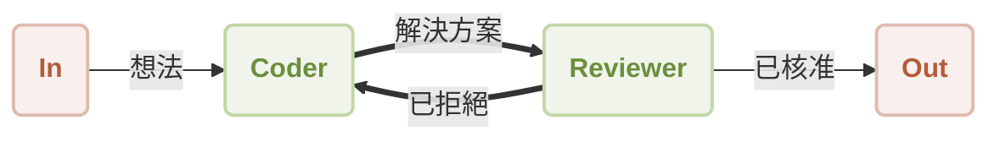

# 工作流反思

您是否曾需要 AI 不僅能生成內容，還能批判並改進自己的工作成果？本指南將示範如何建立一個自我修正的工作流，其中一個 Agent 的輸出會由另一個 Agent 審查和完善。透過遵循這些步驟，您將學會如何使用 AIGNE 框架實現這個強大的迭代模式。

此範例建立了一個包含兩個不同 Agent 的工作流：一個 `Coder` (編碼員) 和一個 `Reviewer` (審查員)。`Coder` Agent 負責編寫程式碼以解決使用者的請求，而 `Reviewer` Agent 則評估該程式碼。如果 `Reviewer` 認為程式碼不符合要求，它會提供建設性的回饋，並將其送回給 `Coder` 進行修訂。這就形成了一個持續改進的循環，直到輸出達到所需標準為止。

下圖說明了此過程：



## 先決條件

為成功執行此範例，您的開發環境必須符合以下標準：

*   **Node.js**：版本 20.0 或更高。
*   **npm**：隨您的 Node.js 安裝一同提供。
*   **OpenAI API 金鑰**：此範例需要 API 金鑰才能與 OpenAI 模型通訊。您可以從 [OpenAI Platform](https://platform.openai.com/api-keys) 取得金鑰。

## 快速入門

此範例可直接從命令列使用 `npx` 執行，無需在本機安裝。

### 執行範例

開啟您的終端機並使用以下任一指令來執行工作流。

若要在預設的單次模式下執行，即處理單一請求後退出：
```bash npx command icon=lucide:terminal
npx -y @aigne/example-workflow-reflection
```

若要進入互動式會話，請使用 `--chat` 旗標：
```bash npx command icon=lucide:terminal
npx -y @aigne/example-workflow-reflection --chat
```

您也可以將輸入直接透過管道傳送至指令：
```bash npx command icon=lucide:terminal
echo "Write a function to validate email addresses" | npx -y @aigne/example-workflow-reflection
```

### 連接到 AI 模型

首次執行時，應用程式會提示您設定與 AI 模型的連接，因為尚未設定任何 API 金鑰。

```d2
direction: down

In: {
  shape: oval
}

Out: {
  shape: oval
}

Coder: {
  shape: rectangle
}

Reviewer: {
  shape: rectangle
}

In -> Coder: "想法"
Coder -> Reviewer: "解決方案"
Reviewer -> Out: "已核准"
Reviewer -> Coder: "已拒絕"
```

您會看到以下選項：

#### 1. 透過 AIGNE 官方 Hub 連接 (建議)

這是最直接的方法。新使用者會獲得免費的點數以開始使用。

1.  選擇第一個選項：`Connect to the Arcblock official AIGNE Hub`。
2.  您的預設網頁瀏覽器將開啟一個新分頁，顯示授權頁面。
3.  遵循畫面上的指示，批准連接請求。


#### 2. 透過自架的 AIGNE Hub 連接

如果您或您的組織運行私有的 AIGNE Hub 實例，請遵循以下步驟：

1.  選擇第二個選項：`Connect to a self-hosted AIGNE Hub`。
2.  在提示時，輸入您自架 AIGNE Hub 實例的 URL。
3.  繼續按照畫面上的指示完成連接。


#### 3. 透過第三方模型提供者連接

您可以透過將適當的 API 金鑰設定為環境變數，直接連接到第三方 LLM 提供者，例如 OpenAI。

例如，若要使用 OpenAI 模型，請在您的終端機中設定 `OPENAI_API_KEY` 環境變數：
```bash 設定 OpenAI API 金鑰 icon=lucide:terminal
export OPENAI_API_KEY="YOUR_OPENAI_API_KEY"
```

請將 `"YOUR_OPENAI_API_KEY"` 替換為您的實際金鑰。設定環境變數後，再次執行 `npx` 指令。有關設定其他提供者 (如 Google Gemini 或 DeepSeek) 的詳細資訊，請參閱原始碼中包含的 `.env.local.example` 檔案。

## 從原始碼安裝

對於想要檢查或自訂程式碼的開發者，可以複製儲存庫以在本機執行範例。

### 1. 複製儲存庫

```bash 複製儲存庫 icon=lucide:terminal
git clone https://github.com/AIGNE-io/aigne-framework
```

### 2. 安裝依賴項

導覽至範例的目錄，並使用 `pnpm` 安裝所需的套件。

```bash 安裝依賴項 icon=lucide:terminal
cd aigne-framework/examples/workflow-reflection
pnpm install
```

### 3. 執行範例

使用 `pnpm start` 指令執行腳本。

```bash 以單次模式執行 icon=lucide:terminal
pnpm start
```

若要以互動式聊天模式執行，請加上 `--chat` 旗標。額外的 `--` 是必要的，以便將旗標傳遞給腳本，而不是 `pnpm` 本身。

```bash 以互動模式執行 icon=lucide:terminal
pnpm start -- --chat
```

若要透過管道提供輸入：
```bash 使用管道輸入執行 icon=lucide:terminal
echo "Write a function to validate email addresses" | pnpm start
```

## 運作方式

此工作流由兩個 `AIAgent` 實例 `coder` 和 `reviewer` 進行協調，它們透過一個主題 (topic) 系統進行通訊。這建立了一個訊息驅動的狀態機。

1.  **初始化**：當一則包含使用者請求的訊息發布到 `UserInputTopic` 時，流程開始。
2.  **Coder Agent**：訂閱 `UserInputTopic` 的 `coder` Agent 收到請求。它會生成初始程式碼，並將其解決方案發布到 `review_request` 主題。
3.  **Reviewer Agent**：`reviewer` Agent 訂閱 `review_request` 主題。它會根據正確性、效率和安全性等標準評估提交的程式碼。
4.  **決策與路由**：
    *   如果程式碼**被核准**，`reviewer` 會將最終驗證過的結果發布到 `UserOutputTopic`，從而結束工作流。
    *   如果程式碼**被拒絕**，`reviewer` 會擬定回饋意見，並將其發布到 `rewrite_request` 主題。
5.  **迭代**：`coder` Agent 同時也訂閱 `rewrite_request` 主題。當它收到回饋時，會相應地修改其程式碼，並將其重新提交到 `review_request` 主題，從而重複此循環，直到獲得核准為止。

### 程式碼實現

以下 TypeScript 程式碼提供了定義和執行 `coder` 和 `reviewer` Agent 的完整實現。

```typescript reflection-workflow.ts icon=logos:typescript
import { AIAgent, AIGNE, UserInputTopic, UserOutputTopic } from "@aigne/core";
import { OpenAIChatModel } from "@aigne/core/models/openai-chat-model.js";
import { z } from "zod";

const { OPENAI_API_KEY } = process.env;

// 初始化模型
const model = new OpenAIChatModel({
  apiKey: OPENAI_API_KEY,
});

// 定義 Coder Agent
const coder = AIAgent.from({
  subscribeTopic: [UserInputTopic, "rewrite_request"],
  publishTopic: "review_request",
  instructions: `\
You are a proficient coder. You write code to solve problems.
Work with the reviewer to improve your code.
Always put all finished code in a single Markdown code block.
For example:
\`\`\`python
def hello_world():
    print("Hello, World!")
\`\`\`

Respond using the following format:

Thoughts: <Your comments>
Code: <Your code>

Previous review result:
{{feedback}}

User's question:
{{question}}
`,
  outputSchema: z.object({
    code: z.string().describe("Your code"),
  }),
});

// 定義 Reviewer Agent
const reviewer = AIAgent.from({
  subscribeTopic: "review_request",
  publishTopic: (output) =>
    output.approval ? UserOutputTopic : "rewrite_request",
  instructions: `\
You are a code reviewer. You focus on correctness, efficiency and safety of the code.

The problem statement is: {{question}}
The code is:
\`\`\`
{{code}}
\`\`\`

Previous feedback:
{{feedback}}

Please review the code. If previous feedback was provided, see if it was addressed.
`,
  outputSchema: z.object({
    approval: z.boolean().describe("APPROVE or REVISE"),
    feedback: z.object({
      correctness: z.string().describe("Your comments on correctness"),
      efficiency: z.string().describe("Your comments on efficiency"),
      safety: z.string().describe("Your comments on safety"),
      suggested_changes: z
        .string()
        .describe("Your comments on suggested changes"),
    }),
  }),
  includeInputInOutput: true,
});

// 初始化並執行 AIGNE 實例
const aigne = new AIGNE({ model, agents: [coder, reviewer] });
aigne.publish(
  UserInputTopic,
  "Write a function to find the sum of all even numbers in a list.",
);

const { message } = await aigne.subscribe(UserOutputTopic);
console.log(message);
```

### 範例輸出

工作流成功完成後，最終核准的程式碼和審查員的回饋將以 JSON 物件的形式記錄到主控台。

```json 範例輸出
{
  "code": "def sum_of_even_numbers(numbers):\n    \"\"\"Function to calculate the sum of all even numbers in a list.\"\"\"\n    return sum(number for number in numbers if number % 2 == 0)",
  "approval": true,
  "feedback": {
    "correctness": "The function correctly calculates the sum of all even numbers in the given list. It properly checks for evenness using the modulus operator and sums the valid numbers.",
    "efficiency": "The implementation is efficient as it uses a generator expression which computes the sum in a single pass over the list. This minimizes memory usage as compared to creating an intermediate list of even numbers.",
    "safety": "The function does not contain any safety issues. However, it assumes that all elements in the input list are integers. It would be prudent to handle cases where the input contains non-integer values (e.g., None, strings, etc.).",
    "suggested_changes": "Consider adding type annotations to the function for better clarity and potential type checking, e.g. `def sum_of_even_numbers(numbers: list[int]) -> int:`. Also, include input validation to ensure 'numbers' is a list of integers."
  }
}
```

## 使用 AIGNE Observe 進行除錯

若要深入了解 Agent 互動、訊息流和整體執行情況，您可以使用 AIGNE 可觀測性工具。

首先，從一個獨立的終端機視窗啟動觀測伺服器：
```bash 啟動 AIGNE Observe icon=lucide:terminal
aigne observe
```

該伺服器在本機執行，可透過 `http://localhost:7893` 存取。在伺服器執行期間，您 AIGNE 應用程式的任何執行都將捕獲詳細的追蹤資訊。在您的瀏覽器中開啟網頁介面，即可查看最近執行的列表，並檢查工作流中每個步驟的具體細節。


## 總結

本指南詳細介紹了建立一個反思式工作流的過程，其中 Agent 協同合作以迭代地改進輸出。此模式是開發更可靠、更複雜且具備自我修正能力的 AI 系統的關鍵技術。

若要探索其他協調 Agent 的方式，請考慮以下工作流模式：

<x-cards data-columns="2">
  <x-card data-title="循序工作流" data-icon="lucide:arrow-right-circle" data-href="/examples/workflow-sequential">
    建立具有保證執行順序的逐步處理管道。
  </x-card>
  <x-card data-title="工作流編排" data-icon="lucide:network" data-href="/examples/workflow-orchestration">
    協調多個 Agent 在複雜的處理管道中協同工作。
  </x-card>
</x-cards>