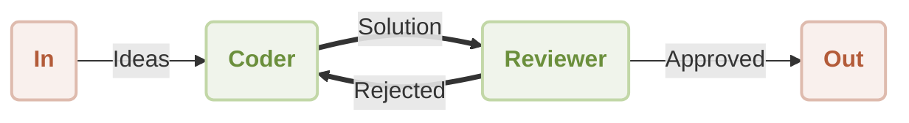

# 工作流反思

您是否曾需要 AI 不仅能生成内容，还能批判和改进其自身的工作？本指南将演示如何构建一个自我修正的工作流，其中一个 Agent 的输出由另一个 Agent 审查和完善。通过遵循这些步骤，您将学习如何使用 AIGNE 框架实现这一强大的迭代模式。

此示例建立了一个包含两个不同 Agent 的工作流：一个 `Coder` 和一个 `Reviewer`。`Coder` Agent 负责编写代码以解决用户的请求，而 `Reviewer` Agent 则评估该代码。如果 `Reviewer` 认为代码不令人满意，它会提供建设性的反馈并将其发回给 `Coder` 进行修订。这就创建了一个持续改进的循环，直到输出达到所需标准。

下图说明了此过程：



## 前提条件

要成功运行此示例，您的开发环境必须满足以下标准：

*   **Node.js**: 20.0 或更高版本。
*   **npm**: 包含在您的 Node.js 安装中。
*   **OpenAI API 密钥**: 示例需要 API 密钥才能与 OpenAI 模型通信。您可以从 [OpenAI 平台](https://platform.openai.com/api-keys)获取一个。

## 快速入门

此示例可直接通过命令行使用 `npx` 执行，无需本地安装。

### 运行示例

打开您的终端并使用以下命令之一来运行工作流。

若以默认的单次模式运行，该模式会处理单个请求并退出：
```bash npx command icon=lucide:terminal
npx -y @aigne/example-workflow-reflection
```

若要进行交互式会话，请使用 `--chat` 标志：
```bash npx command icon=lucide:terminal
npx -y @aigne/example-workflow-reflection --chat
```

您也可以将输入直接通过管道传递给命令：
```bash npx command icon=lucide:terminal
echo "Write a function to validate email addresses" | npx -y @aigne/example-workflow-reflection
```

### 连接到 AI 模型

首次执行时，由于尚未设置任何 API 密钥，应用程序将提示您配置与 AI 模型的连接。

```d2
direction: down

In: {
  shape: oval
}

Out: {
  shape: oval
}

Coder: {
  shape: rectangle
}

Reviewer: {
  shape: rectangle
}

In -> Coder: "想法"
Coder -> Reviewer: "解决方案"
Reviewer -> Out: "已批准"
Reviewer -> Coder: "已拒绝"
```

您会看到以下选项：

#### 1. 通过官方 AIGNE Hub 连接（推荐）

这是最直接的方法。新用户将获得免费积分以开始使用。

1.  选择第一个选项：`Connect to the Arcblock official AIGNE Hub`。
2.  您的默认网络浏览器将打开一个新标签页，显示一个授权页面。
3.  按照屏幕上的说明批准连接请求。


#### 2. 通过自托管的 AIGNE Hub 连接

如果您或您的组织运行一个私有的 AIGNE Hub 实例，请按以下步骤操作：

1.  选择第二个选项：`Connect to a self-hosted AIGNE Hub`。
2.  在提示时，输入您自托管的 AIGNE Hub 实例的 URL。
3.  继续按照屏幕上的说明完成连接。


#### 3. 通过第三方模型提供商连接

您可以通过将相应的 API 密钥配置为环境变量，直接连接到第三方 LLM 提供商，例如 OpenAI。

例如，要使用 OpenAI 模型，请在您的终端中设置 `OPENAI_API_KEY` 环境变量：
```bash 设置 OpenAI API 密钥 icon=lucide:terminal
export OPENAI_API_KEY="YOUR_OPENAI_API_KEY"
```

将 `"YOUR_OPENAI_API_KEY"` 替换为您的实际密钥。设置环境变量后，再次运行 `npx` 命令。有关配置其他提供商（如 Google Gemini 或 DeepSeek）的详细信息，请参阅源代码中包含的 `.env.local.example` 文件。

## 从源代码安装

对于希望检查或自定义代码的开发人员，可以克隆仓库以在本地运行示例。

### 1. 克隆仓库

```bash 克隆仓库 icon=lucide:terminal
git clone https://github.com/AIGNE-io/aigne-framework
```

### 2. 安装依赖项

导航到示例的目录并使用 `pnpm` 安装必要的包。

```bash 安装依赖项 icon=lucide:terminal
cd aigne-framework/examples/workflow-reflection
pnpm install
```

### 3. 运行示例

使用 `pnpm start` 命令执行脚本。

```bash 以单次模式运行 icon=lucide:terminal
pnpm start
```

要在交互式聊天模式下运行，请附加 `--chat` 标志。需要额外的 `--` 将标志传递给脚本而不是 `pnpm` 本身。

```bash 以交互模式运行 icon=lucide:terminal
pnpm start -- --chat
```

通过管道提供输入：
```bash 使用管道输入运行 icon=lucide:terminal
echo "Write a function to validate email addresses" | pnpm start
```

## 工作原理

该工作流由两个 `AIAgent` 实例 `coder` 和 `reviewer` 协同完成，它们通过一个主题系统进行通信。这创建了一个消息驱动的状态机。

1.  **初始化**：当包含用户请求的消息发布到 `UserInputTopic` 时，流程开始。
2.  **Coder Agent**：订阅了 `UserInputTopic` 的 `coder` Agent 接收到请求。它生成初始代码并将其解决方案发布到 `review_request` 主题。
3.  **Reviewer Agent**：`reviewer` Agent 订阅 `review_request` 主题。它根据正确性、效率和安全性等标准评估提交的代码。
4.  **决策与路由**：
    *   如果代码**被批准**，`reviewer` 将最终验证过的结果发布到 `UserOutputTopic`，从而结束工作流。
    *   如果代码**被拒绝**，`reviewer` 会制定反馈并将其发布到 `rewrite_request` 主题。
5.  **迭代**：`coder` Agent 也订阅了 `rewrite_request` 主题。当它收到反馈时，会相应地修改其代码，并将其重新提交到 `review_request` 主题，从而重复此循环，直到获得批准。

### 代码实现

以下 TypeScript 代码提供了定义和运行 `coder` 和 `reviewer` Agent 的完整实现。

```typescript reflection-workflow.ts icon=logos:typescript
import { AIAgent, AIGNE, UserInputTopic, UserOutputTopic } from "@aigne/core";
import { OpenAIChatModel } from "@aigne/core/models/openai-chat-model.js";
import { z } from "zod";

const { OPENAI_API_KEY } = process.env;

// 初始化模型
const model = new OpenAIChatModel({
  apiKey: OPENAI_API_KEY,
});

// 定义 Coder agent
const coder = AIAgent.from({
  subscribeTopic: [UserInputTopic, "rewrite_request"],
  publishTopic: "review_request",
  instructions: `\
You are a proficient coder. You write code to solve problems.
Work with the reviewer to improve your code.
Always put all finished code in a single Markdown code block.
For example:
\`\`\`python
def hello_world():
    print("Hello, World!")
\`\`\`

Respond using the following format:

Thoughts: <Your comments>
Code: <Your code>

Previous review result:
{{feedback}}

User's question:
{{question}}
`,
  outputSchema: z.object({
    code: z.string().describe("Your code"),
  }),
});

// 定义 Reviewer agent
const reviewer = AIAgent.from({
  subscribeTopic: "review_request",
  publishTopic: (output) =>
    output.approval ? UserOutputTopic : "rewrite_request",
  instructions: `\
You are a code reviewer. You focus on correctness, efficiency and safety of the code.

The problem statement is: {{question}}
The code is:
\`\`\`
{{code}}
\`\`\`

Previous feedback:
{{feedback}}

Please review the code. If previous feedback was provided, see if it was addressed.
`,
  outputSchema: z.object({
    approval: z.boolean().describe("APPROVE or REVISE"),
    feedback: z.object({
      correctness: z.string().describe("Your comments on correctness"),
      efficiency: z.string().describe("Your comments on efficiency"),
      safety: z.string().describe("Your comments on safety"),
      suggested_changes: z
        .string()
        .describe("Your comments on suggested changes"),
    }),
  }),
  includeInputInOutput: true,
});

// 初始化并运行 AIGNE 实例
const aigne = new AIGNE({ model, agents: [coder, reviewer] });
aigne.publish(
  UserInputTopic,
  "Write a function to find the sum of all even numbers in a list.",
);

const { message } = await aigne.subscribe(UserOutputTopic);
console.log(message);
```

### 示例输出

工作流成功完成后，最终批准的代码和审阅者的反馈将作为 JSON 对象记录到控制台。

```json 示例输出
{
  "code": "def sum_of_even_numbers(numbers):\n    \"\"\"Function to calculate the sum of all even numbers in a list.\"\"\"\n    return sum(number for number in numbers if number % 2 == 0)",
  "approval": true,
  "feedback": {
    "correctness": "The function correctly calculates the sum of all even numbers in the given list. It properly checks for evenness using the modulus operator and sums the valid numbers.",
    "efficiency": "The implementation is efficient as it uses a generator expression which computes the sum in a single pass over the list. This minimizes memory usage as compared to creating an intermediate list of even numbers.",
    "safety": "The function does not contain any safety issues. However, it assumes that all elements in the input list are integers. It would be prudent to handle cases where the input contains non-integer values (e.g., None, strings, etc.).",
    "suggested_changes": "Consider adding type annotations to the function for better clarity and potential type checking, e.g. `def sum_of_even_numbers(numbers: list[int]) -> int:`. Also, include input validation to ensure 'numbers' is a list of integers."
  }
}
```

## 使用 AIGNE Observe 进行调试

要深入了解 Agent 交互、消息流和整体执行情况，您可以使用 AIGNE 可观测性工具。

首先，从一个单独的终端窗口启动观测服务器：
```bash 启动 AIGNE Observe icon=lucide:terminal
aigne observe
```

该服务器在本地运行，可通过 `http://localhost:7893` 访问。服务器运行时，您的任何 AIGNE 应用程序的执行都将捕获详细的追踪信息。在浏览器中打开 Web 界面，可以查看最近的执行列表，并检查工作流中每个步骤的具体细节。


## 总结

本指南详细介绍了构建反思工作流的过程，其中 Agent 协作以迭代方式改进输出。这种模式是开发更可靠、更复杂的能够自我修正的 AI 系统的关键技术。

要探索其他协调 Agent 的方式，请考虑以下工作流模式：
<x-cards data-columns="2">
  <x-card data-title="顺序工作流" data-icon="lucide:arrow-right-circle" data-href="/examples/workflow-sequential">
    构建具有保证执行顺序的逐步处理管道。
  </x-card>
  <x-card data-title="工作流编排" data-icon="lucide:network" data-href="/examples/workflow-orchestration">
    协调多个 Agent 在复杂的处理管道中协同工作。
  </x-card>
</x-cards>