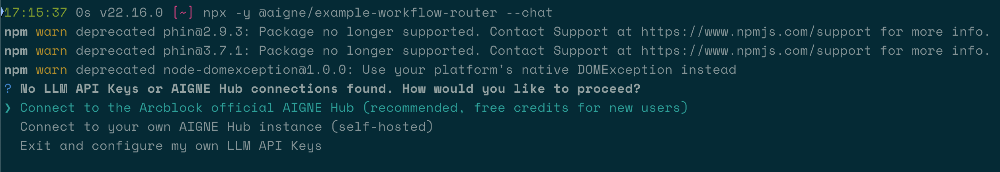

# ワークフロールーター

ユーザーのクエリをその内容に基づいて、異なる専門ハンドラーに振り分ける必要に迫られたことはありませんか？このガイドでは、リクエストをインテリジェントにルーティングするワークフローを構築するための完全なステップバイステップのウォークスルーを提供します。入力を分析し、製品サポートやフィードバック収集などの正しい専門Agentに転送する「トリアージ」Agentを作成する方法を学びます。

ルーターワークフローは、洗練されたマルチAgentシステムを作成するための一般的で強力なパターンです。スマートなディスパッチャーとして機能し、ユーザーのリクエストがタスクに最も適したAgentによって処理されるようにします。この例では、質問を`productSupport`、`feedback`、または`other`の3つの専門AgentのいずれかにルーティングするトリアージAgentを示します。

以下の図は、ルーティングロジックを示しています。

```d2
direction: down

User: {
  shape: c4-person
}

Triage-Agent: {
  label: "トリアージAgent"
  shape: rectangle
}

Specialized-Agents: {
  label: "専門Agent"
  shape: rectangle

  productSupport: {
    label: "製品サポートAgent"
  }

  feedback: {
    label: "フィードバックAgent"
  }

  other: {
    label: "その他Agent"
  }
}

User -> Triage-Agent: "ユーザーのクエリ"
Triage-Agent -> Specialized-Agents.productSupport: "製品に関する質問をルーティング"
Triage-Agent -> Specialized-Agents.feedback: "フィードバックをルーティング"
Triage-Agent -> Specialized-Agents.other: "その他の質問をルーティング"
Specialized-Agents.productSupport -> User: "応答"
Specialized-Agents.feedback -> User: "応答"
Specialized-Agents.other -> User: "応答"

```

## 前提条件

先に進む前に、開発環境が以下の要件を満たしていることを確認してください。

*   **Node.js:** バージョン 20.0 以上。
*   **npm:** Node.jsにバンドルされています。
*   **OpenAI APIキー:** デフォルトのモデル設定に必要です。[OpenAI Platform](https://platform.openai.com/api-keys)から取得できます。

## クイックスタート

`npx`を使用すると、手動でのインストールプロセスなしでこの例を直接実行できます。

### 例を実行する

この例は、いくつかのモードで実行できます。

1.  **ワンショットモード（デフォルト）**
    このコマンドは、ハードコードされた単一の入力を処理して終了します。

    ```bash icon=lucide:terminal
    npx -y @aigne/example-workflow-router
    ```

2.  **インタラクティブチャットモード**
    `--chat`フラグを使用すると、複数のメッセージを送信できるインタラクティブセッションが開始されます。

    ```bash icon=lucide:terminal
    npx -y @aigne/example-workflow-router --chat
    ```

3.  **パイプラインモード**
    コマンドに直接入力をパイプします。これは他のスクリプトと統合するのに便利です。

    ```bash icon=lucide:terminal
    echo "How do I return a product?" | npx -y @aigne/example-workflow-router
    ```

### AIモデルに接続する

初めて例を実行すると、AIモデルが設定されていないことを検出し、セットアップを促すプロンプトが表示されます。



AIモデルに接続するには、いくつかのオプションがあります。

#### 1. AIGNEハブに接続する（推奨）

これが最も簡単な開始方法です。公式のAIGNEハブは、新規ユーザーに無料クレジットを提供しています。

1.  最初のオプション「`Connect to the Arcblock official AIGNE Hub`」を選択します。
2.  Webブラウザで認証ページが開きます。
3.  画面の指示に従って接続を承認します。


#### 2. セルフホストのAIGNEハブに接続する

独自のAIGNEハブのインスタンスを実行している場合：

1.  2番目のオプション「`Connect to your self-hosted AIGNE Hub`」を選択します。
2.  プロンプトが表示されたら、AIGNEハブインスタンスのURLを入力します。


#### 3. サードパーティのモデルプロバイダー経由で接続する

環境変数を設定することで、OpenAIなどのモデルプロバイダーに直接接続することもできます。

```bash OpenAI APIキーを設定 icon=lucide:terminal
export OPENAI_API_KEY="YOUR_OPENAI_API_KEY"
```

`"YOUR_OPENAI_API_KEY"`を実際のキーに置き換えてください。環境変数を設定した後、再度例のコマンドを実行します。Google GeminiやDeepSeekなどの他のプロバイダーについては、ソースコード内の`.env.local.example`ファイルを参照して正しい変数名を確認してください。

## 完全な例とソースコード

中核となるロジックは、いくつかの`AIAgent`インスタンスの定義に関わります。3つの専門Agent（`productSupport`、`feedback`、`other`）と、ルーターとして機能する1つの`triage` Agentです。`triage` Agentは`toolChoice: "router"`で設定されており、これにより利用可能な`skills`（他のAgent）の1つを選択して入力を処理するように指示されます。

以下は、この例の完全なTypeScriptコードです。

```typescript index.ts
import { AIAgent, AIGNE } from "@aigne/core";
import { OpenAIChatModel } from "@aigne/core/models/openai-chat-model.js";

const { OPENAI_API_KEY } = process.env;

const model = new OpenAIChatModel({
  apiKey: OPENAI_API_KEY,
});

const productSupport = AIAgent.from({
  name: "product_support",
  description: "Agent to assist with any product-related questions.",
  instructions: `You are an agent capable of handling any product-related questions.
  Your goal is to provide accurate and helpful information about the product.
  Be polite, professional, and ensure the user feels supported.`,
  outputKey: "product_support",
});

const feedback = AIAgent.from({
  name: "feedback",
  description: "Agent to assist with any feedback-related questions.",
  instructions: `You are an agent capable of handling any feedback-related questions.
  Your goal is to listen to the user's feedback, acknowledge their input, and provide appropriate responses.
  Be empathetic, understanding, and ensure the user feels heard.`,
  outputKey: "feedback",
});

const other = AIAgent.from({
  name: "other",
  description: "Agent to assist with any general questions.",
  instructions: `You are an agent capable of handling any general questions.
  Your goal is to provide accurate and helpful information on a wide range of topics.
  Be friendly, knowledgeable, and ensure the user feels satisfied with the information provided.`,
  outputKey: "other",
});

const triage = AIAgent.from({
  name: "triage",
  instructions: `You are an agent capable of routing questions to the appropriate agent.
  Your goal is to understand the user's query and direct them to the agent best suited to assist them.
  Be efficient, clear, and ensure the user is connected to the right resource quickly.`,
  skills: [productSupport, feedback, other],
  toolChoice: "router", // ルーターモードを有効にするには、toolChoiceを"router"に設定します
});

const aigne = new AIGNE({ model });

// 例1：製品サポートにルーティング
const result1 = await aigne.invoke(triage, "How to use this product?");
console.log(result1);

// 例2：フィードバックにルーティング
const result2 = await aigne.invoke(triage, "I have feedback about the app.");
console.log(result2);

// 例3：その他にルーティング
const result3 = await aigne.invoke(triage, "What is the weather today?");
console.log(result3);
```

### 実行と出力

スクリプトが実行されると、`aigne.invoke`メソッドがユーザーのクエリを`triage` Agentに送信します。その後、Agentはクエリを最も適切な専門Agentにルーティングし、最終的な出力はその選択されたAgentからのものになります。

**「How to use this product?」に対する出力**
```json
{
  "product_support": "I’d be happy to help you with that! However, I need to know which specific product you’re referring to. Could you please provide me with the name or type of product you have in mind?"
}
```

**「I have feedback about the app.」に対する出力**
```json
{
  "feedback": "Thank you for sharing your feedback! I'm here to listen. Please go ahead and let me know what you’d like to share about the app."
}
```

**「What is the weather today?」に対する出力**
```json
{
  "other": "I can't provide real-time weather updates. However, you can check a reliable weather website or a weather app on your phone for the current conditions in your area. If you tell me your location, I can suggest a few sources where you can find accurate weather information!"
}
```

## コマンドラインオプション

このサンプルスクリプトは、その動作をカスタマイズするためのいくつかのコマンドライン引数を受け入れます。

| パラメータ | 説明 | デフォルト |
|---|---|---|
| `--chat` | ワンショットではなく、インタラクティブなチャットモードで実行します。 | 無効 |
| `--model <provider[:model]>` | 使用するAIモデルを指定します（例：`openai`または`openai:gpt-4o-mini`）。 | `openai` |
| `--temperature <value>` | モデル生成のtemperatureを設定します。 | プロバイダーのデフォルト |
| `--top-p <value>` | top-pサンプリング値を設定します。 | プロバイダーのデフォルト |
| `--presence-penalty <value>`| presence penalty値を設定します。 | プロバイダーのデフォルト |
| `--frequency-penalty <value>`| frequency penalty値を設定します。 | プロバイダーのデフォルト |
| `--log-level <level>` | ログの詳細度を設定します（例：`ERROR`、`WARN`、`INFO`、`DEBUG`）。 | `INFO` |
| `--input`, `-i <input>` | 引数として直接入力を提供します。 | なし |

#### 例

```bash インタラクティブモードで実行 icon=lucide:terminal
npx -y @aigne/example-workflow-router --chat
```

```bash 特定のモデルとtemperatureを設定 icon=lucide:terminal
npx -y @aigne/example-workflow-router --model openai:gpt-4o-mini --temperature 0.5 -i "Tell me about your product."
```

```bash ログレベルをdebugに設定 icon=lucide:terminal
npx -y @aigne/example-workflow-router --log-level DEBUG
```

## デバッグ

実行フローを調査し、Agentの動作を理解するために、AIGNEのオブザーバビリティツールを使用できます。

まず、別のターミナルウィンドウでオブザベーションサーバーを起動します。

```bash icon=lucide:terminal
aigne observe
```


サーバーが起動し、`http://localhost:7893`でWebインターフェースにアクセスできます。例を実行すると、実行トレースがダッシュボードに表示され、`triage` Agentがどのようにルーティングの決定を下したか、そしてAgent間でどのようなデータが渡されたかを確認できます。


## まとめ

この例では、AIGNEフレームワークを使用してルーターワークフローを構築する方法を実演しました。専門Agentをスキルとして持つ`triage` Agentを定義し、`toolChoice: "router"`を設定することで、タスクをインテリジェントに委任する強力なシステムを作成できます。

より複雑なパターンについては、以下の例をご覧ください。

<x-cards data-columns="2">
  <x-card data-title="ワークフローハンドオフ" data-icon="lucide:arrow-right-left" data-href="/examples/workflow-handoff">専門Agent間のシームレスな移行を作成し、複雑な問題を解決します。</x-card>
  <x-card data-title="ワークフローオーケストレーション" data-icon="lucide:network" data-href="/examples/workflow-orchestration">洗練された処理パイプラインで連携する複数のAgentを調整します。</x-card>
</x-cards>