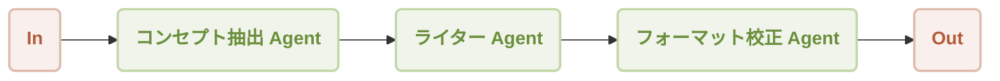

# ワークフロー逐次実行

このガイドでは、AIGNE フレームワークを使用して逐次ワークフローを構築し、実行する方法を説明します。複数の Agent を連鎖させ、ある Agent の出力が次の Agent の入力となることで、ステップバイステップの処理パイプラインを作成する方法を学びます。このパターンは、一連の明確で順序付けられた操作を必要とするタスクに最適です。

## 概要

逐次ワークフローは、事前に定義された順序でタスクを処理します。シーケンス内の各 Agent は特定の機能を実行し、その結果を後続の Agent に渡します。これにより、組み立てラインのように、予測可能で制御された実行フローが保証されます。

この例では、3つの Agent で構成されるシンプルなマーケティングコンテンツ生成パイプラインを構築します。

1.  **コンセプト抽出 Agent (Concept Extractor)**: 製品説明を分析し、主要な機能、ターゲットオーディエンス、独自のセールスポイントを特定します。
2.  **ライター Agent (Writer)**: 抽出されたコンセプトを使用して、説得力のあるマーケティングコピーを作成します。
3.  **フォーマット校正 Agent (Format Proof)**: 下書きのコピーを洗練させ、文法を修正し、明瞭さを向上させ、洗練された最終的な出力を保証します。

データは、以下に示すように、厳密なシーケンスで Agent を通過します。



## 前提条件

この例を実行する前に、開発環境が以下の要件を満たしていることを確認してください。

*   **Node.js**: バージョン 20.0 以上。
*   **npm**: Node.js に含まれています。
*   **OpenAI API キー**: この例でのモデルとの対話に必要です。[OpenAI Platform](https://platform.openai.com/api-keys) から取得できます。

## クイックスタート

`npx` を使用すると、ローカルにインストールすることなくこの例を直接実行できます。

### 例を実行する

ターミナルで以下のコマンドを実行します。

デフォルトのワンショットモードで実行する場合:
```bash icon=lucide:terminal
npx -y @aigne/example-workflow-sequential
```

対話型のチャットモードで実行する場合:
```bash icon=lucide:terminal
npx -y @aigne/example-workflow-sequential --chat
```

コマンドに直接入力をパイプすることもできます:
```bash icon=lucide:terminal
echo "Create marketing content for our new AI-powered fitness app" | npx -y @aigne/example-workflow-sequential
```

### AI モデルに接続する

初めてこの例を実行すると、アプリケーションは AI モデルが設定されていないことを検出し、接続を促すプロンプトを表示します。


続行するにはいくつかのオプションがあります。

**1. 公式 AIGNE Hub 経由で接続する (推奨)**

これは最も簡単に始めることができる方法です。新規ユーザーは試用目的で無料のトークン残高を受け取れます。

*   プロンプトの最初のオプションを選択します: `Connect to the Arcblock official AIGNE Hub`。
*   デフォルトのウェブブラウザが新しいタブで AIGNE Hub の認証ページを開きます。
*   画面の指示に従って接続を承認します。


**2. セルフホストの AIGNE Hub 経由で接続する**

独自の AIGNE Hub インスタンスを運用している場合は、直接接続できます。

*   2番目のオプションを選択します: `Connect to my own AIGNE Hub`。
*   ターミナルでプロンプトが表示されたら、セルフホストの AIGNE Hub インスタンスの URL を入力します。


**3. サードパーティのモデルプロバイダー経由で接続する**

OpenAI などのサポートされているサードパーティのモデルプロバイダーに直接接続することもできます。これには、適切な API キーを環境変数として設定する必要があります。OpenAI の場合、`OPENAI_API_KEY` 変数をエクスポートします。

```bash OpenAI API キーを設定 icon=lucide:terminal
export OPENAI_API_KEY="YOUR_OPENAI_API_KEY"
```

`"YOUR_OPENAI_API_KEY"` を実際のキーに置き換えてください。環境変数を設定した後、再度実行コマンドを実行します。他のプロバイダーの設定に関する詳細は、プロジェクトリポジトリの `.env.local.example` ファイルを参照してください。

## インストール (オプション)

リポジトリのローカルクローンから例を実行したい場合は、以下の手順に従ってください。

**1. リポジトリをクローンする**

```bash icon=lucide:terminal
git clone https://github.com/AIGNE-io/aigne-framework
```

**2. 依存関係をインストールする**

例のディレクトリに移動し、`pnpm` を使用して必要なパッケージをインストールします。

```bash icon=lucide:terminal
cd aigne-framework/examples/workflow-sequential
pnpm install
```

**3. 例を実行する**

`pnpm start` コマンドを使用してワークフローを実行します。

ワンショットモードで実行する場合:
```bash icon=lucide:terminal
pnpm start
```

対話型のチャットモードで実行する場合 (引数の前に `--` があることに注意してください):
```bash icon=lucide:terminal
pnpm start -- --chat
```

パイプライン入力を使用する場合:
```bash icon=lucide:terminal
echo "Create marketing content for our new AI-powered fitness app" | pnpm start
```

### コマンドラインオプション

この例では、カスタマイズのためにいくつかのコマンドライン引数をサポートしています。

| パラメータ | 説明 | デフォルト |
|-----------|-------------|---------|
| `--chat` | 対話型のチャットモードで実行します。 | 無効 |
| `--model <provider[:model]>` | 使用する AI モデルを指定します (例: `openai` または `openai:gpt-4o-mini`)。 | `openai` |
| `--temperature <value>` | モデル生成の temperature を設定します。 | プロバイダーのデフォルト |
| `--top-p <value>` | top-p サンプリングの値を設定します。 | プロバイダーのデフォルト |
| `--presence-penalty <value>` | presence penalty の値を設定します。 | プロバイダーのデフォルト |
| `--frequency-penalty <value>` | frequency penalty の値を設定します。 | プロバイダーのデフォルト |
| `--log-level <level>` | ログレベルを設定します (`ERROR`, `WARN`, `INFO`, `DEBUG`, `TRACE`)。 | `INFO` |
| `--input`, `-i <input>` | 引数として直接入力を提供します。 | `None` |

## コード例

逐次ワークフローのコアロジックは、1つの TypeScript ファイルで定義されています。3つの異なる `AIAgent` インスタンスを初期化し、それらを逐次実行用に設定された `TeamAgent` 内で編成します。

```typescript sequential-workflow.ts
import { AIAgent, AIGNE, ProcessMode, TeamAgent } from "@aigne/core";
import { OpenAIChatModel } from "@aigne/core/models/openai-chat-model.js";

const { OPENAI_API_KEY } = process.env;

// 1. モデルを初期化する
const model = new OpenAIChatModel({
  apiKey: OPENAI_API_KEY,
});

// 2. シーケンスの最初の Agent を定義する
const conceptExtractor = AIAgent.from({
  instructions: `\
あなたはマーケティングアナリストです。製品説明が与えられたら、以下を特定してください:
- 主要な機能
- ターゲットオーディエンス
- 独自のセールスポイント

製品説明:
{{product}}`,
  outputKey: "concept",
});

// 3. 2番目の Agent を定義する
const writer = AIAgent.from({
  instructions: `\
あなたはマーケティングコピーライターです。機能、オーディエンス、USP を説明するテキストブロックが与えられたら、
これらの点を強調する説得力のあるマーケティングコピー (ニュースレターのセクションのようなもの) を作成してください。
出力は短く (約 150 ワード)、コピーのみを単一のテキストブロックとして出力してください。

製品説明:
{{product}}

以下は製品に関する情報です:
{{concept}}`,
  outputKey: "draft",
});

// 4. 3番目の Agent を定義する
const formatProof = AIAgent.from({
  instructions: `\
あなたは編集者です。下書きのコピーが与えられたら、文法を修正し、明瞭さを向上させ、一貫したトーンを確保し、
フォーマットを整え、洗練させてください。最終的に改善されたコピーを単一のテキストブロックとして出力してください。

製品説明:
{{product}}

以下は製品に関する情報です:
{{concept}}

下書きのコピー:
{{draft}}`,
  outputKey: "content",
});

// 5. AIGNE インスタンスを初期化する
const aigne = new AIGNE({ model });

// 6. 逐次ワークフローを管理するための TeamAgent を作成する
const teamAgent = TeamAgent.from({
  skills: [conceptExtractor, writer, formatProof],
  mode: ProcessMode.sequential, // これにより、Agent が次々に実行されることが保証されます
});

// 7. 初期入力でワークフローを呼び出す
const result = await aigne.invoke(teamAgent, {
  product: "AIGNE is a No-code Generative AI Apps Engine",
});

console.log(result);

/*
// 期待される出力構造:
{
  concept: "...", // conceptExtractor からの出力
  draft: "...",   // writer からの出力
  content: "..."  // formatProof からの出力
}
*/
```

このスクリプトは、以下の主要なステップを示しています。
1.  LLM との通信を処理するために `OpenAIChatModel` インスタンスが作成されます。
2.  3つの `AIAgent` インスタンス (`conceptExtractor`, `writer`, `formatProof`) が特定の指示で定義されます。各 Agent の `outputKey` は、その結果が格納されるキーを決定します。
3.  `writer` Agent は `{{concept}}` プレースホルダーを介して `conceptExtractor` の出力を使用します。同様に、`formatProof` は `{{concept}}` と `{{draft}}` を使用します。
4.  `TeamAgent` は、その `skills` 配列に3つの Agent を設定して構成されます。`mode` は `ProcessMode.sequential` に設定されており、これによりチームは提供された順序で Agent を実行するように指示されます。
5.  最後に、`aigne.invoke()` がワークフローを開始し、初期の製品説明を渡します。最終結果は、シーケンス内のすべての Agent からの出力を含むオブジェクトです。

## デバッグ

Agent の実行を監視およびデバッグするには、`aigne observe` コマンドを使用できます。このツールは、トレースの検査、入力と出力の確認、ワークフローのパフォーマンス分析を行うためのウェブベースのインターフェースを提供します。

まず、ターミナルで監視サーバーを起動します。

```bash icon=lucide:terminal
aigne observe
```

サーバーが起動し、`http://localhost:7893` で UI にアクセスできます。


ワークフローを実行すると、実行トレースが可観測性インターフェースに表示され、シーケンスの各ステップを詳細に調べることができます。


## まとめ

このガイドでは、逐次ワークフローのセットアップと実行について説明しました。一連の Agent を定義し、それらを逐次モードの `TeamAgent` で編成することにより、複雑なタスクのための強力な多段階処理パイプラインを構築できます。

より高度なワークフローパターンについては、以下の例をご覧ください。

<x-cards data-columns="2">
  <x-card data-title="ワークフロー: 並列実行" data-href="/examples/workflow-concurrency" data-icon="lucide:git-fork">パフォーマンスを向上させるために複数の Agent を同時に実行する方法を学びます。</x-card>
  <x-card data-title="ワークフロー: オーケストレーション" data-href="/examples/workflow-orchestration" data-icon="lucide:network">より複雑で非線形のパイプラインで複数の Agent を調整します。</x-card>
</x-cards>