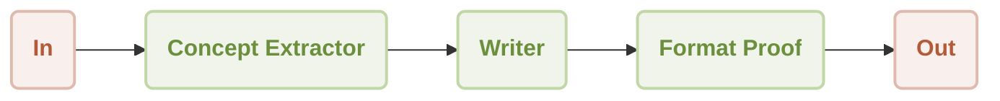

# Workflow Sequential

This guide demonstrates how to construct and execute a sequential workflow using the AIGNE Framework. You will learn how to chain multiple agents together, where the output of one agent becomes the input for the next, creating a step-by-step processing pipeline. This pattern is ideal for tasks that require a series of distinct, ordered operations.

## Overview

A sequential workflow processes tasks in a predefined order. Each agent in the sequence performs a specific function and passes its result to the subsequent agent. This ensures a predictable and controlled execution flow, similar to an assembly line.

This example builds a simple marketing content generation pipeline composed of three agents:

1.  **Concept Extractor**: Analyzes a product description to identify key features, target audience, and unique selling points.
2.  **Writer**: Uses the extracted concepts to compose a compelling marketing copy.
3.  **Format Proof**: Refines the draft copy by correcting grammar, improving clarity, and ensuring a polished final output.

The data flows through the agents in a strict sequence as illustrated below.



## Prerequisites

Before running the example, ensure your development environment meets the following requirements:

*   **Node.js**: Version 20.0 or higher.
*   **npm**: Included with Node.js.
*   **OpenAI API Key**: Required for the model interactions in this example. You can obtain one from the [OpenAI Platform](https://platform.openai.com/api-keys).

## Quick Start

You can run this example directly without a local installation using `npx`.

### Run the Example

Execute the following commands in your terminal.

To run in the default one-shot mode:
```bash icon=lucide:terminal
npx -y @aigne/example-workflow-sequential
```

To run in an interactive chat mode:
```bash icon=lucide:terminal
npx -y @aigne/example-workflow-sequential --interactive
```

You can also pipe input directly into the command:
```bash icon=lucide:terminal
echo "Create marketing content for our new AI-powered fitness app" | npx -y @aigne/example-workflow-sequential
```

### Connect to an AI Model

The first time you run the example, the application will detect that no AI model has been configured and will prompt you to connect to one.


You have several options to proceed:

**1. Connect via the Official AIGNE Hub (Recommended)**

This is the most straightforward method to get started. New users receive a complimentary token balance for trial purposes.

*   Select the first option in the prompt: `Connect to the Arcblock official AIGNE Hub`.
*   Your default web browser will open a new tab to the AIGNE Hub authorization page.
*   Follow the on-screen instructions to approve the connection.


**2. Connect via a Self-Hosted AIGNE Hub**

If you operate your own instance of AIGNE Hub, you can connect to it directly.

*   Select the second option: `Connect to my own AIGNE Hub`.
*   Enter the URL of your self-hosted AIGNE Hub instance when prompted in the terminal.


**3. Connect via a Third-Party Model Provider**

You can also connect directly to a supported third-party model provider, such as OpenAI. This requires setting the appropriate API key as an environment variable. For OpenAI, export the `OPENAI_API_KEY` variable:

```bash Set OpenAI API Key icon=lucide:terminal
export OPENAI_API_KEY="YOUR_OPENAI_API_KEY"
```

Replace `"YOUR_OPENAI_API_KEY"` with your actual key. After setting the environment variable, execute the run command again. For details on configuring other providers, refer to the `.env.local.example` file in the project repository.

## Installation (Optional)

If you prefer to run the example from a local clone of the repository, follow these steps.

**1. Clone the Repository**

```bash icon=lucide:terminal
git clone https://github.com/AIGNE-io/aigne-framework
```

**2. Install Dependencies**

Navigate to the example's directory and install the required packages using `pnpm`.

```bash icon=lucide:terminal
cd aigne-framework/examples/workflow-sequential
pnpm install
```

**3. Run the Example**

Use the `pnpm start` command to execute the workflow.

Run in one-shot mode:
```bash icon=lucide:terminal
pnpm start
```

Run in interactive chat mode (note the `--` before the argument):
```bash icon=lucide:terminal
pnpm start -- --interactive
```

Use pipeline input:
```bash icon=lucide:terminal
echo "Create marketing content for our new AI-powered fitness app" | pnpm start
```

### Command-Line Options

The example supports several command-line arguments for customization:

| Parameter | Description | Default |
|-----------|-------------|---------|
| `--interactive` | Run in interactive chat mode. | Disabled |
| `--model <provider[:model]>` | Specify the AI model to use (e.g., `openai` or `openai:gpt-4o-mini`). | `openai` |
| `--temperature <value>` | Set the temperature for model generation. | Provider default |
| `--top-p <value>` | Set the top-p sampling value. | Provider default |
| `--presence-penalty <value>` | Set the presence penalty value. | Provider default |
| `--frequency-penalty <value>` | Set the frequency penalty value. | Provider default |
| `--log-level <level>` | Set the logging level (`ERROR`, `WARN`, `INFO`, `DEBUG`, `TRACE`). | `INFO` |
| `--input`, `-i <input>` | Provide input directly as an argument. | `None` |

## Code Example

The core logic of the sequential workflow is defined in a single TypeScript file. It initializes three distinct `AIAgent` instances and orchestrates them within a `TeamAgent` configured for sequential execution.

```typescript sequential-workflow.ts
import { AIAgent, AIGNE, ProcessMode, TeamAgent } from "@aigne/core";
import { OpenAIChatModel } from "@aigne/core/models/openai-chat-model.js";

const { OPENAI_API_KEY } = process.env;

// 1. Initialize the model
const model = new OpenAIChatModel({
  apiKey: OPENAI_API_KEY,
});

// 2. Define the first agent in the sequence
const conceptExtractor = AIAgent.from({
  instructions: `\
You are a marketing analyst. Give a product description, identity:
- Key features
- Target audience
- Unique selling points

Product description:
{{product}}`,
  outputKey: "concept",
});

// 3. Define the second agent
const writer = AIAgent.from({
  instructions: `\
You are a marketing copywriter. Given a block of text describing features, audience, and USPs,
compose a compelling marketing copy (like a newsletter section) that highlights these points.
Output should be short (around 150 words), output just the copy as a single text block.

Product description:
{{product}}

Below is the info about the product:
{{concept}}`,
  outputKey: "draft",
});

// 4. Define the third agent
const formatProof = AIAgent.from({
  instructions: `\
You are an editor. Given the draft copy, correct grammar, improve clarity, ensure consistent tone,
give format and make it polished. Output the final improved copy as a single text block.

Product description:
{{product}}

Below is the info about the product:
{{concept}}

Draft copy:
{{draft}}`,
  outputKey: "content",
});

// 5. Initialize the AIGNE instance
const aigne = new AIGNE({ model });

// 6. Create a TeamAgent to manage the sequential workflow
const teamAgent = TeamAgent.from({
  skills: [conceptExtractor, writer, formatProof],
  mode: ProcessMode.sequential, // This ensures agents run one after another
});

// 7. Invoke the workflow with initial input
const result = await aigne.invoke(teamAgent, {
  product: "AIGNE is a No-code Generative AI Apps Engine",
});

console.log(result);

/*
// Expected Output Structure:
{
  concept: "...", // Output from conceptExtractor
  draft: "...",   // Output from writer
  content: "..."  // Output from formatProof
}
*/
```

This script demonstrates the following key steps:
1.  An `OpenAIChatModel` instance is created to handle communication with the LLM.
2.  Three `AIAgent` instances (`conceptExtractor`, `writer`, `formatProof`) are defined with specific instructions. Each agent's `outputKey` determines the key under which its result is stored.
3.  The `writer` agent uses the output of the `conceptExtractor` via the `{{concept}}` placeholder. Similarly, `formatProof` uses `{{concept}}` and `{{draft}}`.
4.  A `TeamAgent` is configured with the three agents in its `skills` array. The `mode` is set to `ProcessMode.sequential`, which instructs the team to execute the agents in the order they are provided.
5.  Finally, `aigne.invoke()` starts the workflow, passing the initial product description. The final result is an object containing the outputs from all agents in the sequence.

## Debugging

To monitor and debug the execution of your agents, you can use the `aigne observe` command. This tool provides a web-based interface to inspect traces, review inputs and outputs, and analyze the performance of your workflow.

First, start the observation server in your terminal:

```bash icon=lucide:terminal
aigne observe
```

The server will start, and you can access the UI at `http://localhost:7893`.


After running your workflow, the execution trace will appear in the observability interface, allowing you to examine each step of the sequence in detail.


## Summary

This guide covered the setup and execution of a sequential workflow. By defining a series of agents and orchestrating them with a `TeamAgent` in sequential mode, you can build powerful, multi-step processing pipelines for complex tasks.

For more advanced workflow patterns, explore the following examples:

<x-cards data-columns="2">
  <x-card data-title="Workflow: Parallel Execution" data-href="/examples/workflow-concurrency" data-icon="lucide:git-fork">Learn how to run multiple agents simultaneously to improve performance.</x-card>
  <x-card data-title="Workflow: Orchestration" data-href="/examples/workflow-orchestration" data-icon="lucide:network">Coordinate multiple agents in more complex, non-linear pipelines.</x-card>
</x-cards>
