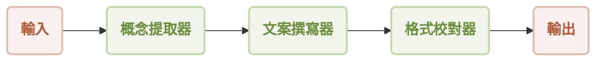

# 循序工作流程

本指南將示範如何使用 AIGNE 框架建構並執行循序工作流程。您將學習如何將多個 Agent 串聯在一起，其中一個 Agent 的輸出會成為下一個 Agent 的輸入，從而建立一個逐步處理的管線。此模式非常適合需要一系列明確、有序操作的任務。

## 總覽

循序工作流程會依照預定的順序處理任務。序列中的每個 Agent 都會執行特定的功能，並將其結果傳遞給後續的 Agent。這確保了可預測且受控的執行流程，類似於一條裝配線。

此範例建立了一個由三個 Agent 組成的簡單行銷內容生成管線：

1.  **概念提取器**：分析產品描述，以識別關鍵功能、目標受眾和獨特的賣點。
2.  **文案撰寫器**：使用提取出的概念來撰寫引人入勝的行銷文案。
3.  **格式校對器**：透過修正文法、提高清晰度並確保最終輸出精煉來完善文案草稿。

資料會依照如下圖所示的嚴格順序流經這些 Agent。



## 先決條件

在執行範例之前，請確保您的開發環境符合以下要求：

*   **Node.js**：20.0 或更高版本。
*   **npm**：隨 Node.js 一併安裝。
*   **OpenAI API 金鑰**：此範例中的模型互動需要此金鑰。您可以從 [OpenAI Platform](https://platform.openai.com/api-keys) 取得。

## 快速入門

您可以使用 `npx` 直接執行此範例，無需進行本機安裝。

### 執行範例

在您的終端機中執行以下指令。

以預設的單次模式執行：
```bash icon=lucide:terminal
npx -y @aigne/example-workflow-sequential
```

以互動式聊天模式執行：
```bash icon=lucide:terminal
npx -y @aigne/example-workflow-sequential --interactive
```

您也可以將輸入直接透過管道傳遞給指令：
```bash icon=lucide:terminal
echo "Create marketing content for our new AI-powered fitness app" | npx -y @aigne/example-workflow-sequential
```

### 連接 AI 模型

當您首次執行範例時，應用程式會偵測到尚未設定 AI 模型，並會提示您連接一個。


您有幾個選項可以繼續：

**1. 透過官方 AIGNE Hub 連接（建議）**

這是最直接的入門方法。新使用者會收到免費的試用代幣額度。

*   在提示中選擇第一個選項：`Connect to the Arcblock official AIGNE Hub`。
*   您的預設網頁瀏覽器將會開啟一個新分頁，前往 AIGNE Hub 授權頁面。
*   依照螢幕上的指示核准連接。


**2. 透過自行託管的 AIGNE Hub 連接**

如果您自行營運 AIGNE Hub 實例，可以直接連接到它。

*   選擇第二個選項：`Connect to my own AIGNE Hub`。
*   在終端機提示時，輸入您自行託管的 AIGNE Hub 實例的 URL。


**3. 透過第三方模型提供者連接**

您也可以直接連接到支援的第三方模型提供者，例如 OpenAI。這需要將相應的 API 金鑰設定為環境變數。對於 OpenAI，請匯出 `OPENAI_API_KEY` 變數：

```bash 設定 OpenAI API 金鑰 icon=lucide:terminal
export OPENAI_API_KEY="YOUR_OPENAI_API_KEY"
```

請將 `"YOUR_OPENAI_API_KEY"` 替換為您的實際金鑰。設定環境變數後，再次執行執行指令。有關設定其他提供者的詳細資訊，請參閱專案儲存庫中的 `.env.local.example` 檔案。

## 安裝（選用）

如果您偏好從本機複製的儲存庫執行範例，請依照以下步驟操作。

**1. 複製儲存庫**

```bash icon=lucide:terminal
git clone https://github.com/AIGNE-io/aigne-framework
```

**2. 安裝依賴套件**

導覽至範例的目錄並使用 `pnpm` 安裝所需的套件。

```bash icon=lucide:terminal
cd aigne-framework/examples/workflow-sequential
pnpm install
```

**3. 執行範例**

使用 `pnpm start` 指令來執行工作流程。

以單次模式執行：
```bash icon=lucide:terminal
pnpm start
```

以互動式聊天模式執行（注意參數前的 `--`）：
```bash icon=lucide:terminal
pnpm start -- --interactive
```

使用管道輸入：
```bash icon=lucide:terminal
echo "Create marketing content for our new AI-powered fitness app" | pnpm start
```

### 命令列選項

此範例支援多個命令列參數以進行自訂：

| 參數 | 說明 | 預設值 |
|-----------|-------------|---------|
| `--interactive` | 以互動式聊天模式執行。 | 停用 |
| `--model <provider[:model]>` | 指定要使用的 AI 模型（例如 `openai` 或 `openai:gpt-4o-mini`）。 | `openai` |
| `--temperature <value>` | 設定模型生成的溫度。 | 提供者預設值 |
| `--top-p <value>` | 設定 top-p 取樣值。 | 提供者預設值 |
| `--presence-penalty <value>` | 設定存在懲罰值。 | 提供者預設值 |
| `--frequency-penalty <value>` | 設定頻率懲罰值。 | 提供者預設值 |
| `--log-level <level>` | 設定日誌記錄層級（`ERROR`、`WARN`、`INFO`、`DEBUG`、`TRACE`）。 | `INFO` |
| `--input`, `-i <input>` | 直接以參數形式提供輸入。 | `None` |

## 程式碼範例

循序工作流程的核心邏輯定義在單一的 TypeScript 檔案中。它初始化了三個不同的 `AIAgent` 實例，並將它們組織在一個設定為循序執行的 `TeamAgent` 中。

```typescript sequential-workflow.ts
import { AIAgent, AIGNE, ProcessMode, TeamAgent } from "@aigne/core";
import { OpenAIChatModel } from "@aigne/core/models/openai-chat-model.js";

const { OPENAI_API_KEY } = process.env;

// 1. 初始化模型
const model = new OpenAIChatModel({
  apiKey: OPENAI_API_KEY,
});

// 2. 定義序列中的第一個 Agent
const conceptExtractor = AIAgent.from({
  instructions: `\
您是一位行銷分析師。根據產品描述，識別出：
- 關鍵功能
- 目標受眾
- 獨特賣點

產品描述：
{{product}}`,
  outputKey: "concept",
});

// 3. 定義第二個 Agent
const writer = AIAgent.from({
  instructions: `\
您是一位行銷文案撰寫員。根據一段描述功能、受眾和獨特賣點的文字，
撰寫一篇引人入勝的行銷文案（例如新聞通訊的一個章節），以突顯這些要點。
輸出應簡短（約 150 字），僅輸出文案作為單一文字區塊。

產品描述：
{{product}}

以下是關於該產品的資訊：
{{concept}}`,
  outputKey: "draft",
});

// 4. 定義第三個 Agent
const formatProof = AIAgent.from({
  instructions: `\
您是一位編輯。根據文案草稿，修正文法、提高清晰度、確保語氣一致，
進行格式化並使其精煉。將最終改進後的文案作為單一文字區塊輸出。

產品描述：
{{product}}

以下是關於該產品的資訊：
{{concept}}

文案草稿：
{{draft}}`,
  outputKey: "content",
});

// 5. 初始化 AIGNE 實例
const aigne = new AIGNE({ model });

// 6. 建立一個 TeamAgent 來管理循序工作流程
const teamAgent = TeamAgent.from({
  skills: [conceptExtractor, writer, formatProof],
  mode: ProcessMode.sequential, // 這確保 Agent 會一個接一個地執行
});

// 7. 使用初始輸入來叫用工作流程
const result = await aigne.invoke(teamAgent, {
  product: "AIGNE is a No-code Generative AI Apps Engine",
});

console.log(result);

/*
// 預期的輸出結構：
{
  concept: "...", // conceptExtractor 的輸出
  draft: "...",   // writer 的輸出
  content: "..."  // formatProof 的輸出
}
*/
```

此指令稿展示了以下關鍵步驟：
1.  建立一個 `OpenAIChatModel` 實例來處理與 LLM 的通訊。
2.  定義了三個具有特定指示的 `AIAgent` 實例（`conceptExtractor`、`writer`、`formatProof`）。每個 Agent 的 `outputKey` 決定了其結果儲存時所使用的鍵。
3.  `writer` Agent 透過 `{{concept}}` 預留位置使用 `conceptExtractor` 的輸出。同樣地，`formatProof` 使用 `{{concept}}` 和 `{{draft}}`。
4.  設定一個 `TeamAgent`，並在其 `skills` 陣列中包含這三個 Agent。`mode` 被設定為 `ProcessMode.sequential`，這會指示團隊依照提供的順序執行這些 Agent。
5.  最後，`aigne.invoke()` 啟動工作流程，並傳入初始的產品描述。最終結果是一個包含序列中所有 Agent 輸出的物件。

## 偵錯

若要監控和偵錯您的 Agent 執行過程，您可以使用 `aigne observe` 指令。此工具提供一個基於網頁的介面，用於檢查追蹤、檢視輸入和輸出，以及分析您工作流程的效能。

首先，在您的終端機中啟動觀察伺服器：

```bash icon=lucide:terminal
aigne observe
```

伺服器將會啟動，您可以透過 `http://localhost:7893` 存取 UI。


執行您的工作流程後，執行追蹤將會出現在可觀察性介面中，讓您能夠詳細檢查序列中的每一步。


## 總結

本指南涵蓋了循序工作流程的設定與執行。透過定義一系列 Agent 並使用 `TeamAgent` 以循序模式來進行協調，您可以為複雜的任務建構強大的多步驟處理管線。

如需更進階的工作流程模式，請探索以下範例：

<x-cards data-columns="2">
  <x-card data-title="工作流程：平行執行" data-href="/examples/workflow-concurrency" data-icon="lucide:git-fork">了解如何同時執行多個 Agent 以提高效能。</x-card>
  <x-card data-title="工作流程：協調" data-href="/examples/workflow-orchestration" data-icon="lucide:network">在更複雜、非線性的管線中協調多個 Agent。</x-card>
</x-cards>
