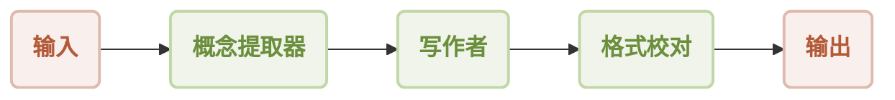
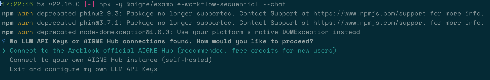

# 顺序工作流

本指南演示了如何使用 AIGNE 框架构建并执行顺序工作流。您将学习如何将多个 Agent 链接在一起，其中一个 Agent 的输出成为下一个 Agent 的输入，从而创建一个逐步处理的管道。这种模式非常适合需要一系列明确、有序操作的任务。

## 概述

顺序工作流按预定义顺序处理任务。序列中的每个 Agent 执行特定功能，并将其结果传递给后续 Agent。这确保了可预测且受控的执行流程，类似于流水线。

本示例构建了一个简单的营销内容生成管道，由三个 Agent 组成：

1.  **概念提取器 (Concept Extractor)**：分析产品描述，以识别关键特性、目标受众和独特卖点。
2.  **写作者 (Writer)**：利用提取的概念撰写引人注目的营销文案。
3.  **格式校对 (Format Proof)**：通过纠正语法、提高清晰度并确保最终输出精炼来完善草稿。

数据按照下图所示的严格顺序流经各个 Agent。



## 前置条件

在运行示例之前，请确保您的开发环境满足以下要求：

*   **Node.js**：版本 20.0 或更高。
*   **npm**：随 Node.js 一同安装。
*   **OpenAI API 密钥**：本示例中的模型交互需要使用。您可以从 [OpenAI Platform](https://platform.openai.com/api-keys) 获取。

## 快速开始

您可以使用 `npx` 直接运行此示例，无需本地安装。

### 运行示例

在您的终端中执行以下命令。

以默认的单次模式运行：
```bash icon=lucide:terminal
npx -y @aigne/example-workflow-sequential
```

以交互式聊天模式运行：
```bash icon=lucide:terminal
npx -y @aigne/example-workflow-sequential --interactive
```

您也可以将输入直接通过管道传递给命令：
```bash icon=lucide:terminal
echo "为我们新推出的人工智能健身应用创建营销内容" | npx -y @aigne/example-workflow-sequential
```

### 连接到 AI 模型

首次运行该示例时，应用程序将检测到尚未配置 AI 模型，并提示您连接一个。



您有多种选择可以继续：

**1. 通过 AIGNE 官方 Hub 连接（推荐）**

这是最直接的入门方法。新用户会获得免费的试用额度。

*   在提示中选择第一个选项：`Connect to the Arcblock official AIGNE Hub`。
*   您的默认网络浏览器将打开一个新标签页，跳转到 AIGNE Hub 授权页面。
*   按照屏幕上的说明批准连接。


**2. 通过自托管的 AIGNE Hub 连接**

如果您运行自己的 AIGNE Hub 实例，可以直接连接到它。

*   选择第二个选项：`Connect to my own AIGNE Hub`。
*   在终端提示时，输入您自托管的 AIGNE Hub 实例的 URL。


**3. 通过第三方模型提供商连接**

您也可以直接连接到受支持的第三方模型提供商，例如 OpenAI。这需要将相应的 API 密钥设置为环境变量。对于 OpenAI，请导出 `OPENAI_API_KEY` 变量：

```bash 设置 OpenAI API 密钥 icon=lucide:terminal
export OPENAI_API_KEY="YOUR_OPENAI_API_KEY"
```

请将 `"YOUR_OPENAI_API_KEY"` 替换为您的实际密钥。设置环境变量后，再次执行运行命令。有关配置其他提供商的详细信息，请参阅项目代码仓库中的 `.env.local.example` 文件。

## 安装（可选）

如果您希望从本地克隆的代码仓库运行示例，请按照以下步骤操作。

**1. 克隆代码仓库**

```bash icon=lucide:terminal
git clone https://github.com/AIGNE-io/aigne-framework
```

**2. 安装依赖**

导航到示例目录，并使用 `pnpm` 安装所需的包。

```bash icon=lucide:terminal
cd aigne-framework/examples/workflow-sequential
pnpm install
```

**3. 运行示例**

使用 `pnpm start` 命令执行工作流。

以单次模式运行：
```bash icon=lucide:terminal
pnpm start
```

以交互式聊天模式运行（注意参数前的 `--`）：
```bash icon=lucide:terminal
pnpm start -- --interactive
```

使用管道输入：
```bash icon=lucide:terminal
echo "为我们新推出的人工智能健身应用创建营销内容" | pnpm start
```

### 命令行选项

该示例支持多个命令行参数以进行自定义：

| 参数 | 描述 | 默认值 |
|-----------|-------------|---------|
| `--interactive` | 以交互式聊天模式运行。 | 禁用 |
| `--model <provider[:model]>` | 指定要使用的 AI 模型（例如 `openai` 或 `openai:gpt-4o-mini`）。 | `openai` |
| `--temperature <value>` | 设置模型生成的温度。 | 提供商默认值 |
| `--top-p <value>` | 设置 top-p 抽样值。 | 提供商默认值 |
| `--presence-penalty <value>` | 设置存在惩罚值。 | 提供商默认值 |
| `--frequency-penalty <value>` | 设置频率惩罚值。 | 提供商默认值 |
| `--log-level <level>` | 设置日志级别（`ERROR`、`WARN`、`INFO`、`DEBUG`、`TRACE`）。 | `INFO` |
| `--input`, `-i <input>` | 直接以参数形式提供输入。 | `None` |

## 代码示例

顺序工作流的核心逻辑定义在一个 TypeScript 文件中。它初始化了三个不同的 `AIAgent` 实例，并将它们配置为一个顺序执行的 `TeamAgent` 来进行编排。

```typescript sequential-workflow.ts
import { AIAgent, AIGNE, ProcessMode, TeamAgent } from "@aigne/core";
import { OpenAIChatModel } from "@aigne/core/models/openai-chat-model.js";

const { OPENAI_API_KEY } = process.env;

// 1. 初始化模型
const model = new OpenAIChatModel({
  apiKey: OPENAI_API_KEY,
});

// 2. 定义序列中的第一个 Agent
const conceptExtractor = AIAgent.from({
  instructions: `\
您是一位市场分析师。根据产品描述，识别出：
- 关键特性
- 目标受众
- 独特卖点

产品描述：
{{product}}`,
  outputKey: "concept",
});

// 3. 定义第二个 Agent
const writer = AIAgent.from({
  instructions: `\
您是一位营销文案撰稿人。根据一段描述特性、受众和独特卖点的文本，
撰写一篇引人注目的营销文案（例如新闻简报的一个章节），突出这些要点。
输出应简短（约 150 字），仅输出文案本身，作为一个单独的文本块。

产品描述：
{{product}}

以下是有关该产品的信息：
{{concept}}`,
  outputKey: "draft",
});

// 4. 定义第三个 Agent
const formatProof = AIAgent.from({
  instructions: `\
您是一位编辑。根据草稿文案，纠正语法，提高清晰度，确保语调一致，
进行格式化，使其更加精炼。将最终改进后的文案作为一个单独的文本块输出。

产品描述：
{{product}}

以下是有关该产品的信息：
{{concept}}

草稿文案：
{{draft}}`,
  outputKey: "content",
});

// 5. 初始化 AIGNE 实例
const aigne = new AIGNE({ model });

// 6. 创建一个 TeamAgent 来管理顺序工作流
const teamAgent = TeamAgent.from({
  skills: [conceptExtractor, writer, formatProof],
  mode: ProcessMode.sequential, // 这确保了 Agent 按顺序逐个运行
});

// 7. 使用初始输入调用工作流
const result = await aigne.invoke(teamAgent, {
  product: "AIGNE 是一个无代码的生成式 AI 应用引擎",
});

console.log(result);

/*
// 预期的输出结构：
{
  concept: "...", // 来自 conceptExtractor 的输出
  draft: "...",   // 来自 writer 的输出
  content: "..."  // 来自 formatProof 的输出
}
*/
```

该脚本演示了以下关键步骤：
1.  创建一个 `OpenAIChatModel` 实例来处理与 LLM 的通信。
2.  定义了三个具有特定指令的 `AIAgent` 实例（`conceptExtractor`、`writer`、`formatProof`）。每个 Agent 的 `outputKey` 决定了其结果存储时所使用的键。
3.  `writer` Agent 通过 `{{concept}}` 占位符使用 `conceptExtractor` 的输出。同样，`formatProof` 使用 `{{concept}}` 和 `{{draft}}`。
4.  配置一个 `TeamAgent`，将其 `skills` 数组中包含这三个 Agent。`mode` 设置为 `ProcessMode.sequential`，指示团队按其提供的顺序执行 Agent。
5.  最后，`aigne.invoke()` 启动工作流，并传入初始产品描述。最终结果是一个包含序列中所有 Agent 输出的对象。

## 调试

要监控和调试 Agent 的执行情况，您可以使用 `aigne observe` 命令。该工具提供了一个基于 Web 的界面，用于检查跟踪、审查输入和输出，并分析工作流的性能。

首先，在您的终端中启动观察服务器：

```bash icon=lucide:terminal
aigne observe
```

服务器将启动，您可以通过 `http://localhost:7893` 访问 UI。


运行您的工作流后，执行跟踪将显示在可观察性界面中，让您可以详细检查序列中的每一步。


## 总结

本指南介绍了顺序工作流的设置和执行。通过定义一系列 Agent 并使用 `TeamAgent` 以顺序模式进行编排，您可以为复杂任务构建功能强大的多步骤处理管道。

要了解更高级的工作流模式，请浏览以下示例：

<x-cards data-columns="2">
  <x-card data-title="工作流：并行执行" data-href="/examples/workflow-concurrency" data-icon="lucide:git-fork">了解如何同时运行多个 Agent 以提高性能。</x-card>
  <x-card data-title="工作流：编排" data-href="/examples/workflow-orchestration" data-icon="lucide:network">在更复杂的非线性管道中协调多个 Agent。</x-card>
</x-cards>
