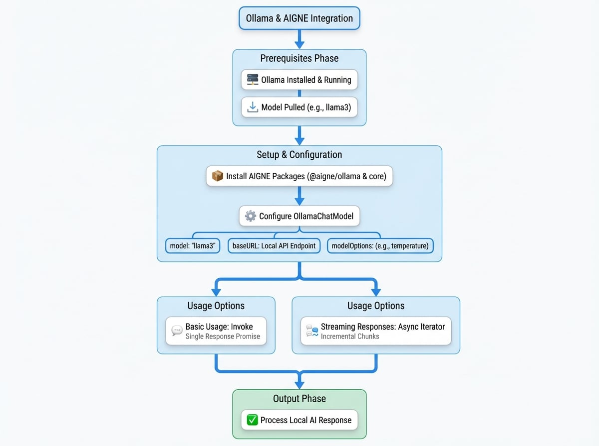

# Ollama

`@aigne/ollama` パッケージは、AIGNE フレームワークと [Ollama](https://ollama.ai/) を介してローカルでホストされるAIモデルとのシームレスな統合を提供します。これにより、開発者は独自のハードウェア上で実行される多種多様なオープンソース言語モデルを活用でき、プライバシーとAI機能へのオフラインアクセスを確保できます。

このガイドでは、AIGNE アプリケーションで `OllamaChatModel` を設定して使用するために必要な手順を説明します。他のモデルプロバイダーに関する情報については、[モデル概要](./models-overview.md) を参照してください。

次の図は、AIGNE フレームワークがローカルのOllamaインスタンスとどのように対話するかを示しています。

<!-- DIAGRAM_IMAGE_START:guide:4:3 -->

<!-- DIAGRAM_IMAGE_END -->

## 前提条件

このパッケージを使用する前に、ローカルマシンにOllamaをインストールして実行している必要があります。また、少なくとも1つのモデルをプルしておく必要があります。詳細な手順については、[Ollama公式サイト](https://ollama.ai/) を参照してください。

## インストール

始めるには、お好みのパッケージマネージャーを使用して必要なAIGNEパッケージをインストールします。

<x-cards data-columns="3">
  <x-card data-title="npm" data-icon="logos:npm-icon">
    ```bash
    npm install @aigne/ollama @aigne/core
    ```
  </x-card>
  <x-card data-title="yarn" data-icon="logos:yarn">
    ```bash
    yarn add @aigne/ollama @aigne/core
    ```
  </x-card>
  <x-card data-title="pnpm" data-icon="logos:pnpm">
    ```bash
    pnpm add @aigne/ollama @aigne/core
    ```
  </x-card>
</x-cards>

## 設定

`OllamaChatModel` クラスは、Ollamaと対話するための主要なインターフェースです。モデルをインスタンス化する際に、その動作をカスタマイズするためのいくつかの設定オプションを指定できます。

```typescript OllamaChatModel のインスタンス化 icon=logos:typescript-icon
import { OllamaChatModel } from "@aigne/ollama";

const model = new OllamaChatModel({
  // 使用するOllamaモデルを指定
  model: "llama3",
  
  // ローカルOllamaインスタンスのベースURL
  baseURL: "http://localhost:11434/v1",

  // モデルに渡すオプションのパラメーター
  modelOptions: {
    temperature: 0.7,
  },
});
```

コンストラクターは以下のパラメーターを受け入れます:

<x-field-group>
  <x-field data-name="model" data-type="string" data-default="llama3.2" data-required="false">
    <x-field-desc markdown>使用するモデルの名前（例: `llama3`、`mistral`）。Ollamaインスタンスでモデルがプルされていることを確認してください。</x-field-desc>
  </x-field>
  <x-field data-name="baseURL" data-type="string" data-default="http://localhost:11434/v1" data-required="false">
    <x-field-desc markdown>Ollama APIのベースURL。これは `OLLAMA_BASE_URL` 環境変数を使用して設定することもできます。</x-field-desc>
  </x-field>
  <x-field data-name="apiKey" data-type="string" data-default="ollama" data-required="false">
    <x-field-desc markdown>プレースホルダーのAPIキー。Ollamaはデフォルトで認証を必要としませんが、AIGNEフレームワークでは空でないキーが必要です。デフォルトは `"ollama"` で、`OLLAMA_API_KEY` 環境変数で設定できます。</x-field-desc>
  </x-field>
  <x-field data-name="modelOptions" data-type="object" data-required="false">
    <x-field-desc markdown>`temperature`、`top_p`など、Ollama APIに渡す追加のパラメーターを含むオブジェクト。これらのオプションにより、モデルの応答生成を微調整できます。</x-field-desc>
  </x-field>
</x-field-group>

## 基本的な使用方法

モデルを実行するには、`invoke` メソッドを使用します。メッセージペイロードを渡してチャット補完を生成します。

```typescript 基本的な呼び出し icon=logos:typescript-icon
import { OllamaChatModel } from "@aigne/ollama";

const model = new OllamaChatModel({
  model: "llama3",
  modelOptions: {
    temperature: 0.8,
  },
});

const result = await model.invoke({
  messages: [{ role: "user", content: "Explain the importance of local AI models." }],
});

console.log(result.text);
```

`invoke` メソッドは、モデルの応答を含むオブジェクトに解決されるPromiseを返します。

**応答の例**
```json
{
  "text": "ローカルAIモデルはいくつかの理由で非常に重要です。第一に、データはデバイス上で処理され、ユーザーのマシンから決して離れることがないため、プライバシーとセキュリティが強化されます...",
  "model": "llama3"
}
```

## ストリーミング応答

リアルタイムの対話が必要なアプリケーションでは、モデルの応答をストリーミングできます。`invoke` メソッドで `streaming` オプションを `true` に設定します。このメソッドは、応答チャンクが利用可能になるたびにそれを生成する非同期イテレーターを返します。

```typescript ストリーミングの例 icon=logos:typescript-icon
import { isAgentResponseDelta } from "@aigne/core";
import { OllamaChatModel } from "@aigne/ollama";

const model = new OllamaChatModel({
  model: "llama3",
});

const stream = await model.invoke(
  {
    messages: [{ role: "user", content: "Tell me a short story about a robot." }],
  },
  { streaming: true },
);

let fullText = "";
process.stdout.write("応答: ");

for await (const chunk of stream) {
  if (isAgentResponseDelta(chunk)) {
    const text = chunk.delta.text?.text;
    if (text) {
      fullText += text;
      process.stdout.write(text);
    }
  }
}

console.log("\n\n--- ストリームの終わり ---");
console.log("全文:", fullText);
```

この例は、ストリームを処理する方法を示しています。各チャンクは完全な応答の差分です。各チャンクからテキストを蓄積して、完全なメッセージを再構築できます。

## まとめ

`@aigne/ollama` パッケージは、ローカルのオープンソースモデルをAIGNEアプリケーションに統合するための、堅牢で簡単な方法を提供します。このガイドの手順に従うことで、`OllamaChatModel` をセットアップし、ニーズに合わせて設定し、標準補完とストリーミング補完の両方を活用できます。

他の利用可能なモデルに関する詳細については、以下のガイドを参照してください:
- [OpenAI](./models-openai.md)
- [Google Gemini](./models-gemini.md)
- [Anthropic](./models-anthropic.md)