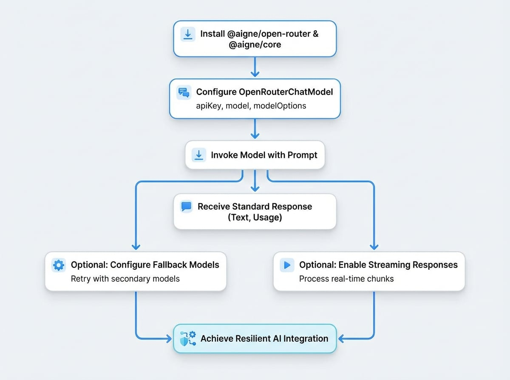

# OpenRouter

OpenRouterは、OpenAI、Anthropic、Googleなど、さまざまなプロバイダーが提供する多様なAIモデルへの統一されたゲートウェイとして機能します。`@aigne/open-router` パッケージは、これらのモデルをAIGNEフレームワークに統合するための標準化されたインターフェースを提供します。これにより、開発者は最小限のコード変更で異なるモデル間を切り替え、堅牢なフォールバックメカニズムを実装できます。

このガイドでは、`@aigne/open-router` パッケージをインストール、設定、および利用して、複数のAIモデルを活用するプロセスを詳しく説明します。

<!-- DIAGRAM_IMAGE_START:guide:4:3 -->

<!-- DIAGRAM_IMAGE_END -->

## インストール

まず、`@aigne/open-router` と `@aigne/core` パッケージをインストールします。以下のコマンドは、npm、yarn、pnpm を使用したインストール方法を示しています。

```bash npm
npm install @aigne/open-router @aigne/core
```

```bash yarn
yarn add @aigne/open-router @aigne/core
```

```bash pnpm
pnpm add @aigne/open-router @aigne/core
```

## 設定と使用方法

`OpenRouterChatModel` クラスは、OpenRouter API と対話するための主要なインターフェースです。これを使用するには、OpenRouter API キーを提供する必要があります。これは、コンストラクタで `apiKey` オプションを介して直接行うか、`OPEN_ROUTER_API_KEY` 環境変数を設定することで行えます。

### 基本的な例

以下は、チャットリクエストを送信するための `OpenRouterChatModel` の標準的な実装です。この例では、Anthropic の `claude-3-opus` モデルを使用しています。

```typescript Basic Usage icon=logos:typescript
import { OpenRouterChatModel } from "@aigne/open-router";

const model = new OpenRouterChatModel({
  // APIキーを直接提供するか、環境変数 OPEN_ROUTER_API_KEY を使用します
  apiKey: "your-api-key", // 環境変数に設定されている場合はオプションです
  // モデルを指定します（デフォルトは'openai/gpt-4o'）
  model: "anthropic/claude-3-opus",
  modelOptions: {
    temperature: 0.7,
  },
});

const result = await model.invoke({
  messages: [{ role: "user", content: "Which model are you using?" }],
});

console.log(result);
```

期待される出力には、テキストの応答、モデル識別子、およびトークン使用量のメトリクスが含まれます。

```json Output icon=mdi:code-json
{
  "text": "I am currently using the anthropic/claude-3-opus model, accessed through OpenRouter.",
  "model": "anthropic/claude-3-opus",
  "usage": {
    "inputTokens": 15,
    "outputTokens": 23
  }
}
```

### コンストラクタのオプション

`OpenRouterChatModel` は `@aigne/openai` パッケージの `OpenAIChatModel` を拡張しており、同じコンストラクタオプションを受け入れます。

<x-field-group>
  <x-field data-name="apiKey" data-type="string" data-required="false">
    <x-field-desc markdown>OpenRouter APIキー。指定しない場合、クライアントは環境変数 `OPEN_ROUTER_API_KEY` を確認します。</x-field-desc>
  </x-field>
  <x-field data-name="model" data-type="string" data-default="openai/gpt-4o" data-required="false">
    <x-field-desc markdown>使用したいモデルの識別子（例：`anthropic/claude-3-opus`）。</x-field-desc>
  </x-field>
  <x-field data-name="fallbackModels" data-type="string[]" data-required="false">
    <x-field-desc markdown>プライマリモデルが失敗した場合にフォールバックとして使用するモデル識別子の配列。</x-field-desc>
  </x-field>
  <x-field data-name="baseURL" data-type="string" data-default="https://openrouter.ai/api/v1" data-required="false">
    <x-field-desc markdown>OpenRouter API のベース URL。テストやプロキシ用に上書きできます。</x-field-desc>
  </x-field>
  <x-field data-name="modelOptions" data-type="object" data-required="false">
    <x-field-desc markdown>モデルプロバイダーに渡すパラメータを含むオブジェクト。例えば `temperature`、`max_tokens`、`top_p` など。</x-field-desc>
  </x-field>
</x-field-group>

## フォールバック付きで複数のモデルを使用する

`@aigne/open-router` パッケージの主要な機能の1つは、フォールバックモデルを指定する機能です。プライマリモデルのリクエストが失敗した場合、システムは自動的に `fallbackModels` リストの次のモデルでリクエストを再試行します。これにより、アプリケーションの信頼性が向上します。

```typescript Model Fallbacks icon=logos:typescript
import { OpenRouterChatModel } from "@aigne/open-router";

const modelWithFallbacks = new OpenRouterChatModel({
  apiKey: "your-api-key",
  model: "openai/gpt-4o",
  fallbackModels: ["anthropic/claude-3-opus", "google/gemini-1.5-pro"], // フォールバックの順序
  modelOptions: {
    temperature: 0.7,
  },
});

// まず gpt-4o を試し、それが失敗した場合は claude-3-opus、次に gemini-1.5-pro を試します
const fallbackResult = await modelWithFallbacks.invoke({
  messages: [{ role: "user", content: "Which model are you using?" }],
});

console.log(fallbackResult);
```

## ストリーミング応答

リアルタイムな対話を必要とするアプリケーションでは、ストリーミングを有効にして、応答チャンクが利用可能になったときに処理できます。`invoke` メソッドで `streaming: true` オプションを設定します。

応答ストリームは、完全なメッセージを組み立てるためにイテレートする必要があります。

```typescript Streaming Example icon=logos:typescript
import { isAgentResponseDelta } from "@aigne/core";
import { OpenRouterChatModel } from "@aigne/open-router";

const model = new OpenRouterChatModel({
  apiKey: "your-api-key",
  model: "anthropic/claude-3-opus",
});

const stream = await model.invoke(
  {
    messages: [{ role: "user", content: "Which model are you using?" }],
  },
  { streaming: true },
);

let fullText = "";
const json = {};

for await (const chunk of stream) {
  if (isAgentResponseDelta(chunk)) {
    const text = chunk.delta.text?.text;
    if (text) fullText += text;
    if (chunk.delta.json) Object.assign(json, chunk.delta.json);
  }
}

console.log(fullText);
console.log(json);
```

最終的な `fullText` と `json` オブジェクトには、集約された応答データが含まれます。

```text Output icon=mdi:console
I am currently using the anthropic/claude-3-opus model, accessed through OpenRouter.
{ model: 'anthropic/claude-3-opus', usage: { inputTokens: 15, outputTokens: 23 } }
```

## まとめ

`@aigne/open-router` パッケージは、統一された弾力性のあるインターフェースを通じて、幅広い言語モデルへのアクセスを簡素化します。モデルのフォールバックやストリーミングなどの機能を活用することで、より堅牢で応答性の高いAIアプリケーションを構築できます。

AIGNEフレームワークにおけるモデルの基本概念に関する詳細については、[モデルの概要](./models-overview.md)を参照してください。