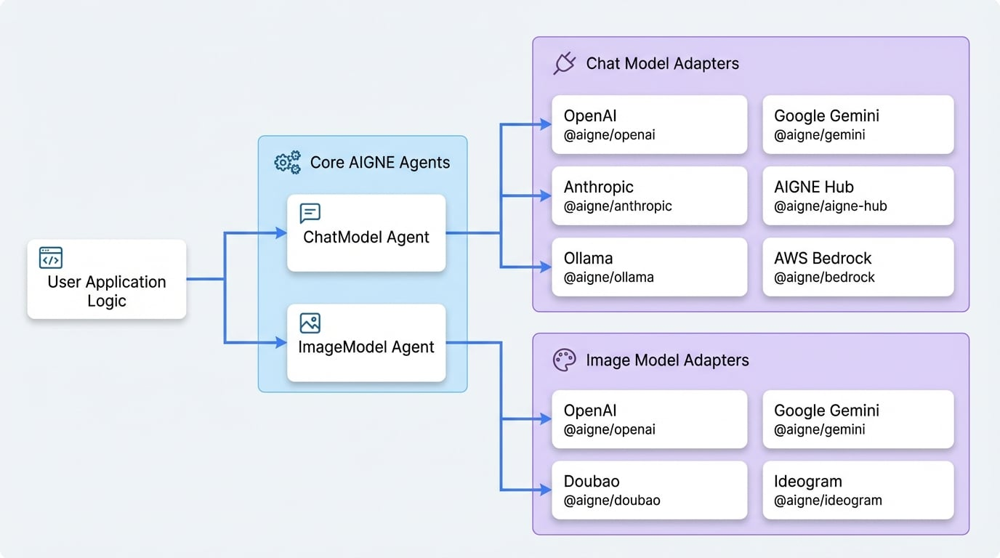

# 總覽

AIGNE 框架的設計與模型無關，讓開發者可以整合來自不同供應商的各種大型語言模型 (LLM) 和圖像生成模型。這是透過一個標準化的適配器系統來實現的，該系統將每個供應商獨特的 API 抽象化為一個一致的介面。

此系統的核心是 `ChatModel` 和 `ImageModel` agents。這些特製化的 agents 作為您應用程式邏輯與外部 AI 服務之間的橋樑。透過使用這些標準化的 agents，您只需極少的程式碼變更，通常只需要更改設定，即可在不同模型供應商之間切換。每個支援的供應商都有一個專用套件 (例如 `@aigne/openai`、`@aigne/anthropic`)，其中包含與其 API 通訊的具體實作。

本節概述了所有官方支援的模型供應商。關於如何安裝、設定和使用特定供應商的詳細說明，請參閱其專屬的文件頁面。

<!-- DIAGRAM_IMAGE_START:architecture:16:9 -->

<!-- DIAGRAM_IMAGE_END -->

## 支援的聊天模型

下表列出了 AIGNE 框架官方支援的聊天模型供應商。選擇一個供應商以查看其詳細的整合指南。

| 供應商 | 套件 |
| :--- | :--- |
| [AIGNE Hub](./models-aigne-hub.md) | `@aigne/aigne-hub` |
| [Anthropic](./models-anthropic.md) | `@aigne/anthropic` |
| [AWS Bedrock](./models-bedrock.md) | `@aigne/bedrock` |
| [DeepSeek](./models-deepseek.md) | `@aigne/deepseek` |
| [Doubao](./models-doubao.md) | `@aigne/doubao` |
| [Google Gemini](./models-gemini.md) | `@aigne/gemini` |
| [LMStudio](./models-lmstudio.md) | `@aigne/lmstudio` |
| [Ollama](./models-ollama.md) | `@aigne/ollama` |
| [OpenAI](./models-openai.md) | `@aigne/openai` |
| [OpenRouter](./models-open-router.md) | `@aigne/open-router` |
| [Poe](./models-poe.md) | `@aigne/poe` |
| [xAI](./models-xai.md) | `@aigne/xai` |

## 支援的圖像模型

下表列出了官方支援的圖像生成模型供應商。選擇一個供應商以查看其詳細的整合指南。

| 供應商 | 套件 |
| :--- | :--- |
| [AIGNE Hub](./models-aigne-hub.md) | `@aigne/aigne-hub` |
| [Doubao](./models-doubao.md) | `@aigne/doubao` |
| [Google Gemini](./models-gemini.md) | `@aigne/gemini` |
| [Ideogram](./models-ideogram.md) | `@aigne/ideogram` |
| [OpenAI](./models-openai.md) | `@aigne/openai` |