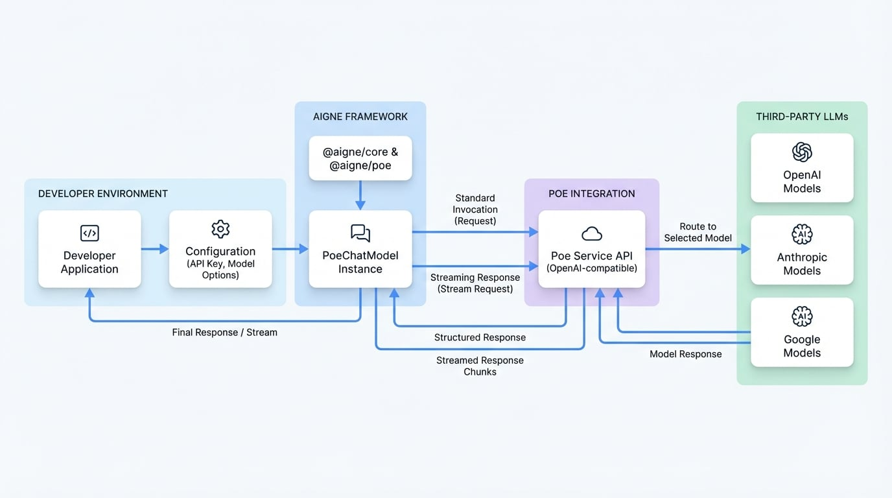

ユーザーは D2 ダイアグラムの構文エラーを修正したいと考えています。
エラーメッセージ `invalid style keyword: "font-family"` は、`font-family` が D2 で有効なスタイルプロパティではないことを示しています。
D2 コード内のこの行を削除または修正する必要があります。

ISTJ の性格に基づき、以下の手順を実行します：
1.  **リクエストの分析:** ユーザーから D2 構文エラーに関するフィードバックが提供されました。目標は、ダイアグラムを修正し、ドキュメントを再生成することです。
2.  **エラーの特定:** エラーは `invalid style keyword: "font-family"` です。これは D2 コードの事実上のエラーです。
3.  **修正案の策定:** D2 ダイアグラムの `style` ブロックから `font-family` プロパティを削除する必要があります。
4.  **ドキュメントの再生成:** 修正された D2 コードでドキュメント全体を再生成します。他のすべての情報が正確であり、確立された構造に従っていることを確認します。
5.  **出力のレビュー:** 最終決定する前に、生成された Markdown と修正された D2 ブロックを再確認し、構文的に正しく、論理的に健全であることを保証します。

ドキュメントコンテンツの生成プロセスを分解してみましょう。

**計画:**

1.  **はじめに:** `@aigne/poe` パッケージの概要から始め、その目的を説明します。つまり、AIGNE フレームワークを、さまざまなサードパーティモデルへのアクセスを提供する Poe API に接続することです。OpenAI 互換 API を使用していることにも言及します。メインのモデル概要ページへのリンクを記載します。
2.  **ダイアグラム:** 修正されたアーキテクチャを示す D2 ダイアグラムを生成します。ダイアグラムには、AIGNE アプリケーション、`@aigne/poe` パッケージ、Poe API、および基盤となる言語モデル（GPT、Claude など）を表示します。不正な `font-family` スタイルは削除します。
3.  **インストール:** npm、yarn、pnpm を使用して必要なパッケージ（`@aigne/poe` および `@aigne/core`）をインストールするための、コピー＆ペースト可能な明確なコマンドを提供します。これは標準的で実用的なステップです。
4.  **設定:** `PoeChatModel` の設定オプションを詳述します。
    *   API キーを提供する2つの方法（`apiKey` プロパティ vs `POE_API_KEY` 環境変数）を説明します。これはセットアップに不可欠です。
    *   `<x-field-group>` を使用して、コンストラクタのオプション（`apiKey`、`model`、`modelOptions`、`baseURL`）を構造化され、読みやすい形式で提示します。
    *   デフォルト値（`gpt-5-mini`、`https://api.poe.com/v1`）を含む各フィールドの正確な説明を提供します。情報はソースコード（`models/poe/src/poe.ts`）で入手可能です。
5.  **使用法セクション:**
    *   **標準呼び出し:** `PoeChatModel` をインスタンス化し、`invoke` メソッドを呼び出す、完全で動作する TypeScript の例を提供します。明確で実用的な例（モデルにそれが何であるかを尋ねるなど）を使用します。例は README で入手可能です。
    *   期待される JSON 出力を表示します。これはユーザーが実装を確認するのに役立ちます。
    *   **ストリーミングレスポンス:** `streaming: true` オプションの使用方法を示す2番目の完全な TypeScript の例を提供します。チャンクを処理するためのループ（`isAgentResponseDelta`）を示します。これは README で言及されている主要な機能です。
    *   最終的なテキストとメタデータがどのように組み立てられるかを含め、期待されるストリーミング出力を表示します。
6.  **参考文献/まとめ:** 関連する外部ドキュメント（公式 Poe ドキュメント）および内部ドキュメント（コアコンセプト：モデル）へのリンクで締めくくります。これにより、ユーザーに明確な次のステップを提供します。

この計画は、フィードバックで指摘された特定のエラーを修正しつつ、技術ガイドに対するユーザーのニーズに直接応える、体系的で事実に基づいたものです。これは、正確性、構造、実用性を優先する ISTJ のアプローチに従っています。# Poe

`@aigne/poe` パッケージは、[Poe](https://poe.com/) との統合のための標準化されたインターフェースを提供します。Poe は、OpenAI、Anthropic、Google などのサードパーティ製言語モデルに幅広くアクセスできるサービスです。OpenAI 互換の API エンドポイントを活用することで、このパッケージは AIGNE フレームワーク内でさまざまなモデルをシームレスに使用できるようにします。

このガイドでは、`PoeChatModel` のインストール、設定、利用方法をステップバイステップで説明します。モデル統合に関するより一般的な情報については、[モデルの概要](./models-overview.md) ドキュメントを参照してください。

<!-- DIAGRAM_IMAGE_START:architecture:16:9 -->

<!-- DIAGRAM_IMAGE_END -->

## インストール

まず、お好みのパッケージマネージャーを使用して必要なパッケージをインストールします。`@aigne/core` と Poe 固有のパッケージの両方が必要です。

```bash
npm install @aigne/poe @aigne/core
```

```bash
yarn add @aigne/poe @aigne/core
```

```bash
pnpm add @aigne/poe @aigne/core
```

## 設定

`PoeChatModel` クラスは、Poe API と対話するための主要なインターフェースです。これをインスタンス化するには、Poe API キーを提供し、目的のモデルを指定する必要があります。

API キーは2つの方法で設定できます：
1.  コンストラクタで `apiKey` プロパティを介して直接設定する。
2.  `POE_API_KEY` という名前の環境変数として設定する。

<x-field-group>
  <x-field data-name="apiKey" data-type="string" data-required="false">
    <x-field-desc markdown>あなたの Poe API キー。コンストラクタではオプションですが、認証を成功させるには、キーがここか `POE_API_KEY` 環境変数で利用可能である必要があります。</x-field-desc>
  </x-field>
  <x-field data-name="model" data-type="string" data-default="gpt-5-mini" data-required="false">
    <x-field-desc markdown>使用したいモデルの識別子。Poe は `claude-3-opus` や `gpt-4o` などのモデルへのアクセスを提供します。指定しない場合、デフォルトは `gpt-5-mini` です。</x-field-desc>
  </x-field>
  <x-field data-name="modelOptions" data-type="object" data-required="false">
    <x-field-desc markdown>`temperature`、`topP`、`maxTokens` など、モデル API に渡す追加のオプション。これらのパラメータは、基盤となるモデルプロバイダーに直接送信されます。</x-field-desc>
  </x-field>
  <x-field data-name="baseURL" data-type="string" data-default="https://api.poe.com/v1" data-required="false">
    <x-field-desc markdown>Poe API のベース URL。カスタムプロキシを使用している場合を除き、これを変更すべきではありません。</x-field-desc>
  </x-field>
</x-field-group>

## 使用法

以下の例では、`PoeChatModel` インスタンスを作成し、標準およびストリーミングのチャット補完に使用する方法を示します。

### 標準呼び出し

単純なリクエスト・レスポンスの対話には、`invoke` メソッドを使用します。このメソッドはリクエストを送信し、モデルからの完全なレスポンスを待ちます。

```typescript 基本的な使用法 icon=logos:typescript
import { PoeChatModel } from "@aigne/poe";

const model = new PoeChatModel({
  // API キーを直接指定するか、POE_API_KEY 環境変数を設定します
  apiKey: "your-poe-api-key",
  // Poe を通じて利用可能な目的のモデルを指定します
  model: "claude-3-opus",
  modelOptions: {
    temperature: 0.7,
  },
});

const result = await model.invoke({
  messages: [{ role: "user", content: "Which model are you using?" }],
});

console.log(result);
```

`invoke` メソッドは、モデルの出力と使用状況のメタデータを含む構造化されたレスポンスを返します。

```json 期待される出力 icon=material-symbols:data-object-outline
{
  "text": "私は Poe を利用しており、Anthropic 社の Claude 3 Opus モデルを使用しています。",
  "model": "claude-3-opus",
  "usage": {
    "inputTokens": 5,
    "outputTokens": 14
  }
}
```

### ストリーミングレスポンス

リアルタイムアプリケーションでは、レスポンスが生成されると同時にストリーミングできます。`invoke` 呼び出しで `streaming: true` オプションを設定すると、レスポンスチャンクの非同期ストリームを受け取ることができます。

```typescript ストリーミングの例 icon=logos:typescript
import { isAgentResponseDelta } from "@aigne/core";
import { PoeChatModel } from "@aigne/poe";

const model = new PoeChatModel({
  apiKey: "your-poe-api-key",
  model: "claude-3-opus",
});

const stream = await model.invoke(
  {
    messages: [{ role: "user", content: "Which model are you using?" }],
  },
  { streaming: true },
);

let fullText = "";
const json = {};

for await (const chunk of stream) {
  if (isAgentResponseDelta(chunk)) {
    const text = chunk.delta.text?.text;
    if (text) {
      fullText += text;
      process.stdout.write(text);
    }
    if (chunk.delta.json) {
      Object.assign(json, chunk.delta.json);
    }
  }
}

console.log("\n--- Final Assembled Data ---");
console.log("Full Text:", fullText);
console.log("Metadata:", json);
```

ストリームを反復処理する際、各チャンクはレスポンスの差分を提供します。完全なテキストとメタデータは、これらの個々のチャンクから組み立てる必要があります。

```text 期待される出力 icon=material-symbols:terminal
私は Poe を利用しており、Anthropic 社の Claude 3 Opus モデルを使用しています。
--- 最終的に組み立てられたデータ ---
全文: 私は Poe を利用しており、Anthropic 社の Claude 3 Opus モデルを使用しています。
メタデータ: { model: "anthropic/claude-3-opus", usage: { inputTokens: 5, outputTokens: 14 } }
```

## 参考文献

- 利用可能なモデルとその機能の完全なリストについては、公式の [Poe ドキュメント](https://developer.poe.com/docs/server-bots-and-apis) を参照してください。
- モデルが AIGNE の広範なアーキテクチャにどのように適合するかを理解するには、[コアコンセプト：モデル](./developer-guide-core-concepts-models.md) のページを参照してください。