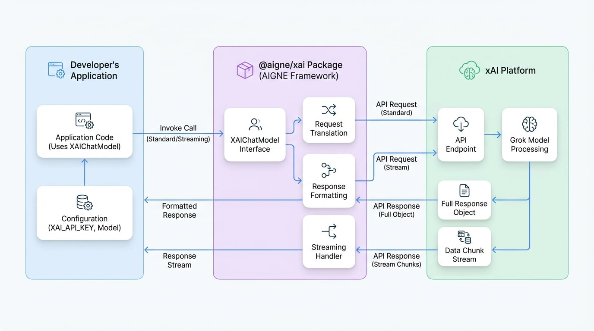

# xAI

本指南介绍了如何在 AIGNE 框架内配置和使用 xAI 的语言模型，特别是 Grok。内容涵盖了必要软件包的安装、API 密钥的配置、模型的实例化，以及标准和流式调用的示例。

`@aigne/xai` 软件包作为 xAI API 的直接接口，允许开发者通过 AIGNE 框架提供的标准化 `ChatModel` 接口，将 Grok 的功能集成到他们的应用程序中。

<!-- DIAGRAM_IMAGE_START:architecture:16:9 -->

<!-- DIAGRAM_IMAGE_END -->

## 安装

首先，请使用您偏好的包管理器安装 `@aigne/xai` 软件包以及 AIGNE 核心库。

<x-cards data-columns="3">
  <x-card data-title="npm" data-icon="logos:npm-icon">
    ```bash
    npm install @aigne/xai @aigne/core
    ```
  </x-card>
  <x-card data-title="yarn" data-icon="logos:yarn">
    ```bash
    yarn add @aigne/xai @aigne/core
    ```
  </x-card>
  <x-card data-title="pnpm" data-icon="logos:pnpm">
    ```bash
    pnpm add @aigne/xai @aigne/core
    ```
  </x-card>
</x-cards>

## 配置

`XAIChatModel` 类是与 xAI API 交互的主要接口。要使用它，您必须使用您的 xAI API 密钥对其进行配置。

您可以通过两种方式提供 API 密钥：
1.  **直接在构造函数中传入**：通过 `apiKey` 属性传递密钥。
2.  **环境变量**：设置 `XAI_API_KEY` 环境变量。模型将自动检测并使用它。

### 构造函数选项

在创建 `XAIChatModel` 实例时，您可以提供以下选项：

<x-field-group>
  <x-field data-name="apiKey" data-type="string" data-required="false">
    <x-field-desc markdown>您的 xAI API 密钥。如果未提供，系统将回退使用 `XAI_API_KEY` 环境变量。</x-field-desc>
  </x-field>
  <x-field data-name="model" data-type="string" data-required="false" data-default="grok-2-latest">
    <x-field-desc markdown>用于聊天补全的特定 xAI 模型。默认为 `grok-2-latest`。</x-field-desc>
  </x-field>
  <x-field data-name="baseURL" data-type="string" data-required="false" data-default="https://api.x.ai/v1">
    <x-field-desc markdown>xAI API 的基础 URL。该项已预先配置，通常无需更改。</x-field-desc>
  </x-field>
  <x-field data-name="modelOptions" data-type="object" data-required="false">
    <x-field-desc markdown>传递给 xAI API 的其他选项，例如 `temperature`、`topP` 等。</x-field-desc>
  </x-field>
</x-field-group>

## 基本用法

以下示例演示了如何实例化 `XAIChatModel` 并调用它以获取响应。

```typescript 基本调用 icon=logos:typescript
import { XAIChatModel } from "@aigne/xai";

const model = new XAIChatModel({
  // 直接提供 API 密钥或使用环境变量 XAI_API_KEY
  apiKey: "your-api-key", // 如果已在环境变量中设置，则此项为可选
  // 指定模型（默认为 'grok-2-latest'）
  model: "grok-2-latest",
  modelOptions: {
    temperature: 0.8,
  },
});

const result = await model.invoke({
  messages: [{ role: "user", content: "Tell me about yourself" }],
});

console.log(result);
```

### 响应示例

`invoke` 方法返回一个包含模型响应和使用元数据的对象。

```json 响应对象 icon=mdi:code-json
{
  "text": "I'm Grok, an AI assistant from X.AI. I'm here to assist with a touch of humor and wit!",
  "model": "grok-2-latest",
  "usage": {
    "inputTokens": 6,
    "outputTokens": 17
  }
}
```

## 流式响应

对于实时应用程序，您可以从模型中流式传输响应。在 `invoke` 方法中设置 `streaming: true` 选项，以便在数据可用时以数据块的形式接收。

```typescript 流式传输示例 icon=logos:typescript
import { isAgentResponseDelta } from "@aigne/core";
import { XAIChatModel } from "@aigne/xai";

const model = new XAIChatModel({
  apiKey: "your-api-key",
  model: "grok-2-latest",
});

const stream = await model.invoke(
  {
    messages: [{ role: "user", content: "Tell me about yourself" }],
  },
  { streaming: true },
);

let fullText = "";
const json = {};

for await (const chunk of stream) {
  if (isAgentResponseDelta(chunk)) {
    const text = chunk.delta.text?.text;
    if (text) fullText += text;
    if (chunk.delta.json) Object.assign(json, chunk.delta.json);
  }
}

console.log(fullText);
console.log(json);
```

### 流式输出

在遍历流时，您可以累积文本增量以形成完整的消息，并合并 JSON 部分以获取最终的元数据。

```text 文本输出 icon=mdi:text-box
I'm Grok, an AI assistant from X.AI. I'm here to assist with a touch of humor and wit!
```

```json JSON 输出 icon=mdi:code-json
{
  "model": "grok-2-latest",
  "usage": {
    "inputTokens": 6,
    "outputTokens": 17
  }
}
```

关于 `@aigne/xai` 软件包的使用指南到此结束。有关其他可用模型的更多信息，请参阅[模型概述](./models-overview.md)。