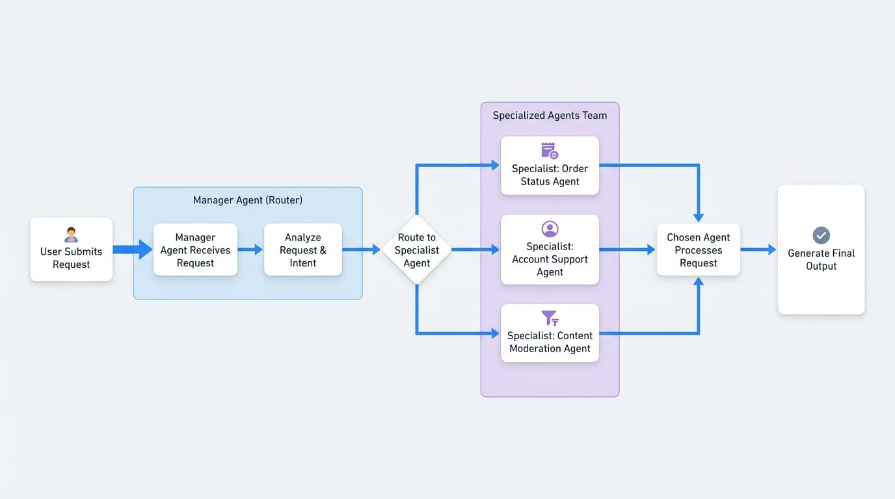

# Decision-Making

Illustrates a scenario where a 'manager' agent analyzes a request and decides which specialized agent is best suited to handle the task.

## Overview

In many real-world scenarios, a single AI agent isn't enough. Complex problems often require a team of specialized agents, each an expert in a specific domain. The Decision-Making workflow, also known as a Router or Triage pattern, addresses this by introducing a "manager" agent.

The manager agent's sole responsibility is to analyze an incoming request, understand its intent, and route it to the most appropriate specialist agent in the team. This is similar to a customer service dispatcher who listens to a customer's problem and connects them with the right department—be it technical support, billing, or sales.

This pattern creates a more efficient and intelligent system. Instead of a single, generalist agent trying to do everything, you have a coordinated team where each member excels at its designated task.

## How It Works

The workflow begins when a user submits a request. The manager agent, acting as the central router, receives this request. Based on its instructions and the available "tools" (the specialist agents), it decides which specialist is best equipped to handle the query. The request is then handed off to the chosen specialist, which processes it and produces the final output.

For example, if a user asks, "What's the status of my order?", the manager agent would route the query to the "Order Status" agent. If the user asks, "How do I reset my password?", it would be routed to the "Account Support" agent.

<!-- DIAGRAM_IMAGE_START:flowchart:16:9 -->

<!-- DIAGRAM_IMAGE_END -->

## Use Cases

This workflow is highly effective for:

- **Intelligent Customer Support:** Automatically routing customer queries to the correct department (e.g., Technical Support, Billing, Sales).
- **Multi-functional Assistants:** Creating a single assistant that can delegate tasks like scheduling, data analysis, or content creation to different specialized agents.
- **Content Moderation:** Classifying incoming content and sending it to different moderation queues based on its nature (e.g., spam, hate speech, inappropriate content).
- **Complex Query Processing:** Breaking down a complex query into sub-tasks and routing each to a specific agent for processing.

## Summary

The Decision-Making workflow is a powerful pattern for orchestrating a team of specialized AI agents. By using a manager agent to triage and route tasks, you can build more sophisticated, scalable, and efficient AI applications that leverage the strengths of individual, focused agents.

To learn more about the technical implementation, see the [Team Agent](./developer-guide-agents-team-agent.md) and [AI Agent](./developer-guide-agents-ai-agent.md) documentation.