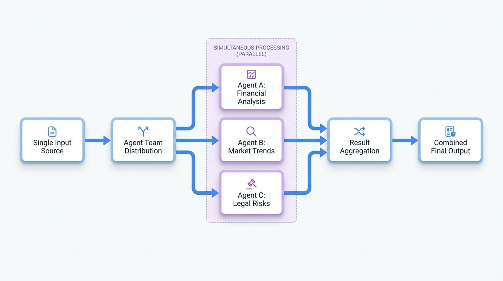

# 並行任務

在某些情況下，您需要同時執行多個獨立的任務以提高效率。並行任務工作流程就是為此目的而設計的。它允許多個 AI Agent 同時處理相同的初始資訊，並在最後收集和合併它們各自的結果。

這種方法就像聘請一個專家團隊來分析一份商業提案。一位專家可能專注於財務可行性，另一位專注於市場趨勢，第三位則專注於法律風險。他們都從同一份提案開始，同時進行工作，最終他們的報告會被匯總起來，以提供一個完整的畫面。這比他們必須等待彼此完成工作要快得多。

此工作流程由一個設定為並行模式運作的 [Agent Team](./user-guide-understanding-agents-agent-teams.md) 管理。若想了解任務依序執行的不同方法，請參閱 [循序任務](./user-guide-common-workflows-sequential-tasks.md) 工作流程。

## 運作方式

並行工作流程遵循一個清晰、高效的流程來處理彼此不依賴的任務。該流程旨在透過一次執行所有 Agent 來最大化速度。

1.  **單一輸入**：流程從單一資訊開始，例如一份文件、一個使用者查詢或一組資料。
2.  **同步分發**：Agent Team 接收此輸入，並將*完全相同的資訊*分發給團隊中的每一個 Agent。
3.  **獨立處理**：所有 Agent 同時開始工作。每個 Agent 根據其獨特的指令執行其專門的任務，無需等待其他 Agent 或與之互動。
4.  **結果彙整**：當每個 Agent 完成其工作時，其輸出會被收集起來。然後 Agent Team 將這些個別的輸出彙整成一個單一的組合結果。如果多個 Agent 為同一個欄位產生輸出，系統通常會接受最先完成的 Agent 的結果。

這種結構確保了完成所有任務所需的總時間取決於運行時間最長的 Agent，而不是所有 Agent 時間的總和。

<!-- DIAGRAM_IMAGE_START:flowchart:16:9 -->

<!-- DIAGRAM_IMAGE_END -->

## 常見使用案例

並行工作流程最適用於需要在同一份資訊上進行多個獨立分析或任務，且速度是優先考量的情境。

<x-cards data-columns="2">
  <x-card data-title="多視角內容分析" data-icon="lucide:scan-text">
    在分析一份文件時，一個 Agent 可以提取關鍵特徵，另一個可以分析情感基調（情緒），第三個則可以識別目標受眾。這三項任務可以同時進行。
  </x-card>
  <x-card data-title="並行資料查詢" data-icon="lucide:database-zap">
    如果您需要在不同來源（例如，客戶資料庫、產品目錄和知識庫）中搜尋資訊，您可以為每個來源派遣一個 Agent 同時進行搜尋。
  </x-card>
  <x-card data-title="競爭分析" data-icon="lucide:bar-chart-3">
    為了分析競爭對手的產品，一個 Agent 可以收集近期的客戶評論，另一個可以尋找定價資訊，第三個可以查詢技術規格，所有這些都可以並行進行。
  </x-card>
  <x-card data-title="程式碼審查" data-icon="lucide:code-2">
    對於一段程式碼，一個 Agent 可以檢查安全漏洞，而另一個則檢查是否符合風格指南。然後將這些回饋結合起來提供給開發者。
  </x-card>
</x-cards>

## 總結

並行任務工作流程是提高效率的強大模式。透過允許多個 Agent 獨立且同時工作，它顯著減少了完成涉及多個不相關子任務的複雜工作所需的時間。這使其成為建構反應迅速且功能強大的 AI 應用程式的基礎工作流程。

要了解 Agent 如何以不同方式協同工作，請接著閱讀 [循序任務](./user-guide-common-workflows-sequential-tasks.md) 工作流程。