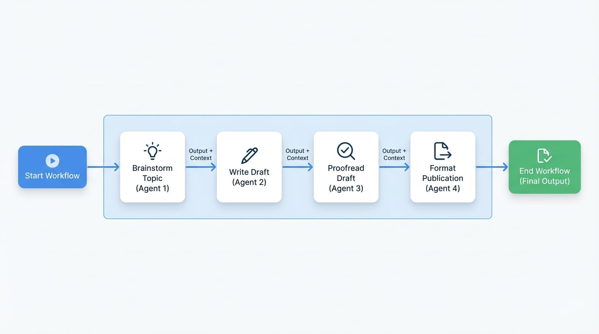

# 顺序任务

顺序任务工作流按特定的预定顺序处理一系列任务。它就像一条数字流水线，上一步的输出成为下一步的输入。这种模式非常适合多阶段流程，其中每一步都建立在前一步工作的基础之上。

在 AIGNE 框架中，这由配置为以 `sequential` 模式运行的 `TeamAgent` 管理。团队中的每个 Agent 完成其任务后，会将结果传递下去，从而确保从开始到结束的逻辑性和有序性。

<!-- DIAGRAM_IMAGE_START:flowchart:16:9 -->

<!-- DIAGRAM_IMAGE_END -->

## 工作原理

假设一个请求进入工作流。

1.  序列中的第一个 Agent 接收并处理初始输入。
2.  完成后，其输出会与原始输入相结合。
3.  然后，这个组合结果被传递给序列中的第二个 Agent。
4.  此传递过程会沿着流程线继续，直到最后一个 Agent 完成其任务。
5.  最后一个 Agent 的输出即为整个工作流的最终结果。

这确保了每个 Agent 都拥有所有前序 Agent 已完成工作的完整上下文，从而可以创建复杂且精密的流程管道。

## 常见用例

顺序工作流对于需要结构化、分步方法的任务非常有效。

-   **内容生成管道**：一个初始 Agent 负责构思主题，第二个 Agent 撰写草稿，第三个 Agent 进行校对，最后一个 Agent 将其格式化以供发布。
-   **数据处理 (ETL)**：一个 Agent 从源提取数据，另一个 Agent 将其转换为标准化格式，第三个 Agent 将其加载到数据库中。
-   **客户问询升级**：一个一线 Agent 回答客户的基本问题。如果问题复杂，它会将对话历史记录传递给专业的技术支持 Agent 进行解决。
-   **报告生成**：一个 Agent 收集原始数据，第二个 Agent 对其进行分析并生成关键洞见，第三个 Agent 将分析结果汇编成格式化报告。

## 总结

顺序任务工作流提供了一种可靠且结构化的方式来自动化复杂的多步骤流程。通过将多个 Agent 链接在一起，您可以构建功能强大且一致的自动化流程管道，其中操作顺序对于实现预期结果至关重要。

对于可以同时执行的任务，可以考虑使用[并行任务](./user-guide-common-workflows-parallel-tasks.md)工作流以提高效率。